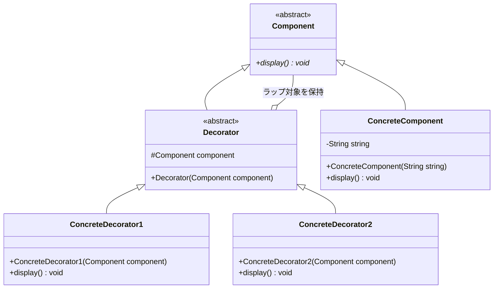
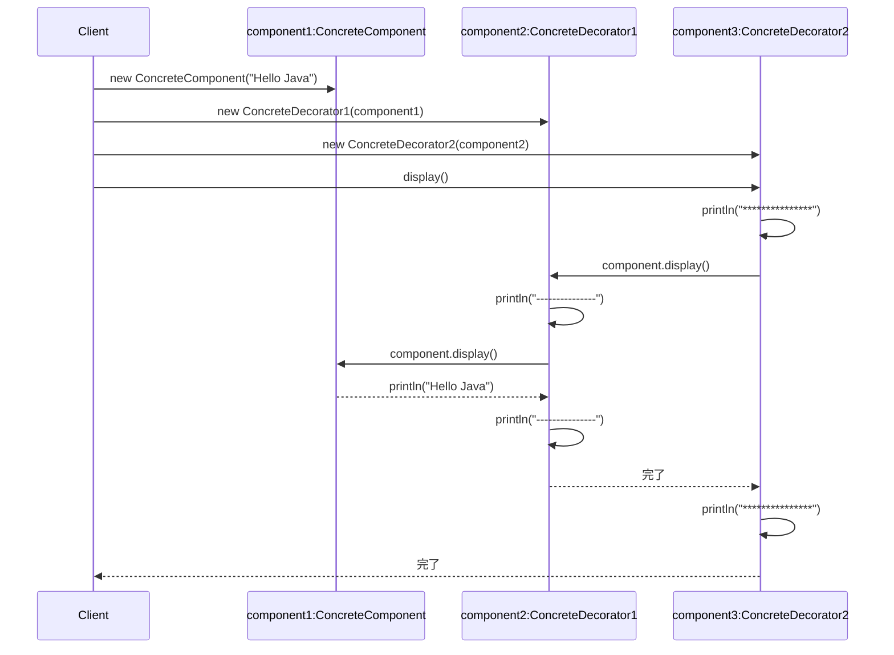

## 概要

Decorator（デコレーター）パターンは、「**中身を書き換えずに、外側に『飾り』をつけて機能をどんどん追加する**」ためのデザインパターンです。マトリョーシカのように、オブジェクトを別のオブジェクトで包んでいくイメージです。

もっとも分かりやすい例えは、アイスクリームの注文です。

1. ベース（本体）：バニラアイス
2. トッピングA（飾り）：チョコソースをかける
3. トッピングB（飾り）：ナッツをまぶす

このとき、トッピングAもトッピングBも、「アイスクリームの一種」として振る舞うのがポイントです。チョコをかけた後でも、それは依然として「食べられるアイス」ですよね。このように、中身を別のオブジェクトで包んでも、外側からの見え方（インターフェース）を変えずに機能だけを盛っていくのがDecoratorパターンの真髄です。

## クラス構造



## イメージ


### 図の見方

#### 継承（is-a）による拡張

「文字列」を継承して「色付き」を作り、さらにそれを継承して「枠付き」を作る……という流れを考えてみます。「色はいらないけど枠だけ欲しい」と思ったとき、また別の継承ルートを作らなければなりません。機能が増えるたびに、組み合わせの数だけクラスが増えてしまい、管理不能になります。これが「静的で拡張性が乏しい」と言われる理由です。

#### 委譲（has-a）による拡張

ここがDecoratorパターンの独壇場です。Componentクラスは、文字列、色付け、枠囲み、すべてを「同じ仲間（型）」として扱います。「枠囲みクラス」が内部に「色付けクラス」を抱え、さらにその中が「文字列」……という具合に、実行時に動的に包んでいきます。この仕組みによって、「枠だけ」「色だけ」「色＋枠＋影」など、組み合わせが自由自在になります。

### まとめ

この仕組みのキモは、「is-a（継承）からhas-a（構成・委譲）へのパラダイムシフト」にあります。外側から包んでいる「飾り」も、中身と同じインターフェースを持っているからこそ、Clientは何も気にせず「HELLO」を表示（メソッド呼び出し）できるのです。

## メリット

通常、機能を追加しようとすると「継承」を使いがちですが、継承はコンパイル時に構造が固まってしまいます。Decoratorなら、実行時に（プログラムが動いている最中に）「今はこれとこれを追加しよう」と動的に機能を盛り付けることができます。

たとえば「トッピング付きのコーヒー」を作る場合、継承だと「ミルクコーヒー」「砂糖コーヒー」「ミルク砂糖コーヒー」「ホイップコーヒー」……と、組み合わせの数だけクラスが必要になります。Decoratorなら、「ミルク」「砂糖」「ホイップ」という3つの飾りクラスを作るだけで、どんな組み合わせも自由自在に作れます。

「基本の処理」と「追加の機能（ログ出力、キャッシュ、暗号化など）」を別々のクラスに分けられるのも利点です。それぞれのクラスが1つのことだけに集中できるため、単一責任の原則を守りやすくなります。

## デメリット

「飾り」を増やすたびに、それを包む新しいインスタンスが作られます。似たような小さなオブジェクトがメモリ上にたくさん並ぶことになり、慣れていない人がデバッグ（中身を確認）しようとすると「今どの層にいるんだ」と混乱しがちです。

外側から見ると、最終的に何層包まれているのか、どの順番で包まれているのかが分かりにくいのもデメリットです。また、一番内側の「中身（ConcreteComponent）」を直接操作したいときに、厚い皮に包まれていてアクセスしにくいという問題も起こります（具体例は後述します）。

「暗号化した後に圧縮する」のと「圧縮した後に暗号化する」のでは結果が変わるように、Decoratorを組み合わせる際はその順番を正しく管理する必要があり、ミスをするとバグの原因になります。

## サンプルソース

```java:Component.java
public abstract class Component {
    public abstract void display();
}
```

```java:Decorator.java
public abstract class Decorator extends Component {
    protected Component component;

    public Decorator(Component component) {
        this.component = component;
    }
}
```

```java:ConcreteComponent.java
public class ConcreteComponent extends Component {
    private final String string;

    public ConcreteComponent(String string) {
        this.string = string;
    }

    @Override
    public void display() {
        System.out.println(string);
    }
}
```

```java:ConcreteDecorator1.java
public class ConcreteDecorator1 extends Decorator {
    public ConcreteDecorator1(Component component) {
        super(component);
    }

    @Override
    public void display() {
        System.out.println("---------------");
        component.display();
        System.out.println("---------------");
    }
}
```

```java:ConcreteDecorator2.java
public class ConcreteDecorator2 extends Decorator {
    public ConcreteDecorator2(Component component) {
        super(component);
    }

    @Override
    public void display() {
        System.out.println("***************");
        component.display();
        System.out.println("***************");
    }
}
```

```java:Client.java
public class Client {
    public static void main(String... args) {
        Component component1 = new ConcreteComponent("Hello Java");
        Component component2 = new ConcreteDecorator1(component1);
        Component component3 = new ConcreteDecorator2(component2);
        component3.display();
    }
}
```

### 実行結果

```
***************
---------------
Hello Java
---------------
***************
```

### シーケンス図




`component1`（生の文字列）を`ConcreteDecorator1`（ダッシュの枠）で包み、さらにそれを`ConcreteDecorator2`（アスタリスクの枠）で包んでいます。一番外側の`component3.display()`を呼ぶだけで、内側に包まれているすべての層の`display()`が連鎖的に呼ばれ、外側から「アスタリスク→ダッシュ→本体→ダッシュ→アスタリスク」という順番で表示されます。

## 補足：内側のConcreteComponentに直接アクセスする難しさ

デメリットで触れた「一番内側の中身に直接アクセスしにくい」という問題を、具体的に確認してみます。仮に`ConcreteComponent`だけが持つ、`Component`インターフェースにはない独自メソッド（たとえば`getRawString()`）があったとします。

```java
public class ConcreteComponent extends Component {
    private final String string;

    public ConcreteComponent(String string) {
        this.string = string;
    }

    @Override
    public void display() {
        System.out.println(string);
    }

    // Componentインターフェースにはない、ConcreteComponent固有のメソッド
    public String getRawString() {
        return string;
    }
}
```

`component3`は`Component`型として扱われているため、このままでは`component3.getRawString()`は呼び出せません。「じゃあ`ConcreteComponent`にキャストすればいい」と思うかもしれませんが、`component3`の実体は`ConcreteComponent`ではなく`ConcreteDecorator2`のインスタンスなので、`(ConcreteComponent) component3`のようにキャストすると`ClassCastException`が発生してしまいます。中身の`ConcreteComponent`に到達するには、`ConcreteDecorator2`→`ConcreteDecorator1`と、包んでいる層を順番に剥がしていく必要がありますが、`Decorator`が持つ`component`フィールドは`protected`なので、Clientから直接アクセスすることもできません。これが、デコレーターで包んだあとに「元のオブジェクトならではの機能」を使いたくなったときに起こる、典型的な困りごとです。

## 補足：JavaのI/Oライブラリに見るDecoratorパターン

実は、Javaを使ったことがある人なら誰でも一度は目にしたことがあるはずの、非常に有名なDecoratorパターンの実例があります。それが`java.io`パッケージの入出力ストリームです。

```java
import java.io.BufferedReader;
import java.io.FileReader;
import java.io.IOException;

BufferedReader reader = new BufferedReader(new FileReader("sample.txt"));
```

この`new BufferedReader(new FileReader("sample.txt"))`という書き方は、まさに今回のサンプルコードで`new ConcreteDecorator2(new ConcreteDecorator1(component1))`と書いていたのと同じ発想です。`FileReader`（ファイルを読み込む基本機能）を`BufferedReader`（読み込みをバッファリングして効率化する飾り）で包んでいます。さらに文字コードを指定したい場合は`InputStreamReader`を、暗号化やGZIP圧縮を挟みたい場合は`CipherInputStream`や`GZIPInputStream`を、同じように何重にも包んでいくことができます。

`java.io`のクラス名を見て「なぜこんなに`new`を重ねる書き方をするんだろう」と疑問に思ったことがある人は多いと思いますが、その答えがまさにDecoratorパターンです。今回学んだ「同じインターフェース（`Component`）を持つオブジェクトで包んでいく」という考え方が、Java標準ライブラリの入出力処理を支える基本設計そのものになっています。

## 補足：`Component`は抽象クラスにするか、インターフェースにするか

今回のサンプルコードでは、GoFの原典に忠実な形で、`Component`と`Decorator`をどちらも抽象クラス（`abstract class`）として書いています。

一方、現代のJavaでは、`Component`側に共通のフィールドや状態を持たせる必要がない場合、次のように`Component`を`interface`として定義し、実際に共通のフィールド（`component`）を持つ`Decorator`だけを抽象クラスにする実装スタイルもよく使われます。

```java:Component.java（インターフェース版）
public interface Component {
    void display();
}
```

```java:Decorator.java（インターフェース版）
public abstract class Decorator implements Component {
    protected final Component component; // finalを付けて不変にするのも一般的

    public Decorator(Component component) {
        this.component = component;
    }
}
```

`Component`をインターフェースにしておくメリットは、Javaが持つ「クラスの継承は1つまで」という制約から`ConcreteComponent`側を解放できる点にあります。もし将来`ConcreteComponent`に別のクラスを継承させたくなった場合でも、インターフェースであれば実装（`implements`）は複数できるため、柔軟に対応できます。

どちらのスタイルが絶対的に正しいというわけではありません。「原典に忠実に、共通の型を抽象クラスとして表現するアプローチ」と、「Javaの単一継承の制約を避けるため、共通の型はインターフェースにしておくアプローチ」の両方が実務では見られる、ということを知っておくと安心です。