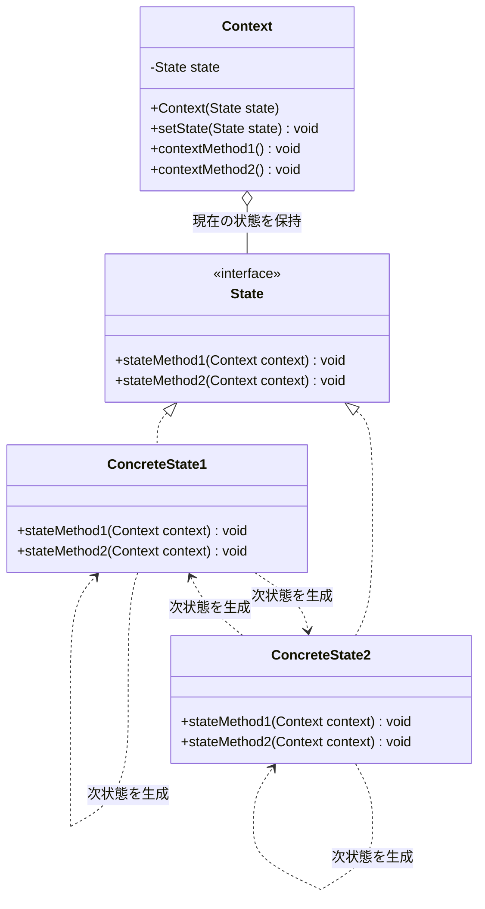
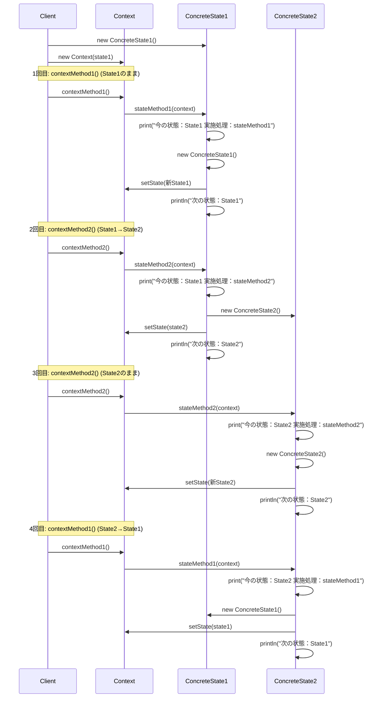
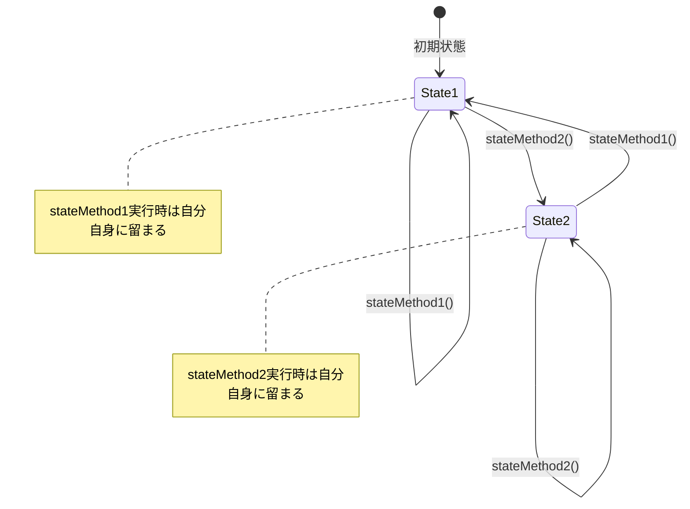

## 概要

State（ステート）パターンを一言でいうと、「**『状態』そのものをクラスにして、状況に合わせて中身（振る舞い）を入れ替える**」ためのデザインパターンです。

「もしAの状態ならこれをする、Bの状態ならこれをする……」という分岐を、巨大な`if`文や`switch`文で書くのではなく、「A状態クラス」「B状態クラス」として独立させます。オブジェクトは今自分がどの状態クラスを持っているかによって、動きをガラッと変えます。

自動販売機をプログラムで作る場合を想像してみてください。ボタンを押したときの挙動は、今の状態によってまったく変わります。

- お金が入っていない状態でボタンを押す→「ピピっ（お金を入れてください）」と鳴る
- お金が入っている状態でボタンを押す→飲み物が出てくる
- 売り切れ状態でボタンを押す→何も起きない

これを普通に書くと、ボタンを押す関数の中に「もしお金があれば」「もし売り切れなら」という大量の`if`文や`switch`文が必要になります。Stateパターンでは、この「状態」を丸ごとクラスにします。「未投入状態クラス」「投入済み状態クラス」「売り切れ状態クラス」を用意し、自販機くんは今自分が持っている「状態クラス」に処理を丸投げするのです。

## クラス構造



### Strategyパターンとの違い

以前解説したStrategyパターンと形がそっくりだと思いませんでしたか？

- **Strategy**：「アルゴリズム（作戦）」を外から差し替える。使う人が「この作戦でいこう」と決めることが多い
- **State**：「自分自身の状態」によって動きが変わる。動いているうちに、中身が「晴れ」から「雨」へ自動的に切り替わるようなニュアンスが強い

## イメージ


### 図の見方

#### 従来のやり方の問題点

「昼の放送をする」メソッドを見てください。「晴れの場合かつ前が雨なら」「晴れの場合かつ前が雨以外なら」と、条件分岐（if文）が複雑に絡み合っています。これでは、新しい天気（雪など）が増えたときに、コードがスパゲッティ状態になってしまいます。

#### 解決策：状態をクラスにする

ここがこのパターンの核心です。「晴れ」「曇り」「雨」という状態そのものを、それぞれ独立したクラスとして分離します。

#### 構造の役割分担

Contextクラス（放送室）は、現在の天気がどれかを状態として保持し、「朝の放送の時間だよ」と合図（メソッド実行）を出す役割です。Stateインターフェース（放送マニュアル）は、「朝の放送をする」「昼の放送をする」というメニューだけを決めています。Sunny・Cloudy・Rainクラス（各天気の担当DJ）は、自分の天気のときに何を喋るか（具体的な処理）を熟知しています。

### まとめ

この仕組みのキモは、「状態によって振る舞いが変わるものを、if文で制御するのではなく、オブジェクトの差し替えで表現する」という点にあります。Contextはただ「今の状態」にマイクを渡すだけ。すると、その状態（DJ）が自分の天気にふさわしい放送をしてくれる。この「役割の丸投げ」が、柔軟な設計を生みます。

## メリット

状態ごとの条件分岐が複雑になればなるほど、コードは読みづらくなります。Stateパターンを使えば、特定の状態に関するロジックが1つのクラスに集約されるため、コードがすっきりし、見通しが良くなります。

「Cという新しい状態」を増やしたいときも、既存の巨大な分岐コードをいじる必要はありません。新しい状態クラスを作るだけで済みます（開放閉鎖の原則）。

「今の状態から次はどの状態へ移るか」というルールを、各状態クラス自身に記述できるのも大きな利点です。次の状態への遷移を各状態が自分で判断できるため、状態の移り変わり（ステートマシン）のロジックが、Contextではなくそれぞれの状態クラスに整理された形で収まります。

## デメリット

状態が10個あれば、最低でも10個のクラスを作る必要があります。状態が2〜3個しかない単純なプログラムで使うと、かえって構造を複雑にしてしまいます。

「A状態からB状態へ移る」という処理を書く際、A状態クラスがB状態クラスのことを知っていなければならないケースが多く、クラス同士が互いに依存し合う形になりがちです。

ロジックが各クラスに分散するため、「このシステム全体でどういう状態遷移があるのか」をコードだけで一気に把握するのが難しくなることもあります。

## サンプルソース

各`ConcreteState`が、Contextを受け取って自分で次の状態を決める形にしています。こうすることで、「今の状態が何か」によって、同じ操作でも次の遷移先が変わりうる、というStateパターン本来の仕組みを再現しています。

```java:State.java
public interface State {
    void stateMethod1(Context context);
    void stateMethod2(Context context);
}
```

```java:Context.java
public class Context {
    private State state;

    public Context(State state) {
        this.state = state;
    }

    public void setState(State state) {
        this.state = state;
    }

    public void contextMethod1() {
        state.stateMethod1(this);
    }

    public void contextMethod2() {
        state.stateMethod2(this);
    }
}
```

```java:ConcreteState1.java
public class ConcreteState1 implements State {
    @Override
    public void stateMethod1(Context context) {
        System.out.print("今の状態：State1　実施処理：stateMethod1　");
        // 次の状態を、このConcreteState1自身が決める
        context.setState(new ConcreteState1());
        System.out.println("次の状態：State1");
    }

    @Override
    public void stateMethod2(Context context) {
        System.out.print("今の状態：State1　実施処理：stateMethod2　");
        context.setState(new ConcreteState2());
        System.out.println("次の状態：State2");
    }
}
```

```java:ConcreteState2.java
public class ConcreteState2 implements State {
    @Override
    public void stateMethod1(Context context) {
        System.out.print("今の状態：State2　実施処理：stateMethod1　");
        context.setState(new ConcreteState1());
        System.out.println("次の状態：State1");
    }

    @Override
    public void stateMethod2(Context context) {
        System.out.print("今の状態：State2　実施処理：stateMethod2　");
        context.setState(new ConcreteState2());
        System.out.println("次の状態：State2");
    }
}
```

```java:Client.java
public class Client {
    public static void main(String... args) {
        Context context = new Context(new ConcreteState1()); // 初期値 State1
        context.contextMethod1(); // 状態がState1のとき、State1のstateMethod1を実施　状態：State1のまま
        context.contextMethod2(); // 状態がState1のとき、State1のstateMethod2を実施　状態：State2に変化
        context.contextMethod2(); // 状態がState2のとき、State2のstateMethod2を実施　状態：State2のまま
        context.contextMethod1(); // 状態がState2のとき、State2のstateMethod1を実施　状態：State1に変化
    }
}
```

### 実行結果

```
今の状態：State1　実施処理：stateMethod1　次の状態：State1
今の状態：State1　実施処理：stateMethod2　次の状態：State2
今の状態：State2　実施処理：stateMethod2　次の状態：State2
今の状態：State2　実施処理：stateMethod1　次の状態：State1
```

### シーケンス図



### 状態遷移図(Contextの状態変化)




`Context`の`contextMethod1()`／`contextMethod2()`は、単に「今の状態に処理を丸投げする」だけになっており、次にどの状態へ遷移するかは一切決めていません。遷移先を決めているのは、あくまで呼び出された`ConcreteState1`・`ConcreteState2`自身です。たとえば`ConcreteState1.stateMethod2()`は「State1のときにstateMethod2が呼ばれたら、State2に移る」という遷移ルールを、State1自身の知識として持っています。もし将来「State1のときはstateMethod2を呼んでもState1のまま」という仕様変更が必要になっても、直すのは`ConcreteState1`クラスだけで済み、`Context`には一切手を入れずに済みます。

## 補足：遷移の決定権をどちらに持たせるか

今回のサンプルでは、遷移の決定権を必ず「今の状態（ConcreteState）」側に持たせる実装を紹介しました。ただし、これが唯一の正解というわけではありません。GoFの原典でも、遷移ルールをContext側に集約する（テーブル駆動にするなど）バリエーションが紹介されています。

- **ConcreteState側で遷移を決める（本記事の方式）**：各Stateが「次はどの状態か」を自分の中に持つため、状態ごとの遷移条件が1箇所に閉じており、状態の追加や変更に強い一方、ConcreteState同士が「次はこのクラス」というお互いの存在を知っている必要があり、状態間の依存が生まれます
- **Context側で遷移を一括管理する**：「State1のときにevent Xが来たらState2へ」といった対応表（テーブル）をContext側に持たせる方式です。ConcreteState同士が互いを知る必要がなくなり結合を断ち切れますが、遷移ロジックがすべてContextに集まるため、Context自体が肥大化しやすくなります

基本的には「各Stateが自分の遷移先を決める」本記事の方式が分かりやすく、多くの場面で扱いやすい設計です。一方、状態の種類が多く、ConcreteState同士の結合を断ち切りたい場合には、Context側でテーブルなどを使って遷移を一括管理する設計も選択肢に入れておくとよいでしょう。

## 補足：ステートレスなConcreteStateは使い回せる

今回のサンプルでは、`context.setState(new ConcreteState1())`のように、遷移のたびに新しい`ConcreteState`のインスタンスを`new`しています。しかし、`ConcreteState1`や`ConcreteState2`は、よく見ると内部にフィールドを1つも持っていない「ステートレス（無所有・無状態）」なクラスです。

このような、インスタンスごとの個別データを持たないクラスであれば、遷移のたびに新しく`new`する必要はありません。以前紹介したSingletonパターンやFlyweightパターンを組み合わせて、あらかじめ作っておいた1つのインスタンスを使い回すのが定石のアプローチです。

```java:ConcreteState1.java（Singleton化した例）
public class ConcreteState1 implements State {
    // ステートレスなので、インスタンスは1つで使い回して問題ない
    public static final ConcreteState1 INSTANCE = new ConcreteState1();

    private ConcreteState1() {
    }

    @Override
    public void stateMethod1(Context context) {
        System.out.print("今の状態：State1　実施処理：stateMethod1　");
        context.setState(ConcreteState1.INSTANCE);
        System.out.println("次の状態：State1");
    }

    @Override
    public void stateMethod2(Context context) {
        System.out.print("今の状態：State1　実施処理：stateMethod2　");
        context.setState(ConcreteState2.INSTANCE);
        System.out.println("次の状態：State2");
    }
}
```

`ConcreteState2`側にも同様に`INSTANCE`を用意しておけば、遷移のたびに無駄なオブジェクトを作らずに済みます。今回のように状態クラスが個別のデータを持たないなら積極的に使い回し、もし将来「その状態に入った時刻」のような個別データを持たせたくなったら、通常の`new`によるインスタンス生成に戻す、という判断基準を持っておくとよいでしょう。