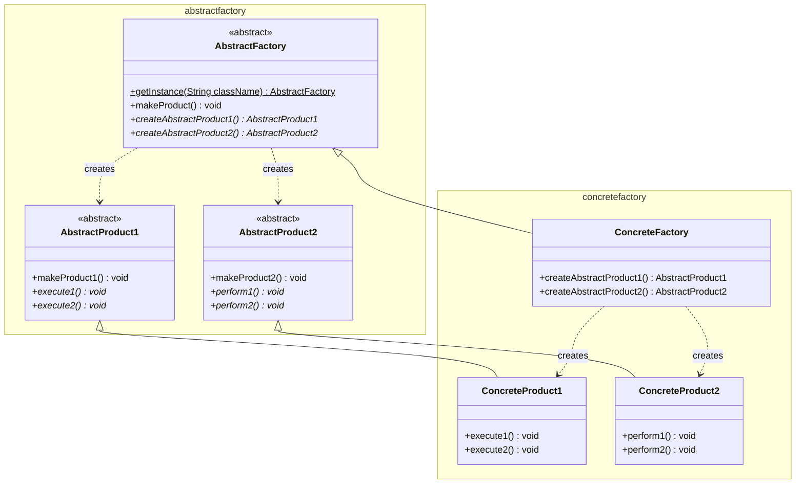
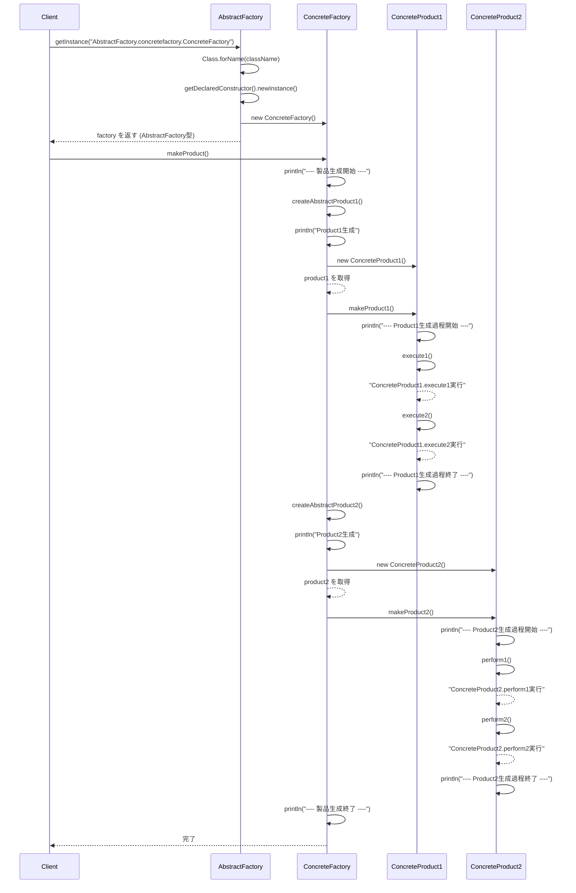

## 概要

Abstract Factory（アブストラクト・ファクトリー）パターンは、「**関連する部品の『セット』を、具体的なクラスを気にせずに一気に作り替える**」ためのデザインパターンです。別名「工場の工場」とも呼ばれます。

分かりやすい例えは、WindowsとMacのUI（ボタンやテキストボックス）の切り替えです。

- ボタン（部品A）：Windows風、Mac風
- テキストボックス（部品B）：Windows風、Mac風

もし、あなたのアプリが「今はWindowsモード」で動いているなら、ボタンもテキストボックスもWindows用で統一されていなければなりません。ここで「ボタンだけMac風」になってしまうと、デザインが崩れてしまいます。

Abstract Factoryは、「Windows工場」を呼べばWindows用の部品セットだけが、「Mac工場」を呼べばMac用の部品セットだけが確実に手に入るようにする仕組みです。

## クラス構造



## イメージ


### 図の見方

#### 抽象的な工場と製品：ルール

ここが「ルール」です。抽象的な工場は「うちの系列は、必ず『本体』と『芯』の2つを作ります」と宣言します。抽象的な本体・芯は、具体的な形は決まっていませんが、「書くための道具」としての共通の型です。

#### 具体的な工場：ブランド（製品ライン）

ここが「ブランド（製品ライン）」です。ボールペン工場は「ペン用の本体」と「インクの芯」をセットで作り、シャープペンシル工場は「シャーペン用の本体」と「黒鉛の芯」をセットで作ります。

#### Client（利用側）のメリット

Clientは、中央の「抽象的な工場」の窓口だけを使います。「ボールペン工場」をセットすれば、自動的にペン用のパーツが揃います。「うっかりシャーペンの本体にボールペンの芯を入れてしまった」という事故が構造的に起こらなくなるのです。

### まとめ

この仕組みのキモは、「横のつながり（継承）」と「縦のつながり（生成）」がマトリックス状に整理されている点にあります。「ボールペン」と「シャーペン」という別々の世界（ConcreteFactory）を完全に分離しつつ、Clientには「文房具を作る」という共通の窓口（AbstractFactory）だけを見せる。この「一貫性のあるセット販売」こそがAbstract Factoryの真髄です。

## メリット

「Windows風のボタン」と「Mac風のチェックボックス」が混ざってしまうと、画面がチグハグになります。このパターンを使えば、「Windows工場」からは必ず「Windows用の部品セット」だけが出てくるようになるため、デザインや仕様の統一感が保証されます。

使う側（クライアント）は「何のボタンを作るか」を知る必要がなく、ただ「工場にボタンを注文する」だけで済みます。これにより、将来的に部品のクラス名が変わっても、使う側のコードを修正する必要がありません。

「今はダークモード工場を使う」「次はライトモード工場を使う」と工場を入れ替えるだけで、アプリ全体の見た目や挙動を一気に変えることができるのも大きな強みです。

## デメリット

最大の弱点は、新しい「種類の部品」を追加するのが大変だという点です。たとえば「ボタン」と「テキスト」を作っていた工場に、新しく「スライダー」を追加したいとなった場合、抽象工場だけでなく、今まで作ったすべての具体的な工場を書き換えなければなりません。Windows工場、Mac工場、Linux工場……すべてに「スライダーの作り方」を追記して回る必要があります。

インターフェース、抽象クラス、具体的なクラスが何層にも重なるため、初めてコードを見る人が構造を理解するのに時間がかかるのもデメリットです。小さなプロジェクトで使うと、大げさすぎる設計になりがちです。

## サンプルソース

#### `abstractfactory`パッケージ

```java:AbstractFactory.java
package AbstractFactory.abstractfactory;

import java.lang.reflect.InvocationTargetException;

public abstract class AbstractFactory {
    public static AbstractFactory getInstance(String className) throws Exception {
        AbstractFactory abstractFactory = null;
        try {
            // Class#newInstance()はJava 9で非推奨になったため、
            // getDeclaredConstructor().newInstance()を使う
            abstractFactory = (AbstractFactory) Class.forName(className)
                    .getDeclaredConstructor()
                    .newInstance();
        } catch (ClassNotFoundException ex) {
            System.err.println("クラスの指定が正しくありません");
            throw ex;
        } catch (NoSuchMethodException | InvocationTargetException
                | InstantiationException | IllegalAccessException ex) {
            System.err.println("インスタンスの生成に失敗しました");
            throw ex;
        }
        return abstractFactory;
    }

    public void makeProduct() {
        System.out.println("---- 製品生成開始 ----");
        createAbstractProduct1().makeProduct1();
        createAbstractProduct2().makeProduct2();
        System.out.println("---- 製品生成終了 ----");
    }

    public abstract AbstractProduct1 createAbstractProduct1();
    public abstract AbstractProduct2 createAbstractProduct2();
}
```

```java:AbstractProduct1.java
package AbstractFactory.abstractfactory;

public abstract class AbstractProduct1 {
    public void makeProduct1() {
        System.out.println("---- Product1生成過程開始 ----");
        execute1();
        execute2();
        System.out.println("---- Product1生成過程終了 ----");
    }

    public abstract void execute1();
    public abstract void execute2();
}
```

```java:AbstractProduct2.java
package AbstractFactory.abstractfactory;

public abstract class AbstractProduct2 {
    public void makeProduct2() {
        System.out.println("---- Product2生成過程開始 ----");
        perform1();
        perform2();
        System.out.println("---- Product2生成過程終了 ----");
    }

    public abstract void perform1();
    public abstract void perform2();
}
```

#### `concretefactory`パッケージ

```java:ConcreteFactory.java
package AbstractFactory.concretefactory;

import AbstractFactory.abstractfactory.*;

public class ConcreteFactory extends AbstractFactory {
    @Override
    public AbstractProduct1 createAbstractProduct1() {
        System.out.println("Product1生成");
        return new ConcreteProduct1();
    }
    @Override
    public AbstractProduct2 createAbstractProduct2() {
        System.out.println("Product2生成");
        return new ConcreteProduct2();
    }
}
```

```java:ConcreteProduct1.java
package AbstractFactory.concretefactory;

import AbstractFactory.abstractfactory.*;

public class ConcreteProduct1 extends AbstractProduct1 {
    @Override
    public void execute1() {
        System.out.println("ConcreteProduct1.execute1実行");
    }
    @Override
    public void execute2() {
        System.out.println("ConcreteProduct1.execute2実行");
    }
}
```

```java:ConcreteProduct2.java
package AbstractFactory.concretefactory;

import AbstractFactory.abstractfactory.AbstractProduct2;

public class ConcreteProduct2 extends AbstractProduct2 {
    @Override
    public void perform1() {
        System.out.println("ConcreteProduct2.perform1実行");
    }
    @Override
    public void perform2() {
        System.out.println("ConcreteProduct2.perform2実行");
    }
}
```

#### `Main`

```java:Client.java
package AbstractFactory;

import AbstractFactory.abstractfactory.AbstractFactory;

public class Client {
    public static void main(String... args) throws Exception {
        final String fullyQualifiedClassName = "AbstractFactory.concretefactory.ConcreteFactory";
        AbstractFactory factory = AbstractFactory.getInstance(fullyQualifiedClassName);
        factory.makeProduct();
    }
}
```

### 実行結果

```
---- 製品生成開始 ----
Product1生成
---- Product1生成過程開始 ----
ConcreteProduct1.execute1実行
ConcreteProduct1.execute2実行
---- Product1生成過程終了 ----
Product2生成
---- Product2生成過程開始 ----
ConcreteProduct2.perform1実行
ConcreteProduct2.perform2実行
---- Product2生成過程終了 ----
---- 製品生成終了 ----
```

### シーケンス図


`AbstractFactory.getInstance()`は、クラス名を文字列として受け取り、リフレクションを使ってそのクラスのインスタンスを動的に生成しています。`Client`側は`"AbstractFactory.concretefactory.ConcreteFactory"`という文字列さえ知っていれば、`import`すら書かずに具体的な工場クラスを取得できます。設定ファイルなどからこの文字列を読み込むようにすれば、コードを再コンパイルすることなく「使う工場（部品セット）」を丸ごと切り替えられる、というのがこの実装の狙いです。

※なお、パッケージ名が`AbstractFactory.abstractfactory`のように大文字から始まっていますが、Javaの一般的な命名規約ではパッケージ名は小文字で統一するのが推奨されています（例：`abstractfactory.core`など）。今回は元の構成を大きく変えないため残していますが、実務では小文字のパッケージ名にするのが無難です。

## 補足：文字列によるクラス指定から、`ServiceLoader`という選択肢へ

今回のサンプルのように「クラス名を文字列で受け取り、リフレクションでインスタンス化する」という手法は、JDBCドライバの読み込みなど、Javaの歴史の中で長らく使われてきた定番のテクニックです。ただし、この方法にはクラス名の文字列をどこかにタイプミスなく管理し続けなければならないという弱点があります。

Java 6以降では、こうした「実行時にどの実装を使うか差し替えたい」という要望に応えるため、`java.util.ServiceLoader`という仕組みが標準ライブラリに用意されています。`META-INF/services`ディレクトリの下に、インターフェース名と同じファイル名の設定ファイルを置き、その中に実装クラス名を1行書いておくだけで、`ServiceLoader.load(AbstractFactory.class)`のようにして実装クラスを自動的に読み込めます。JDBC 4以降のドライバの自動検出も、この仕組みをベースにしています。今回のような「文字列でクラス名を指定する」手作りの実装は、パターンの仕組みを理解するにはうってつけですが、実務でプラグイン機構のようなものを作る場合は、まず`ServiceLoader`で実現できないかを検討してみるとよいでしょう。