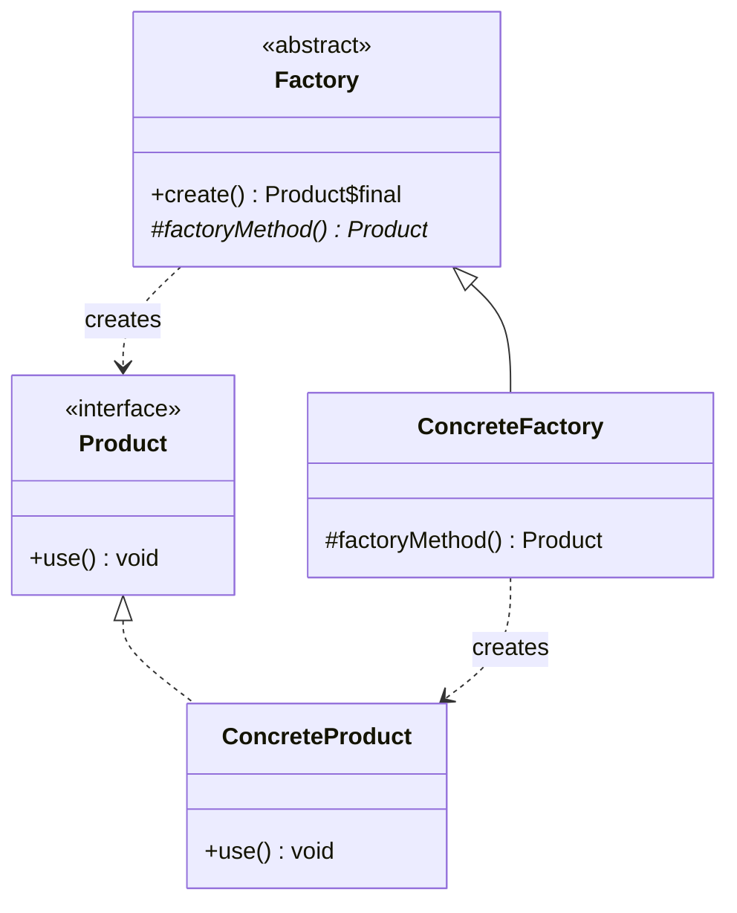
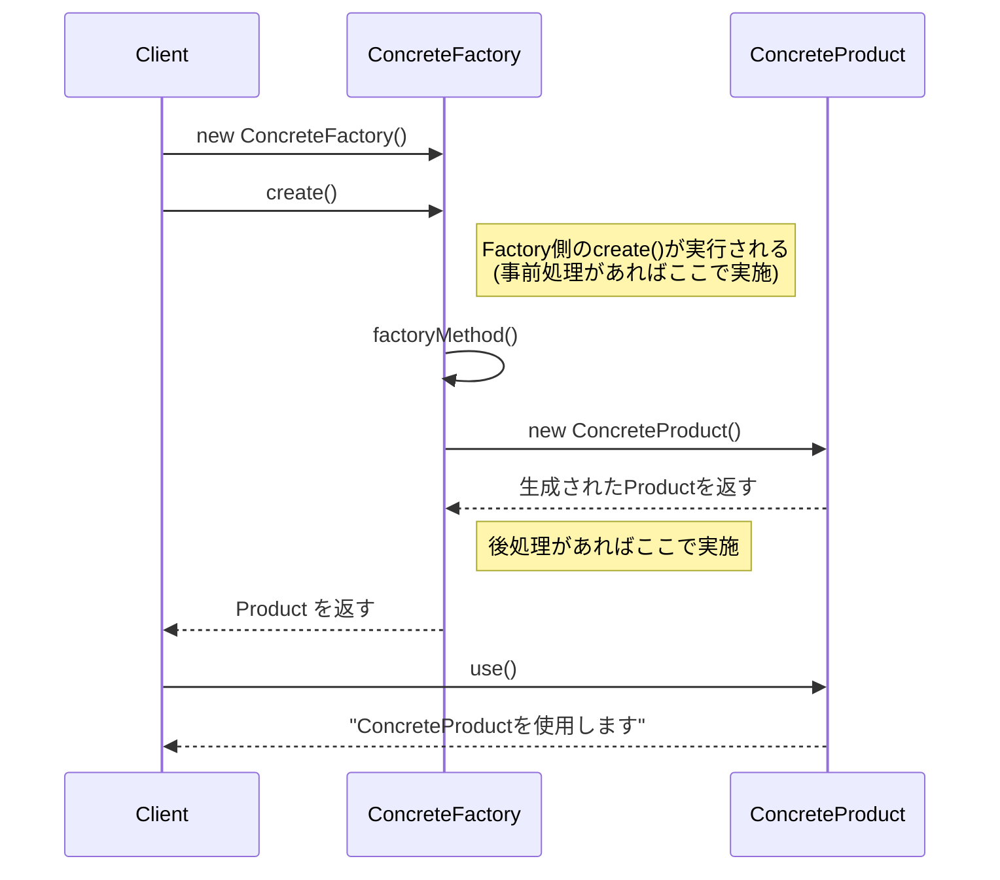

## 概要

Factory Method（ファクトリーメソッド）パターンを一言でいうと、「**インスタンス（モノ）の具体的な作り方を、サブクラスに任せる**」ためのデザインパターンです。

全国展開しているラーメンチェーン店を想像すると分かりやすいです。本部は「ラーメンを作る」という手順（メソッド）だけを決めておき、実際に「醤油ラーメンを作るのか」「味噌ラーメンを作るのか」という具体的な中身は、各店舗（サブクラス）が決める、という役割分担です。

普段、何かインスタンスを作るときは`new 自動車()`のように直接書けば済みます。ただしこの書き方だと、コードの中に「自動車」という具体的なクラス名がそのまま埋め込まれてしまい、あとから「別の乗り物に差し替えたい」となったときに、その`new`を書いた箇所をすべて探して直すことになります。Factory Methodパターンを使うと、利用する側（Client）は「何の製品が来るか」を細かく知らなくても、「工場にお願いすれば、何かしら製品が手に入る」という状態を作れます。

## クラス構造



## イメージ


ここから先の解説は上のイメージ図に沿って進めますが、図中では工場が製品を作るメソッドを`createProduct()`という名前で説明しています。一方、後述するサンプルコードでは、同じ役割のメソッドを`factoryMethod()`という名前にしています（さらに、それを外部から呼び出すための公開メソッドとして`create()`も用意しています）。呼び方は違いますが、「工場に実装させる、製品を作るためのメソッド」という役割はまったく同じものだと思ってください。

### 図の見方

#### スーパークラス同士の「約束」

画像上部の青いボックス（抽象的な工場・抽象的な製品）です。

- **抽象的な工場**：「うちの系列の工場は、必ず決まった名前のメソッド（画像では`createProduct()`）で製品を作る」ということだけを宣言します。中身の実装はここには書きません。
- **抽象的な製品**：「この工場群で作られるものは、すべて『製品』という共通の型として扱う」という約束です。

ここで決まるのは、あくまで「作り方の手順（枠組み）」だけです。

#### サブクラスでの「実作業」

画像下部の赤いボックス（自動車・ジュース）が実際の現場にあたります。

- **自動車工場**は、製品を作るメソッドの中で`new 自動車()`を実行します。
- **ジュース工場**は、同じ名前のメソッドの中で`new ジュース()`を実行します。

つまり、「具体的に何を`new`するか」という責任を、親クラスから子クラス（サブクラス）へと委ねているのがポイントです。

#### Client（利用側）のメリット

Clientは、「自動車工場」を具体的なクラスとしてではなく、「工場（スーパークラス）」という抽象的な型として扱います。「この工場が中で何を作っているかは詳しく知らないけれど、決まったメソッドを呼べば何かしら製品をくれるはずだ」というように、具体的な中身と切り離して（疎結合に）考えられるようになります。

ただし、ここで1つ注意が必要です。Clientが完全に何も知らなくてよいのは「どの製品（Product）が作られるか」までであって、「どの工場（Factory）を使うか」自体は、多くの場合Client側が選んで`new`する必要があります。「製品の詳細」と「工場の選択」は別の話だという点は、混同しやすいので覚えておくとよいでしょう。

### まとめ

この図の一番のメッセージは、「工場（Factory）」の継承関係と「製品（Product）」の継承関係が、並行した2本の系列になっているという点です。「自動車工場」が「工場」の子クラスであるのと同時に、「自動車」も「製品」の子（実装）になっている、という対応関係です。

「新しい製品を追加するなら、それに対応する新しい工場も用意する」というルールを徹底することで、どの工場がどの製品を作るのかという対応関係が常にはっきりし、プログラムが無秩序に広がっていくのを防いでいます。

## メリット

使う側（Client）が製品の具体的な中身を知らなくてよい、というのがいちばんの利点です。Clientは「何か製品を作って」と工場に頼むだけで済みます。製品の実装が「最新モデル」に変わっても、Client側の頼み方（呼び出し方）を変える必要がないため、修正範囲を最小限に抑えられます。

新しい製品を追加しやすい（拡張性が高い）のも大きな強みです。新しい製品（たとえば塩ラーメン）を追加したいとき、既存の醤油ラーメンや味噌ラーメンのコードには一切手を加えません。新しい「塩ラーメン工場クラス」を1つ追加するだけで済みます。こうした「機能追加のために既存コードを直さなくてよい」という性質は、「オープン・クローズドの原則（拡張に対しては開いていて、修正に対しては閉じている）」と呼ばれる設計原則の一例です。

また、インスタンスを生成する際の面倒な準備（初期設定や値のチェックなど）を、工場クラスの中に閉じ込めておけるというメリットもあります。あちこちのコードでバラバラに`new`して同じ初期化処理を繰り返すよりも、1箇所にまとめておいたほうが管理は格段に楽になります。

## デメリット

製品を1つ増やすたびに、それを作るための工場クラスも1つセットで増やす必要があります。「製品クラス」と「工場クラス」がペアで増えていくため、ファイルの数がどんどん多くなりがちです。

単純に`new ClassA()`と書けば済むところを、わざわざ抽象クラスやインターフェースを定義し、工場クラスまで用意する必要があるため、コードの見通しが一段階回りくどくなるのも事実です。特に小規模なプログラムでは、「かえって面倒になった」と感じることも珍しくありません。

そしてFactory Methodは仕組み上、継承（`extends`）を前提としています。新しい製品を追加するたびにサブクラスを作る必要があるため、設計がクラス階層に固定されやすく、柔軟性が失われる場面もあります（このあたりは、以前紹介したTemplate Methodパターンが抱える弱点とも共通しています）。

## サンプルソース

```java:Factory.java
public abstract class Factory {
    // 外部にはこちらの公開メソッドだけを見せる
    public final Product create() {
        // ここで事前処理（ログ出力やパラメータチェックなど）を行うことも可能
        Product product = factoryMethod();
        // ここで後処理（生成した製品の登録処理など）を行うことも可能
        return product;
    }

    // 何の製品を作るかはサブクラスに任せる（画像でいうcreateProduct()に相当）
    protected abstract Product factoryMethod();
}
```

```java:ConcreteFactory.java
public class ConcreteFactory extends Factory {
    // ConcreteFactoryはConcreteProductを生成することをここに実装
    @Override
    protected Product factoryMethod() {
        return new ConcreteProduct();
    }
}
```

```java:Product.java
public interface Product {
    void use();
}
```

```java:ConcreteProduct.java
public class ConcreteProduct implements Product {
    @Override
    public void use() {
        System.out.println("ConcreteProductを使用します");
    }
}
```

```java:Client.java
public class Client {
    public static void main(String... args) {
        // 使用する側に何の工場かは指定してもらう必要があるが、
        // 何の製品かは意識させたくない。
        Factory factory = new ConcreteFactory();
        Product product = factory.create();

        // 上記の代わりに以下の実装でも同様の処理となる。
        // ただし、利用者側が工場が作る製品を意識する必要が出てくる。
        // Product product = new ConcreteProduct();

        product.use();
    }
}
```

### 実行結果

```
ConcreteProductを使用します
```



なお、`create()`と`factoryMethod()`が別のメソッドとして分かれているのには理由があります。もし公開メソッドを用意せず、サブクラス側の`factoryMethod()`を直接呼び出す形にしてしまうと、製品を作る前後に必ず行いたい共通処理（ログを出す、パラメータをチェックする、作った製品を何かに登録する、など）を挟み込む場所がなくなってしまいます。`create()`を`final`にして間に挟んでおくことで、「製品ごとに変わる部分（`factoryMethod()`の中身）」と「どの製品でも共通の前後処理（`create()`の中身）」をきれいに分離できる、というのがこの構造の狙いです。

## 補足：Abstract Factoryパターンとの違い

名前が似ていて混同されやすいパターンに、**Abstract Factory（抽象ファクトリー）パターン**があります。両者の違いは、「工場が作る製品の数」にあります。

- **Factory Method**：1つの工場（Creator）が、1種類の製品を作るためのメソッドを持つ
- **Abstract Factory**：1つの工場が、互いに関連し合う複数種類の製品（製品ファミリー）をまとめて作るためのメソッド群を持つ

たとえば「和風の家具一式（和風の椅子・和風のテーブル）」と「洋風の家具一式（洋風の椅子・洋風のテーブル）」を、テイストを揃えたセットとしてまとめて作りたい場合はAbstract Factoryの出番です。一方、今回のように「何か1つの製品を作る手順を、サブクラスごとに切り替えたい」だけであれば、Factory Methodで十分です。実際、Abstract Factoryの内部では、各製品を作る部分にFactory Methodパターンが使われていることも多く、両者は独立した別物というより、発展的な関係にあると捉えるとよいでしょう。

## 補足：継承に依存しない代替案

デメリットで触れた「継承への依存」を避けたい場合、Java 8以降であれば、サブクラスを作る代わりに`Supplier<Product>`（引数を取らずに何かを返す関数型インターフェース）をコンストラクタで受け取る、という設計も選択肢になります。

```java
public class Factory {
    private final Supplier<Product> creator;

    public Factory(Supplier<Product> creator) {
        this.creator = creator;
    }

    public Product create() {
        return creator.get();
    }
}
```

```java
// ConcreteFactoryクラスを作らず、ラムダ式で製品の作り方だけを渡す
Factory factory = new Factory(ConcreteProduct::new);
Product product = factory.create();
```

こうすると、新しい製品を追加するたびに工場のサブクラスを作る必要がなくなり、クラス数の増加も抑えられます。ただし、これは「継承」ではなく「コンポジション」を使った実装になるため、厳密には元祖のGoF流Factory Methodパターンとは少し性質が異なる点には注意してください。あくまで、状況に応じて選べる現代的な代替案の1つとして捉えるとよいでしょう。

※`Supplier`は`java.util.function`パッケージのクラスなので、実際に上記のコードを試す場合は、ファイルの先頭に`import java.util.function.Supplier;`を忘れずに追加してください。