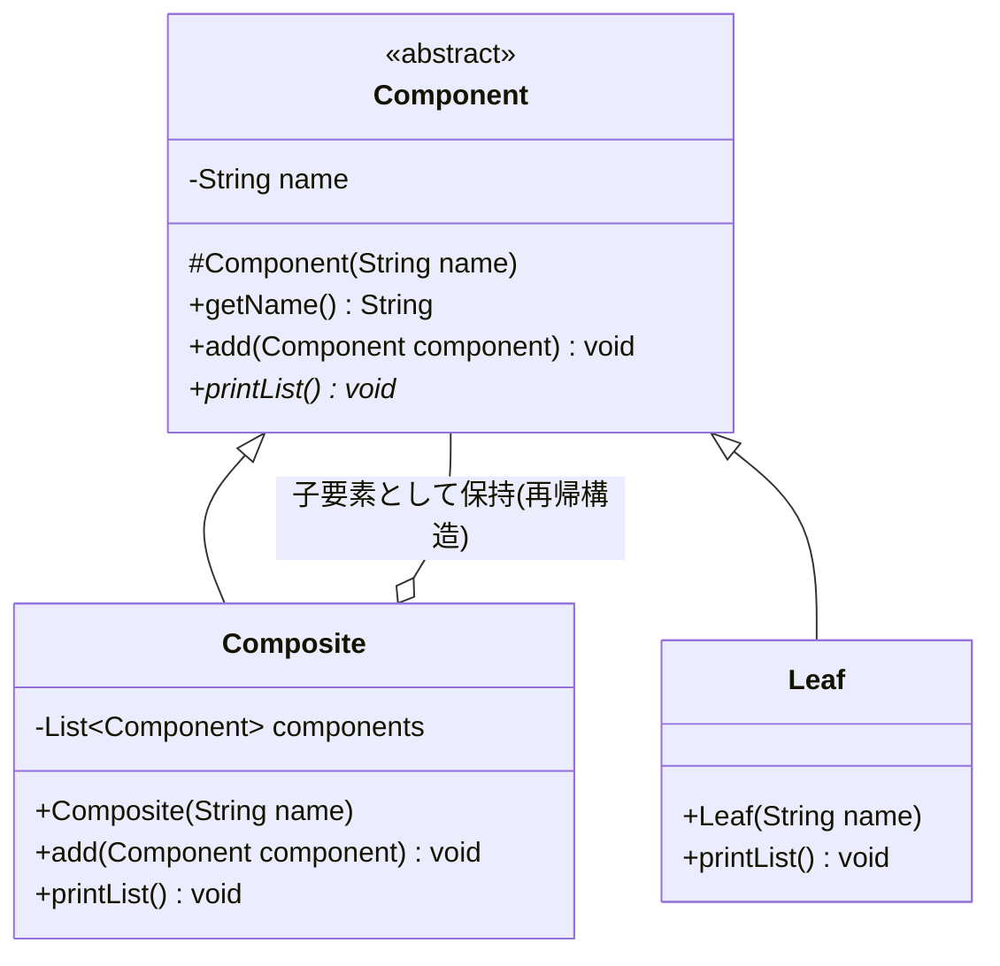
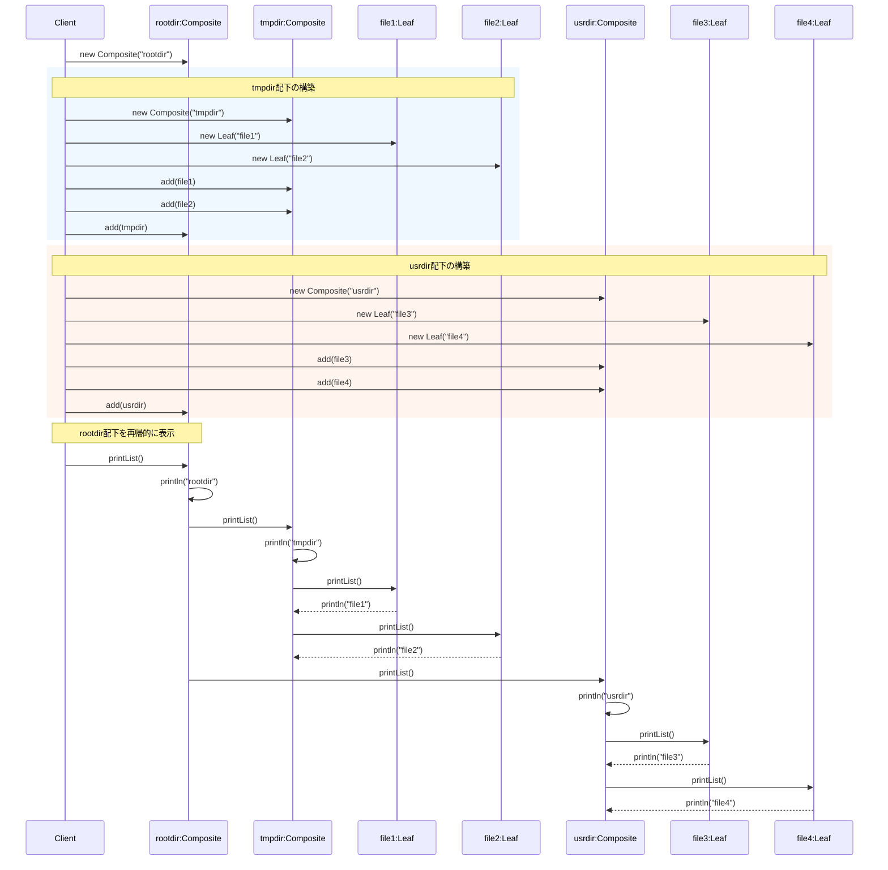

## 概要

Composite（コンポジット）パターンは、「**『単品』と『セット（詰め合わせ）』を、区別せずに同じように扱う**」ためのデザインパターンです。ファイルシステム（ファイルとフォルダの関係）をイメージすると分かりやすいです。

- ファイル（単体）：中身があるデータ。それ以上中には何も入れられません
- フォルダ（複合体）：ファイルや、さらに別のフォルダを入れることができます

ここで重要なのは、「サイズを表示する」という操作です。あなたが「サイズを知りたい」と思ったとき、相手がファイルであってもフォルダであっても、右クリックして「プロパティ」を見ればサイズが分かります。フォルダの場合は、中に入っているすべてのファイルとサブフォルダの合計を自動で計算してくれます。

このように、中身が1つなのか、たくさん入っている箱なのかを意識せずに、同じ命令（メソッド）を送れるようにするのがCompositeパターンの本質です。

## クラス構造



## イメージ


### 図の見方

#### Componentクラス：共通の顔

画像内のオレンジの枠「Componentクラス」に注目してください。これが、ファイルとフォルダの共通の親（インターフェース）になります。「ファイルなのかディレクトリ（フォルダ）なのかの差異を意識せず」に済むのは、このComponentという共通の型があるからです。

#### 再帰呼び出し：マトリョーシカの連鎖

中央と右側の赤い矢印「再帰呼び出し」がこのパターンの核心です。フォルダ（Component）の中に、また別のフォルダ（Component）が入り、その中にもまたフォルダが入る……というように繰り返すことで、どんなに深い階層構造になっても、一番上のフォルダを操作するだけで、中身すべてに命令を伝えることができるようになります。

#### Client（利用側）のメリット

Clientは、目の前のオブジェクトが「ただのファイル」なのか「100個のファイルが入った巨大なフォルダ」なのかを判別する`if`文を書く必要がありません。ただ「Componentさん、処理をお願いします」と一言頼むだけで済みます。

### まとめ

この仕組みのキモは、「入れ子構造をフラットに捉える」という考え方です。「1個のもの」と「1個以上の集まり」を同じように扱えることによって、ディレクトリをまるごとコピーするような処理が、非常に短いコードで書けるようになります。

## メリット

使う側（クライアント）は、相手が「1つのデータ」なのか「それらを束ねたグループ」なのかを気にする必要がありません。たとえばフォルダの中にある全ファイルの合計サイズを知りたいとき、中身がファイルでもサブフォルダでも、ただ「サイズを教えて」という命令（再帰的な呼び出し）を出すだけで完結します。

階層構造をそのままクラス構成に落とし込めるため、ファイルシステム、組織図、XML/HTMLの構造、GUIのウィンドウとボタンの関係などを直感的に実装できるのも利点です。

新しい種類の「単品（Leaf）」や、新しいルールの「セット（Composite）」を追加しても、それを利用する側のコードを修正する必要がありません。これは「開放閉鎖の原則」に沿った性質です。

## デメリット

「単品」と「セット」を同じインターフェースで扱うため、本来は「セット」にしかできない操作（子要素を追加する、など）を、「単品」側にも持たせなければならないことがあります。ファイル（単品）に対して「中身に別のファイルを詰め込む」という、意味のないメソッドが定義されてしまうことがある、というのが典型例です（後述のサンプルコードで実際に確認します）。

「このフォルダには画像ファイルしか入れられないようにしたい」といった細かい制限をかけようとすると、実行時に型をチェックするコードが必要になり、パターンのメリットである一貫性が薄れてしまいます。

構造が非常に深くなると、処理が何層にもわたって再帰的に呼び出されるため、エラーが起きたときに「今、どの階層のどの部品で止まったのか」を追いかけるのが大変になることもあります。

## サンプルソース

```java:Component.java
public abstract class Component {
    private final String name;

    protected Component(String name) {
        this.name = name;
    }

    public String getName() {
        return name;
    }

    // Leafはadd()できないため、デフォルトでは「サポートしていない操作」として例外を投げる。
    // Compositeはこのメソッドをオーバーライドして、実際に子要素を追加できるようにする。
    public void add(Component component) {
        throw new UnsupportedOperationException(getName() + "には子要素を追加できません");
    }

    public abstract void printList();
}
```

```java:Composite.java
import java.util.ArrayList;
import java.util.List;

public class Composite extends Component {
    private final List<Component> components = new ArrayList<>();

    public Composite(String name) {
        super(name);
    }

    @Override
    public void add(Component component) {
        components.add(component);
    }

    @Override
    public void printList() {
        System.out.println(getName());
        // 配下のComponent（Leaf・Composite問わず）をすべて表示
        for (Component component : components) {
            component.printList();
        }
    }
}
```

```java:Leaf.java
public class Leaf extends Component {
    public Leaf(String name) {
        super(name);
    }

    @Override
    public void printList() {
        System.out.println(getName());
    }
}
```

```java:Client.java
public class Client {
    public static void main(String... args) {
        // rootディレクトリ作成
        Composite rootdir = new Composite("rootdir");

        // tmpディレクトリを作成し、file1, file2を作成
        Composite tmpdir = new Composite("tmpdir");
        Leaf file1 = new Leaf("file1");
        Leaf file2 = new Leaf("file2");
        tmpdir.add(file1);
        tmpdir.add(file2);
        // rootディレクトリの直下にtmpディレクトリを置く
        rootdir.add(tmpdir);

        // usrディレクトリを作成し、file3, file4を作成
        Composite usrdir = new Composite("usrdir");
        Leaf file3 = new Leaf("file3");
        Leaf file4 = new Leaf("file4");
        usrdir.add(file3);
        usrdir.add(file4);
        // rootディレクトリの直下にusrディレクトリを置く
        rootdir.add(usrdir);

        // rootディレクトリ配下のComponentをすべて表示
        rootdir.printList();
    }
}
```

### 実行結果

```
rootdir
tmpdir
file1
file2
usrdir
file3
file4
```

### シーケンス図


## 補足：Leafに対して`add()`を呼ぶとどうなるか

デメリットで触れた「単品側にも意味のないメソッドを持たせなければならない」問題を、実際に動かして確認してみます。`file1`は`Leaf`のインスタンスなので、本来は何も追加できません。

```java
try {
    file1.add(new Leaf("file5"));
} catch (UnsupportedOperationException e) {
    System.out.println("エラー：" + e.getMessage());
}
```

```
エラー：file1には子要素を追加できません
```

`Leaf`クラスは`add()`をオーバーライドしていないため、`Component`が持つデフォルトの実装（`UnsupportedOperationException`を投げる）がそのまま使われます。これは、Javaの標準ライブラリで`List.of(...)`のような変更不可なリストに対して`add()`を呼んだときに`UnsupportedOperationException`が発生するのとまったく同じ考え方です。「インターフェース上は同じメソッドを持っているが、実装によっては実行時にサポートされないことがある」というこの割り切りは、Composite パターンにおける「透明性（同じインターフェースで統一する）」と「安全性（無意味な操作を型レベルで防ぐ）」のトレードオフとしてよく議論されるポイントです。

なお、GoFの原典で紹介されている`Component`インターフェースには、`add()`だけでなく`remove()`（子要素の削除）や`getChild()`（子要素の取得）といったメソッドも含まれることがあります。今回はシンプルさを優先して`add()`だけに絞っていますが、実務で本格的な木構造を扱う場合は、こうした操作もあわせて検討するとよいでしょう。