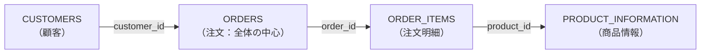
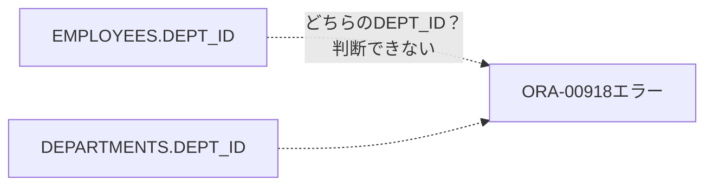
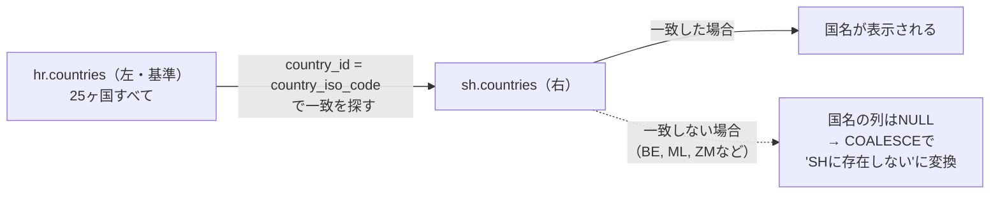
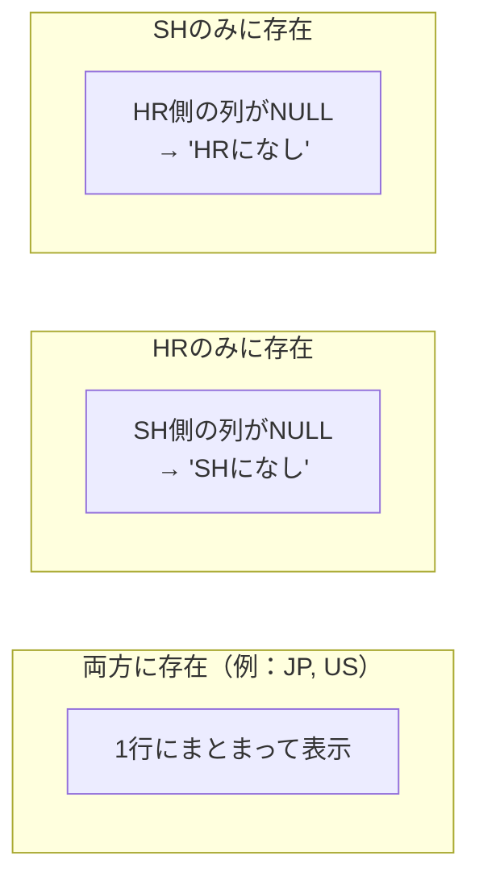
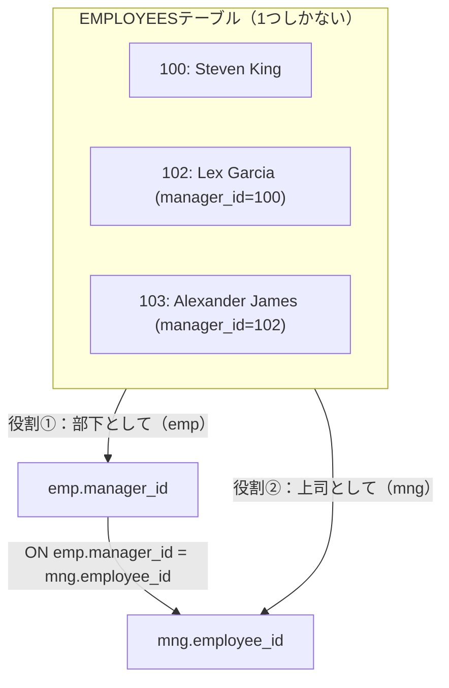
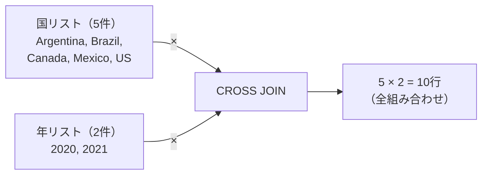
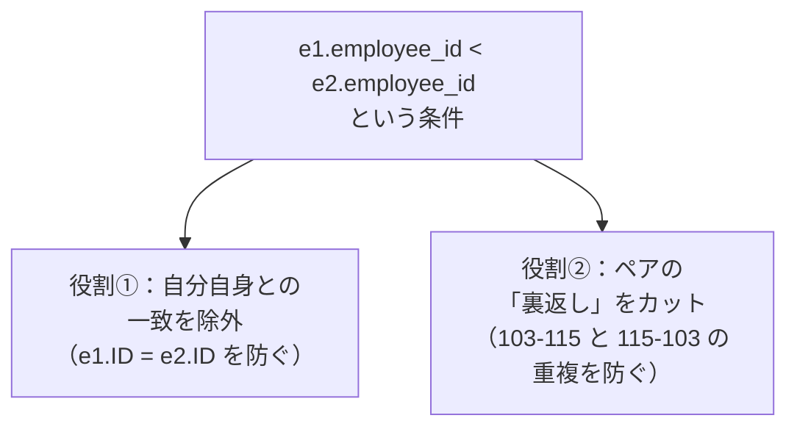
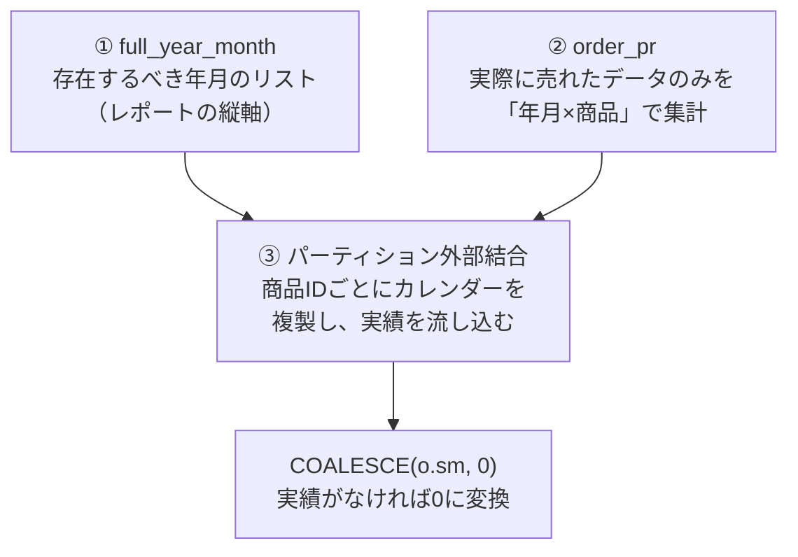

# 問題10-1：内部結合（複数テーブルの結合）
### 難易度：★★☆☆☆ (Lv.2)
## 問題
OEスキーマの各テーブルを使用して、注文ID（`ORDER_ID`）が「2454」である注文の詳細データを取得してください。
この問題では、注文、顧客、注文明細、商品の計4つのテーブルを適切に結合する必要があります。なお、結果の表示順は問いません。

**【取得項目と編集ルール】**
* **ORDER_DATE**：`ORDERS`テーブルより取得。「YYYY-MM-DD HH24:MI:SS」形式の文字列に変換してください。
* **CUSTOMER_NAME**：`CUSTOMERS`テーブルの`CUST_FIRST_NAME`と`CUST_LAST_NAME`を半角スペースで結合してください。
* **PRODUCT_NAME**：`PRODUCT_INFORMATION`テーブルより取得してください。
* **QUANTITY**：`ORDER_ITEMS`テーブルより取得してください。

## 期待する結果
| ORDER_DATE           | CUSTOMER_NAME   | PRODUCT_NAME     | QUANTITY |
| --------------------- | ---------------- | ------------------ | -------- |
| 2007-10-02 16:49:34   | Manisha Taylor    | PS 12V /P            | 3         |
| 2007-10-02 16:49:34   | Manisha Taylor    | MB - S600             | 0         |
| 2007-10-02 16:49:34   | Manisha Taylor    | Video Card /E32       | 12        |
| 2007-10-02 16:49:34   | Manisha Taylor    | KB 101/ES             | 120       |
| 2007-10-02 16:49:34   | Manisha Taylor    | Resin                 | 18        |
| 2007-10-02 16:49:34   | Manisha Taylor    | Screws <B.32.P>       | 16        |
| 2007-10-02 16:49:34   | Manisha Taylor    | Screws <S.32.S>       | 13        |

## 解答例
```sql:例1：INNER JOINを使用
SELECT
    TO_CHAR(o.order_date, 'YYYY-MM-DD HH24:MI:SS')  AS "ORDER_DATE",
    c.cust_first_name || ' ' || c.cust_last_name  AS "CUSTOMER_NAME",
    p.product_name,
    oi.quantity
FROM
    oe.order_items                   oi
    INNER JOIN oe.orders              o 
       ON oi.order_id = o.order_id
    INNER JOIN oe.customers           c 
       ON o.customer_id = c.customer_id
    INNER JOIN oe.product_information p 
       ON oi.product_id = p.product_id
WHERE o.order_id = 2454
```
```sql:例2：使用するテーブルをカンマで区切る方法
SELECT
    TO_CHAR(o.order_date, 'YYYY-MM-DD HH24:MI:SS')  AS "ORDER_DATE",
    c.cust_first_name || ' ' || c.cust_last_name  AS "CUSTOMER_NAME",
    p.product_name,
    oi.quantity
FROM
    oe.order_items         oi,
    oe.orders              o,
    oe.customers           c,
    oe.product_information p
WHERE
        o.order_id = 2454
    AND oi.order_id = o.order_id
    AND o.customer_id = c.customer_id
    AND oi.product_id = p.product_id
```
```sql:例3：USINGを使用（例1の派生）
SELECT
    TO_CHAR(order_date, 'YYYY-MM-DD HH24:MI:SS')  AS "ORDER_DATE",
    c.cust_first_name || ' ' || c.cust_last_name  AS "CUSTOMER_NAME",
    p.product_name,
    oi.quantity
FROM
    oe.order_items                   oi
    INNER JOIN oe.orders              o 
       USING(order_id)
    INNER JOIN oe.customers           c 
       USING(customer_id)
    INNER JOIN oe.product_information p 
       USING(product_id)
WHERE order_id = 2454
```

## 解説
複数のテーブルからバラバラになった情報をパズルのように組み合わせる「結合（JOIN）」は、SQLの中でも実力が試される分野です。今回は「注文内容」を中心に、顧客情報と商品情報を紐づける実践的なクエリです。

内部結合（INNER JOIN）は、SQLで最も頻繁に使われる結合方法です。「複数のテーブル間で、指定した条件が両方に存在するデータのみを結びつける」という仕組みで、ベン図でいうところの「重なり合った部分（積集合）」を取り出すイメージです。


例えば、社員全員の情報を持つ「社員テーブル」と、資格を保有している社員だけを記録した「資格テーブル」（資格を持たない社員のデータは存在しない）があるとします。これらを「社員ID」で内部結合すると、資格を持っていない社員の情報は検索結果から消えてしまいます。内部結合は「結合する両方のテーブルに存在するデータのみ」を抽出する仕組みなので、片方のテーブルにデータが存在しない社員は、結合の条件から漏れて出力対象外になるのです。この挙動は最初つまずきやすいポイントなので、覚えておいて損はありません。

今回のクエリでは、4つのテーブルが連なるように結合されています。



`ORDERS`（注文）が全体の中心で、誰がいつ注文したかを管理し、`CUSTOMERS`（顧客）が`customer_id`で`ORDERS`と結合されて顧客名を、`ORDER_ITEMS`（注文明細）が`order_id`で`ORDERS`と結合されて注文の中身を、`PRODUCT_INFORMATION`（商品情報）が`product_id`で`ORDER_ITEMS`と結合されて商品名を提供しています。

解答例には3つの書き方があり、実務での評価は大きく異なります。

| 書き方 | 特徴 | 実務での評価 |
| :--- | :--- | :--- |
| 例1：`INNER JOIN ... ON` | 結合条件が1セットで書ける | 最も標準的で現在主流。ほとんどのプロジェクトで推奨 |
| 例2：カンマ区切り＋`WHERE` | 結合条件と抽出条件が混在する | Oracleの古いバージョンの名残。結合漏れ（デカルト積）事故を招きやすい |
| 例3：`USING`句 | 両テーブルで結合カラム名が完全に同じ場合のみ使える | 便利だが汎用性は`ON`の方が高い |

例1の`INNER JOIN ... ON`は最も標準的で現在主流の書き方で、「どのテーブルとどのテーブルを、何の条件でくっつけるか」が1セットで書けるため読みやすく、ほとんどのプロジェクトで推奨されます。例2のカンマ区切り＋`WHERE`句は、Oracleの古いバージョンでよく使われていた書き方です。結合条件（JOIN）と抽出条件（WHERE）が混ざり合うため、テーブルが増えると「結合し忘れ（デカルト積）」という事故を招きやすく、既存の古いシステムの保守で見かけることはあっても、新規で書くなら例1を使うのが無難です。例3の`USING`句は、結合するカラム名が両方のテーブルで全く同じ（例：両方とも`order_id`）場合に使える書き方で、`oi.order_id = o.order_id`と書く手間が省ける一方、テーブル設計によってはカラム名が違うこともあるため、汎用性は`ON`の方が高いです。

データベースは、4つのテーブルをすべて結合して「巨大な1つの表」を作ってから、最後に`WHERE o.order_id = 2454`で必要な行だけを抜き出す、という処理順序で動きます。

期待する結果を見ると、Manisha Taylorさんが1回の注文（2454番）で、ネジ（Screws）やビデオカードなど複数の商品をまとめて購入している様子が分かります。「1つの注文に複数の明細（商品）がぶら下がっている」という1対多（One-to-Many）の関係が、結合によって1つのリストとして可視化されました。

:::message
### ORA-00918: 列の定義が未確定です（column ambiguously defined）
SQL初心者が遭遇しやすい「ORA-00918」エラーについて説明します。

複数のテーブルを結合（JOIN）して検索する際、それぞれのテーブルに同名の列が存在することがあります（例：`ID`、`NAME`、`CREATED_AT`など）。SQLの中でその列名を単独で書くと、Oracleは「どのテーブルのデータを取り出せばいいのか」を判断できず、処理を止めます。

`EMPLOYEES`テーブルと`DEPARTMENTS`テーブルの両方に`DEPT_ID`という列がある場合、次のように書くとエラーになります。
```sql
SELECT DEPT_ID, EMP_NAME, DEPT_NAME
FROM EMPLOYEES E
JOIN DEPARTMENTS D ON E.DEPT_ID = D.DEPT_ID;
```



`SELECT`句にある`DEPT_ID`が、`EMPLOYEES`のものか`DEPARTMENTS`のものか区別がつかないためです。修正方法は、テーブル名（または別名）で列を修飾することです。
```sql
SELECT E.DEPT_ID, E.EMP_NAME, D.DEPT_NAME
FROM EMPLOYEES E
JOIN DEPARTMENTS D ON E.DEPT_ID = D.DEPT_ID;
```

いくつか注意点もあります。`SELECT`句だけ直しても、`WHERE`句や`ORDER BY`句で指定が漏れているとエラーになるので、`WHERE DEPT_ID = 10`は`WHERE E.DEPT_ID = 10`のように、他の箇所も合わせて修正が必要です。

また`JOIN`で`ON`ではなく`USING`を使う場合、逆にテーブル修飾をしてはいけないという特殊なルールがあります。

| 結合方法 | テーブル修飾 |
| :--- | :--- |
| `ON`句 | 必要（`E.DEPT_ID`のように書く） |
| `USING`句 | 禁止（`DEPT_ID`とだけ書く。修飾すると逆にエラー） |

`SELECT E.DEPT_ID FROM EMPLOYEES E JOIN DEPARTMENTS D USING (DEPT_ID)`はNGで、`SELECT DEPT_ID FROM EMPLOYEES E JOIN DEPARTMENTS D USING (DEPT_ID)`が正解です。`USING`を使うと、Oracle内部でその列が「結合キー」として1つに統合されるため、修飾すると逆に不適切とみなされます。

サブクエリの中で同名の列を複数SELECTしている場合も同様のエラーが起きます。
```sql
-- サブクエリ内で名前が重複している例
SELECT * FROM (
    SELECT E.ID, D.ID FROM EMPLOYEES E, DEPARTMENTS D
) -- ここで「ID」という名前の列が2つできてしまう
```
この場合は、サブクエリ内で`D.ID AS DEPT_ID`のように別名をつけて重複を回避する必要があります。

トラブルを防ぐには、単一テーブルのクエリであっても将来的にJOINが増える可能性を考えて最初からテーブル別名をつけて書く癖をつけること、`SELECT *`を避けて意図せず同名列を複数取得してしまう事態を防ぐこと、可能であれば設計段階で「どのテーブルのIDか」がすぐ分かる列名（`EMP_ID`と`DEPT_ID`など）にしておくことが役立ちます。
:::

----
<br><br>

# 問題10-2：外部結合１（LEFT OUTER JOIN）
### 難易度：★★☆☆☆ (Lv.2)
## 問題
HRスキーマの`COUNTRIES`テーブルにあるすべての国ID（`COUNTRY_ID`）を取得してください。あわせて、SHスキーマの`COUNTRIES`テーブルから対応する「国名（`COUNTRY_NAME`）」も取得してください。

**【抽出・編集ルール】**
* **結合条件**：HRスキーマの `COUNTRY_ID` と、SHスキーマの `COUNTRY_ISO_CODE` を比較して結合してください。
* **外部結合の利用**：HRスキーマ側にある国はすべて表示し、SHスキーマ側にデータが存在しない場合でも結果に含めてください。
* **NULLの扱い**：SHスキーマに該当する国名が存在しない場合は、「SHに存在しない」という文字列を表示してください。

## 期待する結果
| COUNTRY_ID | COUNTRY_NAME              |
| ----------- | -------------------------- |
| US          | United States of America    |
| DE          | Germany                     |
| GB          | United Kingdom               |
| NL          | Netherlands                  |
| DK          | Denmark                      |
| FR          | France                       |
| BR          | Brazil                        |
| AR          | Argentina                    |
| JP          | Japan                          |
| IN          | India                          |
| AU          | Australia                       |
| CA          | Canada                          |
| CN          | China                            |
| SG          | Singapore                        |
| IT          | Italy                              |
| MX          | Mexico                             |
| CH          | Switzerland                        |
| NG          | Nigeria                              |
| EG          | Egypt                                 |
| ZW          | Zimbabwe                              |
| KW          | Kuwait                                  |
| IL          | Israel                                    |
| ZM          | SHに存在しない                           |
| ML          | SHに存在しない                           |
| BE          | SHに存在しない                           |

## 解答例
```sql:例1：LEFT JOINを使用
SELECT
    h.country_id,
    COALESCE(s.country_name, 'SHに存在しない') AS "COUNTRY_NAME"
FROM
    hr.countries h
    LEFT OUTER JOIN sh.countries s 
      ON h.country_id = s.country_iso_code
```
```sql:例2：使用するテーブルをカンマで区切る方法
SELECT
    h.country_id,
    COALESCE(s.country_name, 'SHに存在しない') AS "COUNTRY_NAME"
FROM
    hr.countries h,
    sh.countries s
WHERE
    h.country_id = s.country_iso_code (+)
```

## 解説
今回は「外部結合（OUTER JOIN）」です。これまでの内部結合（INNER JOIN）は「両方のテーブルに存在するデータ」のみを表示していましたが、今回は「片方のテーブルにしかなくても、基準となるテーブルのデータはすべて表示する」という、実務のデータ整合性チェックなどで欠かせないテクニックを学びます。

外部結合（OUTER JOIN）には、「どのテーブルを主役（全件表示）にするか」によって3つの種類があります。

| 種類 | 全件表示されるテーブル | 実務での使用頻度 |
| :--- | :--- | :--- |
| `LEFT OUTER JOIN` | 左側（先に書いたテーブル） | ◎ 最もよく使われる |
| `RIGHT OUTER JOIN` | 右側（後に書いたテーブル） | △ ほとんど使われない |
| `FULL OUTER JOIN` | 左右両方 | ○ 差分チェック等で使う |

左外部結合（LEFT OUTER JOIN）は左側に書いたテーブルのデータをすべて表示し、右側のテーブルに一致するデータがあればくっつけます（先に登場したテーブルを「左」、後に登場したテーブルを「右」と表現します）。実務で最もよく使われる結合です。


右外部結合（RIGHT OUTER JOIN）はその逆で、右側に書いたテーブルのデータをすべて表示します。


完全外部結合（FULL OUTER JOIN）は左と右、両方のテーブルのデータをすべて表示します。


今回のように、実務ではほとんどの場合、基準を左に置く`LEFT OUTER JOIN`が使われます。動作としては、左側（FROM句）の`hr.countries`を基準にし、ここにある25ヶ国は右側にデータがあろうとなかろうとすべて表示されます。右側（JOIN句）の`sh.countries`から名前を探しに行き、該当するコードがなければ右側のテーブル由来のカラムはすべてNULLとして出力されます。



外部結合をすると、どうしても「SHにデータがない国」でNULLが発生します。これを「SHに存在しない」という分かりやすい文字に置き換えているのが`COALESCE`関数です。
```sql
COALESCE(s.country_name, 'SHに存在しない')
```
引数を左から順番に見ていき、最初にNULLではない値を返します。`country_name`があればそれを表示し、もしNULL（＝結合に失敗）なら`'SHに存在しない'`を表示するというロジックです。Oracleでは`NVL(s.country_name, 'SHに存在しない')`と書いても同じ結果になります。

解答例2にある`(+)`は、Oracleデータベース特有の古い書き方です。`(+)`が付いている方のテーブルを「不足している可能性がある側（外部テーブル）」として扱います。現在のシステム開発では、他のデータベース（MySQLやPostgreSQLなど）でもそのまま動くことと、結合条件が`ON`句にまとまって読みやすいことから、標準SQL（ANSI形式）の`LEFT OUTER JOIN`（例1）を使うのが一般的です。

今回の問題は、実務でよくある「マスタデータの不備」を探すシミュレーションになっています。HR（人事）マスタにはあるのに、SH（売上）マスタには登録されていない国が「BE（ベルギー）」「ML（マリ）」「ZM（ザンビア）」の3つあることが判明しました。このように「あるはずのデータが、もう片方のテーブルから漏れていないか」を確認するために、外部結合はよく使われます。

:::message
### 右外部結合(RIGHT JOIN)って必要？
数学的・論理的には、`RIGHT JOIN`でできることはすべて`LEFT JOIN`で書けます。テーブルAとBがあるとき、`A RIGHT JOIN B`は`B LEFT JOIN A`と全く同じ結果を返します。そのため、多くのエンジニアは「常にLEFT JOINを使う」というマイルールを持っており、RIGHT JOINを一度も書かない人も珍しくありません。私自身、実務ではまだ一度も使ったことがありません。

では、なぜわざわざRIGHT JOINが存在するのか、あえて使うとしたらどんな時でしょうか。

唯一と言ってもいい実践的な使い道が、複雑な「結合の連鎖」を壊したくない場面です。例えば、すでに3つのテーブルを結合しているクエリに、さらにもう1つテーブルを足したい場合を考えてみます。
```sql
SELECT *
FROM customers c
JOIN orders o ON c.id = o.customer_id
JOIN details d ON o.id = d.order_id
-- ここで「商品マスター(products)」を足したい。
-- ただし、注文されていない商品も含めてすべて表示したい。
```
ここでLEFT JOINにこだわると、`products`を一番左（FROMの直後）に持ってくるためにクエリ全体を書き換える必要が出てきます。しかしRIGHT JOINを使えば、今の流れを維持したまま最後に「右側（新しく足す方）を優先してね」と付け加えるだけで済みます。
```sql
...
RIGHT JOIN products p ON d.product_id = p.id;
```
「左から右へ流れるロジックの組み立てを崩したくない」という時に役立つ、というわけです（それでも私は個人的にはLEFT JOINで書き直してしまうと思いますが）。

もう一つの理由は、SQLが「自然言語（英語）」に近い形を目指して作られた言語であり、「左があるなら、右があってもいいじゃないか」というデザイン上の対称性のために用意されている、という側面もあります。

それでもなお、多くの現場でLEFT JOINが推奨されるのには理由があります。私たちは（特に横書き文化では）左から右へ情報を処理するため、「メインのテーブルが左にあり、そこに情報を付け足していく」というLEFT JOINの流れの方が直感的に理解しやすいのです。また、LEFTとRIGHTが1つのクエリに混在すると、どちらのテーブルが主軸なのか一瞬で判断できなくなり、結合漏れのバグの原因になりやすい、という実務上の理由もあります。
:::

:::message
### とりあえず「外部結合」
SQL初心者に内部結合・外部結合の概念を教えた後、非常に多いのが、内部結合で済むところをすべて外部結合にしてしまうパターンです。「とりあえずLEFT JOINにしておけばデータが消えないから安心」というのは、多くの人が一度は通る道かもしれません。

初心者が外部結合を選んでしまう背景には、いくつかの心理があります。内部結合（INNER JOIN）を使うと結合相手がいない行が結果から消えてしまい、これを見て「計算が合わなくなるのでは」と不安になること、テーブル間の関係性（親に対して子が必ず存在するかどうか）を把握しきれておらず「念のため」すべて残そうとすること、「このテーブルのデータを全部見たい」という直感にLEFT JOINの挙動がマッチしすぎてしまうこと、などです。

「とりあえず」で外部結合を使うと、いくつかの実害が発生します。本来「結合相手が必ずいるはず」のデータに不備（ゴミデータ）があってもNULLとして表示されるため異常に気づけない、という品質の隠蔽が起こりえます。また`COUNT`や`AVG`を使う際、意図しないNULLが混じることで計算結果が狂う原因にもなります。さらに、オプティマイザ（Oracleの実行計画を立てる仕組み）の選択肢を狭めてしまい、大規模データでは処理が遅くなることもあります。

判断基準は次のように整理できます。

| 結合相手がいないレコード | 判断 |
| :--- | :--- |
| 表示されないのが正しい（存在しなければ無価値） | `INNER JOIN` |
| いなくても存在自体を表示したい | `OUTER JOIN` |

注文詳細のない注文や、社員のいない部署はINNER JOINで消してよいケースが多く、売上が0円の商品一覧やまだ配属先が決まっていない新入社員はOUTER JOINで残すべきケースにあたります。

外部結合は「優しさ」ではなく「例外処理」だと捉えると、判断がしやすくなります。すべてを救おうとするのではなく、データの意味（ビジネスルール）に従って、必要なところではINNER JOINで潔く絞り込むことも大切です。
:::

----
<br>

# 問題10-3：外部結合２（FULL OUTER JOIN と 差分抽出）
### 難易度：★★☆☆☆ (Lv.2)
## 問題
HRスキーマの`COUNTRIES`テーブルと、SHスキーマの`COUNTRIES`テーブルを比較し、**どちらか一方のテーブルにしか存在しない国**を特定してください。

**【抽出・編集ルール】**
* **結合条件**：HRスキーマの `COUNTRY_ID` と、SHスキーマの `COUNTRY_ISO_CODE` を比較します。
* **表示内容**：
  * HRスキーマに存在しない（SHにのみ存在する）場合：国コードを表示し、ステータスに「HRになし」と表示。
  * SHスキーマに存在しない（HRにのみ存在する）場合：国コードを表示し、ステータスに「SHになし」と表示。

## 期待する結果
| COUNTRY | STATUS    |
| ------- | ---------- |
| BE      | SHになし    |
| ML      | SHになし    |
| ZM      | SHになし    |
| CL      | HRになし    |
| ES      | HRになし    |
| HU      | HRになし    |
| IE      | HRになし    |
| MY      | HRになし    |
| NZ      | HRになし    |
| PL      | HRになし    |
| RO      | HRになし    |
| SA      | HRになし    |
| SE      | HRになし    |
| TH      | HRになし    |
| TR      | HRになし    |
| ZA      | HRになし    |

## 解答例
```sql:例1：UNION ALLを使用
WITH unmatch_data AS (
    SELECT
        h.country_id       AS "HR",
        s.country_iso_code AS "SH"
    FROM
        hr.countries h
        FULL OUTER JOIN sh.countries s 
          ON h.country_id = s.country_iso_code
    ORDER BY
        h.country_id,
        s.country_iso_code
)
SELECT
    hr        AS "COUNTRY",
    'SHになし' AS "STATUS"
FROM
    unmatch_data
WHERE
    sh IS NULL
UNION ALL
SELECT
    sh        AS "COUNTRY",
    'HRになし' AS "STATUS"
FROM
    unmatch_data
WHERE
    hr IS NULL
```
```sql:例2：CASE文を使用
WITH unmatch_data AS (
    SELECT
        h.country_id       AS "HR",
        s.country_iso_code AS "SH"
    FROM
        hr.countries h
        FULL OUTER JOIN sh.countries s 
          ON h.country_id = s.country_iso_code
    ORDER BY
        h.country_id,
        s.country_iso_code
)
SELECT
    CASE
        WHEN hr IS NULL THEN sh 
        ELSE hr END AS "COUNTRY",
    CASE
        WHEN hr IS NULL THEN 'HRになし' 
        ELSE 'SHになし' END AS "STATUS"
FROM
    unmatch_data ud
WHERE
     hr IS NULL
  OR sh IS NULL
```

## 解説
前問（10-2）は「左側を基準にする」外部結合でしたが、今回は「両方のテーブルを対等に比較し、仲間はずれを探す」完全外部結合（FULL OUTER JOIN）を使います。

`FULL OUTER JOIN`は、左右両方のテーブルにあるデータを1つも漏らさずに結合します。



両方のテーブルにある国（例：JP, USなど）は1行にまとまって表示され、HRにはあるがSHにない国はSH側の列がNULLになり、SHにはあるがHRにない国はHR側の列がNULLになります。今回の目的は、このうち「片方だけがNULLになっている」不一致データ（対称差）を抜き出すことです。

解答例は2つのアプローチを示しています。

| 方式 | 考え方 | 特徴 |
| :--- | :--- | :--- |
| UNION ALL（例1） | 「SHにないリスト」と「HRにないリスト」を別々に作り、縦に結合 | 役割が分かれておりロジックが明快 |
| CASE式（例2） | 1つのSELECT文の中で条件分岐して表示を切り替え | クエリがコンパクト |

UNION ALLを使う方法（例1）は、「SHにないリスト」と「HRにないリスト」を別々に作って最後に縦に結合する方法です。「上半分はSHなし担当、下半分はHRなし担当」と役割が分かれているため、ロジックが明快で後から修正しやすいのが特徴です。CASE式を使う方法（例2）は、1つの`SELECT`文の中で条件分岐を使って表示を切り替える方法で、クエリがコンパクトにまとまります。`hr IS NULL`ならその国は`sh`側から来たデータなのでステータスを「HRになし」に、そうでなければ（`sh IS NULL`なら）「SHになし」にする、という流れです。

この「どちらかにしか存在しないデータの抽出」は、「システム移行」や「データ同期」の場面で頻繁に使われます。例えば「人事システム(HR)」と「販売システム(SH)」で国マスタがズレていると、売上集計時にエラーが出たり、存在しない国への配送指示が出てしまったりします。このSQLを定期的に実行することで、マスタの不整合を早めに察知し、修正することができます。

期待する結果を見ると、ベルギー（BE）などは「SHになし」、逆にチリ（CL）やハンガリー（HU）などは「HRになし」と、両方のテーブルから漏れている国がすべて網羅されています。論理的には「HRがNULL、またはSHがNULL」という条件のデータを抽出していることになります。両方が同時にNULLになることは（外部結合の性質上）ないので、実質的に「片方だけがNULL」の行を抽出している形になります。

----
<br><br>

# 問題10-4：自己結合（Self Join）
### 難易度：★★☆☆☆ (Lv.2)
## 問題
HRスキーマの`EMPLOYEES`テーブルを使用して、各従業員の氏名と、その従業員の直属の上司の氏名を並べて取得してください。

**【条件および編集ルール】**
* 1つの`EMPLOYEES`テーブルに対して、一方を「従業員用（`emp`）」、もう一方を「上司用（`mng`）」として別名を定義し、自己結合を行ってください。
* **結合キー**：従業員側の`MANAGER_ID`と、上司側の`EMPLOYEE_ID`を紐付けます。
* **外部結合の利用**：最上位の管理者（上司がいない従業員）も結果に含まれるよう、`LEFT OUTER JOIN`を使用してください。
* 今回は結果を絞り込むため、`EMPLOYEE_ID`が110以下のデータを対象とします。
* 氏名は`FIRST_NAME`と`LAST_NAME`を半角スペースで結合してください。

## 期待する結果
| EMPLOYEE_ID | EMPLOYEE_NAME    | MANAGER_ID | MANAGER_NAME     |
| ----------- | ------------------ | ----------- | ------------------ |
| 100         | Steven King          |             |                       |
| 101         | Neena Yang           | 100         | Steven King          |
| 102         | Lex Garcia           | 100         | Steven King          |
| 103         | Alexander James      | 102         | Lex Garcia           |
| 104         | Bruce Miller         | 103         | Alexander James      |
| 105         | David Williams       | 103         | Alexander James      |
| 106         | Valli Jackson        | 103         | Alexander James      |
| 107         | Diana Nguyen         | 103         | Alexander James      |
| 108         | Nancy Gruenberg      | 101         | Neena Yang           |
| 109         | Daniel Faviet        | 108         | Nancy Gruenberg      |
| 110         | John Chen            | 108         | Nancy Gruenberg      |

## 解答例
```sql
SELECT
    emp.employee_id,
    emp.first_name || ' ' || emp.last_name AS employee_name,
    emp.manager_id,
    mng.first_name || ' ' || mng.last_name AS manager_name
FROM
    hr.employees emp
    LEFT JOIN hr.employees mng 
      ON emp.manager_id = mng.employee_id
WHERE
    emp.employee_id <= 110
ORDER BY
    emp.employee_id
```

## 解説
今回は「自己結合（Self Join）」です。これまでは「AテーブルとBテーブル」という異なる表をくっつけてきましたが、今回は「自分自身のコピーと自分自身をくっつける」という手法を学びます。組織図や部品の構成表（BOM）など、階層構造を持つデータを扱う際の基本スキルです。

自己結合とは、同じテーブルに対してそれぞれ別の役割（名前）を与えて結合することです。同じ`EMPLOYEES`テーブルを2回登場させるため、データベースが混乱しないように必ず別名を付けます。今回は`emp`（部下・従業員としての役割）と`mng`（上司・マネージャーとしての役割）です。



結合のロジックは、「部下の持っている『上司のID（`manager_id`）』」と「上司が持っている『自分のID（`employee_id`）』」を紐づける形になります。
```sql
ON emp.manager_id = mng.employee_id
```

ここで押さえておきたいのが、なぜ`LEFT JOIN`（外部結合）を使う必要があるのか、という点です。期待する結果の1行目（Steven Kingさん）を見てください。Steven Kingさんは社長（トップ）なので上司がいません（`manager_id`がNULLです）。もしここで`INNER JOIN`を使ってしまうと、上司がいないSteven Kingさんは結果から消えてしまいます。「上司がいない人（社長）」も含めて全従業員をリストアップしたい場合は、`LEFT JOIN`を使って左側（部下側）のデータをすべて守る必要があります。

自己結合は、一つのテーブルの中に「親子関係」が隠れているデータ構造でよく使われます。「社員」と「その上司」の組織管理、「小カテゴリ（例：スニーカー）」と「その親カテゴリ（例：靴・シューズ）」のカテゴリ管理、「製品」と「それを構成する部品」の製造業データなど、応用範囲は広いです。

期待する結果を見ると、Alexander Jamesさん（103番）の上司はLex Garciaさん（102番）であることが分かります。さらに、Alexander Jamesさん自身も、Bruce Millerさん（104番）たちの「上司」として右側に登場しています。このように「ある行では部下として、別の行では上司として」振る舞うデータを1行に並べて表示できるのが、自己結合の面白いところです。

----
<br>

# 【完全版】問題10-5：自己結合２（同一年月の複数回注文）
### 難易度：★★★☆☆ (Lv.3)
## 問題
OEスキーマの`ORDERS`テーブルを使用して、**同じ年月の間に2回以上の注文を行った顧客**とその注文詳細を特定してください。

**【抽出・編集ルール】**
* **抽出条件**：
  * 同一の顧客（`CUSTOMER_ID`）であること。
  * 注文日（`ORDER_DATE`）の「年」と「月」が一致していること。
  * 注文ID（`ORDER_ID`）が異なること（自分自身と一致するのを防ぐため）。
<br>
* **表示項目**：
  * `CUSTOMER_ID`
  * `CUST_NAME`：`CUSTOMERS`テーブルの`CUST_FIRST_NAME`と`CUST_LAST_NAME`を半角スペースで結合。
  * `ORDER_ID`
  * `ORDER_DATE`
    
  結果の表示順は問いません。

## 期待する結果
| CUSTOMER_ID | CUST_NAME           | ORDER_ID | ORDER_DATE                    |
| ----------- | --------------------- | -------- | -------------------------------- |
| 105         | Matthias MacGraw        | 2358     | 2008-01-08T17:03:12.654278Z       |
| 105         | Matthias MacGraw        | 2356     | 2008-01-26T09:22:41.934562Z       |
| 148         | Gustav Steenburgen      | 2451     | 2007-12-17T17:03:52.562632Z       |
| 148         | Gustav Steenburgen      | 2386     | 2007-12-06T12:22:34.225609Z       |

## 解答例、解説
[](https://zenn.dev/kinopp/books/0b24d659785f31)

----
<br><br>

# 問題10-6：クロス結合（Cross Join）
### 難易度：★★★☆☆ (Lv.3)
## 問題
HRスキーマの`COUNTRIES`テーブルより、`REGION_ID`が「20」の国々を対象として、**2020年と2021年の2年分**のデータを記録するためのベースとなるデータを作成してください。

**【抽出・編集ルール】**
* **YEAR**：2020と2021の2つの行を持つ仮想的なデータを作成してください。
* **NAME**：`COUNTRIES`テーブルから、`REGION_ID = 20` に該当する国の名前を取得してください。
* **DATA**：将来的に値を入れるための空の列（NULL）を用意してください。
* **結合方法**：年データと国データをクロス結合（CROSS JOIN）させ、すべての組み合わせ（年×国）を生成してください。
* 結果の表示順は問いません。

## 期待する結果
| YEAR | NAME                       | DATA |
| ---- | --------------------------- | ---- |
| 2020 | Argentina                    |      |
| 2020 | Brazil                        |      |
| 2020 | Canada                          |      |
| 2020 | Mexico                            |      |
| 2020 | United States of America            |      |
| 2021 | Argentina                    |      |
| 2021 | Brazil                        |      |
| 2021 | Canada                          |      |
| 2021 | Mexico                            |      |
| 2021 | United States of America            |      |

## 解答例
```sql
WITH t_year AS (
    SELECT 2020 AS "YEAR" FROM dual
    UNION ALL
    SELECT 2021 AS "YEAR" FROM dual
)
SELECT
    t."YEAR",
    c.country_name AS "NAME",
    null           AS "DATA"
FROM
    hr.countries c
    CROSS JOIN t_year t
WHERE
    region_id = 20
```

## 解説
今回はこれまでの結合とは少し毛色の違う「クロス結合（CROSS JOIN）」です。通常の結合は「共通点（IDなど）」を探して紐づけますが、クロス結合は「共通点なんて関係ない、とにかく全通りの組み合わせ（総当たり）を作る」という特殊な手法です。

別名「デカルト積」とも呼ばれます。Aテーブルのすべての行に対し、Bテーブルのすべての行を掛け合わせます。


動作としては、左側の`hr.countries`から地域20の国（5件）を取得し、右側の`WITH`句で作った`t_year`（2件：2020年と2021年）を用意し、この2つを掛け算することで5カ国×2年＝10行の結果が生成されます。もし地域20に100カ国あれば200行になります。



このように、データを増やして網羅的な表を作るのがクロス結合の特徴です。


解答例の冒頭にある`WITH t_year AS ...`の部分は、テーブルがデータベースに存在しなくても、その場で「年リスト」という名の使い捨てテーブルを定義しています。
```sql
SELECT 2020 AS "YEAR" FROM dual
UNION ALL
SELECT 2021 AS "YEAR" FROM dual
```
`DUAL`と`UNION ALL`を組み合わせることで、「2020」と「2021」という2つの値を持つ即席のマスターデータを作っています。

「全組み合わせを作るなんて、いつ使うのか」と思うかもしれませんが、実は「穴のないレポート」を作る際に役立ちます。例えば「売上があった月」だけを集計すると、売上がなかった月はリストから消えてしまいますが、まず「全店舗×全月」をクロス結合で作り、そこに実績をぶつけることで「売上0円」の月も漏れなく表示できるレポートが作れます。今回のようなテンプレート作成も同様で、新しい年度の予算入力用テーブルを作る際、すべての国に対してあらかじめ「2020年の行」と「2021年の行」を空っぽの状態で用意しておく、という使い方です。

期待する結果を見ると、Argentina（アルゼンチン）に対して2020年の行と2021年の行が1つずつ作られています。他の国も同様です。最後に`null AS "DATA"`としているのは、これからここに実績や予算を書き込むための空欄（受け皿）をあらかじめ用意している、という設計です。

なお、1,000行のテーブルと1,000行のテーブルをクロス結合すると、一気に100万行に膨れ上がります。条件を指定せずに巨大なテーブル同士をクロス結合すると、想定外に大きな結果セットが生成されてしまうため、実務では「何と何を掛け合わせるか」を意識しておく必要があります。

----
<br><br>

# 問題10-7：重複データのチェック
### 難易度：★★★☆☆ (Lv.3)
## 問題
HRスキーマの`EMPLOYEES`テーブルより、**同じ名（`FIRST_NAME`）を持つ従業員のペア**を取得してください。
**【抽出・編集ルール】**
* 同一テーブルを自己結合させ、`FIRST_NAME`が一致する組み合わせを探してください。
* **重複表示の防止**：
* 自分自身とのペア（例：ID 100 と ID 100）を表示しないこと。
* 入れ替わっただけの同じペア（例：「AさんとBさん」と「BさんとAさん」）が両方表示されないように工夫すること。
* 結果の表示順は問いません。
## 期待する結果
| EMPLOYEE_ID | FIRST_NAME | LAST_NAME   | DUP_ID | DUP_F_NAME | DUP_L_NAME  |
| ----------- | ----------- | ------------ | ------ | ----------- | ------------ |
| 103         | Alexander    | James          | 115    | Alexander    | Khoo          |
| 100         | Steven       | King           | 128    | Steven       | Markle        |
| 127         | James        | Landry         | 131    | James        | Marlow        |
| 110         | John         | Chen           | 139    | John         | Seo           |
| 110         | John         | Chen           | 145    | John         | Singh         |
| 139         | John         | Seo            | 145    | John         | Singh         |
| 119         | Karen        | Colmenares     | 146    | Karen        | Partners      |
| 105         | David        | Williams       | 151    | David        | Bernstein     |
| 144         | Peter        | Vargas         | 152    | Peter        | Hall          |
| 105         | David        | Williams       | 165    | David        | Lee           |
| 151         | David        | Bernstein      | 165    | David        | Lee           |
| 125         | Julia        | Nayer          | 186    | Julia        | Dellinger     |
| 143         | Randall      | Matos          | 191    | Randall      | Perkins       |
| 124         | Kevin        | Mourgos        | 197    | Kevin        | Feeney        |
| 189         | Jennifer     | Dilly          | 200    | Jennifer     | Whalen        |
| 134         | Michael      | Rogers         | 201    | Michael      | Martinez      |
| 171         | William      | Smith          | 206    | William      | Gietz         |
## 解答例
```sql
SELECT
    e1.employee_id,
    e1.first_name,
    e1.last_name,
    e2.employee_id AS dup_id,
    e2.first_name  AS dup_f_name,
    e2.last_name   AS dup_l_name
FROM
         hr.employees e1
    INNER JOIN hr.employees e2 
            ON e1.first_name = e2.first_name -- 名前が同じ
           AND e1.employee_id < e2.employee_id; -- 重複表示を防ぐ工夫
```
## 解説
自己結合を使った「重複データのあぶり出し」です。1つのテーブルを2枚のカードに見立てて重ね合わせ、同じ名前を持つペアを抽出します。

通常、`GROUP BY`を使えば「同じ名前が何人いるか」は分かりますが、今回の期待する結果のように「誰と誰が同じ名前なのか」という具体的な内訳（レコード同士の比較）を出したい場合は、自己結合が必要です。
```sql
ON e1.first_name = e2.first_name
```
この一行で、データベースは「左側のテーブルの`FIRST_NAME`」と「右側のテーブルの`FIRST_NAME`」を総当たりで比較し、一致するものだけを繋ぎます。

`e1.employee_id < e2.employee_id`という条件には、2つの役割があります。



1つ目は自分自身との一致を除外する役割です。この条件がないと、すべての行が「自分自身（`e1.ID` = `e2.ID`）」と結合してしまい、全員が結果に出てきてしまいます。2つ目は重複ペアの「裏返し」をカットする役割です。例えば、ID:103のAlexanderとID:115のAlexanderがいる場合、もし条件を`e1.ID <> e2.ID`（等しくない）だけにすると、「ID:103とID:115」「ID:115とID:103」の2行が出てしまいます。「片方のIDがもう片方より小さい」という不等号（`<`）を使うことで、ペアを1つに固定し、すっきりしたリストにしています。

| 条件 | 結果 |
| :--- | :--- |
| 条件なし | 自分自身とのペアも含めすべて出てしまう |
| `e1.ID <> e2.ID`（等しくない） | 自分自身は除外できるが、裏返しペアが2行出る |
| `e1.ID < e2.ID`（小なり） | 自分自身の除外＋裏返しペアも1行に固定できる |

実務では、このクエリは「名寄せ」やデータの不備チェックでよく使われます。同じ電話番号やメールアドレスで二重登録されているユーザーを見つけ出す顧客マスタの重複排除や、同じタイミングで全く同じ内容の注文が2回飛んでいないか（二重決済）を調査する注文エラーの特定などです。

期待する結果を見ると、110番のJohn Chenさんに対して、DUP_IDとして139番と145番のJohnさんが並んでいます。「110番(Chen) < 139番(Seo)」「110番(Chen) < 145番(Singh)」「139番(Seo) < 145番(Singh)」という具合に、3人以上が同じ名前の場合でも、この不等号ロジックならすべての組み合わせを漏れなく、かつ重複なくリストアップできます。

----
<br><br>

# 【完全版】問題10-8：外部結合と自己結合（重複データのカウント）
### 難易度：★★★☆☆ (Lv.3)
## 問題
HRスキーマの`EMPLOYEES`テーブルより、名（`FIRST_NAME`）が重複しているデータを確認してください。
ただし、単に重複を出すだけでなく、**すべての対象者について**以下のルールで状態を表示してください。

**【抽出・編集ルール】**
* **対象範囲**：`EMPLOYEE_ID` が 150 から 165 までの従業員。
* **DUPLICATION**：自分以外に同じ名（`FIRST_NAME`）を持つ人が何人いるかを表示する（0人なら「0」、1人なら「1」）。
* **STATUS**：重複数が 1 以上の場合は「**重複あり**」、0 の場合は「**ユニーク**」と表示する。
* 結果の表示順は、重複が多い順（`DUPLICATION` の降順）としてください。

## 期待する結果
| EMPLOYEE_ID | FIRST_NAME   | LAST_NAME  | DUPLICATION | STATUS    |
| ----------- | ------------- | ----------- | ------------ | ---------- |
| 151         | David          | Bernstein    | 2             | 重複あり    |
| 165         | David          | Lee          | 2             | 重複あり    |
| 152         | Peter          | Hall         | 1             | 重複あり    |
| 162         | Clara          | Vishney      | 0             | ユニーク    |
| 163         | Danielle       | Greene       | 0             | ユニーク    |
| 161         | Sarath         | Sewall       | 0             | ユニーク    |
| 160         | Louise         | Doran        | 0             | ユニーク    |
| 153         | Christopher    | Olsen        | 0             | ユニーク    |
| 154         | Nanette        | Cambrault    | 0             | ユニーク    |
| 156         | Janette        | King         | 0             | ユニーク    |
| 158         | Allan          | McEwen       | 0             | ユニーク    |
| 159         | Lindsey        | Smith        | 0             | ユニーク    |
| 157         | Patrick        | Sully        | 0             | ユニーク    |
| 155         | Oliver         | Tuvault      | 0             | ユニーク    |
| 150         | Sean           | Tucker       | 0             | ユニーク    |
| 164         | Mattea         | Marvins      | 0             | ユニーク    |

## 解答例、解説
[](https://zenn.dev/kinopp/books/0b24d659785f31)

----
<br><br>

# 問題10-9：部分外部結合（Partitioned Outer Join）
### 難易度：★★★☆☆ (Lv.3)
## 問題
COスキーマの`ORDERS`テーブルと`ORDER_ITEMS`テーブルを使用して、商品ごとの月別注文合計数を取得してください。
通常、注文がない月はその行自体が表示されませんが、今回は「注文がない月も0件として表示」させる必要があります。

**【条件およびルール】**
* 抽出対象の商品ID（`PRODUCT_ID`）は **8** および **37** とします。
* 注文年月（`OT`）は「YYYYMM」形式（数値型）で表示してください。
* その月に該当商品の注文がなかった場合は、注文数（`SM`）に **0** を表示してください。
* 結果は、商品IDの昇順、および年月の昇順で表示してください。

## 期待する結果
| OT      | PRODUCT_ID | SM  |
| ------- | ----------- | --- |
| 202102  | 8            | 0    |
| 202103  | 8            | 15   |
| 202104  | 8            | 4    |
| 202105  | 8            | 10   |
| 202106  | 8            | 21   |
| 202107  | 8            | 7    |
| 202108  | 8            | 39   |
| 202109  | 8            | 15   |
| 202110  | 8            | 19   |
| 202111  | 8            | 13   |
| 202112  | 8            | 38   |
| 202201  | 8            | 15   |
| 202202  | 8            | 10   |
| 202203  | 8            | 14   |
| 202204  | 8            | 0    |
| 202102  | 37           | 0    |
| 202103  | 37           | 9    |
| 202104  | 37           | 0    |
| 202105  | 37           | 17   |
| 202106  | 37           | 17   |
| 202107  | 37           | 25   |
| 202108  | 37           | 16   |
| 202109  | 37           | 16   |
| 202110  | 37           | 12   |
| 202111  | 37           | 47   |
| 202112  | 37           | 20   |
| 202201  | 37           | 35   |
| 202202  | 37           | 32   |
| 202203  | 37           | 16   |
| 202204  | 37           | 0    |

## 解答例
```sql
WITH full_year_month AS ( -- ORDERSテーブルに存在するすべての年月
    SELECT DISTINCT
        TO_NUMBER(TO_CHAR(
            TRUNC(o.order_tms, 'MM'),
            'YYYYMM'
        )) ot
    FROM
        co.orders o
), order_pr AS ( -- 年月、商品ごとの注文数を取得
    SELECT
        TO_NUMBER(TO_CHAR(
            TRUNC(o.order_tms, 'MM'),
            'YYYYMM'
        ))               ot,
        oi.product_id,
        SUM(oi.quantity) sm
    FROM
             co.orders o
        INNER JOIN co.order_items oi 
           ON o.order_id = oi.order_id
    GROUP BY
        trunc(o.order_tms, 'mm'),
        oi.product_id
)
SELECT
    f.ot,
    o.product_id,
    COALESCE(o.sm, 0) AS sm
FROM
    full_year_month f
    LEFT JOIN order_pr        o 
    PARTITION BY ( o.product_id )  -- 注文が存在しない場合、0件と表示するためのレコード作成
      ON f.ot = o.ot
WHERE o.product_id IN (8, 37)
ORDER BY
    o.product_id,
    f.ot
```

## 解説
今回は、Oracle独自の拡張構文であるパーティション外部結合（Partitioned Outer Join）を使います。「データがない月も0件として表示する」というのは、Excelなら簡単ですが、SQLで実現しようとすると少し工夫が必要になります。

通常の`LEFT JOIN`では、基準となるテーブル（カレンダー）に全ての月があっても、結合先のデータに「特定の商品」の記録が全くなければ、その商品の行は消えてしまいます。例えば、商品37番が2021年2月に1個も売れていなかった場合、普通の結合では「202102」という行自体が商品37番のリストから消えてしまうのです。
```sql
LEFT JOIN order_pr o PARTITION BY ( o.product_id ) ON f.ot = o.ot
```
`PARTITION BY ( o.product_id )`という記述が今回のポイントです。「商品IDごとに、独立したカレンダー（外部結合）を適用してね」という命令で、データベースは内部的に商品8番用のカレンダーと商品37番用のカレンダーを別々に用意し、それぞれに対して「歯抜け」がないかチェックして埋めてくれます。


このクエリは3つの部品で構成されています。



まず`full_year_month`で、データの有無に関わらず「存在するべき年月のリスト」を抽出し、これがレポートの縦軸になります。次に`order_pr`で、実際に売れたデータだけを「年月×商品」で集計します。ここではまだ「売れた時」のデータしかありません。最後の`SELECT`句でパーティション外部結合を使い、「全ての年月（f）」に対して「商品ごとの枠組み（PARTITION BY）」を作り、そこに「実績（o）」を流し込みます。実績がなければNULLになるので、最後に`COALESCE(o.sm, 0)`で0に変換して完成です。

このテクニックを知らないと、BIツールやレポート画面で「売上がない月だけグラフが飛んでしまう」という見た目の問題が起きがちです。在庫管理では入出荷がない日も「在庫0」として表示し続けたい場面、KPIダッシュボードではログインがない日も「ユーザー数0」として折れ線グラフを繋げたい場面など、「データがない」という情報を「0」として可視化したいケースで役立ちます。

期待する結果の202102（2月）や202204（4月）を見てください。どちらの商品も売上個数が0になっています。本来テーブルには存在しない「無」のデータが、このSQLによって「0」という価値ある情報として生成されているのが分かります。

## 参考リンク
https://codezine.jp/article/detail/5139

----
<br><br>

# 【完全版】問題10-10：空白の時間を埋める（データの高密度化）
### 難易度：★★★★☆ (Lv.4)
## 問題
経営陣から「2015年における各部門の月別採用トレンド」の提出を求められました。
しかし、通常の `GROUP BY` で集計すると、**「採用者が1人もいなかった月」のデータ自体がスキップされ、レポートから行ごと消えてしまいます。**
グラフ作成やBIツールで不具合を起こさないよう、採用者が0人の月も漏れなく「0」として行を出力する、いわゆる「データの穴埋め（Data Densification）」をOracle独自の結合構文で実現します。
`HR.EMPLOYEES` テーブルから、**2015年の1月〜12月**における月別の採用人数をカウントしてください。
対象とする部門は、部門ID（`DEPARTMENT_ID`）が `30` および `50` とします。
ただし、**採用者が0人の月も行を省略せず、人数「0」として必ず12ヶ月分すべての行を表示**させてください。結果は部門ID、月の昇順でソートします。

## 期待する結果
| HIRE_MONTH | DEPARTMENT_ID | HIRE_COUNT |
| ----------- | -------------- | ----------- |
| 2015-01     | 30              | 0            |
| 2015-02     | 30              | 0            |
| 2015-03     | 30              | 0            |
| 2015-04     | 30              | 0            |
| 2015-05     | 30              | 0            |
| 2015-06     | 30              | 0            |
| 2015-07     | 30              | 1            |
| 2015-08     | 30              | 0            |
| 2015-09     | 30              | 0            |
| 2015-10     | 30              | 0            |
| 2015-11     | 30              | 0            |
| 2015-12     | 30              | 1            |
| 2015-01     | 50              | 1            |
| 2015-02     | 50              | 2            |
| 2015-03     | 50              | 1            |
| 2015-04     | 50              | 1            |
| 2015-05     | 50              | 0            |
| 2015-06     | 50              | 1            |
| 2015-07     | 50              | 1            |
| 2015-08     | 50              | 2            |
| 2015-09     | 50              | 0            |
| 2015-10     | 50              | 3            |
| 2015-11     | 50              | 0            |
| 2015-12     | 50              | 0            |

## 解答例、解説
[](https://zenn.dev/kinopp/books/0b24d659785f31)