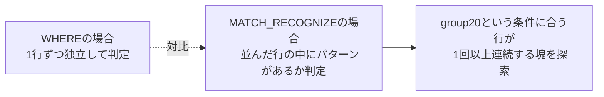
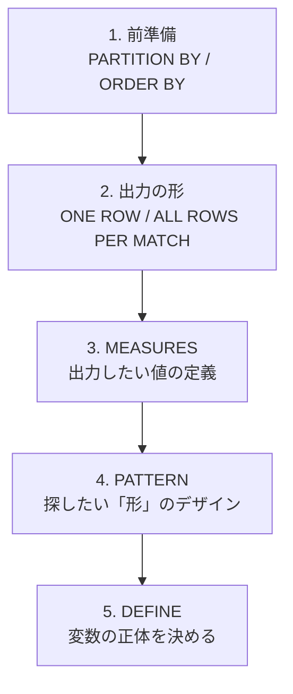
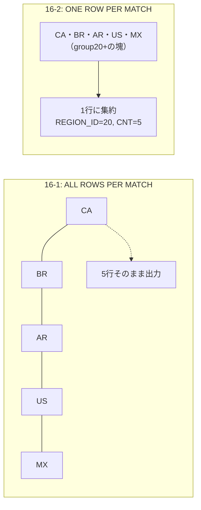

# 問題16-1：行パターンマッチング初歩の初歩１
### 難易度：★★★☆☆ (Lv.3)
## 問題
MATCH_RECOGNIZE句を使用して、HRスキーマの`COUNTRIES`テーブルから、`REGION_ID`が「20」のデータを取得してください。
なお、レコードの表示順序は問いません。

**【学習のポイント】**
通常、特定のIDを抽出するだけなら `WHERE region_id = 20` で十分ですが、ここではあえて `MATCH_RECOGNIZE` の基本作法を使い、以下のキーワードの役割を理解してください。
* **`PATTERN`**: 探したいパターンの並び順（正規表現のような書き方）。
* **`DEFINE`**: パターン内で使う変数の条件定義。
* **`ALL ROWS PER MATCH`**: 見つかったパターンに含まれるすべての行を表示する指定。

## 期待する結果
| REGION_ID | COUNTRY_ID | COUNTRY_NAME |
| --------- | ---------- | ------------------------ |
| 20 | CA | Canada |
| 20 | BR | Brazil |
| 20 | AR | Argentina |
| 20 | US | United States of America |
| 20 | MX | Mexico |

## 解答例
```sql
SELECT
    *
FROM
    hr.countries 
    MATCH_RECOGNIZE (
        ORDER BY
            region_id
        ALL ROWS PER MATCH
        PATTERN ( 
            group20+ 
        )
        DEFINE
            group20 AS region_id = 20
    )
```

## 解説
Oracle SQLの中でも比較的新しい機能、`MATCH_RECOGNIZE`句（行パターンマッチング）についてです。この機能は本来、株価の「V字回復」やログデータの「特定のエラーパターン」など、複数の行にまたがるシーケンス（連続性）を正規表現のように探すための強力な仕組みです。今回はその「初歩の初歩」として、単純なフィルタリングをこの構文でどう書くか、という問題です。

通常の`WHERE`句が「個々の行」を判定するのに対し、`MATCH_RECOGNIZE`は「並んだ行の中に、特定のパターンがあるか」を判定します。

| 記述 | 役割 |
| :--- | :--- |
| `PATTERN (group20+)` | `group20`という条件に合う行が1回以上連続するパターンを探す |
| `DEFINE group20 AS region_id = 20` | `group20`の正体（条件）を定義 |
| `ALL ROWS PER MATCH` | 一致した行をすべて出力（指定しないと1行に集約される） |

`PATTERN ( group20+ )`の`+`は正規表現でおなじみの記号で、「`group20`という条件に合う行が1回以上連続して出現するパターン」を探せ、という意味になります。`DEFINE group20 AS region_id = 20`で「`group20`とは何か」を定義しており、今回は単純に`REGION_ID`が20であること、としています。



解答例にある各オプションの意味も整理しておきます。`ORDER BY region_id`は、パターンを探す前にデータをどの順番で並べるかを指定するもので、行パターンマッチングにおいて並び順は重要な要素です。`ALL ROWS PER MATCH`は、パターンに一致した行をすべて出力する指定です。これを指定しない（デフォルトの`ONE ROW PER MATCH`）と、一致した複数の行が1行に集約されてしまいます。今回は全データを見たいため、これが必要になります。

正直なところ、この問題のような単純な抽出なら`WHERE region_id = 20`と書くのが一番早く、行パターンマッチングを使う必要はありません。今回は構文の学習として、あえてこの書き方を使っています。「売上が3日連続で上がった直後に、1日だけ下がったパターン」や「ログイン失敗が1分以内に5回連続したパターン」のような複雑な条件が出てきたときに、この構文が活きてきます。これらを従来のSQL（自己結合や分析関数）で書くとクエリが複雑になりがちですが、`MATCH_RECOGNIZE`なら`PATTERN (UP UP UP DOWN)`のように直感的に記述できます。

結果には、アメリカ大陸（REGION_ID: 20）に属するカナダ、ブラジル、アルゼンチンなどの国々が正しく抽出されています。

:::message
### MATCH_RECOGNIZEの文法詳細
`MATCH_RECOGNIZE`は、Oracle 12cから導入された構文です。基本的な考え方は、「テーブル全体を1つの長い文字列のように見立てて、そこに正規表現で検索をかける」というイメージです。全体の構文図をもとに、主要な5つのパーツを分解して整理します。



**1. 前準備：データの整理**
パターンを探す前に、データを「どの範囲で」「どの順番で」並べるかを決めます。`PARTITION BY`（任意）はデータをグループ化します（例：`cust_id`ごとにパターンを探す）。`ORDER BY`（必須）はパターンを判定する「時間順」や「ID順」を指定します。

**2. 出力の形：ONE ROW か ALL ROWS か**
マッチした結果をどう表示するかを決めます。`ONE ROW PER MATCH`（デフォルト）は1つのパターンに一致した複数行を1行にまとめて出力し集計に向いています。`ALL ROWS PER MATCH`はマッチした行をすべてそのまま出力し、詳細を確認するのに向いています。

**3. MEASURES：出力したい値の定義**
通常の`SELECT`句のように、結果に含めたい値を定義します。`MATCH_NUMBER()`は何番目のマッチかを表示し、`CLASSIFIER()`はその行がどの変数（`DEFINE`で決めた名前）に一致したかを表示します。`FINAL COUNT(A.id)`のように、マッチした「A」という区間の件数を集計することもできます。

**4. PATTERN：探したい「形」のデザイン**
正規表現の記号を使って、行の並び順を定義します。`PATTERN (A B+ C)`はAが1回、その次にBが1回以上、最後にCが1回という並びを探せという意味です。`PATTERN (UP{3,} DOWN)`は3回以上連続で上昇（UP）した後、下落（DOWN）したパターンを探せという意味です。

**5. DEFINE：変数の正体を決める**
`PATTERN`で使ったアルファベット（変数）が、具体的にどういう条件なのかを定義します。
```sql
DEFINE
  UP AS price > PREV(price),    -- 「UP」とは、前の行より価格が高いこと
  DOWN AS price < PREV(price)   -- 「DOWN」とは、前の行より価格が低いこと
```
ここで`PREV()`（前の行を参照）や`FIRST()`（マッチ区間の最初の行を参照）といったナビゲーション関数を使って条件を作ります。

| キーワード | 必須/任意 | 役割 |
| :--- | :---: | :--- |
| `PARTITION BY` | 任意 | データをどの「部署」や「ユーザー」ごとに探すかのグループ分け |
| `ORDER BY` | 必須 | 時系列順に並べる指定 |
| `MEASURES` | 任意 | パターンの開始日や変化率などの出力したい値の定義 |
| `PATTERN` | 必須 | `(UP+ DOWN+)`のような探したいパターンの形 |
| `DEFINE` | 必須 | パターンの各変数の定義 |

主要なキーワードをまとめると、`PARTITION BY`はデータをどの「部署」や「ユーザー」ごとに探すかのグループ分け、`ORDER BY`（必須）は時系列順に並べる指定、`MEASURES`はパターンの開始日や変化率などの出力したい値の定義、`PATTERN`（必須）は`(UP+ DOWN+)`のような正規表現に近い探したいパターンの形、`DEFINE`（必須）は「UPとは前の行より価格が高いこと」のようなパターンの各変数の定義、という役割になります。
:::

----
<br><br>
# 問題16-2：行パターンマッチング初歩の初歩２
### 難易度：★★★☆☆ (Lv.3)
## 問題
MATCH_RECOGNIZE句を使用して、HRスキーマの`COUNTRIES`テーブルから、`REGION_ID`が「20」のデータの件数を取得してください。

## 期待する結果
| REGION_ID | CNT |
| --------- | --- |
| 20 | 5 |

## 解答例
```sql
SELECT
    *
FROM
    hr.countries 
    MATCH_RECOGNIZE (
        ORDER BY
            region_id
        MEASURES
           region_id      AS region_id,
           COUNT(*)       AS cnt
        ONE ROW PER MATCH
        PATTERN ( 
            group20+ 
        )
        DEFINE
            group20 AS region_id = 20
    )
```

## 解説
前回（16-1）は「パターンに一致する行をすべて出す」という使い方でしたが、今回は「見つけたパターンを1行にまとめる」という、集計としての`MATCH_RECOGNIZE`です。「`GROUP BY`でいいのでは」という声が聞こえてきそうですが、この構文で集計を行う仕組みを理解しておくと、複雑な集計を扱う際に役立ちます。

今回のポイントは出力形式の切り替えです。



前回（ALL ROWS...）はパターンに一致した行をバラさずにそのまま表示していましたが、今回（ONE ROW...）はパターン（`group20`が1回以上連続する区間）を見つけたら、それを1つの塊（マッチ）として扱い、結果を1行に集約します。

`ONE ROW PER MATCH`を使う場合、その1行に「何を表示するか」を`MEASURES`で定義する必要があります。`COUNT(*)`は「そのマッチ（区間）の中に何行含まれていたか」を数え、`region_id`はマッチした区間の代表値として出力しています。

なぜ`GROUP BY`ではなくこれを使うのか、という点も考えてみましょう。

| 集計方式 | 「連続性」の扱い |
| :--- | :--- |
| `GROUP BY` | 条件に合う行を全部まとめて数える（連続性を区別しない） |
| `MATCH_RECOGNIZE` | 連続性が途切れたら別のマッチとして分けて集計 |

例えば、株価データで「3日連続上昇」というパターンが期間中に3回発生したとします。`GROUP BY`だと条件に合う日を全部まとめて数えてしまいますが、`MATCH_RECOGNIZE`は「1回目の3連騰（3日間）」「2回目の3連騰（3日間）」……というように、連続性が途切れたら別のマッチとして分けて集計できます。今回の問題では`REGION_ID=20`が一箇所に固まっている（ORDER BYされている）ため結果として1行になりますが、「連続性が切れたら別の行として出す」という挙動が、標準の集計関数との違いです。

結果を見ると、`REGION_ID`が20の国々が1つのパターンとして認識され、その中に含まれる5件という数字が`CNT`として算出されています。

----
<br><br>

# 【完全版】問題16-3：上昇・下降パターンの認識１
### 難易度：★★★★☆ (Lv.4)
## 問題
SHスキーマの`SALES`テーブルを使用し、月ごとの売上が「前月より高い」状態が3回以上続いた期間を特定してください。
なお、レコードはSTART_MONTHの昇順でソートしてください。


## 期待する結果
| START_MONTH | END_MONTH | DURATION |
| ----------- | --------- | -------- |
| 2019-06 | 2019-10 | 5 |
| 2020-07 | 2020-09 | 3 |
| 2020-12 | 2021-02 | 3 |
| 2022-10 | 2022-12 | 3 |

## 解答例、解説
[](https://zenn.dev/kinopp/books/0b24d659785f31)

----
<br><br>

# 【完全版】問題16-4：上昇・下降パターンの認識２
### 難易度：★★★★☆ (Lv.4)
## 問題
HRスキーマの`EMPLOYEES`テーブルより、部門ごとに採用順（`HIRE_DATE`順）にデータを見たとき、「新しく入った従業員の給与が、直前に採用された従業員よりも高い状態が3回以上連続した期間」を特定してください。
なお、レコードは`CONSECUTIVE_INCREASES`の降順、次いで`START_HIRE_DATE`の昇順でソートしてください。

## 期待する結果
| DEPARTMENT_ID | START_HIRE_DATE | END_HIRE_DATE | CONSECUTIVE_INCREASES | START_SALARY | END_SALARY |
| ------------- | --------------- | ------------- | --------------------- | ------------ | ---------- |
| 50 | 2017-04-10 | 2017-11-16 | 4 | 2100 | 5800 |
| 50 | 2017-12-12 | 2018-02-03 | 4 | 2400 | 2800 |
| 80 | 2015-12-15 | 2016-03-23 | 3 | 7500 | 10000 |
| 80 | 2018-01-04 | 2018-01-29 | 3 | 6200 | 10500 |

## 解答例、解説
[](https://zenn.dev/kinopp/books/0b24d659785f31)

----
<br><br>

# 【完全版】問題16-5：階層構造のカウント
### 難易度：★★★★☆ (Lv.4)
## 問題
HRスキーマの`EMPLOYEES`テーブルを参照し、従業員と上司のリレーションをツリー構造で取得してください。また、各従業員の配下にいる全従業員（部下およびそのまた部下すべて）の数を取得してください。
出力にあたっては以下の条件を満たしてください。
* 最上位の従業員を「1」、その下位の従業員を「2」という形で、レベルに応じた番号を氏名に付与する。
* 階層が深くなるごとに、氏名の前に全角スペース2つ分（半角スペース4つ相当）のインデントを付与する。
（例）「1. Steven King」、「  2. Neena Kochhar」、「    3. Nancy Greenberg」
* なお、レコードは深さ優先探索順（兄弟間は氏名の昇順）で表示してください。

## 期待する結果
（社長Steven King（配下106人）を頂点に、各マネージャーとその配下人数がインデント付きの組織ツリー形式で表示される。例：Neena Yang配下11人、その下のNancy Gruenberg配下5人というように、階層を下るごとに配下人数が正しく減少する。詳細は元データを参照。）

## 解答例、解説
[](https://zenn.dev/kinopp/books/0b24d659785f31)

----
<br><br>

# 【完全版】問題16-6：V字型売上回復パターンの検出
### 難易度：★★★★☆ (Lv.4)
## 問題
売上データ（`SALES`）を分析し、特定の製品（例：PRODUCT_ID = 13）において、売上が「連続して減少」した後に「連続して増加」した、いわゆる「V字回復」の期間を特定してください。
このデータは、一時的な需要の落ち込みから市場がいつ回復に転じたかを判断する材料になります。
SHスキーマの下記テーブルを使用して
* `sh.sales`
* `sh.products`
  
月ごとの売上合計を集計したデータに対して `MATCH_RECOGNIZE` を適用し、以下の条件を満たす「V字回復」パターンを抽出してください。
1. 集計単位は「月」とする。
2. パターン：1ヶ月以上の減少（`DOWN`）ののち、1ヶ月以上の増加（`UP`）が続くこと。
3. 結果には、パターンの開始月、底（最も売上が低かった月）、終了月、および底の売上金額を表示すること。

## 期待する結果
| START_MONTH | BOTTOM_MONTH | END_MONTH | BOTTOM_REVENUE |
| ----------- | ------------ | --------- | -------------- |
| 2019-02 | 2019-04 | 2019-05 | 17404.26 |
| 2019-06 | 2019-06 | 2019-07 | 20004 |
| 2019-08 | 2019-10 | 2020-01 | 112205.27 |
| 2020-02 | 2020-04 | 2020-05 | 6835.38 |
| 2020-06 | 2020-06 | 2020-07 | 18528.62 |
| 2020-08 | 2020-09 | 2020-10 | 39841.76 |
| 2020-12 | 2020-12 | 2021-02 | 79685.37 |
| 2021-03 | 2021-03 | 2021-04 | 160276.7 |
| 2021-05 | 2021-06 | 2021-08 | 152892.03 |
| 2021-09 | 2021-09 | 2021-10 | 163743.33 |
| 2021-11 | 2021-11 | 2021-12 | 150036.7 |
| 2022-01 | 2022-01 | 2022-02 | 149353.95 |
| 2022-03 | 2022-03 | 2022-04 | 172683.53 |
| 2022-05 | 2022-05 | 2022-07 | 145000.2 |
| 2022-08 | 2022-08 | 2022-10 | 186648.5 |
| 2022-11 | 2022-11 | 2022-12 | 197739.91 |

## 解答例、解説
[](https://zenn.dev/kinopp/books/0b24d659785f31)

----
<br><br>

# 【完全版】問題16-7：W字型（ダブルボトム）パターンの検出
### 難易度：★★★★☆ (Lv.4)
## 問題
マーケティング部門から、「一時的なリバウンド（だまし）に終わらず、二度の底を打って力強く回復した製品の売上推移を特定したい」との依頼がありました。
いわゆる「ダブルボトム（W字型）」は、市場の底堅い需要を確認できた重要なサインとみなされます。
SHスキーマの売上データから、この「W字」の波形を描いている期間を抽出してください。
`SALES` テーブルおよび `PRODUCTS` テーブルを使用し、**製品ID：13** について、月ごとの売上合計が以下のパターンを描いている期間を特定してください。

* **パターン定義**:
  1. 減少（`DOWN`）が1回以上
  2. その後に上昇（`UP`）が1回以上（これが「だまし」の回復）
  3. 再び減少（`DOWN`）が1回以上
  4. 最後に上昇（`UP`）が1回以上（これが「真の回復」）
* **期待する出力**:
  * パターンの「開始月」、「1度目の底の月」、「2度目の底の月」、「終了月」。
  * レコードは開始月の昇順でソートしてください。

## 期待する結果
| START_MONTH | BOTTOM_1 | BOTTOM_2 | END_MONTH |
| ----------- | -------- | -------- | --------- |
| 2019-02 | 2019-04 | 2019-06 | 2019-07 |
| 2019-08 | 2019-10 | 2020-04 | 2020-05 |
| 2020-06 | 2020-06 | 2020-09 | 2020-10 |
| 2020-12 | 2020-12 | 2021-03 | 2021-04 |
| 2021-05 | 2021-06 | 2021-09 | 2021-10 |
| 2021-11 | 2021-11 | 2022-01 | 2022-02 |
| 2022-03 | 2022-03 | 2022-05 | 2022-07 |
| 2022-08 | 2022-08 | 2022-11 | 2022-12 |

## 解答例、解説
[](https://zenn.dev/kinopp/books/0b24d659785f31)

----
<br><br>

# 【完全版】問題16-8：給与の停滞（プラトー）期間の特定
### 難易度：★★★★☆ (Lv.4)
## 問題
人事部門から、「部門内において、採用順に見たときに初任給が前任者と全く同じ額で据え置かれている期間（プラトー）を特定したい」との依頼がありました。
同一の給与で複数名が連続して採用されている期間を抽出することで、当時の給与規定の硬直性や、採用市場の安定度を分析する材料とします。
HRスキーマの`employees` テーブルを使用し、部門（`department_id`）ごとに採用日（`hire_date`）の昇順でデータを見たとき、**「給与（`salary`）が直前に採用された従業員と同一である状態」が1回以上続いた期間**を特定してください。
出力には以下の情報を含めてください：
1. 部門ID
2. その停滞期間の開始採用日（1人目の採用日）
3. その停滞期間の終了採用日（最後の人の採用日）
4. その期間に採用された人数（据え置きが始まった1人目を含む）
5. その期間の給与額
なお、結果は `department_id` の昇順、次いで `start_date` の昇順でソートしてください。

## 期待する結果
| DEPARTMENT_ID | START_DATE | END_DATE | PLATEAU_COUNT | SALARY |
| ------------- | -------------------- | -------------------- | ------------- | ------ |
| 50 | 2016-07-11T00:00:00Z | 2016-08-26T00:00:00Z | 2 | 2900 |
| 50 | 2018-02-06T00:00:00Z | 2018-03-08T00:00:00Z | 2 | 2200 |

## 解答例、解説
[](https://zenn.dev/kinopp/books/0b24d659785f31)

----
<br><br>

# 【完全版】問題16-9：移動平均を超え続ける「確変」期間の抽出
### 難易度：★★★★☆ (Lv.4)
## 問題
経営層から「単なる一過性の売上増ではなく、過去のトレンド（直近3ヶ月の平均）を継続的に上回り続けている、真の『好調期間（確変モード）』を特定してほしい」との高度な分析依頼がありました。
移動平均を基準とすることで、季節変動や一時的なスパイクに惑わされない、真に勢いのある期間を炙り出します。
SHスキーマの`sales` テーブルのデータを使用し、月ごとの合計売上高を算出してください。その結果に対して `MATCH_RECOGNIZE` 句を適用し、以下の条件を満たす期間を抽出してください。
1. **好調行（`HIGH_PERF`）の定義**:
その月の売上が、**「直近3ヶ月の売上平均」を上回っている**こと。
平均は「1ヶ月前・2ヶ月前・3ヶ月前の売上の合計を3で割った値」として算出する。
2. **パターンの定義**:
「好調行」が **3ヶ月以上連続** している期間を特定する。
3. **出力項目**:
   * 好調期間の開始月（`START_MONTH`）
   * 好調期間の終了月（`END_MONTH`）
   * その期間内の最大月間売上（`MAX_REV`）
   * その期間の継続月数（`DURATION`）
    
なお、集計対象は全製品の合計とし、結果は `START_MONTH` の昇順でソートしてください。

## 期待する結果
| START_MONTH | END_MONTH | MAX_REV | DURATION |
| ----------- | --------- | ---------- | -------- |
| 2019-06 | 2019-10 | 2236464.53 | 5 |
| 2020-07 | 2020-09 | 2030917.97 | 3 |
| 2020-12 | 2021-02 | 2118618.97 | 3 |
| 2021-07 | 2021-10 | 2164612.21 | 4 |
| 2022-01 | 2022-04 | 2379957.23 | 4 |
| 2022-06 | 2022-12 | 2547042.11 | 7 |

## 解答例、解説
[](https://zenn.dev/kinopp/books/0b24d659785f31)

----
<br><br>

# 【完全版】問題16-10：CLASSIFIER()による状態ラベリング
### 難易度：★★★☆☆ (Lv.3)
## 問題
SHスキーマの`SALES`テーブルを使用し、月ごとの売上合計を算出してください。
その上で、`MATCH_RECOGNIZE`句を使用し、各月の売上が**前月と比較してどのような状態だったか**を、以下のルールでラベル付けしてください。

* 前月より売上が高い月 → `UP`
* 前月より売上が低い月 → `DOWN`
* 前月と売上が同額、または比較対象となる前月が存在しない月（データの最初の月）→ `FLAT`

なお、これまでの問題（16-3、16-6など）のように「連続した期間」を1行に集約するのではなく、**全ての月を1行ずつ**、そのステータスと共に出力してください。
結果は`MONTH`の昇順でソートしてください。

## 期待する結果
| MONTH   | REVENUE    | STATUS | 
| ------- | ---------- | ------ | 
| 2019-01 | 2277420.49 | FLAT   | 
| 2019-02 | 2372690.87 | UP     | 
| 2019-03 | 1830572.64 | DOWN   | 
| 2019-04 | 1975978.3  | UP     | 
| 2019-05 | 1748287.23 | DOWN   | 
| 2019-06 | 1869728.61 | UP     | 
| 2019-07 | 1932282.28 | UP     | 
| 2019-08 | 1972532.63 | UP     | 
| 2019-09 | 2167008.19 | UP     | 
| 2019-10 | 2236464.53 | UP     | 
| 2019-11 | 1959664.22 | DOWN   | 
| 2019-12 | 1741284.96 | DOWN   | 
| 2020-01 | 2077439.76 | UP     | 
| 2020-02 | 2357629.26 | UP     | 
| 2020-03 | 1658678.19 | DOWN   | 
| 2020-04 | 1573272.66 | DOWN   | 
| 2020-05 | 1711727.87 | UP     | 
| 2020-06 | 1640471.1  | DOWN   | 
| 2020-07 | 1891215.57 | UP     | 
| 2020-08 | 1904916.61 | UP     | 
| 2020-09 | 2030917.97 | UP     | 
| 2020-10 | 1722615.48 | DOWN   | 
| 2020-11 | 1719132.18 | DOWN   | 
| 2020-12 | 1931931.01 | UP     | 
| 2021-01 | 2006378.46 | UP     | 
| 2021-02 | 2118618.97 | UP     | 
| 2021-03 | 1859892.06 | DOWN   | 
| 2021-04 | 1765510.12 | DOWN   | 
| 2021-05 | 1874492.85 | UP     | 
| 2021-06 | 1731727.95 | DOWN   | 
| 2021-07 | 1896762.82 | UP     | 
| 2021-08 | 2112255.79 | UP     | 
| 2021-09 | 2112220.68 | DOWN   | 
| 2021-10 | 2164612.21 | UP     | 
| 2021-11 | 2060343.77 | DOWN   | 
| 2021-12 | 2062690.94 | UP     | 
| 2022-01 | 2113709.13 | UP     | 
| 2022-02 | 2103124.54 | DOWN   | 
| 2022-03 | 2330263.77 | UP     | 
| 2022-04 | 2379957.23 | UP     | 
| 2022-05 | 2187022.11 | DOWN   | 
| 2022-06 | 2355489.05 | UP     | 
| 2022-07 | 2347845.35 | DOWN   | 
| 2022-08 | 2428415.28 | UP     | 
| 2022-09 | 2419738    | DOWN   | 
| 2022-10 | 2449167.91 | UP     | 
| 2022-11 | 2474687.5  | UP     | 
| 2022-12 | 2547042.11 | UP     | 

## 解答例、解説
[](https://zenn.dev/kinopp/books/0b24d659785f31)

----
<br><br>

# 【完全版】問題16-11：PERMUTE ― 3ステップの完了確認（順不同）
### 難易度：★★★★☆ (Lv.4)
## 問題
物流部門から、「注文ごとに『梱包（PACKING）』『検品（INSPECTION）』『出荷（SHIPPING）』の3工程が、**順序を問わず**すべて完了しているかを確認したい」との依頼がありました。作業員の手が空いたタイミングで検品を先に済ませてしまうなど、現場では工程の順番が入れ替わることがあるため、"順番"ではなく"3つ揃っているかどうか"を判定したいとのことです。

以下の`ORDER_LOGS`（作業ログ）を`WITH`句で定義し、`MATCH_RECOGNIZE`句を使用して、**3工程がすべて（順不同で、かつ連続して）記録されている注文**を特定してください。出力には、注文ID・実際に行われた工程の順序（`→`区切り）・開始時刻・終了時刻を含めてください。
なお、結果は`ORDER_ID`の昇順でソートしてください。

```sql
WITH order_logs AS (
    SELECT 1001 AS order_id, 'PACKING'    AS step_name, TO_DATE('2026-01-05 08:00:00','YYYY-MM-DD HH24:MI:SS') AS log_time FROM dual UNION ALL
    SELECT 1001, 'INSPECTION', TO_DATE('2026-01-05 08:10:00','YYYY-MM-DD HH24:MI:SS') FROM dual UNION ALL
    SELECT 1001, 'SHIPPING',   TO_DATE('2026-01-05 08:20:00','YYYY-MM-DD HH24:MI:SS') FROM dual UNION ALL
    SELECT 1002, 'SHIPPING',   TO_DATE('2026-01-05 09:00:00','YYYY-MM-DD HH24:MI:SS') FROM dual UNION ALL
    SELECT 1002, 'PACKING',    TO_DATE('2026-01-05 09:15:00','YYYY-MM-DD HH24:MI:SS') FROM dual UNION ALL
    SELECT 1002, 'INSPECTION', TO_DATE('2026-01-05 09:30:00','YYYY-MM-DD HH24:MI:SS') FROM dual UNION ALL
    SELECT 1003, 'PACKING',    TO_DATE('2026-01-05 10:00:00','YYYY-MM-DD HH24:MI:SS') FROM dual UNION ALL
    SELECT 1003, 'INSPECTION', TO_DATE('2026-01-05 10:10:00','YYYY-MM-DD HH24:MI:SS') FROM dual UNION ALL
    SELECT 1004, 'PACKING',    TO_DATE('2026-01-05 11:00:00','YYYY-MM-DD HH24:MI:SS') FROM dual UNION ALL
    SELECT 1004, 'CANCELLED',  TO_DATE('2026-01-05 11:05:00','YYYY-MM-DD HH24:MI:SS') FROM dual UNION ALL
    SELECT 1004, 'INSPECTION', TO_DATE('2026-01-05 11:10:00','YYYY-MM-DD HH24:MI:SS') FROM dual UNION ALL
    SELECT 1004, 'SHIPPING',   TO_DATE('2026-01-05 11:20:00','YYYY-MM-DD HH24:MI:SS') FROM dual
)
-- ここに MATCH_RECOGNIZE を使ったSELECT文を記述してください
```

## 期待する結果
| ORDER_ID | STEP_ORDER | START_TIME | END_TIME |
| -------- | ---------------------------------- | ------------------- | ------------------- |
| 1001 | PACKING→INSPECTION→SHIPPING | 2026-01-05 08:00:00 | 2026-01-05 08:20:00 |
| 1002 | SHIPPING→PACKING→INSPECTION | 2026-01-05 09:00:00 | 2026-01-05 09:30:00 |

※1003は`SHIPPING`が記録されておらず未完了のため、1004は`PACKING`の直後に無関係な`CANCELLED`イベントが割り込んでいるため、いずれも結果には含まれません。

## 解答例、解説
[](https://zenn.dev/kinopp/books/0b24d659785f31)
