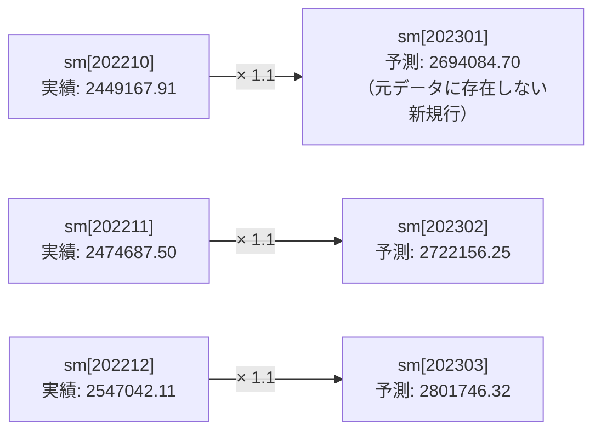

# 問題15-1：MODEL句の基礎（売上予測）
### 難易度：★★★☆☆ (Lv.3)
## 問題
SHスキーマの`SALES`テーブルを使用し、2022年10月〜12月の実績値をもとに、2023年1月〜3月の売上予測値を算出して表示してください。

**【予測ルール】**
* **2023年1月**：2022年10月の実績 × 1.1
* **2023年2月**：2022年11月の実績 × 1.1
* **2023年3月**：2022年12月の実績 × 1.1
  
※算出結果はすべて小数点第3位を切り捨て（第2位まで表示）てください。

## 期待する結果
| TM     | SM         | 
| ------ | ---------- | 
| 202210 | 2449167.91 | 
| 202211 | 2474687.5  | 
| 202212 | 2547042.11 | 
| 202301 | 2694084.7  | 
| 202302 | 2722156.25 | 
| 202303 | 2801746.32 | 

## 解答例
```sql
SELECT
    tm,
    sm
FROM
    (
        SELECT
            TO_NUMBER(to_char(time_id, 'yyyymm')) AS tm,
            SUM(amount_sold)                      AS sm
        FROM
            sh.sales
        WHERE
            time_id BETWEEN DATE '2022-10-01' AND DATE '2022-12-31'
        GROUP BY
            tm
    )
MODEL
    DIMENSION BY ( tm )
    MEASURES ( sm )
    RULES (
        sm[202301]= TRUNC(sm[202210]* 1.1, 2),
        sm[202302]= TRUNC(sm[202211]* 1.1, 2),
        sm[202303]= TRUNC(sm[202212]* 1.1, 2)
    )
ORDER BY
    tm
```

## 解説
`MODEL`句は、SQLの中にスプレッドシートを持ち込むような、少し特殊な機能です。通常、SQLは「すでにあるデータ」を取得・加工するものですが、`MODEL`句を使うと、存在しない未来のデータ（行）を計算によってその場で生成することができます。

`MODEL`句を理解する近道は、結果セットを表計算ソフトのシートとして捉えることです。

| MODEL句のキーワード | Excelでの対応イメージ |
| :--- | :--- |
| `DIMENSION BY` | 行番号・キー（今回は`tm`＝年月） |
| `MEASURES` | セルの中身（今回は売上額`sm`） |
| `RULES` | 「A4 = A1 * 1.1」のようなセル数式 |

`DIMENSION BY`はExcelでいう「行番号」や「キー」で、今回は`tm`（年月）を軸にしています。`MEASURES`はセルの中身、つまり計算対象となる数値（今回は売上額`sm`）です。`RULES`が本体で、Excelで「A4 = A1 * 1.1」と入力するように、特定の座標に対して計算式を割り当てます。

今回のクエリの特徴は、「元のデータには2023年の行が存在しない」のに、結果には表示されるという点です。



```sql
sm[202301] = TRUNC(sm[202210] * 1.1, 2)
```
この一文で、SQLは`tm`が`202301`である行を探し、もし存在しなければ新しい行を作り、その行の`sm`列に`202210`の値に1.1を掛けた結果を代入する、という処理を自動で行います。通常、新しい行を作るには`UNION ALL`などで結合する必要がありますが、`MODEL`句なら数式を書くだけで「予実管理表」のようなデータが作れます。

`MODEL`句は、単なる予測以上の複雑な計算（再帰計算）にも向いています。「前日の在庫 - 今日の出荷予定 = 今日の在庫」という前の行の結果を使う在庫シミュレーション、毎月の残高に利息を計算し次の月の開始残高にする住宅ローンの返済表、前年実績に一定の成長率を乗せて全月分の目標値を一括作成する売上目標の自動生成など、応用範囲は広いです。

今回は`sm[202301]`と直接指定しましたが、`sm[ANY]`（すべての月）や`sm[tm > 202212]`（特定の範囲）といった指定も可能です。セルの範囲指定に近い感覚でクエリを操れます。

----
<br><br>

# 【完全版】問題15-2：未来の繰り返し予測（再帰と反復）
### 難易度：★★★★☆ (Lv.4)
## 問題
SHスキーマの`SALES`テーブルを使用し、2022年10月〜12月の実績をもとに、**2023年12月まで**の12ヶ月分をシミュレーションしてください。

**【シミュレーションルール】**
* **予測式**：対象月の**3ヶ月前**の売上額（実績または予測値）に対して **1.1倍** する。
* **端数処理**：小数点第3位を切り捨て。
* **計算の連鎖**：
  * 2023年01月 = 2022年10月（実績） × 1.1
 ...
  * 2023年04月 = **2023年01月（予測値）** × 1.1
  * 2023年05月 = **2023年02月（予測値）** × 1.1

つまり、一度出した予測値が次の計算のベースになります。

## 期待する結果
| TM     | SM         | 
| ------ | ---------- | 
| 202210 | 2449167.91 | 
| 202211 | 2474687.5  | 
| 202212 | 2547042.11 | 
| 202301 | 2694084.7  | 
| 202302 | 2722156.25 | 
| 202303 | 2801746.32 | 
| 202304 | 2963493.17 | 
| 202305 | 2994371.87 | 
| 202306 | 3081920.95 | 
| 202307 | 3259842.48 | 
| 202308 | 3293809.05 | 
| 202309 | 3390113.04 | 
| 202310 | 3585826.72 | 
| 202311 | 3623189.95 | 
| 202312 | 3729124.34 | 

## 解答例、解説
[](https://zenn.dev/kinopp/books/0b24d659785f31)

----
<br><br>


# 【完全版】問題15-3：モデル句による離脱者分析（Churn Analysis）
### 難易度：★★★★☆ (Lv.4)
## 問題
SHスキーマの `SALES` テーブルを使用し、2021年の四半期（Quarter）ごとの売上推移から、顧客のステータスを判定してください。

**【判定ルール（Q4時点でのSTATUS）】**
* **CHURNED（完全離脱）**:
  * 売上が **Q1 > Q2 > Q3** と連続減少しており、かつ **Q4の売上が 0**（データなし）。
* **INACTIVE（休眠）**:
  * 上記には当てはまらないが、**Q4の売上が 0**（データなし）。
* **ACTIVE（活動中）**:
  * Q4に売上が存在する。
**【条件】**
* 表示対象：`CUST_ID` が 71, 100, 525。
* 売上のない四半期は行自体が存在しませんが、MODEL句でQ4の行を補完して判定結果を表示してください。
* 結果は、**顧客ID（CUST_ID）の昇順**、および**四半期（QTR）の昇順**で表示してください。
## 期待する結果
| CUST_ID | QTR | AMOUNT  | STATUS   | 
| ------- | --- | ------- | -------- | 
| 71      | 1   | 160.37  |          | 
| 71      | 2   | 39.9    |          | 
| 71      | 3   | 162.34  |          | 
| 71      | 4   | 12.58   | ACTIVE   | 
| 100     | 1   | 210.95  |          | 
| 100     | 2   | 81.35   |          | 
| 100     | 4   |         | INACTIVE | 
| 525     | 1   | 4849.34 |          | 
| 525     | 2   | 4405.46 |          | 
| 525     | 3   | 486.18  |          | 
| 525     | 4   |         | CHURNED  | 

## 解答例、解説
[](https://zenn.dev/kinopp/books/0b24d659785f31)

----
<br><br>


# 【完全版】問題15-4：モデル句による在庫枯渇シミュレーション
### 難易度：★★★★☆ (Lv.4)
## 問題
COスキーマの注文データ（2021年2月〜2022年4月）と現在の在庫データを使用し、「現在の在庫から毎月の平均注文数を引き続けたら、いつ在庫がマイナスになるか」をシミュレーションしてください。

**【シミュレーション条件】**
* **対象商品**：`PRODUCT_ID` が 19 および 35。
* **平均注文数の算出**：2021年2月から2022年4月（計15ヶ月）の総注文数を15で割ったもの（四捨五入して整数）。
* **ループ処理**：
  * 2022年4月を起点（現在の在庫）とします。
  * 翌月以降、在庫から平均注文数を差し引いていきます。
  * **在庫がマイナスになった時点で、その商品についての計算を終了**してください。
* **表示項目**：年月（`OT`）、商品ID（`PRODUCT_ID`）、シミュレーション在庫数（`SUM_IVT`）。
* **商品ID（PRODUCT_ID）の昇順**、および**年月（OT）の昇順**で表示してください。
  
## 期待する結果
| OT     | PRODUCT_ID | SUM_IVT | 
| ------ | ---------- | ------- | 
| 202204 | 19         | 70      | 
| 202205 | 19         | 50      | 
| 202206 | 19         | 30      | 
| 202207 | 19         | 10      | 
| 202208 | 19         | -10     | 
| 202209 | 19         | -30     | 
| 202204 | 35         | 36      | 
| 202205 | 35         | 19      | 
| 202206 | 35         | 2       | 
| 202207 | 35         | -15     | 
| 202208 | 35         | -32     | 

## 解答例、解説
[](https://zenn.dev/kinopp/books/0b24d659785f31)

----
<br><br>


# 【完全版】問題15-5：MODEL句による移動平均の算出（トレンド平滑化）
### 難易度：★★★☆☆ (Lv.3)
## 問題
マーケティング分析において、日次や月次の売上データは変動（ノイズ）が激しく、真のトレンドが見えにくいことがあります。
SHスキーマの **`SALES`** テーブルを使用し、月ごとの売上合計を算出した上で、 **「直近3ヶ月の移動平均（Moving Average）」** を計算してください。

**【算出・編集ルール】**
1. **TM（年月）**: 2021年1月〜12月の実績値。
2. **SM（売上合計）**: 各月の `AMOUNT_SOLD` の合計。
3. **MOV_AVG（3ヶ月移動平均）**:
   * **「当月・1ヶ月前・2ヶ月前」** の3ヶ月分の売上の平均値を算出してください。
   * データが3ヶ月分揃わない月（1月、2月）は、存在する月のみの平均で構いません。
   * 小数点第3位を四捨五入し、第2位まで表示してください。
4. 表示順は **`TM`** の昇順とします。

## 期待する結果
| TM     | SM         | MOV_AVG    | 
| ------ | ---------- | ---------- | 
| 202101 | 2006378.46 | 2006378.46 | 
| 202102 | 2118618.97 | 2062498.72 | 
| 202103 | 1859892.06 | 1994963.16 | 
| 202104 | 1765510.12 | 1914673.72 | 
| 202105 | 1874492.85 | 1833298.34 | 
| 202106 | 1731727.95 | 1790576.97 | 
| 202107 | 1896762.82 | 1834327.87 | 
| 202108 | 2112255.79 | 1913582.19 | 
| 202109 | 2112220.68 | 2040413.1  | 
| 202110 | 2164612.21 | 2129696.23 | 
| 202111 | 2060343.77 | 2112392.22 | 
| 202112 | 2062690.94 | 2095882.31 | 

## 解答例、解説
[](https://zenn.dev/kinopp/books/0b24d659785f31)

----
<br><br>


# 【完全版】問題15-6：多次元階層における集計とシェア算出（クロスディメンション参照）
### 難易度：★★★★☆ (Lv.4)
## 問題
経営分析チームより、製品カテゴリ別の売上レポートの作成依頼がありました。
単にカテゴリごとの売上を出すだけでなく、 **「全カテゴリ合計（Total）」** の行を仮想的に生成し、さらにその合計値を用いて **「各カテゴリが全体の何％を占めているか（Share）」** を算出してください。
通常であれば `RATIO_TO_REPORT` 分析関数や `ROLLUP` を組み合わせる場面ですが、今回は **MODEL 句の多次元参照** を用いて、一つの数式内で「合計の算出」と「シェアの計算」を同時に行います。
2021年の売上データを対象に、以下の情報を取得する SQL を作成してください。

**【使用テーブル】**
* **`sh.sales`**（売上履歴）
* **`sh.products`**（商品マスタ）
* **`sh.times`**（時間マスタ）

**【抽出・集計ルール】**
1. **DIMENSION（次元）**: `PROD_CATEGORY`（製品カテゴリ）と `CALENDAR_YEAR`（年）の2次元を定義します。
2. **仮想行の生成**: 元データには存在しない **`Total`** という名前のカテゴリ行を生成し、その年の全カテゴリの合計売上を算出してください。
3. **SHARE（構成比）の算出**:
   * 各カテゴリの売上が、その年の `Total` 行の売上に対して何％にあたるかを計算してください。
   * 小数点第3位を四捨五入し、第2位まで表示してください。
4. 対象は 2021年のみとし、表示順はカテゴリの昇順（ただし `Total` は最後）とします。

## 期待する結果
| PROD_CATEGORY     | YEAR | SALES_AMOUNT | SHARE_PCT | 
| ----------------- | ---- | ------------ | --------- | 
| Baseball          | 2021 | 6464786.22   | 27.2      | 
| Cricket           | 2021 | 3434409.23   | 14.45     | 
| Golf              | 2021 | 4336456.4    | 18.25     | 
| Soccer / Football | 2021 | 4329248.89   | 18.22     | 
| Tennis            | 2021 | 5200605.88   | 21.88     | 
| Total             | 2021 | 23765506.62  | 100       | 

## 解答例、解説
[](https://zenn.dev/kinopp/books/0b24d659785f31)

----
<br><br>


# 【完全版】問題15-7：UPDATEオプションによる「既存行限定」の更新
### 難易度：★★★☆☆ (Lv.3)
## 問題
経営企画部から、次のような依頼がありました。

> 「2023年1月分については、金額はまだ未定ですが、予算枠として**仮登録（0円のプレースホルダー行）** だけは済ませてあります。一方、2月・3月分はまだ起票すらしていません。この状態で、実績（2022年10-12月）をもとにした予測値を反映してほしいのですが、**万が一のミスで2月・3月分の行を勝手に新規作成してしまうことだけは絶対に避けたい**（起票前の月に数字が入ると経理処理が混乱するため）」

SHスキーマの`SALES`テーブルから算出した2022年10月〜12月の実績値と、上記の「1月分のプレースホルダー行（`SM`は`0`）」を`UNION ALL`で組み合わせたデータに対し、`MODEL`句を使って以下のルールを適用してください。

**【予測ルール】**
* **2023年1月**：2022年10月の実績 × 1.1
* **2023年2月**：2022年11月の実績 × 1.1
* **2023年3月**：2022年12月の実績 × 1.1

※算出結果はすべて小数点第3位を切り捨て（第2位まで表示）。
※**既に行が存在する月だけを更新し、行が存在しない月については新規に行を作成しないでください。**

## 期待する結果
| TM     | SM         |
| ------ | ---------- |
| 202210 | 2449167.91 |
| 202211 | 2474687.5  |
| 202212 | 2547042.11 |
| 202301 | 2694084.7  |

※2023年2月（202302）・3月（202303）は、行自体が存在しないためルールが適用されず、結果には表示されません。

## 解答例、解説
[](https://zenn.dev/kinopp/books/0b24d659785f31)

----
<br><br>

# 【完全版】問題15-8：RETURN UPDATED ROWS句による差分抽出
### 難易度：★★★☆☆ (Lv.3)
## 問題
問題15-1で作成した「2022年10月〜12月の実績」と「2023年1月〜3月の予測値」を算出するクエリについて、経営会議向けに次のような追加要望がありました。

> 「実績（10〜12月）はみんな既に知っている数字なので、資料には**新しく計算された予測値（1〜3月）だけ**を載せてほしい。予測ルール自体は15-1のものをそのまま使ってよい」

`MODEL`句の`RETURN UPDATED ROWS`句を使い、**ルールによって新規作成・更新された行だけ**を抽出するクエリを作成してください。予測ルールおよび端数処理の仕様は問題15-1と同一とします。

## 期待する結果
| TM     | SM         |
| ------ | ---------- |
| 202301 | 2694084.7  |
| 202302 | 2722156.25 |
| 202303 | 2801746.32 |

※10月〜12月の実績行は、ルールによる変更を一切受けていないため、結果には含まれません。

## 解答例、解説
[](https://zenn.dev/kinopp/books/0b24d659785f31)

----
<br><br>


# 【完全版】問題15-9：FOR句によるリスト指定の一括ルール適用
### 難易度：★★★☆☆ (Lv.3)
## 問題
SHスキーマの`SALES`テーブルを使用し、2022年10月〜12月の月次売上合計を算出してください。

経理部門より、次のような連絡がありました。

> 「10月と12月は、月末の営業日が祝休日と重なった影響で計上が翌営業日にずれ込んでいる可能性があるため、実績を**1.05倍したものを補正後の速報値**として扱いたい。11月分は営業日のズレがないので、実績のまま変更不要」

`MODEL`句の`FOR`句を使い、**補正対象の月（10月・12月）だけをリストで指定**して、1本のルールで一括補正してください。11月分については、ルールを個別に書かず、対象外のまま素通りさせる形にすること。

※算出結果は小数点第3位を四捨五入し、第2位まで表示してください。

## 期待する結果
| TM     | SM         |
| ------ | ---------- |
| 202210 | 2571626.31 |
| 202211 | 2474687.5  |
| 202212 | 2674394.22 |

## 解答例、解説
[](https://zenn.dev/kinopp/books/0b24d659785f31)

----
<br><br>


# 【完全版】問題15-10：欠損値の線形補間（PRESENTVによる実績／補間フラグ付き）
### 難易度：★★★★☆ (Lv.4)
## 問題
SHスキーマの`SALES`テーブルを使用し、2022年1月〜5月の月次売上合計を集計してください。

ただし今回は、**4月分のデータだけがシステム連携障害により欠損している**という状況を想定します（本問では動作確認のため、`WHERE`句で意図的に4月のデータを除外してこの状態を再現してください）。

**【補間ルール】**
* 欠損している4月の売上は、**前月（3月）と翌月（5月）の実績値の単純平均**で補完してください。
* 併せて、各月のデータが「実績値」か「補間によって作られた値」かを判定する`FLG`列を追加し、次のいずれかを表示してください。
  * 元データに存在する月 → `実績`
  * `MODEL`句のルールによって新たに作られた月 → `補間`

※算出結果は小数点第3位を四捨五入し、第2位まで表示してください。

## 期待する結果
| TM     | SM         | FLG  | 
| ------ | ---------- | ---- | 
| 202201 | 2113709.13 | 実績 | 
| 202202 | 2103124.54 | 実績 | 
| 202203 | 2330263.77 | 実績 | 
| 202204 | 2258642.94 | 補間 | 
| 202205 | 2187022.11 | 実績 | 

## 解答例、解説
[](https://zenn.dev/kinopp/books/0b24d659785f31)

----
<br><br>


# 【完全版】問題15-11：シナリオ分析（楽観・標準・悲観の並行シミュレーション）
### 難易度：★★★★☆ (Lv.4)
## 問題
経営企画部より、2023年1月〜3月の売上予測について、次のように3パターンの成長率で試算してほしいという依頼がありました。

**【シナリオ別の成長率】**
| シナリオ | 3ヶ月前実績に対する成長率 |
| :--- | :---: |
| 楽観 | 1.15倍 |
| 標準 | 1.10倍 |
| 悲観 | 1.05倍 |

SHスキーマの`SALES`テーブルから算出した2022年10月〜12月の実績値をもとに、上記3シナリオそれぞれについて、2023年1月〜3月の予測値を**1本のクエリで同時に**算出してください。

**【表示要件】**
* 結果には、シナリオ別の**予測値（新規作成された行）のみ**を表示してください（実績行は表示不要）。
* シナリオの表示順は、**楽観 → 標準 → 悲観**の順にしてください（文字コード順ではありません）。
* 各シナリオ内は年月（`TM`）の昇順とします。

※算出結果は小数点第3位を四捨五入し、第2位まで表示してください。

## 期待する結果
| SCENARIO | TM     | SM         | 
| -------- | ------ | ---------- | 
| 楽観     | 202301 | 2816543.1  | 
| 楽観     | 202302 | 2845890.63 | 
| 楽観     | 202303 | 2929098.43 | 
| 標準     | 202301 | 2694084.7  | 
| 標準     | 202302 | 2722156.25 | 
| 標準     | 202303 | 2801746.32 | 
| 悲観     | 202301 | 2571626.31 | 
| 悲観     | 202302 | 2598421.88 | 
| 悲観     | 202303 | 2674394.22 | 

## 解答例、解説
[](https://zenn.dev/kinopp/books/0b24d659785f31)
