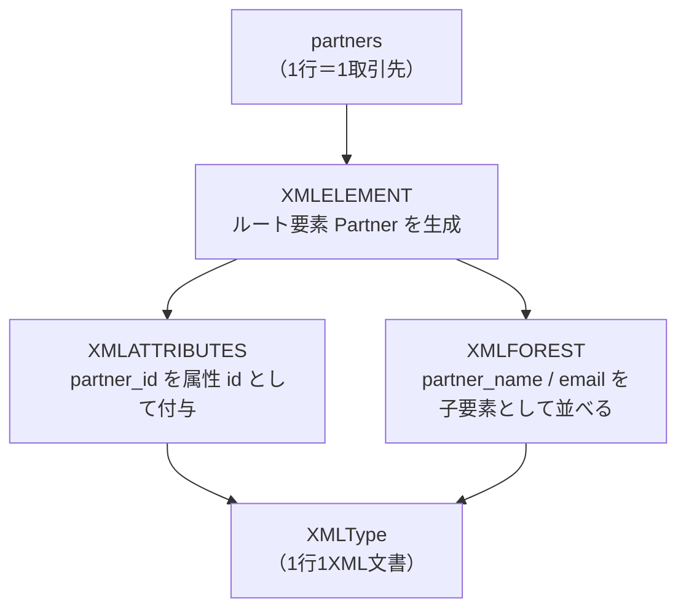

# 問題19-1：XMLELEMENT／XMLATTRIBUTES／XMLFORESTによるリレーショナル→XML変換
### 難易度：★★★☆☆ (Lv.3)
## 問題
以下の`WITH`句で用意した3件の取引先データ（`PARTNER_ID`、`PARTNER_NAME`、`EMAIL`）を、他システムへの連携用に**行ごとに1つのXML要素**へ変換してください。

**【XMLの構造】**
* ルート要素名：`Partner`
* `partner_id`：ルート要素の**属性（attribute）**`id`として持たせる
* `partner_name`：子要素`Name`として持たせる
* `email`：子要素`Email`として持たせる

```sql:検証用データ（WITH句）
WITH partners AS (
    SELECT 1 AS partner_id, 'Sato ' || CHR(38) || ' Suzuki Trading' AS partner_name, 'contact@satosuzuki.co.jp' AS email FROM dual UNION ALL
    SELECT 2,               'Yamada Logistics',                                       'info@yamada-logi.co.jp'                    FROM dual UNION ALL
    SELECT 3,               'Tanaka Holdings',                                        'sales@tanaka-hd.co.jp'                     FROM dual
)
-- ここから先を作成してください
```

## 期待する結果
| PARTNER_ID | PARTNER_XML                                                                                             | 
| ---------- | ------------------------------------------------------------------------------------------------------- | 
| 1          | <Partner id="1"><Name>Sato \&amp; Suzuki Trading</Name><Email>contact@satosuzuki.co.jp</Email></Partner> | 
| 2          | <Partner id="2"><Name>Yamada Logistics</Name><Email>info@yamada-logi.co.jp</Email></Partner>            | 
| 3          | <Partner id="3"><Name>Tanaka Holdings</Name><Email>sales@tanaka-hd.co.jp</Email></Partner>              | 

※`PARTNER_ID = 1`の`Name`要素内では、`&`が自動的に`&amp;`へエスケープされている点に注目してください。

## 解答例
```sql:失敗例：文字列連結によるXML風テキストの生成
WITH partners AS (
    SELECT 1 AS partner_id, 'Sato ' || CHR(38) || ' Suzuki Trading' AS partner_name, 'contact@satosuzuki.co.jp' AS email FROM dual UNION ALL
    SELECT 2,               'Yamada Logistics',                                       'info@yamada-logi.co.jp'                    FROM dual UNION ALL
    SELECT 3,               'Tanaka Holdings',                                        'sales@tanaka-hd.co.jp'                     FROM dual
)
SELECT
    partner_id,
    '<Partner id="' || partner_id || '">'
    || '<Name>' || partner_name || '</Name>'
    || '<Email>' || email || '</Email>'
    || '</Partner>' AS PARTNER_XML_TEXT
FROM
    partners
ORDER BY
    partner_id
-- 見た目はXMLだが、PARTNER_ID=1の "&" がエスケープされていないため不正な文字列（well-formedでない）
-- 試しに XMLTYPE(partner_xml_text) へキャストすると、1行目だけ ORA-31011（XML解析に失敗しました）で落ちる
```

```sql:正解例：XMLELEMENT / XMLATTRIBUTES / XMLFORESTを使用
WITH partners AS (
    SELECT 1 AS partner_id, 'Sato ' || CHR(38) || ' Suzuki Trading' AS partner_name, 'contact@satosuzuki.co.jp' AS email FROM dual UNION ALL
    SELECT 2,               'Yamada Logistics',                                       'info@yamada-logi.co.jp'                    FROM dual UNION ALL
    SELECT 3,               'Tanaka Holdings',                                        'sales@tanaka-hd.co.jp'                     FROM dual
)
SELECT
    partner_id,
    XMLELEMENT(
        "Partner",
        XMLATTRIBUTES(partner_id AS "id"),
        XMLFOREST(
            partner_name AS "Name",
            email        AS "Email"
        )
    ) AS PARTNER_XML
FROM
    partners
ORDER BY
    partner_id
```

## 解説
今回は、リレーショナルデータを他システム連携用のXML文書に変換する、SQL/XML生成関数の基礎を扱う演習です。17-3で学んだ`JSON_OBJECT`によるSQL→JSON変換のXML版にあたります。



まず失敗例を確認しましょう。`||`による単純な文字列連結は、見た目こそXMLらしい形になりますが、その正体は**ただの文字列**です。`PARTNER_ID = 1`の`partner_name`に含まれる`&`は、XMLの世界では「エンティティ参照の開始」という特別な意味を持つ記号であり、そのまま出力すると不正な（well-formedでない）XMLになります。この文字列を`XMLTYPE(...)`でXML型にキャストしようとした瞬間に、Oracleがパースエラーとして弾きます。

```sql
SELECT XMLTYPE('<Partner id="1"><Name>Sato ' || CHR(38) || ' Suzuki Trading</Name></Partner>') FROM dual;
-- ORA-31011: XML解析に失敗しました。
```

一方、正解例で使う`XMLELEMENT`・`XMLFOREST`は、最初から「型の保証されたXML」を組み立てる関数のため、`&`・`<`・`>`・`"`・`'`といった特殊文字を**自動的にエンティティ参照へエスケープ**してくれます。文字列連結では意識しなければならなかった落とし穴を、関数側が肩代わりしてくれるわけです。

3つの関数の役割は以下のように整理できます。

| 関数 | 役割 | 例 |
| :--- | :--- | :--- |
| `XMLELEMENT` | 要素（タグ）を1つ作る。入れ子にして構造を作る土台 | `XMLELEMENT("Partner", ...)` → `<Partner>...</Partner>` |
| `XMLATTRIBUTES` | `XMLELEMENT`の中で使い、値を**属性**として付与する | `XMLATTRIBUTES(partner_id AS "id")` → `<Partner id="1">` |
| `XMLFOREST` | 複数のカラムを**子要素の並び**としてまとめて生成する（`XMLELEMENT`の入れ子を書く手間を省く） | `XMLFOREST(partner_name AS "Name", email AS "Email")` → `<Name>...</Name><Email>...</Email>` |

`XMLFOREST(partner_name AS "Name", email AS "Email")`は、`XMLELEMENT("Name", partner_name), XMLELEMENT("Email", email)`と書いた場合と同じ結果になりますが、同列に並ぶ複数の子要素を一度に指定できるため、コードが簡潔になります。属性にしたい値（今回の`partner_id`）だけは`XMLATTRIBUTES`で別扱いにする、という使い分けがポイントです。

:::message
### 値を「属性」にするか「子要素」にするかの目安
XML設計に絶対のルールはありませんが、一般的には「そのデータを一意に識別するID」や「メタ情報（作成日時、バージョンなど）」は属性、「本文となるデータそのもの」は子要素にする設計がよく使われます。今回の`partner_id`のように主キーに相当する値を属性にしておくと、後続の`XMLTABLE`（次回以降で扱います）で行を特定する際にも扱いやすくなります。
:::

なお、`XMLELEMENT`の第1引数（要素名）はダブルクォートで囲んだ識別子として指定します。ここを`'Partner'`のようにシングルクォート（文字列リテラル）で書いてしまうと構文エラーになる点にも注意してください。

:::message
### 検証データに"&"を含める場合はCHR(38)を使う
SQL*PlusやSQLcl、Oracle FreeSQLなどの多くのOracleクライアントには、`&変数名`をユーザー入力に置き換える「置換変数」という機能があります。この機能はスクリプトを対話的に実行する際に便利ですが、データそのものに`&`を含めたい場合は邪魔になり、意図せず入力待ちで処理が止まってしまいます。
このようなケースでは、リテラルに直接`&`を書かず、`CHR(38)`（`&`の文字コード）を文字列連結で挟み込むことで、置換変数として解釈されるのを防げます（`SET DEFINE OFF`でクライアント側の機能自体を無効化する方法もありますが、環境によって挙動が異なるため、SQL文だけで完結する`CHR(38)`の方が確実です）。
:::

## 参考リンク
https://docs.oracle.com/en/database/oracle/oracle-database/19/sqlrf/XMLELEMENT.html
https://docs.oracle.com/en/database/oracle/oracle-database/19/sqlrf/XMLFOREST.html
https://docs.oracle.com/en/database/oracle/oracle-database/19/adxdb/generation-of-XML-data-from-relational-data.html

---
<br><br>

# 【完全版】問題19-2：XMLTABLEによるXML→リレーショナル展開
### 難易度：★★★★☆ (Lv.4)
## 問題
以下の`WITH`句で用意した3件の注文XMLデータ（`ORDER_XML`）を展開し、注文明細（`Item`）を1行1件として抽出してください。

**【抽出する項目】**
* `ORDER_ID`：`Order`要素の属性`id`
* `CUSTOMER`：`Order`要素直下の`Customer`
* `PRODUCT`：各`Item`要素内の`Product`
* `QTY`：各`Item`要素内の`Qty`
* `PRICE`：各`Item`要素内の`Price`

なお、1件の注文に複数の`Item`が含まれる場合は、`ORDER_ID`と`CUSTOMER`を各明細行に繰り返し表示してください。

```sql:検証用データ（WITH句）
WITH orders AS (
    SELECT XMLTYPE('<Order id="1001"><Customer>Yamada Trading</Customer><Items>'
        || '<Item><Product>Widget A</Product><Qty>5</Qty><Price>1200</Price></Item>'
        || '<Item><Product>Widget B</Product><Qty>2</Qty><Price>3400</Price></Item>'
        || '</Items></Order>') AS order_xml FROM dual
    UNION ALL
    SELECT XMLTYPE('<Order id="1002"><Customer>Suzuki Corp</Customer><Items>'
        || '<Item><Product>Widget C</Product><Qty>10</Qty><Price>500</Price></Item>'
        || '</Items></Order>') FROM dual
    UNION ALL
    SELECT XMLTYPE('<Order id="1003"><Customer>Tanaka Holdings</Customer><Items>'
        || '<Item><Product>Widget A</Product><Qty>1</Qty><Price>1200</Price></Item>'
        || '<Item><Product>Widget D</Product><Qty>3</Qty><Price>800</Price></Item>'
        || '<Item><Product>Widget E</Product><Qty>7</Qty><Price>250</Price></Item>'
        || '</Items></Order>') FROM dual
)
-- ここから先を作成してください
```

## 期待する結果
| ORDER_ID | CUSTOMER        | PRODUCT  | QTY | PRICE | 
| -------- | --------------- | -------- | --- | ----- | 
| 1001     | Yamada Trading  | Widget A | 5   | 1200  | 
| 1001     | Yamada Trading  | Widget B | 2   | 3400  | 
| 1002     | Suzuki Corp     | Widget C | 10  | 500   | 
| 1003     | Tanaka Holdings | Widget A | 1   | 1200  | 
| 1003     | Tanaka Holdings | Widget D | 3   | 800   | 
| 1003     | Tanaka Holdings | Widget E | 7   | 250   | 

## 解答例、解説
[](https://zenn.dev/kinopp/books/0b24d659785f31)

----
<br><br>

# 【完全版】問題19-3：XMLQUERY／XMLEXISTSによる抽出とフィルタ
### 難易度：★★★★☆ (Lv.4)
## 問題
以下の`WITH`句で用意した5件の商品データ（`PRODUCT_ID`、`PRODUCT_XML`）に対して、`Reviews`要素の中に評価（`rating`属性）が **9以上のレビューが少なくとも1件でも存在する** 商品のみを抽出してください。

あわせて、抽出した商品については、該当する（`rating`が9以上の）レビュー要素**そのもの**を`HIGH_RATING_REVIEWS`列として出力してください。

なお、`PRODUCT_ID = 103`のように`Reviews`要素の中身が空のデータや、`PRODUCT_ID = 104`のように`Reviews`要素自体が存在しないデータも含まれています。これらはエラーにせず、正しく「該当なし」として除外してください。

```sql:検証用データ（WITH句）
WITH products AS (
    SELECT 101 AS product_id, XMLTYPE('<Product><Colour>red</Colour><Brand>AURORA</Brand><Reviews>'
        || '<Review rating="4"/><Review rating="7"/><Review rating="9"/><Review rating="2"/></Reviews></Product>') AS product_xml FROM dual UNION ALL
    SELECT 102,               XMLTYPE('<Product><Colour>blue</Colour><Brand>NIXEL</Brand><Reviews>'
        || '<Review rating="3"/><Review rating="5"/><Review rating="6"/></Reviews></Product>') FROM dual UNION ALL
    SELECT 103,               XMLTYPE('<Product><Colour>green</Colour><Brand>KAPPA</Brand><Reviews/></Product>') FROM dual UNION ALL
    SELECT 104,               XMLTYPE('<Product><Colour>black</Colour><Brand>OMEGA</Brand></Product>') FROM dual UNION ALL
    SELECT 105,               XMLTYPE('<Product><Colour>white</Colour><Brand>VELOX</Brand><Reviews>'
        || '<Review rating="10"/></Reviews></Product>') FROM dual
)
-- ここから先を作成してください
```

## 期待する結果
| PRODUCT_ID | COLOUR | BRAND  | HIGH_RATING_REVIEWS   | 
| ---------- | ------ | ------ | --------------------- | 
| 101        | red    | AURORA | <Review rating="9"/>  | 
| 105        | white  | VELOX  | <Review rating="10"/> | 

## 解答例、解説
[](https://zenn.dev/kinopp/books/0b24d659785f31)

----
<br><br>

# 【完全版】問題19-4：XMLAGGによる複数行の集約
### 難易度：★★★★☆ (Lv.4)
## 問題
以下の`WITH`句で用意した部門データ（`DEPARTMENTS`）と従業員データ（`EMPLOYEES`）を結合し、部門ごとに1つのXML文書を生成してください。

**【XMLの構造】**
* ルート要素名：`Department`
* `department_name`：ルート要素の属性`name`
* `Employees`：所属する従業員の`Employee`要素（`last_name`）を並べた入れ物
  * `Employee`要素は`last_name`の昇順で並べること

なお、`Purchasing`部門のように所属従業員が1人もいない部門についても出力の対象とし、`Employees`要素は**空要素**（中身に`Employee`要素を1つも含まない状態）としてください。

```sql:検証用データ（WITH句）
WITH departments AS (
    SELECT 10 AS department_id, 'Accounting'      AS department_name FROM dual UNION ALL
    SELECT 20,                  'Marketing'                          FROM dual UNION ALL
    SELECT 30,                  'Purchasing'                         FROM dual UNION ALL
    SELECT 40,                  'Human Resources'                    FROM dual
),
employees AS (
    SELECT 10 AS department_id, 'Gietz'    AS last_name FROM dual UNION ALL
    SELECT 10,                  'Higgins'               FROM dual UNION ALL
    SELECT 20,                  'Davis'                 FROM dual UNION ALL
    SELECT 20,                  'Martinez'              FROM dual UNION ALL
    SELECT 40,                  'Jacobs'                FROM dual
    -- Purchasing（department_id = 30）に該当する行はなし
)
-- ここから先を作成してください
```

## 期待する結果
| DEPARTMENT_NAME | DEPT_XML                                                                                                                 | 
| --------------- | ------------------------------------------------------------------------------------------------------------------------ | 
| Accounting      | <Department name="Accounting"><Employees><Employee>Gietz</Employee><Employee>Higgins</Employee></Employees></Department> | 
| Human Resources | <Department name="Human Resources"><Employees><Employee>Jacobs</Employee></Employees></Department>                       | 
| Marketing       | <Department name="Marketing"><Employees><Employee>Davis</Employee><Employee>Martinez</Employee></Employees></Department> | 
| Purchasing      | <Department name="Purchasing"><Employees></Employees></Department>                                                       | 

## 解答例、解説
[](https://zenn.dev/kinopp/books/0b24d659785f31)

----
<br><br>

# 【完全版】問題19-5：NULL値と空要素の使い分け
### 難易度：★★★★☆ (Lv.4)
## 問題
以下の`WITH`句で用意した顧客データ（`CUSTOMER_ID`、`CUSTOMER_NAME`、`PHONE`、`NOTES`）を、他システム連携用にXML形式へ変換してください。連携先システムからは、次のような**あえて異なる**要件が指定されています。

**【出力ルール】**
* `PHONE`（電話番号）が`NULL`の顧客は、`Phone`要素**自体を出力しない**こと（省略）。
* `NOTES`（備考）が`NULL`の顧客についても、`Notes`要素は**必ず出力**すること。ただし中身は空でよい（空要素）。

```sql:検証用データ（WITH句）
WITH customers AS (
    SELECT 1 AS customer_id, 'Yamada Taro'   AS customer_name, '090-1234-5678' AS phone, 'VIP customer, handle with care' AS notes FROM dual UNION ALL
    SELECT 2,                'Suzuki Hanako',                   NULL,                    'Prefers email contact'         FROM dual UNION ALL
    SELECT 3,                'Tanaka Ichiro',                   '080-9876-5432',          NULL                            FROM dual
)
-- ここから先を作成してください
```

## 期待する結果
| CUSTOMER_ID | CUSTOMER_XML                                                                                                                  | 
| ----------- | ----------------------------------------------------------------------------------------------------------------------------- | 
| 1           | <Customer id="1"><Name>Yamada Taro</Name><Phone>090-1234-5678</Phone><Notes>VIP customer, handle with care</Notes></Customer> | 
| 2           | <Customer id="2"><Name>Suzuki Hanako</Name><Notes>Prefers email contact</Notes></Customer>                                    | 
| 3           | <Customer id="3"><Name>Tanaka Ichiro</Name><Phone>080-9876-5432</Phone><Notes></Notes></Customer>                             | 

## 解答例、解説
[](https://zenn.dev/kinopp/books/0b24d659785f31)

----
<br><br>


# 【完全版】問題19-6：XML名前空間（Namespace）を持つXMLからの値抽出
### 難易度：★★★★☆ (Lv.4)
## 問題
以下の`WITH`句で用意した3件の仕入先データ（`SUPPLIER_XML`）は、外部システムとの連携を想定し、`Supplier`要素にXML名前空間（`xmlns`）が宣言されています。各仕入先について、次の3項目を抽出してください。

**【抽出する項目】**
* `SUPPLIER_ID`：`Supplier`要素の属性`id`
* `NAME`：子要素`Name`
* `COUNTRY`：子要素`Country`

```sql:検証用データ（WITH句）
WITH suppliers AS (
    SELECT XMLTYPE('<Supplier xmlns="http://example.com/ns/supplier" id="1"><Name>Yamada Trading</Name><Country>Japan</Country></Supplier>') AS supplier_xml FROM dual UNION ALL
    SELECT XMLTYPE('<Supplier xmlns="http://example.com/ns/supplier" id="2"><Name>Global Parts Co.</Name><Country>USA</Country></Supplier>') FROM dual UNION ALL
    SELECT XMLTYPE('<Supplier xmlns="http://example.com/ns/supplier" id="3"><Name>Rhein Metall GmbH</Name><Country>Germany</Country></Supplier>') FROM dual
)
-- ここから先を作成してください
```

## 期待する結果
| SUPPLIER_ID | NAME              | COUNTRY |
| ----------- | ----------------- | ------- |
| 1           | Yamada Trading     | Japan   |
| 2           | Global Parts Co.   | USA     |
| 3           | Rhein Metall GmbH  | Germany |

## 解答例、解説
[](https://zenn.dev/kinopp/books/0b24d659785f31)

----
<br><br>

# 【完全版】問題19-7：XQuery Update（transform式）による既存XMLの部分更新
### 難易度：★★★★☆ (Lv.4)
## 問題
以下の`WITH`句で用意した3件の商品XML（`PRODUCT_XML`）について、消費税率改定を想定し、次の2つの更新を**1つのXQuery Update文で同時に**行い、更新後のXMLを返してください。

**【更新内容】**
1. `Price`要素の値を、現在の値の**10%増（四捨五入）** に置き換える
2. 更新済みであることを示す`Revised`要素（値は固定で`Y`）を、`Product`要素の**最後の子要素**として追加する

なお、この問題では実表への`UPDATE`文は使わず、`PRODUCT_XML`列そのものは変更しません。あくまで**問い合わせ結果として更新後のXML文書を返す**点に注意してください。

```sql:検証用データ（WITH句）
WITH products AS (
    SELECT 1 AS product_id, XMLTYPE('<Product><Name>Widget A</Name><Price>1200</Price></Product>') AS product_xml FROM dual UNION ALL
    SELECT 2,                XMLTYPE('<Product><Name>Widget B</Name><Price>3400</Price></Product>') FROM dual UNION ALL
    SELECT 3,                XMLTYPE('<Product><Name>Widget C</Name><Price>500</Price></Product>')  FROM dual
)
-- ここから先を作成してください
```

## 期待する結果
| PRODUCT_ID | UPDATED_XML                                                                       |
| ---------- | ---------------------------------------------------------------------------------- |
| 1          | <Product><Name>Widget A</Name><Price>1320</Price><Revised>Y</Revised></Product>    |
| 2          | <Product><Name>Widget B</Name><Price>3740</Price><Revised>Y</Revised></Product>    |
| 3          | <Product><Name>Widget C</Name><Price>550</Price><Revised>Y</Revised></Product>     |

## 解答例、解説
[](https://zenn.dev/kinopp/books/0b24d659785f31)

----
<br><br>

# 【完全版】問題19-8：XMLSERIALIZEによる出力形式の制御
### 難易度：★★★☆☆ (Lv.3)
## 問題
以下の`WITH`句で用意した部門データ（`DEPARTMENTS`）から、19-4と同様の構造を持つXML文書を生成します。今回は生成したXMLを、次の2つの用途向けにそれぞれ異なる形式で出力してください。

**【出力形式】**
1. **連携用（コンパクト）**：改行やインデントを含まない、詰め込み形式の1行XML
2. **閲覧用（整形）**：人間が読みやすいよう、階層ごとに2文字分インデントされた整形済みXML。あわせて、先頭に`<?xml version="1.0"?>`のXML宣言を付与すること

```sql:検証用データ（WITH句）
WITH departments AS (
    SELECT 10 AS department_id, 'Accounting' AS department_name FROM dual UNION ALL
    SELECT 20,                  'Marketing'                     FROM dual
),
employees AS (
    SELECT 10 AS department_id, 'Gietz'   AS last_name FROM dual UNION ALL
    SELECT 10,                  'Higgins'              FROM dual UNION ALL
    SELECT 20,                  'Davis'                FROM dual
)
-- ここから先を作成してください
```

## 期待する結果
| DEPARTMENT_NAME | COMPACT_XML | READABLE_XML |
| --- | --- | --- |
| Accounting | `<Department name="Accounting"><Employees><Employee>Gietz</Employee><Employee>Higgins</Employee></Employees></Department>` | `<?xml version="1.0"?>`<br>`<Department name="Accounting">`<br>`  <Employees>`<br>`    <Employee>Gietz</Employee>`<br>`    <Employee>Higgins</Employee>`<br>`  </Employees>`<br>`</Department>` |
| Marketing | `<Department name="Marketing"><Employees><Employee>Davis</Employee></Employees></Department>` | `<?xml version="1.0"?>`<br>`<Department name="Marketing">`<br>`  <Employees>`<br>`    <Employee>Davis</Employee>`<br>`  </Employees>`<br>`</Department>` |

## 解答例、解説
[](https://zenn.dev/kinopp/books/0b24d659785f31)
