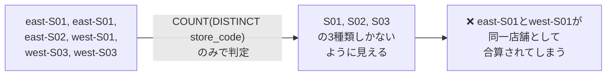
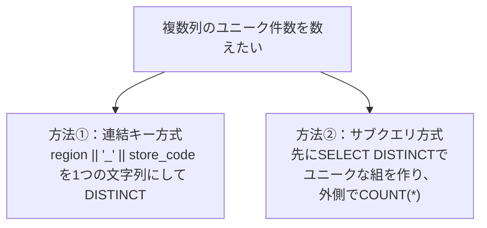

# 【完全版】問題8-13：複数列のGROUPING判定を1つにまとめる（GROUPING_ID）
### 難易度：★★★★☆ (Lv.4)
## 問題
人事部から、問題8-7で作成したような「部門×役職の給与集計レポート」について、追加の要望がありました。
`CUBE`を使うと「部門×役職の明細」「部門ごとの小計」「役職ごとの小計」「全社総計」の4パターンが生成されますが、今回のレポートでは **「役職ごとの小計」（部門を問わず、役職だけでまとめた行）だけが不要** とのことです。「部門ごとの小計」と「全社総計」はこれまで通り必要です。

再現性のため、以下の`WITH`句で部門×役職の給与データを用意します。

```sql
WITH dept_job_salary AS (
    SELECT 'A部門' AS dept_name, 'MGR'   AS job_name, 450000 AS salary FROM dual UNION ALL
    SELECT 'A部門', 'STAFF', 300000 FROM dual UNION ALL
    SELECT 'A部門', 'STAFF', 280000 FROM dual UNION ALL
    SELECT 'B部門', 'MGR',   500000 FROM dual UNION ALL
    SELECT 'B部門', 'STAFF', 350000 FROM dual UNION ALL
    SELECT 'B部門', 'STAFF', 330000 FROM dual
)
SELECT * FROM dept_job_salary
```

**【集計・出力ルール】**
* `CUBE(dept_name, job_name)`を用いて、部門×役職の明細・部門ごとの小計・役職ごとの小計・全社総計の4パターンを一度に集計すること。
* そのうち、**「役職ごとの小計」（部門がまとめられ、役職だけが残る行）だけを結果から除外**すること。
* 部門ごとの小計行の役職欄には`'部門合計'`、全社総計行の部門・役職欄には`'全社'`／`'合計'`と表示すること。
* 表示順は、明細行→部門ごとの小計→全社総計の順とし、部門名・役職名はそれぞれ昇順とすること。

## 期待する結果
| DEPT_NAME | JOB_NAME | TOTAL_SALARY |
| --------- | -------- | ------------- |
| A部門     | MGR      | 450000        |
| A部門     | STAFF    | 580000        |
| A部門     | 部門合計 | 1030000       |
| B部門     | MGR      | 500000        |
| B部門     | STAFF    | 680000        |
| B部門     | 部門合計 | 1180000       |
| 全社      | 合計     | 2210000       |

## 解答例、解説
[](https://zenn.dev/kinopp/books/0b24d659785f31)

----
<br><br>

# 問題8-14：複数列にまたがるユニーク件数のカウント（COUNT(DISTINCT 複数列)の制約と回避策）
### 難易度：★★☆☆☆ (Lv.2)
## 問題
マーケティング部から、キャンペーンサイトへのアクセスログを分析してほしいと依頼がありました。
店舗コード（`STORE_CODE`）は**地域（`REGION`）ごとに独立して採番**されており、同じ店舗コードでも地域が違えば全くの別店舗を指します（例：`east`の`S01`と`west`の`S01`は別の店舗）。
このアクセスログから、実際にアクセスが発生した **「地域×店舗コード」のユニークな組み合わせ数** を知りたいとのことです。

再現性のため、以下の`WITH`句でアクセスログを用意します。

```sql
WITH access_log AS (
    SELECT 'east' AS region, 'S01' AS store_code FROM dual UNION ALL
    SELECT 'east', 'S01' FROM dual UNION ALL
    SELECT 'east', 'S02' FROM dual UNION ALL
    SELECT 'west', 'S01' FROM dual UNION ALL
    SELECT 'west', 'S03' FROM dual UNION ALL
    SELECT 'west', 'S03' FROM dual
)
SELECT * FROM access_log
```

**【取得項目】**
* **UNIQUE_STORE_CNT**：`REGION`と`STORE_CODE`の組み合わせで見たときの、ユニークな店舗数

## 期待する結果
| UNIQUE_STORE_CNT |
| ----------------- |
| 4                  |

## 解答例
```sql:例1：NG例①（列を1つだけDISTINCTすると静かに集計が誤る）
WITH access_log AS (
    SELECT 'east' AS region, 'S01' AS store_code FROM dual UNION ALL
    SELECT 'east', 'S01' FROM dual UNION ALL
    SELECT 'east', 'S02' FROM dual UNION ALL
    SELECT 'west', 'S01' FROM dual UNION ALL
    SELECT 'west', 'S03' FROM dual UNION ALL
    SELECT 'west', 'S03' FROM dual
)
SELECT
    COUNT(DISTINCT store_code) AS unique_store_cnt  -- regionを無視しているため過小カウント
FROM
    access_log
```
```sql:例2：NG例②（複数列をそのままDISTINCTに渡すと構文エラー）
WITH access_log AS (
    SELECT 'east' AS region, 'S01' AS store_code FROM dual UNION ALL
    SELECT 'east', 'S01' FROM dual UNION ALL
    SELECT 'east', 'S02' FROM dual UNION ALL
    SELECT 'west', 'S01' FROM dual UNION ALL
    SELECT 'west', 'S03' FROM dual UNION ALL
    SELECT 'west', 'S03' FROM dual
)
SELECT
    COUNT(DISTINCT region, store_code) AS unique_store_cnt
FROM
    access_log
-- ORA-00909: invalid number of arguments
```
```sql:例3：正解①（連結キー方式）
WITH access_log AS (
    SELECT 'east' AS region, 'S01' AS store_code FROM dual UNION ALL
    SELECT 'east', 'S01' FROM dual UNION ALL
    SELECT 'east', 'S02' FROM dual UNION ALL
    SELECT 'west', 'S01' FROM dual UNION ALL
    SELECT 'west', 'S03' FROM dual UNION ALL
    SELECT 'west', 'S03' FROM dual
)
SELECT
    COUNT(DISTINCT region || '_' || store_code) AS unique_store_cnt
FROM
    access_log
```
```sql:例4：正解②（サブクエリ方式）
WITH access_log AS (
    SELECT 'east' AS region, 'S01' AS store_code FROM dual UNION ALL
    SELECT 'east', 'S01' FROM dual UNION ALL
    SELECT 'east', 'S02' FROM dual UNION ALL
    SELECT 'west', 'S01' FROM dual UNION ALL
    SELECT 'west', 'S03' FROM dual UNION ALL
    SELECT 'west', 'S03' FROM dual
)
SELECT
    COUNT(*) AS unique_store_cnt
FROM
    ( SELECT DISTINCT region, store_code FROM access_log )
```

## 解説
今回のテーマは、地味ながら実務で頻繁に踏み抜く「複数列にまたがるユニーク件数のカウント」です。単一列であれば`COUNT(DISTINCT 列)`で一発ですが、「2つ以上の列の組み合わせでユニークかどうかを判定したい」場合、Oracleには少し癖のある制約があります。

まず例1（NG例①）です。「店舗のユニーク数が知りたいのだから`store_code`だけをDISTINCTすればよい」と考えるのは自然な発想ですが、これは`region`という軸を無視してしまっています。



`store_code`の値だけを見ると`S01`, `S02`, `S03`の3種類しかなく、`COUNT(DISTINCT store_code)`は`3`を返します。しかし実際には`east`の`S01`と`west`の`S01`は別店舗であるため、正しい答えは`4`のはずです。エラーは出ず、`3`という一見もっともらしい数字が返ってくるため、`region`をまたいで店舗コードが重複しているという前提条件を知らないと、この誤りに気づくのは難しいでしょう。

これに気づいて「では2つの列を両方DISTINCTに渡せばよいのでは」と書き直したのが例2（NG例②）ですが、今度は実行した瞬間にエラーになります。

```
ORA-00909: invalid number of arguments
```

Oracleの`COUNT`関数は、`DISTINCT`キーワードの後ろに**単一の式**しか受け付けない仕様になっています。多くの人が「複数列をカンマ区切りで渡せばまとめてDISTINCT判定してくれるはず」と直感的に考えてしまいますが、Oracleではこの書き方はサポートされておらず、構文エラーとして弾かれます。

| 書き方 | 結果 |
| :--- | :--- |
| `COUNT(DISTINCT store_code)` | 実行できるが、regionを無視した誤った集計になる |
| `COUNT(DISTINCT region, store_code)` | `ORA-00909`で実行不可 |

そこで登場するのが、例3・例4の2つの回避策です。



例3の連結キー方式は、`region || '_' || store_code`のように区切り文字を挟んで2つの列を1つの文字列に合成し、その合成後の文字列を`COUNT(DISTINCT ...)`に渡す方法です。`'east' || '_' || 'S01'`は`'east_S01'`という1つの値になるため、これなら単一の式として`DISTINCT`に渡せます。

例4のサブクエリ方式は、内側の`SELECT DISTINCT region, store_code`で先に「ユニークな組み合わせの一覧」を作り、それを外側で`COUNT(*)`するという2段階の方法です。`DISTINCT`は複数列に対して素直に使える一方、`COUNT(DISTINCT 複数列)`という書き方だけが許されていない、というOracleの制約を踏まえた、ある意味で最も直感的な回避策です。

| 方式 | 書き方の特徴 | メリット・デメリット |
| :--- | :--- | :--- |
| 連結キー方式 | 1行のシンプルな記述で完結 | 区切り文字の選び方次第で、異なる値が偶然同じ文字列に合成されてしまうリスクがある |
| サブクエリ方式 | 内側でDISTINCT、外側でCOUNT | ロジックが直感的で読みやすいが、記述はやや長くなる |

期待する結果を見ると、`east-S01`（2件のアクセスがあるが1店舗として数える）、`east-S02`、`west-S01`（`east`の`S01`とは別店舗）、`west-S03`（2件のアクセスがあるが1店舗として数える）の、合計4つのユニークな組み合わせが正しくカウントされています。

:::message
### 連結キー方式の落とし穴：区切り文字の衝突とNULLの伝播
連結キー方式（`region || '_' || store_code`）は手軽ですが、2つの注意点があります。

1つ目は、**区切り文字の選び方によっては、本来別の値であるはずの組み合わせが偶然同じ文字列に合成されてしまう**リスクです。例えば区切り文字を使わずに単純連結（`region || store_code`）した場合、`region='AB', store_code='C'`と`region='A', store_code='BC'`は、どちらも`'ABC'`という同じ文字列になってしまい、別々の組み合わせとして数えられるべきものが1つに潰れてしまいます。区切り文字には、実データに絶対含まれないと確信できる文字（`'_'`や`'|'`、あるいは`CHR(1)`のような制御文字）を選ぶ必要があります。

2つ目は、**列にNULLが含まれる場合の挙動**です。Oracleの文字列連結演算子`||`は、連結対象のどれか1つでもNULLだと、結果全体がNULLになる...と思われがちですが、実際には`||`はNULLを空文字列として扱うため、他がNULLでなければ結果はNULLになりません。ただし`store_code`が完全にNULLの行がある場合、`COUNT(DISTINCT ...)`はNULLを結果から除外する仕様のため、「region×store_codeの組み合わせとしては存在するが、store_codeが未設定の行」がカウントから漏れる可能性があります。今回のデータのようにNULLが存在しない場合は問題になりませんが、実データを扱う際は、対象列にNULLが含まれていないかを事前に確認しておくと安心です。
:::

`COUNT(DISTINCT 複数列)`が直接書けないというOracleの制約は、知らないと必ず一度は`ORA-00909`にぶつかる典型的なポイントです。「ユニークなユーザー×商品の組み合わせ数」「ユニークな年月×担当者の組み合わせ数」など、複数の軸を組み合わせたユニーク件数を数えたくなる場面は実務で頻出するため、連結キー方式とサブクエリ方式の2つを引き出しとして持っておくと、いざというときに迷わず対応できます。

---
<br><br>

# 【完全版】問題8-15：集約関数としてのパーセンタイル値算出（PERCENTILE_CONT / PERCENTILE_DISC）
### 難易度：★★★★☆ (Lv.4)
## 問題
研修担当部門から、新人研修の理解度テストについて分析依頼がありました。
問題8-9では「中央値（50パーセンタイル）」を`MEDIAN`関数で算出しましたが、今回はさらに踏み込み、「下位25%の受講者はどのラインにいるか（25パーセンタイル）」「上位10%の優秀層はどのラインからか（90パーセンタイル）」も併せて把握したいとのことです。
部門（`DEPT_NAME`）ごとにグループ化し、テストスコア（`SCORE`）の25・50・90パーセンタイル値を算出してください。

再現性のため、以下の`WITH`句でテストスコアを用意します。

```sql
WITH test_scores AS (
    SELECT 'A部門' AS dept_name, 60  AS score FROM dual UNION ALL
    SELECT 'A部門', 70  FROM dual UNION ALL
    SELECT 'A部門', 80  FROM dual UNION ALL
    SELECT 'A部門', 90  FROM dual UNION ALL
    SELECT 'A部門', 100 FROM dual UNION ALL
    SELECT 'B部門', 10  FROM dual UNION ALL
    SELECT 'B部門', 50  FROM dual UNION ALL
    SELECT 'B部門', 60  FROM dual UNION ALL
    SELECT 'B部門', 70  FROM dual UNION ALL
    SELECT 'B部門', 100 FROM dual
)
SELECT * FROM test_scores
```

**【取得項目】**
1. **DEPT_NAME**：部門名
2. **P25**：25パーセンタイル値（線形補間、`PERCENTILE_CONT`）
3. **P50**：50パーセンタイル値＝中央値（線形補間、`PERCENTILE_CONT`）
4. **P90_CONT**：90パーセンタイル値（線形補間、`PERCENTILE_CONT`）
5. **P90_DISC**：90パーセンタイル値（実データの値、`PERCENTILE_DISC`）

**【条件】**
* 部門ごとに**1行**で集計結果を出力すること。
* 結果は`DEPT_NAME`の昇順で表示すること。

## 期待する結果
| DEPT_NAME | P25 | P50 | P90_CONT | P90_DISC |
| --------- | --- | --- | -------- | -------- |
| A部門     | 70  | 80  | 96       | 100      |
| B部門     | 50  | 60  | 88       | 100      |

## 解答例、解説
[](https://zenn.dev/kinopp/books/0b24d659785f31)

----
<br><br>

# 【完全版】問題8-16：集計結果に対するさらなる集計とネスト構造（MAX(SUM(...)) と2段階集計）
### 難易度：★★★★☆ (Lv.4)
## 問題
人事部から、「部門ごとの給与合計を比較したときに、**合計額が最も高い部門はどこで、その金額はいくらか**」を知りたいという依頼がありました。

再現性のため、以下の`WITH`句で部門別の給与データを用意します。

```sql
WITH dept_salary AS (
    SELECT 'A部門' AS dept_name, 300000 AS salary FROM dual UNION ALL
    SELECT 'A部門', 280000 FROM dual UNION ALL
    SELECT 'B部門', 500000 FROM dual UNION ALL
    SELECT 'B部門', 450000 FROM dual UNION ALL
    SELECT 'C部門', 200000 FROM dual UNION ALL
    SELECT 'C部門', 150000 FROM dual UNION ALL
    SELECT 'C部門', 180000 FROM dual
)
SELECT * FROM dept_salary
```

**【取得項目】**
1. **DEPT_NAME**：給与合計が最も高い部門の部門名
2. **TOTAL_SALARY**：その部門の給与合計額

## 解答例、解説
[](https://zenn.dev/kinopp/books/0b24d659785f31)

----
<br><br>

# 【完全版】問題8-17：2変数間の関係性を測る（CORR / COVAR_POP / REGR_SLOPE）
### 難易度：★★★★☆ (Lv.4)
## 問題
マーケティング部から、広告費と売上の関係性を地域別に分析してほしいと依頼がありました。
「広告費を増やせば増やすほど、売上も比例して伸びる地域」と「広告費を増やしても、あまり売上に影響が出ていなさそうな地域」があるのではないか、という仮説を、感覚ではなく数値で裏付けたいとのことです。

再現性のため、以下の`WITH`句で地域別の月次データ（広告費・売上）を用意します。

```sql
WITH ad_sales AS (
    SELECT 'A地区' AS region, 100 AS ad_spend, 1000 AS sales FROM dual UNION ALL
    SELECT 'A地区', 150, 1400 FROM dual UNION ALL
    SELECT 'A地区', 200, 2100 FROM dual UNION ALL
    SELECT 'A地区', 250, 2500 FROM dual UNION ALL
    SELECT 'A地区', 300, 3000 FROM dual UNION ALL
    SELECT 'B地区', 100, 1800 FROM dual UNION ALL
    SELECT 'B地区', 150, 1200 FROM dual UNION ALL
    SELECT 'B地区', 200, 2000 FROM dual UNION ALL
    SELECT 'B地区', 250, 1300 FROM dual UNION ALL
    SELECT 'B地区', 300, 1900 FROM dual
)
SELECT * FROM ad_sales
```

**【取得項目】**
1. **REGION**：地区名
2. **CORR_AD_SALES**：広告費と売上の相関係数（小数点第4位まで四捨五入）
3. **COVAR_POP_AD_SALES**：広告費と売上の母共分散（小数点第2位まで四捨五入）
4. **REGR_SLOPE**：広告費を説明変数、売上を目的変数とした回帰直線の傾き（小数点第2位まで四捨五入）

**【条件】**
* 地区ごとにグループ化すること。
* 結果は`REGION`の昇順で表示すること。

## 期待する結果
| REGION | CORR_AD_SALES | COVAR_POP_AD_SALES | REGR_SLOPE | 
| ------ | ------------- | ------------------ | ---------- | 
| A地区  | 0.9964        | 51000              | 10.2       | 
| B地区  | 0.1301        | 3000               | 0.6        | 

## 解答例、解説
[](https://zenn.dev/kinopp/books/0b24d659785f31)
