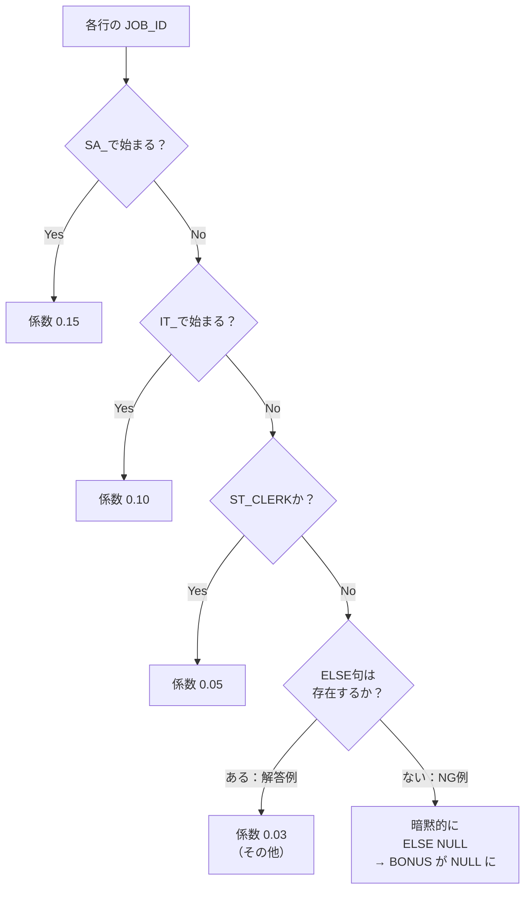
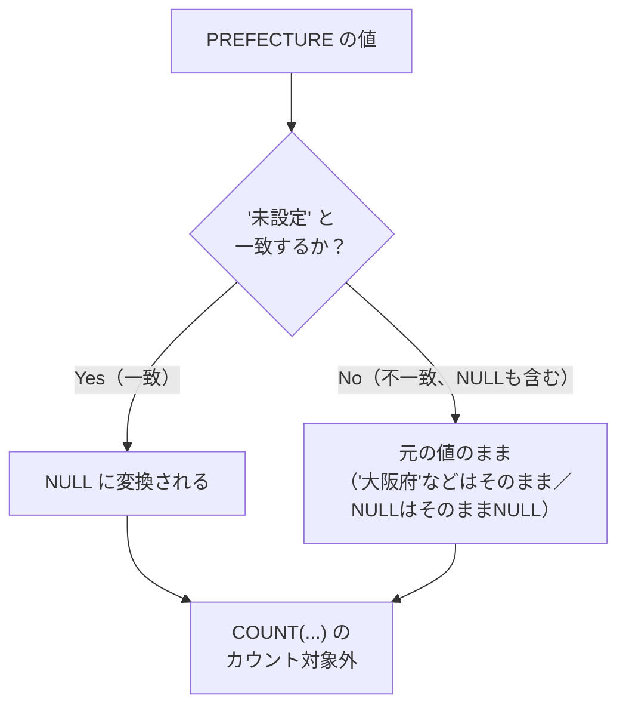
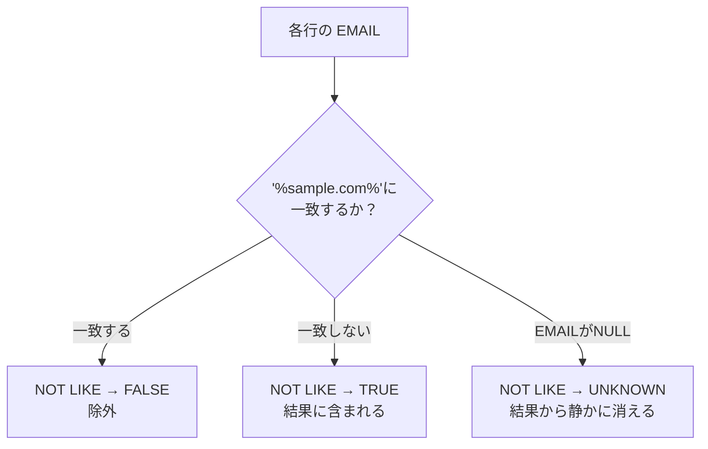
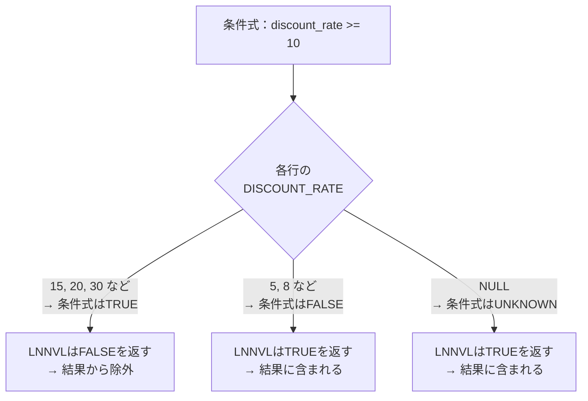
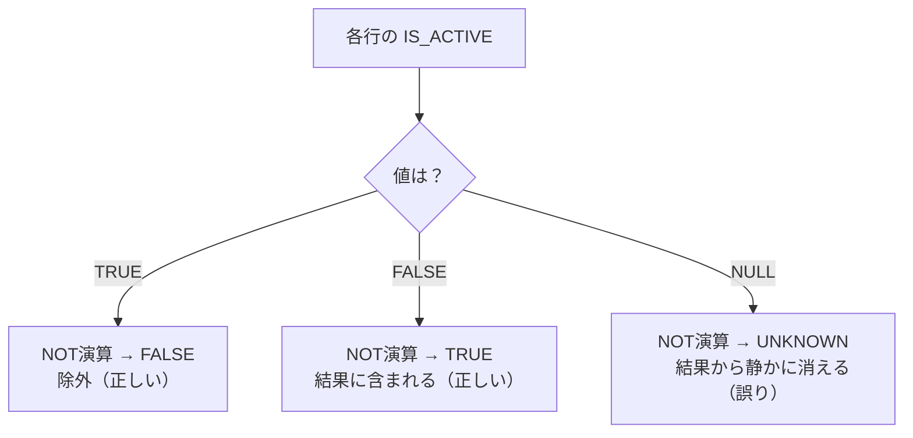

# 問題4-16：CASE式の「ELSE省略」で起きる静かな抜け漏れ
### 難易度：★★☆☆☆ (Lv.2)

## 問題
次の`WITH`句で作成する **`EMPLOYEE_BONUS`**（賞与計算用データ）を使用します。

```sql
WITH employee_bonus AS (
    SELECT 1  AS employee_id, 'Tanaka'    AS last_name, 'SA_REP'   AS job_id, 9500  AS salary FROM dual UNION ALL
    SELECT 2, 'Suzuki',    'SA_MAN',   15000 FROM dual UNION ALL
    SELECT 3, 'Sato',      'IT_PROG',  6000  FROM dual UNION ALL
    SELECT 4, 'Ito',       'ST_CLERK', 3200  FROM dual UNION ALL
    SELECT 5, 'Watanabe',  'ST_CLERK', 2800  FROM dual UNION ALL
    SELECT 6, 'Yamamoto',  'HR_REP',   4500  FROM dual UNION ALL
    SELECT 7, 'Nakamura',  'MK_REP',   3500  FROM dual UNION ALL
    SELECT 8, 'Kobayashi', 'SA_REP',   9800  FROM dual UNION ALL
    SELECT 9, 'Kato',      'IT_PROG',  5200  FROM dual UNION ALL
    SELECT 10, 'Kimura',   'HR_REP',   4800  FROM dual
)
SELECT * FROM employee_bonus
```

各従業員について、**`JOB_ID`のカテゴリに応じた賞与係数**を給与に掛けて「賞与額」を算出してください。

**【賞与係数のルール】**
* `JOB_ID`が **'SA_'で始まる**（営業系）　→　係数 **`0.15`**
* `JOB_ID`が **'IT_'で始まる**（技術系）　→　係数 **`0.10`**
* `JOB_ID`が **'ST_CLERK'**（倉庫スタッフ）　→　係数 **`0.05`**
* **上記のいずれにも該当しない場合**　→　係数 **`0.03`**

なお、レコードは`EMPLOYEE_ID`の昇順で表示してください。

## 期待する結果
| EMPLOYEE_ID | LAST_NAME | JOB_ID   | SALARY | BONUS | 
| ----------- | --------- | -------- | ------ | ----- | 
| 1           | Tanaka    | SA_REP   | 9500   | 1425  | 
| 2           | Suzuki    | SA_MAN   | 15000  | 2250  | 
| 3           | Sato      | IT_PROG  | 6000   | 600   | 
| 4           | Ito       | ST_CLERK | 3200   | 160   | 
| 5           | Watanabe  | ST_CLERK | 2800   | 140   | 
| 6           | Yamamoto  | HR_REP   | 4500   | 135   | 
| 7           | Nakamura  | MK_REP   | 3500   | 105   | 
| 8           | Kobayashi | SA_REP   | 9800   | 1470  | 
| 9           | Kato      | IT_PROG  | 5200   | 520   | 
| 10          | Kimura    | HR_REP   | 4800   | 144   | 

**合計賞与額：6949.0**

## 解答例
```sql
WITH employee_bonus AS (
    SELECT 1  AS employee_id, 'Tanaka'    AS last_name, 'SA_REP'   AS job_id, 9500  AS salary FROM dual UNION ALL
    SELECT 2, 'Suzuki',    'SA_MAN',   15000 FROM dual UNION ALL
    SELECT 3, 'Sato',      'IT_PROG',  6000  FROM dual UNION ALL
    SELECT 4, 'Ito',       'ST_CLERK', 3200  FROM dual UNION ALL
    SELECT 5, 'Watanabe',  'ST_CLERK', 2800  FROM dual UNION ALL
    SELECT 6, 'Yamamoto',  'HR_REP',   4500  FROM dual UNION ALL
    SELECT 7, 'Nakamura',  'MK_REP',   3500  FROM dual UNION ALL
    SELECT 8, 'Kobayashi', 'SA_REP',   9800  FROM dual UNION ALL
    SELECT 9, 'Kato',      'IT_PROG',  5200  FROM dual UNION ALL
    SELECT 10, 'Kimura',   'HR_REP',   4800  FROM dual
)
SELECT
    employee_id,
    last_name,
    job_id,
    salary,
    salary * CASE
        WHEN job_id LIKE 'SA_%'   THEN 0.15
        WHEN job_id LIKE 'IT_%'   THEN 0.10
        WHEN job_id = 'ST_CLERK'  THEN 0.05
        ELSE 0.03
    END AS bonus
FROM
    employee_bonus
ORDER BY
    employee_id
```

## 解説
4-8と4-15でCASE式を扱いましたが、いずれの解答例にも必ず`ELSE`句がありました。今回は、その`ELSE`句を**うっかり書き忘れてしまった場合**に何が起きるかを扱います。

```sql:❌ NG例：ELSE句を書き忘れた場合
SELECT
    employee_id,
    last_name,
    job_id,
    salary,
    salary * CASE
        WHEN job_id LIKE 'SA_%'  THEN 0.15
        WHEN job_id LIKE 'IT_%'  THEN 0.10
        WHEN job_id = 'ST_CLERK' THEN 0.05
        -- ELSE句がない！
    END AS bonus
FROM
    employee_bonus
ORDER BY
    employee_id
```

このNG例は、**構文エラーには一切なりません。** 実行すると次のような結果が返ってきます。

| EMPLOYEE_ID | LAST_NAME | JOB_ID   | SALARY | BONUS   |
| ----------- | --------- | -------- | ------ | ------- |
| 1           | Tanaka    | SA_REP   | 9500   | 1425.0  |
| ...         | ...       | ...      | ...    | ...     |
| 6           | Yamamoto  | HR_REP   | 4500   | **(NULL)** |
| 7           | Nakamura  | MK_REP   | 3500   | **(NULL)** |
| 10          | Kimura    | HR_REP   | 4800   | **(NULL)** |

`HR_REP`や`MK_REP`という、どの`WHEN`条件にも一致しない`JOB_ID`を持つ行の`BONUS`が、エラーにもならず、警告も出さず、**静かにNULLへと置き換わっています。**



### なぜNULLになるのか：CASE式の仕様

これは不具合ではなく、**Oracle SQLの正式な仕様**です。単純CASE式・検索CASE式のどちらであっても、`ELSE`句を省略した場合、内部的には **`ELSE NULL`が自動的に補われている** ものとして扱われます。

```sql
-- この2つは完全に同じ意味
CASE WHEN 条件 THEN 値 END
CASE WHEN 条件 THEN 値 ELSE NULL END
```

つまり「どの`WHEN`にも一致しなかったらNULLを返す」という動作は、SQLの仕様として明確に定義された正しい挙動です。だからこそエラーにはならず、レビューでも見落とされやすいのです。

### 個別の値が消えるだけでは終わらない：集計への波及

今回さらに厄介なのは、この現象が**個々の行だけでなく、集計結果にまで静かに波及する**という点です。NG例のクエリで全従業員の賞与合計を`SUM(salary * CASE ...)`のように計算すると、`HR_REP`と`MK_REP`の3名分の賞与（135.0 + 105.0 + 144.0 = 384.0円）が合計からごっそり抜け落ちます。

これは、集計関数が原則として**NULLを「存在しないもの」として無視して計算する**という性質によるものです（この性質については、これから第8章で詳しく学びます）。エラーが出ないどころか、`SUM`関数はNULLを含む行があっても正常に数値を返してくれるため、「合計金額の桁がゼロ何個か違う」というような明らかにおかしい結果にはならず、**「本来より少し少ないだけの、もっともらしい合計額」** が出力されてしまいます。これこそが、本書で繰り返し警告している「静かな失敗」の典型例です。

| 現象 | 気づきやすさ |
| :--- | :--- |
| 構文エラーになる | ⭕ すぐ気づける |
| 明らかにおかしい数値（0件、桁違いなど）になる | ⭕ すぐ気づける |
| 一部の行だけNULLになる（今回の個別行） | △ 該当行を目視すれば気づける |
| 集計結果がわずかに少ない値になる（今回の合計） | ❌ 非常に気づきにくい |

### 対策：ELSEを明示するか、「網羅している」ことをテストする

対策はシンプルで、解答例のように**必ず`ELSE`句を明示する**ことです。「その他に分類されるものはすべて係数0.03」というルールを`ELSE 0.03`という形でコードに残しておくことで、新しい`JOB_ID`が将来追加されても、少なくとも「未分類のまま賞与が消える」という事態は防げます。

もう一つの実務的な対策として、`CASE`式の分岐が本当にすべてのパターンを網羅しているかを検証するために、**変換後にNULLが発生していないかをチェックするクエリ**を別途用意しておく方法もあります。

```sql:参考：CASE式の変換漏れを検知するチェッククエリ
SELECT
    job_id,
    COUNT(*) AS 該当件数
FROM
    employee_bonus
WHERE
    CASE
        WHEN job_id LIKE 'SA_%'  THEN 0.15
        WHEN job_id LIKE 'IT_%'  THEN 0.10
        WHEN job_id = 'ST_CLERK' THEN 0.05
    END IS NULL
GROUP BY
    job_id
```

このクエリで1件でもヒットすれば、「`ELSE`句、またはいずれかの`WHEN`条件が漏れている」ことを機械的に検知できます。新しい`JOB_ID`が今後追加される可能性がある業務データを扱う際は、このような防御的なチェックを本番投入前に一度通しておくと安心です。

:::message
### 「ELSEを省略した=その他はすべて除外」ではない
今回の`ELSE`省略は、`WHERE`句で行そのものを絞り込む場合とは意味が異なる点に注意してください。`WHERE`句の条件に一致しない行は**結果セットから消える（行ごと表示されない）**のに対し、`SELECT`句のCASE式で`ELSE`を省略した場合は**行自体は残ったまま、その列の値だけがNULLになる**という違いがあります。「行が減っていないから大丈夫」と安心していると、今回のように列の値だけが静かに壊れているケースを見逃してしまいます。
:::

## 参考リンク
https://www.shift-the-oracle.com/sql/case-when-expression.html

---
<br><br>

# 問題4-17：意味のない「ダミー値」をNULLIFでNULL扱いにする
### 難易度：★★☆☆☆ (Lv.2)

## 問題
次の`WITH`句で作成する **`CUSTOMER_PROFILE`**（顧客プロフィールデータ）を使用します。このデータは、旧システムからの移行時に「未入力」の項目へ、NULLではなく **`'未設定'`という文字列** を仮の値として入れてしまった、という経緯があります。

```sql
WITH customer_profile AS (
    SELECT 1  AS customer_id, 'Tanaka'    AS last_name, '大阪府'   AS prefecture FROM dual UNION ALL
    SELECT 2, 'Suzuki',    '未設定' FROM dual UNION ALL
    SELECT 3, 'Sato',      '東京都' FROM dual UNION ALL
    SELECT 4, 'Ito',       '未設定' FROM dual UNION ALL
    SELECT 5, 'Watanabe',  '愛知県' FROM dual UNION ALL
    SELECT 6, 'Yamamoto',  '未設定' FROM dual UNION ALL
    SELECT 7, 'Nakamura',  '福岡県' FROM dual UNION ALL
    SELECT 8, 'Kobayashi', NULL     FROM dual UNION ALL
    SELECT 9, 'Kato',      '北海道' FROM dual UNION ALL
    SELECT 10, 'Kimura',   '未設定' FROM dual
)
SELECT * FROM customer_profile
```

このデータから、**「全顧客数」**と、**「都道府県が実際に登録されている顧客数」**（`'未設定'`という文字列は実質的に未入力として扱う）を、**1件のクエリで同時に**求めてください。

## 期待する結果
| 全顧客数 | 登録済み件数 |
| -------- | ------------ |
| 10       | 5            |

## 解答例
```sql
WITH customer_profile AS (
    SELECT 1  AS customer_id, 'Tanaka'    AS last_name, '大阪府'   AS prefecture FROM dual UNION ALL
    SELECT 2, 'Suzuki',    '未設定' FROM dual UNION ALL
    SELECT 3, 'Sato',      '東京都' FROM dual UNION ALL
    SELECT 4, 'Ito',       '未設定' FROM dual UNION ALL
    SELECT 5, 'Watanabe',  '愛知県' FROM dual UNION ALL
    SELECT 6, 'Yamamoto',  '未設定' FROM dual UNION ALL
    SELECT 7, 'Nakamura',  '福岡県' FROM dual UNION ALL
    SELECT 8, 'Kobayashi', NULL     FROM dual UNION ALL
    SELECT 9, 'Kato',      '北海道' FROM dual UNION ALL
    SELECT 10, 'Kimura',   '未設定' FROM dual
)
SELECT
    COUNT(*)                             AS "全顧客数",
    COUNT(NULLIF(prefecture, '未設定'))  AS "登録済み件数"
FROM
    customer_profile
```

## 解説
問題4-13ではDECODEを扱いました。この後の問題6-6でゼロ除算対策としても登場するNULLIFですが、今回はそのもう一つの代表的な使い方です。今回は`NULLIF`の**もう一つの代表的な使い方**です。まず構文をおさらいします。

```sql
NULLIF(A, B)
```

「AとBが等しければNULLを返し、異なればAをそのまま返す」というシンプルな関数です。6-6では「割り算の分母が0だったらNULLにする」という使い方をしましたが、今回はこれを **「特定の文字列だったらNULLにする」** という用途で使います。



`COUNT(列名)`という書き方は、NULLの行を自動的に無視してカウントするという性質を持っています（この性質については、これから第8章で改めて学びます）。つまり「`NULLIF`で`'未設定'`をNULLに変換してから`COUNT`する」ことで、結果的に「'未設定'でも元からNULLでもない、本当に意味のあるデータだけ」をカウントできる、という組み立てになっています。そして`COUNT(*)`は行の中身を一切見ずに単純に行数を数えるため、`'未設定'`や`NULL`が混ざっていても関係なく「全顧客数」の`10`件を返します。

### なぜ `WHERE prefecture <> '未設定'` では両方の数字を出せないのか

「'未設定'を除外したいだけなら、`WHERE`句で弾けばいいのでは？」と思われるかもしれません。実際に書いてみると、思わぬ壁にぶつかります。

```sql:❌ NG例：WHERE句の否定条件で絞り込んでから件数を数えようとした場合
SELECT
    COUNT(*) AS "全顧客数",
    COUNT(*) AS "登録済み件数"
FROM
    customer_profile
WHERE
    prefecture <> '未設定'
```

このNG例を実行すると、**「全顧客数」と表示したいはずの列にも、`5`という数字が返ってきてしまいます。**

| CUSTOMER_ID | LAST_NAME | PREFECTURE | `<> '未設定'`の判定 |
| ----------- | --------- | ---------- | :---: |
| 1           | Tanaka    | 大阪府      | TRUE（残る） |
| 3           | Sato      | 東京都      | TRUE（残る） |
| 5           | Watanabe  | 愛知県      | TRUE（残る） |
| 7           | Nakamura  | 福岡県      | TRUE（残る） |
| 8           | Kobayashi | **(NULL)** | **UNKNOWN（消える）** |
| 9           | Kato      | 北海道      | TRUE（残る） |

これは4-3で学んだ「`<>`とNULLの罠」がここでも顔を出しているためです。`Kobayashi`さんの`PREFECTURE`は`NULL`であるため、`prefecture <> '未設定'`という比較は`UNKNOWN`になり、`WHERE`句によって**行そのものが結果セットから消えてしまいます**。

問題はここからです。`WHERE`句は文字通り「行の絞り込み」を行うため、一度この条件を通過した時点で、**元の10件という母数の情報はクエリのどこにも残っていません。** 残っているのは「絞り込まれた後の5件」だけであり、この5件から「全顧客数」を求めようとしても、絞り込み後の件数（5件）しか手に入らないのです。「全顧客数」と「登録済み件数」を同時に、しかも正しい数字で求めたいなら、`WHERE`句で行自体を消してしまう方法は原理的に使えません。

### NULLIFは「行を消さずに、値だけを書き換える」

一方、解答例の`NULLIF(prefecture, '未設定')`は、`WHERE`句のように行を絞り込むのではなく、**列の値だけをその場で書き換える**アプローチです。そのため`Kobayashi`さんを含む全10行は最後まで結果セットに残り続けます。

* `COUNT(*)`　→　行を1件も減らしていないので、そのまま`10`件が正しく数えられる
* `COUNT(NULLIF(prefecture, '未設定'))`　→　ダミー値と元からのNULLだけがカウント対象外になり、`5`件が正しく数えられる

同じ`FROM`句・同じ行集合に対して、**性質の異なる2つの集計を同時に走らせられる**というのが、`WHERE`による事前の絞り込みにはない、`NULLIF`ならではの強みです。

| アプローチ | 全顧客数 | 登録済み件数 | 同時取得 |
| :--- | :---: | :---: | :---: |
| `WHERE <> '未設定'` で絞り込む | ❌ 取得不可（絞り込み後の件数しか残らない） | ⭕（結果的に5件） | ❌ |
| `NULLIF` で値だけ書き換える | ⭕ 10件 | ⭕ 5件 | ⭕ |

### NVLとNULLIFは「ちょうど逆」の関係

4-13で扱った`NVL`（NULLを具体的な値に変える）と、今回の`NULLIF`（具体的な値をNULLに変える）は、ちょうど正反対の関係にあります。

| 関数 | やること | イメージ |
| :--- | :--- | :--- |
| `NVL(A, B)` | AがNULLなら → B | 「空欄を埋める」 |
| `NULLIF(A, B)` | AとBが等しいなら → NULL | 「意味のない値を空欄化する」 |

`NVL`は「NULLだと困るので何かで埋めたい」という場面で使い、`NULLIF`は逆に「値は入っているが、それは実質的に空欄と同じ意味なので、NULLとして扱いたい」という場面で使います。

:::message
### NULLIFは「等しいかどうか」の判定にNULLは使えない
今回の`NULLIF(prefecture, '未設定')`は、あくまで**具体的な値同士**の比較です。もし`NULLIF(prefecture, NULL)`のように第2引数にNULLを直接渡してしまうと、`prefecture = NULL`という比較自体が常にUNKNOWNになるため、**絶対に一致判定されず、常に元の値がそのまま返ってきます**（つまり何も変換されません）。「NULLIFを使えばNULLがらみの処理は何でも解決する」というわけではなく、あくまで「特定の"具体的な"値をNULL化する」ための関数だという点を覚えておいてください。
:::

## 参考リンク
https://www.shift-the-oracle.com/sql/functions/nullif.html


---
<br><br>

# 問題4-18：NOT LIKEに潜むNULLの罠
### 難易度：★★☆☆☆ (Lv.2)

## 問題
次の`WITH`句で作成する **`CUSTOMER_CONTACT`**（顧客連絡先データ）を使用します。

```sql
WITH customer_contact AS (
    SELECT 1  AS customer_id, 'Tanaka'    AS last_name, 'tanaka@sample.com'   AS email FROM dual UNION ALL
    SELECT 2, 'Suzuki',    'suzuki@test-corp.co.jp' FROM dual UNION ALL
    SELECT 3, 'Sato',      'sato@sample.com'        FROM dual UNION ALL
    SELECT 4, 'Ito',       'ito@freemail.com'       FROM dual UNION ALL
    SELECT 5, 'Watanabe',  NULL                     FROM dual UNION ALL
    SELECT 6, 'Yamamoto',  'yamamoto@sample.com'    FROM dual UNION ALL
    SELECT 7, 'Nakamura',  NULL                     FROM dual UNION ALL
    SELECT 8, 'Kobayashi', 'kobayashi@another.jp'   FROM dual
)
SELECT * FROM customer_contact
```

**「'sample.com'を含まないメールアドレスを持つ顧客」** を抽出してください。メールアドレスが未登録（NULL）の顧客も、当然'sample.com'を含んでいないため、結果に含めてください。

なお、レコードは`CUSTOMER_ID`の昇順で表示してください。

## 期待する結果
| CUSTOMER_ID | LAST_NAME | EMAIL                  | 
| ----------- | --------- | ---------------------- | 
| 2           | Suzuki    | suzuki@test-corp.co.jp | 
| 4           | Ito       | ito@freemail.com       | 
| 5           | Watanabe  |                        | 
| 7           | Nakamura  |                        | 
| 8           | Kobayashi | kobayashi@another.jp   | 

## 解答例
```sql
WITH customer_contact AS (
    SELECT 1  AS customer_id, 'Tanaka'    AS last_name, 'tanaka@sample.com'   AS email FROM dual UNION ALL
    SELECT 2, 'Suzuki',    'suzuki@test-corp.co.jp' FROM dual UNION ALL
    SELECT 3, 'Sato',      'sato@sample.com'        FROM dual UNION ALL
    SELECT 4, 'Ito',       'ito@freemail.com'       FROM dual UNION ALL
    SELECT 5, 'Watanabe',  NULL                     FROM dual UNION ALL
    SELECT 6, 'Yamamoto',  'yamamoto@sample.com'    FROM dual UNION ALL
    SELECT 7, 'Nakamura',  NULL                     FROM dual UNION ALL
    SELECT 8, 'Kobayashi', 'kobayashi@another.jp'   FROM dual
)
SELECT
    customer_id,
    last_name,
    email
FROM
    customer_contact
WHERE
       email NOT LIKE '%sample.com%'
    OR email IS NULL
ORDER BY
    customer_id
```

## 解説
問題4-3で「`<>`や`!=`のような否定の比較演算子は、NULLの行を静かに除外してしまう」という罠を学びました。実は全く同じ性質が、`LIKE`の否定形である **`NOT LIKE`** にもそのまま当てはまります。

```sql:❌ NG例：NOT LIKEだけで抽出しようとした場合
SELECT
    customer_id,
    last_name,
    email
FROM
    customer_contact
WHERE
    email NOT LIKE '%sample.com%'
ORDER BY
    customer_id
```

このNG例を実行すると、結果は次の3件になります。

| CUSTOMER_ID | LAST_NAME | EMAIL                  |
| ----------- | --------- | ----------------------- |
| 2           | Suzuki    | suzuki@test-corp.co.jp  |
| 4           | Ito       | ito@freemail.com        |
| 8           | Kobayashi | kobayashi@another.jp    |

`Watanabe`さんと`Nakamura`さん、`EMAIL`が`NULL`の2名が結果から消えています。この2名のメールアドレスは、`'sample.com'`という文字列を**含んでいない**のですから、本来なら「含まない顧客」として抽出されるべきです。しかしSQLはエラーも警告も出さず、当たり前のような顔をして3件という"それらしい"件数を返してきます。



### なぜNULLだと消えてしまうのか

`LIKE`という演算子は、内部的には`=`と同じ「三値論理（TRUE / FALSE / UNKNOWN）」で動作しています。`email LIKE '%sample.com%'`にせよ、その否定形の`email NOT LIKE '%sample.com%'`にせよ、**`email`がNULLである時点で、パターンに一致するかどうかを判定すること自体ができません。** 「存在しない値」を相手にパターンマッチングを試みても答えが出せないため、結果はTRUEでもFALSEでもなく、常に**UNKNOWN**になります。

`WHERE`句は、判定結果がTRUEの行だけを残す仕組みです。UNKNOWNはTRUEではないため、`LIKE`の場合もその否定の`NOT LIKE`の場合も、NULLの行は**どちらのケースであっても一律で弾かれてしまう**のです。

| 演算子 | NULLに対する判定結果 | WHERE句での扱い |
| :--- | :---: | :--- |
| `email LIKE '%sample.com%'` | UNKNOWN | 除外される |
| `email NOT LIKE '%sample.com%'` | UNKNOWN | **除外される（ここが罠）** |

「`NOT LIKE`なんだから、`LIKE`で弾かれる行の"残り全部"が返ってくるはずだ」という直感は、NULLが絡む場面では成立しません。4-3で学んだ`<>`の罠と全く同じ構造がここにも潜んでいるわけです。

### 対策：IS NULLを明示的にOR条件へ加える

対処法も4-3と同じで、**「NULLの場合も対象に含めたいなら、`IS NULL`をOR条件で明示的に追加する」** ことです。

```sql
WHERE
       email NOT LIKE '%sample.com%'
    OR email IS NULL
```

こう書くことで、「'sample.com'を含まない」という条件と、「そもそもメールアドレスが登録されていない」という条件の**両方**を正しく拾えるようになります。今回のように「不完全なデータも含めて洗い出したい」という業務要件（例えば「meilが'sample.com'指定でない、あるいは未登録の顧客に一斉に登録案内を送りたい」など）では、この`IS NULL`の付け忘れが実務上のクレームに直結しやすいポイントです。

### LIKE以外の否定条件でも同じ発想を

この「否定条件＋NULL」の罠は、`<>`（4-3）、`NOT IN`（4-4）、そして今回の`NOT LIKE`と、姿を変えて何度も登場してきました。今後別の否定条件（`NOT BETWEEN`など）に出会った場合も、**「この条件、NULLの行はどう判定されるだろう？」と一度立ち止まって考える癖**をつけておくと、思わぬデータの欠落を未然に防げます。

| これまで登場した否定条件 | NULLとの組み合わせ |
| :--- | :--- |
| `<>` / `!=`（4-3） | UNKNOWNになり除外される |
| `NOT IN`（4-4） | リストにNULLが混ざると全行が除外される（さらに危険） |
| `NOT LIKE`（今回） | UNKNOWNになり除外される |

期待する結果を見ると、`Watanabe`さんと`Nakamura`さんの2名がきちんと結果に含まれており、「'sample.com'を含まない」＋「そもそも未登録」の両方が漏れなく抽出できていることが確認できます。

:::message
### NOT LIKEとNOT INは「危険度」が異なる
今回の`NOT LIKE`は、NULLの行が「1行だけ静かに消える」という挙動でしたが、4-4で学んだ`NOT IN`は、候補リストの中に**1つでもNULLが混ざっていると、条件全体が常にUNKNOWNとなり、結果が0件になってしまう**という、さらに強力な罠を持っています。同じ「否定＋NULL」というテーマでも、演算子によって被害の範囲が異なることも覚えておくと、実務でのトラブルシューティングに役立ちます。
:::

---
<br><br>

# 問題4-19：LNNVL関数 —「否定条件＋NULLの罠」への決定版
### 難易度：★★★☆☆ (Lv.3)

## 問題
次の`WITH`句で作成する **`CUSTOMER_DISCOUNT`**（顧客割引率データ）を使用します。

```sql
WITH customer_discount AS (
    SELECT 1  AS customer_id, 'Tanaka'    AS last_name, 15 AS discount_rate FROM dual UNION ALL
    SELECT 2, 'Suzuki',    5   FROM dual UNION ALL
    SELECT 3, 'Sato',      20  FROM dual UNION ALL
    SELECT 4, 'Ito',       NULL FROM dual UNION ALL
    SELECT 5, 'Watanabe',  8   FROM dual UNION ALL
    SELECT 6, 'Yamamoto',  NULL FROM dual UNION ALL
    SELECT 7, 'Nakamura',  30  FROM dual
)
SELECT * FROM customer_discount
```

**「割引率が10%未満の顧客（割引率が未登録＝NULLの顧客も含む）」**に、追加クーポンを配布する対象として抽出してください。**`LNNVL`関数**を使って実現してください。

なお、レコードは`CUSTOMER_ID`の昇順で表示してください。

## 期待する結果
| CUSTOMER_ID | LAST_NAME | DISCOUNT_RATE | 
| ----------- | --------- | ------------- | 
| 2           | Suzuki    | 5             | 
| 4           | Ito       |               | 
| 5           | Watanabe  | 8             | 
| 6           | Yamamoto  |               | 

## 解答例
```sql
WITH customer_discount AS (
    SELECT 1  AS customer_id, 'Tanaka'    AS last_name, 15 AS discount_rate FROM dual UNION ALL
    SELECT 2, 'Suzuki',    5   FROM dual UNION ALL
    SELECT 3, 'Sato',      20  FROM dual UNION ALL
    SELECT 4, 'Ito',       NULL FROM dual UNION ALL
    SELECT 5, 'Watanabe',  8   FROM dual UNION ALL
    SELECT 6, 'Yamamoto',  NULL FROM dual UNION ALL
    SELECT 7, 'Nakamura',  30  FROM dual
)
SELECT
    customer_id,
    last_name,
    discount_rate
FROM
    customer_discount
WHERE
    LNNVL(discount_rate >= 10)
ORDER BY
    customer_id
```

## 解説
本章では、4-3（`<>`）、4-4（`NOT IN`）、4-18（`NOT LIKE`）と、姿を変えて何度も「否定条件はNULLの行を静かに除外してしまう」という罠を見てきました。そのたびに対策として`OR 列 IS NULL`を手作業で書き足してきましたが、実はOracleには、この定型パターンをたった1つの関数で置き換えられる専用の武器が用意されています。それが **`LNNVL`（Logical NOT NVL）** です。

```sql
LNNVL(条件式)
```

`LNNVL`は少し変わった性質を持つ関数で、「条件式がFALSEまたはUNKNOWN（NULLが絡んで判定不能）のときにTRUEを返し、条件式がTRUEのときにFALSEを返す」という、**評価結果を丸ごとひっくり返す**動きをします。



これまでの`OR IS NULL`方式と比較すると、書き方の違いが一目瞭然です。

```sql:これまでの書き方（4-3・4-4・4-18で使ってきたパターン）
WHERE
       discount_rate < 10
    OR discount_rate IS NULL
```
```sql:LNNVLを使った書き方（今回）
WHERE
    LNNVL(discount_rate >= 10)
```

`LNNVL(discount_rate >= 10)`は、「`discount_rate >= 10`がTRUEにならない行（つまりFALSEの行と、NULLでUNKNOWNになる行の両方）」を、一発で拾い上げます。`OR IS NULL`を書き忘れるリスクがそもそもなくなる、という点が最大のメリットです。

| 書き方 | NULLの拾い漏れリスク | 記述量 |
| :--- | :--- | :--- |
| `列 < 10 OR 列 IS NULL` | あり（`OR IS NULL`を書き忘れると4-3と同じ罠にはまる） | やや長い |
| `LNNVL(列 >= 10)` | なし（関数の仕様として自動的にNULLを拾う） | 短い |

### LNNVLを使う上での制約：複合条件は書けない

`LNNVL`には重要な制約があります。**引数に`AND`・`OR`・`BETWEEN`を含む複合条件を渡すことはできません。** あくまで「1つの単純な比較条件」だけを評価する関数です。

```sql:❌ エラーになる書き方
WHERE LNNVL(discount_rate >= 10 AND customer_id > 3)
-- ORA-01801のようなエラーになる
```

複数の条件にNULL対策を適用したい場合は、`LNNVL`を条件ごとに分けて`AND`/`OR`でつなぐ必要があります。

### 使える場所も限定的：WHERE句と検索CASE式のWHEN句のみ

`LNNVL`は`WHERE`句のほか、**検索CASE式の`WHEN`句**でも使用できます。4-16で「CASE式のELSE省略はNULLを静かに生み出す」という罠を扱いましたが、`LNNVL`を使えば「条件に一致しない、またはNULLで判定不能」という状態そのものを`WHEN`句で明示的に拾うことができます。

```sql:参考：検索CASE式のWHEN句でLNNVLを使う場合
SELECT
    customer_id,
    last_name,
    discount_rate,
    CASE
        WHEN LNNVL(discount_rate >= 10) THEN '追加クーポン対象'
        ELSE '対象外'
    END AS "判定"
FROM
    customer_discount
ORDER BY
    customer_id
```

### 豆知識：OracleはNOT IN句の内部処理でLNNVLを使っている

`LNNVL`は普段あまり目にする機会のない関数ですが、実はOracleのオプティマイザ自身が裏側で活用しています。`NOT IN`を使ったクエリの実行計画を確認すると、Oracleが内部的に`NOT IN`条件を`NOT EXISTS`条件へ書き換える際、この`LNNVL`関数を使っていることがあります。4-4で学んだ「`NOT IN`とNULLの罠」の根っこには、実はこの`LNNVL`と同じ「NULLをどう論理的に扱うか」という考え方が横たわっている、というわけです。

期待する結果を見ると、割引率5%・8%の顧客に加えて、割引率が未登録（NULL）の`Ito`さんと`Yamamoto`さんもきちんと結果に含まれています。`OR IS NULL`を書き忘れる心配なく、シンプルな1行でこれを実現できるのが`LNNVL`の強みです。

:::message
### LNNVLは「読みやすさ」とのトレードオフ
`LNNVL`は非常に便利な関数ですが、SQLに不慣れなメンバーが読むと「評価結果をひっくり返す」という独特の挙動が直感的に理解しづらく、可読性の面ではやや上級者向けの技といえます。チームの习熟度によっては、あえて従来通り`OR 列 IS NULL`と明示的に書いた方が、後から読むメンバーにとって親切な場合もあります。「短く書けるから」という理由だけで無条件に使うのではなく、チームの技術レベルやコードレビューの文化を踏まえて採用を判断するとよいでしょう。
:::

## 参考リンク
https://www.shift-the-oracle.com/sql/functions/lnnvl.html

---
<br><br>

# 問題4-20：BOOLEAN型による条件式（Oracle 23ai）
### 難易度：★★☆☆☆ (Lv.2)

## 問題
次の`WITH`句で作成する **`MEMBER_STATUS`**（会員ステータスデータ）を使用します。Oracle Database 23aiから導入された**ネイティブな`BOOLEAN`型**を使って会員の有効フラグを表現しています。

```sql
WITH member_status AS (
    SELECT 1 AS member_id, 'Tanaka'    AS last_name, TRUE  AS is_active FROM dual UNION ALL
    SELECT 2, 'Suzuki',    FALSE FROM dual UNION ALL
    SELECT 3, 'Sato',      TRUE  FROM dual UNION ALL
    SELECT 4, 'Ito',       NULL  FROM dual UNION ALL
    SELECT 5, 'Watanabe',  FALSE FROM dual UNION ALL
    SELECT 6, 'Yamamoto',  NULL  FROM dual UNION ALL
    SELECT 7, 'Nakamura',  TRUE  FROM dual
)
SELECT * FROM member_status
```

**「有効ではない会員（休会中の会員に加え、入会手続きが完了しておらず有効フラグが未確定＝NULLの会員も含む）」** を、比較演算子（`= FALSE`など）を一切使わずに抽出してください。

なお、レコードは`MEMBER_ID`の昇順で表示してください。

## 期待する結果
| MEMBER_ID | LAST_NAME | IS_ACTIVE | 
| --------- | --------- | --------- | 
| 2         | Suzuki    | FALSE     | 
| 4         | Ito       |           | 
| 5         | Watanabe  | FALSE     | 
| 6         | Yamamoto  |           | 

## 解答例
```sql
WITH member_status AS (
    SELECT 1 AS member_id, 'Tanaka'    AS last_name, TRUE  AS is_active FROM dual UNION ALL
    SELECT 2, 'Suzuki',    FALSE FROM dual UNION ALL
    SELECT 3, 'Sato',      TRUE  FROM dual UNION ALL
    SELECT 4, 'Ito',       NULL  FROM dual UNION ALL
    SELECT 5, 'Watanabe',  FALSE FROM dual UNION ALL
    SELECT 6, 'Yamamoto',  NULL  FROM dual UNION ALL
    SELECT 7, 'Nakamura',  TRUE  FROM dual
)
SELECT
    member_id,
    last_name,
    is_active
FROM
    member_status
WHERE
    IS_ACTIVE IS NOT TRUE
ORDER BY
    member_id
```

## 解説
これまで長年、Oracle SQLに「真偽値そのもの」を表す型は存在せず、`'Y'/'N'`や`1/0`といった文字・数値で真偽を代用するのが業界の慣習でした。しかしOracle Database 23ai（本書の実行環境の土台）から、SQLレベルでネイティブな **`BOOLEAN`型** が使えるようになりました。

`WITH`句の中で`TRUE`・`FALSE`・`NULL`という3つのキーワードをそのまま値として書けることに注目してください。これは23ai以降で新たにサポートされた、正真正銘の論理型リテラルです。

```sql
TRUE  AS is_active   -- 真偽値のTRUE
FALSE AS is_active   -- 真偽値のFALSE
NULL  AS is_active   -- 未確定（3値目の状態）
```

### 比較演算子なしで条件式に使える

`BOOLEAN`型の最大の特徴は、**`WHERE`句でその列名を書くだけで、それ自体が条件式として機能する**という点です。

```sql:有効な会員を抽出する場合
WHERE is_active        -- 「= TRUE」を書かなくても、これだけでTRUEの行を抽出できる
```
```sql:従来のOracle（VARCHAR2やNUMBERで代用していた時代）の書き方
WHERE is_active = 'Y'  -- あるいは WHERE is_active = 1
```

23ai以前は、`is_active`という列自体は「単なる文字列・数値」であり、`WHERE`句には必ず`= 'Y'`のような比較演算子を添えて「TRUEに相当する値かどうか」を明示的に判定する必要がありました。`BOOLEAN`型では、列そのものが最初から真偽値として扱われるため、この比較演算子が不要になります。

### なぜ`= FALSE`を使わずに解答例を書いたのか

今回の問題は「比較演算子を使わない」という制約付きでしたが、これは実務上も重要な意味を持ちます。理由は、`BOOLEAN`型もまた**NULLを許容する3値論理**（TRUE / FALSE / UNKNOWN）に従うためです。

```sql:❌ NG例：NOT演算子だけで「有効でない」を表現しようとした場合
WHERE
    NOT is_active
```

一見自然に見えるこの書き方も、実行すると`Suzuki`さんと`Watanabe`さん（`FALSE`）の2件しか返らず、`Ito`さんと`Yamamoto`さん（`NULL`）が結果から静かに消えてしまいます。



これはまさに、本章で`<>`（4-3）・`NOT IN`（4-4）・`NOT LIKE`（4-18）と繰り返し扱ってきた **「否定条件＋NULLの罠」と全く同じ構造**です。Oracle 23aiの新機能である`BOOLEAN`型であっても、SQLの根幹にある3値論理からは逃れられません。「新しい型が導入されても、NULLの怖さは変わらない」ということを象徴する好例です。

### 正しい書き方：IS [NOT] TRUE / IS [NOT] FALSEを使う

`BOOLEAN`型には、この3値論理を安全に判定するための専用の述語が用意されています。

```sql
列名 IS TRUE       -- TRUEの行だけ
列名 IS NOT TRUE   -- TRUE以外（FALSE と NULL の両方）
列名 IS FALSE      -- FALSEの行だけ
列名 IS NOT FALSE  -- FALSE以外（TRUE と NULL の両方）
```

解答例で使った`IS_ACTIVE IS NOT TRUE`は、「TRUEではない行」、つまり「FALSEの行」と「NULL（未確定）の行」の両方を、**NULLを取りこぼすことなく**まとめて拾い上げます。

| 書き方 | TRUE | FALSE | NULL |
| :--- | :---: | :---: | :---: |
| `is_active` | ⭕ 含む | - | - |
| `NOT is_active` | - | ⭕ 含む | ❌ 除外される（罠） |
| `is_active IS NOT TRUE` | - | ⭕ 含む | ⭕ 含む |

期待する結果を見ると、休会中の`Suzuki`さん・`Watanabe`さんに加えて、フラグが未確定の`Ito`さん・`Yamamoto`さんも漏れなく含まれています。

:::message
### 文字列との暗黙変換にも対応している
`BOOLEAN`型は`TRUE`/`FALSE`リテラルだけでなく、`'Y'/'N'`、`'yes'/'no'`、`'1'/'0'`、`'t'/'f'`といった従来使われてきた文字列表現からも暗黙的に変換できるよう設計されています。これは、`'Y'/'N'`で真偽値を表現してきた大量の既存システムやアプリケーションコードとの互換性を保つための配慮です。とはいえ、新規に設計するテーブルであれば、最初から`BOOLEAN`型を使い、`= 'Y'`のような比較演算子に頼らないシンプルな条件式を書けることが、この機能の一番の価値だといえます。
:::

## 参考リンク
https://oracle-base.com/articles/23/boolean-data-type-23
