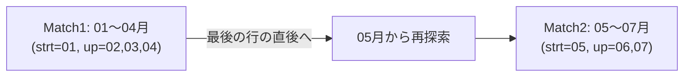
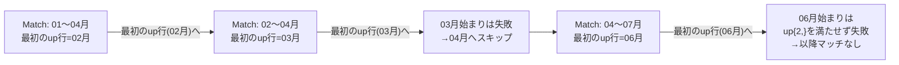

# 【完全版】問題16-12：ログイン試行のセッション化（ギャップ検出）
### 難易度：★★★★☆ (Lv.4)
## 問題
セキュリティ部門から、「ユーザーごとのログイン履歴を分析し、**"連続したログイン行動"のまとまり（セッション）** を特定したい」との依頼がありました。ここでいう「連続」とは、時間的に近接している（前回のログインから30分以内）ログインは同じ一連の行動とみなし、30分以上間隔が空いた場合は「別のセッション」として区切る、という定義です。

以下の`LOGIN_LOGS`（ログイン履歴）を`WITH`句で定義し、`MATCH_RECOGNIZE`句を使用して、ユーザーごとにセッションを特定してください。出力には、ユーザーID・セッション番号・セッション開始時刻・セッション終了時刻・セッション内のログイン回数・セッションの継続時間（分）を含めてください。
なお、結果は`USER_ID`の昇順、次いで`SESSION_START`の昇順でソートしてください。

```sql
WITH login_logs AS (
    SELECT 501 AS user_id, TO_DATE('2026-02-10 09:00:00','YYYY-MM-DD HH24:MI:SS') AS log_time FROM dual UNION ALL
    SELECT 501, TO_DATE('2026-02-10 09:10:00','YYYY-MM-DD HH24:MI:SS') FROM dual UNION ALL
    SELECT 501, TO_DATE('2026-02-10 09:25:00','YYYY-MM-DD HH24:MI:SS') FROM dual UNION ALL
    SELECT 501, TO_DATE('2026-02-10 10:10:00','YYYY-MM-DD HH24:MI:SS') FROM dual UNION ALL
    SELECT 501, TO_DATE('2026-02-10 10:15:00','YYYY-MM-DD HH24:MI:SS') FROM dual UNION ALL
    SELECT 502, TO_DATE('2026-02-10 14:00:00','YYYY-MM-DD HH24:MI:SS') FROM dual UNION ALL
    SELECT 502, TO_DATE('2026-02-10 14:45:00','YYYY-MM-DD HH24:MI:SS') FROM dual UNION ALL
    SELECT 503, TO_DATE('2026-02-10 08:00:00','YYYY-MM-DD HH24:MI:SS') FROM dual UNION ALL
    SELECT 503, TO_DATE('2026-02-10 08:29:00','YYYY-MM-DD HH24:MI:SS') FROM dual UNION ALL
    SELECT 503, TO_DATE('2026-02-10 09:00:00','YYYY-MM-DD HH24:MI:SS') FROM dual
)
-- ここに MATCH_RECOGNIZE を使ったSELECT文を記述してください
```

## 期待する結果
| USER_ID | SESSION_NO | SESSION_START        | SESSION_END          | LOGIN_COUNT | DURATION_MIN | 
| ------- | ---------- | -------------------- | -------------------- | ----------- | ------------ | 
| 501     | 1          | 2026-02-10T09:00:00Z | 2026-02-10T09:25:00Z | 3           | 25           | 
| 501     | 2          | 2026-02-10T10:10:00Z | 2026-02-10T10:15:00Z | 2           | 5            | 
| 502     | 1          | 2026-02-10T14:00:00Z | 2026-02-10T14:00:00Z | 1           | 0            | 
| 502     | 2          | 2026-02-10T14:45:00Z | 2026-02-10T14:45:00Z | 1           | 0            | 
| 503     | 1          | 2026-02-10T08:00:00Z | 2026-02-10T08:29:00Z | 2           | 29           | 
| 503     | 2          | 2026-02-10T09:00:00Z | 2026-02-10T09:00:00Z | 1           | 0            | 

## 解答例、解説
[](https://zenn.dev/kinopp/books/0b24d659785f31)

----
<br><br>

# 問題16-13：AFTER MATCH SKIP TO の挙動比較 ― PAST LAST ROW / NEXT ROW / FIRST
### 難易度：★★★☆☆ (Lv.3)
## 問題
以下の`MONTHLY_KPI`（月次の指標データ）を`WITH`句で定義し、`MATCH_RECOGNIZE`句を使用して、「起点（`strt`）の後、横ばい（`flat`）が0回以上続き、その後に上昇（`up`）が2回以上連続する」というパターン（`PATTERN (strt flat* up{2,})`）を検出してください。

このパターンに対して、`AFTER MATCH SKIP TO`の指定を以下の3パターンに変えて、それぞれ実行してください。
1. **指定なし**（デフォルトの`SKIP PAST LAST ROW`）
2. **`SKIP TO NEXT ROW`**
3. **`SKIP TO FIRST up`**

出力には、パターンの開始月（`START_MONTH`）・終了月（`END_MONTH`）・そのマッチに含まれる上昇（`up`）行の数（`UP_COUNT`）を含め、それぞれ`START_MONTH`の昇順でソートしてください。

**【学習のポイント】**
3つのクエリを実行した結果の**件数や範囲がどう変わるか**を比較し、「次の探索をどこから再開するか」という指定１つで、検出されるマッチがどう変わるのかを体感してください。

```sql
WITH monthly_kpi AS (
    SELECT '2026-01' AS month, 100 AS revenue FROM dual UNION ALL
    SELECT '2026-02', 110 FROM dual UNION ALL
    SELECT '2026-03', 120 FROM dual UNION ALL
    SELECT '2026-04', 130 FROM dual UNION ALL
    SELECT '2026-05', 130 FROM dual UNION ALL -- 前月と同額（横ばい）
    SELECT '2026-06', 140 FROM dual UNION ALL
    SELECT '2026-07', 150 FROM dual UNION ALL
    SELECT '2026-08', 140 FROM dual UNION ALL
    SELECT '2026-09', 145 FROM dual
)
-- ここに MATCH_RECOGNIZE を使ったSELECT文を、SKIP TOの指定を変えて3通り記述してください
```

## 期待する結果

### ① 指定なし（デフォルト：SKIP PAST LAST ROW）
| START_MONTH | END_MONTH | UP_COUNT |
| ----------- | --------- | -------- |
| 2026-01 | 2026-04 | 3 |
| 2026-05 | 2026-07 | 2 |

### ② SKIP TO NEXT ROW
| START_MONTH | END_MONTH | UP_COUNT |
| ----------- | --------- | -------- |
| 2026-01 | 2026-04 | 3 |
| 2026-02 | 2026-04 | 2 |
| 2026-04 | 2026-07 | 2 |
| 2026-05 | 2026-07 | 2 |

### ③ SKIP TO FIRST up
| START_MONTH | END_MONTH | UP_COUNT |
| ----------- | --------- | -------- |
| 2026-01 | 2026-04 | 3 |
| 2026-02 | 2026-04 | 2 |
| 2026-04 | 2026-07 | 2 |

## 解答例
```sql:① 指定なし（デフォルト：SKIP PAST LAST ROW）
WITH monthly_kpi AS (
    SELECT '2026-01' AS month, 100 AS revenue FROM dual UNION ALL
    SELECT '2026-02', 110 FROM dual UNION ALL
    SELECT '2026-03', 120 FROM dual UNION ALL
    SELECT '2026-04', 130 FROM dual UNION ALL
    SELECT '2026-05', 130 FROM dual UNION ALL
    SELECT '2026-06', 140 FROM dual UNION ALL
    SELECT '2026-07', 150 FROM dual UNION ALL
    SELECT '2026-08', 140 FROM dual UNION ALL
    SELECT '2026-09', 145 FROM dual
)
SELECT * FROM monthly_kpi
MATCH_RECOGNIZE (
    ORDER BY month
    MEASURES
        FIRST(month)     AS start_month,
        LAST(month)      AS end_month,
        COUNT(up.month)  AS up_count
    ONE ROW PER MATCH
    -- AFTER MATCH SKIP TO は指定しない（デフォルト = PAST LAST ROW）
    PATTERN ( strt flat* up{2,} )
    DEFINE
        flat AS revenue = PREV(revenue),
        up   AS revenue > PREV(revenue)
)
ORDER BY start_month
```
```sql:② SKIP TO NEXT ROW
WITH monthly_kpi AS (
    SELECT '2026-01' AS month, 100 AS revenue FROM dual UNION ALL
    SELECT '2026-02', 110 FROM dual UNION ALL
    SELECT '2026-03', 120 FROM dual UNION ALL
    SELECT '2026-04', 130 FROM dual UNION ALL
    SELECT '2026-05', 130 FROM dual UNION ALL
    SELECT '2026-06', 140 FROM dual UNION ALL
    SELECT '2026-07', 150 FROM dual UNION ALL
    SELECT '2026-08', 140 FROM dual UNION ALL
    SELECT '2026-09', 145 FROM dual
)
SELECT * FROM monthly_kpi
MATCH_RECOGNIZE (
    ORDER BY month
    MEASURES
        FIRST(month)     AS start_month,
        LAST(month)      AS end_month,
        COUNT(up.month)  AS up_count
    ONE ROW PER MATCH
    AFTER MATCH SKIP TO NEXT ROW
    PATTERN ( strt flat* up{2,} )
    DEFINE
        flat AS revenue = PREV(revenue),
        up   AS revenue > PREV(revenue)
)
ORDER BY start_month
```
```sql:③ SKIP TO FIRST up
WITH monthly_kpi AS (
    SELECT '2026-01' AS month, 100 AS revenue FROM dual UNION ALL
    SELECT '2026-02', 110 FROM dual UNION ALL
    SELECT '2026-03', 120 FROM dual UNION ALL
    SELECT '2026-04', 130 FROM dual UNION ALL
    SELECT '2026-05', 130 FROM dual UNION ALL
    SELECT '2026-06', 140 FROM dual UNION ALL
    SELECT '2026-07', 150 FROM dual UNION ALL
    SELECT '2026-08', 140 FROM dual UNION ALL
    SELECT '2026-09', 145 FROM dual
)
SELECT * FROM monthly_kpi
MATCH_RECOGNIZE (
    ORDER BY month
    MEASURES
        FIRST(month)     AS start_month,
        LAST(month)      AS end_month,
        COUNT(up.month)  AS up_count
    ONE ROW PER MATCH
    AFTER MATCH SKIP TO FIRST up
    PATTERN ( strt flat* up{2,} )
    DEFINE
        flat AS revenue = PREV(revenue),
        up   AS revenue > PREV(revenue)
)
ORDER BY start_month
```

## 解説
16-5のメッセージボックスで表にまとめただけだった`AFTER MATCH SKIP TO`の各オプションを、今回は実際にデータへ当てはめて、**「結果が何行になるか」「範囲がどう重なるか」** を目で確認していきます。同じ`PATTERN`・同じ`DEFINE`のまま、`SKIP TO`の指定だけを変えるとどうなるかに注目してください。

### データとパターンの確認
今回使うデータをグラフ化すると、以下のような形になっています。


`PATTERN (strt flat* up{2,})`は、「起点（`strt`：誰でもOK）→ 横ばいが0回以上（`flat*`）→ 上昇が2回以上連続（`up{2,}`）」という形です。この中で、**05月の「横ばい（FLAT）」がどのマッチに取り込まれるか、あるいは取り込まれないか**が、`SKIP TO`の指定によって変わる、という点が本問のキモです。

### ①デフォルト（PAST LAST ROW）：重複なしのシンプルな結果

デフォルトの`PAST LAST ROW`は、1つのマッチが見つかったら「そのマッチの最後の行の直後」から次を探すため、マッチ同士が絶対に重複しません。01月を起点にすると02〜04月の3連騰を拾って1つ目のマッチが確定し、続きは05月から再開されます。05月は（この時点では）新たな起点として扱われ、06〜07月の2連騰を拾って2つ目のマッチになります。結果は過不足なく**2件**、これが最も直感的な「イベントの分割」です。

### ②SKIP TO NEXT ROW：起点を1行ずつずらす「総当たり」

`SKIP TO NEXT ROW`は、「見つかったマッチの**最初の行の次の行**」から必ず再探索します。そのため、01月始まりのマッチが見つかった後も、02月始まり・（03月始まりは失敗するので自動的に）04月始まり・05月始まりと、**起点になり得る行をほぼ総当たりで試す**ことになります。特に注目したいのが3件目の「04〜07月」です。ここでは起点04月の直後にある05月の`FLAT`（横ばい）が`flat*`によって取り込まれ、06〜07月の2連騰につながっています。デフォルトの探索では見えなかった「04月を起点とした場合の姿」が、ここで初めて表に出てきます。結果は最も多い**4件**で、重複を許すぶん「その地点を起点にしたら、どこまでのトレンドが成立するか」を漏れなく確認したい場合に向いた設定です。

### ③SKIP TO FIRST up：デフォルトとNEXT ROWの"中間"

`SKIP TO FIRST up`は、「マッチの中で**変数`up`が最初に一致した行**」から次を探します。1件目（01〜04月）では`up`の最初の行は02月なので、これは`SKIP TO NEXT ROW`（起点の次の行＝02月）と偶然同じ位置になり、同じ結果（02〜04月）が得られます。ところが3件目の「04〜07月」（`strt`=04月, `flat`=05月, `up`=06月,07月）では、`up`が最初に一致するのは**06月**です。`SKIP TO NEXT ROW`なら「起点の次の行」である05月まで戻って再探索しますが、`SKIP TO FIRST up`は`flat`で消費された05月を飛び越えて06月から再開します。その結果、05月を起点とする「05〜07月」のマッチはここでは検出されず、結果は**3件**という、デフォルト（2件）とNEXT ROW（4件）の中間の件数に落ち着きます。

| SKIP TOの指定 | 再開位置の考え方 | 今回の結果件数 | 重複の度合い |
| :--- | :--- | :---: | :--- |
| `PAST LAST ROW`（デフォルト） | マッチの最後の行の直後 | 2件 | なし |
| `SKIP TO FIRST up` | マッチ内で`up`が最初に現れた行 | 3件 | 変数の登場位置に依存 |
| `SKIP TO NEXT ROW` | マッチの最初の行の次の行（固定） | 4件 | 最大限（起点をほぼ総当たり） |

:::message
### FIRST/LAST variable が NEXT ROW と同じ結果になることもある
今回の①〜③件目のマッチ（01〜04月、02〜04月）では、`SKIP TO FIRST up`と`SKIP TO NEXT ROW`が**たまたま同じ結果**になっています。これは、`flat*`が0回しかマッチしなかった（横ばいが挟まらなかった）ケースでは、「`up`が最初に現れる行」と「起点の次の行」が同じ位置を指すためです。両者が明確に違う結果を生むのは、今回の04〜07月のマッチのように、**`strt`と目的の変数（`up`）の間に、別の変数（`flat`）が挟まっている場合**に限られます。

このことから分かるのは、`SKIP TO FIRST/LAST variable`は「その変数が実際にどこにマッチしたか」というデータの実態に依存して再開位置が変わる、**動的な**スキップだということです。一方`SKIP TO NEXT ROW`は、マッチの中身がどうであれ機械的に「2行目」から再開する、**固定的な**スキップです。この違いを理解しておくと、「なぜこのマッチが検出されて、あのマッチは検出されなかったのか」を正しく説明できるようになります。
:::

### 実務でどう使い分けるか
| 目的 | 適した`SKIP TO`指定 |
| :--- | :--- |
| 「1つのトレンド＝1つのイベント」として重複なく集計したい（例：売上好調期間のレポート） | `PAST LAST ROW`（デフォルト） |
| ある地点を起点にした場合、どこまでパターンが継続するかを漏れなく確認したい（デバッグ・検証目的） | `SKIP TO NEXT ROW` |
| パターンの「本質的な部分（今回なら上昇そのもの）」を基準に、前後の付随的な状態（横ばいなど）をまたいで次を探したい | `SKIP TO FIRST/LAST variable` |

`MATCH_RECOGNIZE`は`PATTERN`と`DEFINE`にばかり目が行きがちですが、`AFTER MATCH SKIP TO`は「同じデータ・同じパターン定義でも、結果の件数や範囲を大きく左右する」という点で、実は非常に重要な設定です。特に業務要件が「重複を許さない集計」なのか「起点ごとの網羅的な検証」なのかによって、選ぶべき`SKIP TO`は変わります。クエリを書く前に、「1つのマッチが見つかったら、次はどこから探すべきか」を要件として明確にしておくことが、この構文を正しく使いこなす近道です。

---
<br><br>

# 【完全版】問題16-14：アラート発報の抑制（同一障害の再通知防止）
### 難易度：★★★★☆ (Lv.4)
## 問題
インフラ運用チームから、「CPU使用率の監視アラートが、しきい値超過中に何度も重複して発報されてしまい、運用担当者が疲弊している」との相談がありました。求められているのは、以下のようなロジックです。

* CPU使用率が**80%以上**の状態（`OVER`）が1回以上続いたら、それを1つの「障害イベント」とみなす。
* CPU使用率が80%未満（`NORMAL`）に**回復するまでの間は、たとえ何回計測しても再アラートを出さない**（＝1つの障害イベントにつき、通知は1回でよい）。
* CPU使用率が一度80%未満に回復した後、再び80%以上になった場合は、それは**新しい別の障害イベント**として扱う。

以下の`SERVER_METRICS`（5分間隔のCPU使用率ログ）を`WITH`句で定義し、`MATCH_RECOGNIZE`句を使用して、上記ロジックによる障害イベントを検出してください。出力には、サーバーID・アラート開始時刻・アラート終了時刻（しきい値超過の最後の計測時刻）・回復時刻（80%未満に戻った最初の計測時刻）・超過中の計測回数・超過継続時間（分）を含めてください。
なお、結果は`SERVER_ID`の昇順、次いで`ALERT_START`の昇順でソートしてください。

```sql
WITH server_metrics AS (
    SELECT 'WEB01' AS server_id, TO_DATE('2026-03-01 08:00:00','YYYY-MM-DD HH24:MI:SS') AS log_time, 60 AS cpu_usage FROM dual UNION ALL
    SELECT 'WEB01', TO_DATE('2026-03-01 08:05:00','YYYY-MM-DD HH24:MI:SS'), 65 FROM dual UNION ALL
    SELECT 'WEB01', TO_DATE('2026-03-01 08:10:00','YYYY-MM-DD HH24:MI:SS'), 85 FROM dual UNION ALL
    SELECT 'WEB01', TO_DATE('2026-03-01 08:15:00','YYYY-MM-DD HH24:MI:SS'), 90 FROM dual UNION ALL
    SELECT 'WEB01', TO_DATE('2026-03-01 08:20:00','YYYY-MM-DD HH24:MI:SS'), 88 FROM dual UNION ALL
    SELECT 'WEB01', TO_DATE('2026-03-01 08:25:00','YYYY-MM-DD HH24:MI:SS'), 75 FROM dual UNION ALL
    SELECT 'WEB01', TO_DATE('2026-03-01 08:30:00','YYYY-MM-DD HH24:MI:SS'), 70 FROM dual UNION ALL
    SELECT 'WEB01', TO_DATE('2026-03-01 08:35:00','YYYY-MM-DD HH24:MI:SS'), 95 FROM dual UNION ALL
    SELECT 'WEB01', TO_DATE('2026-03-01 08:40:00','YYYY-MM-DD HH24:MI:SS'), 92 FROM dual UNION ALL
    SELECT 'WEB01', TO_DATE('2026-03-01 08:45:00','YYYY-MM-DD HH24:MI:SS'), 60 FROM dual UNION ALL
    SELECT 'WEB01', TO_DATE('2026-03-01 08:50:00','YYYY-MM-DD HH24:MI:SS'), 96 FROM dual UNION ALL
    SELECT 'WEB01', TO_DATE('2026-03-01 08:55:00','YYYY-MM-DD HH24:MI:SS'), 98 FROM dual UNION ALL
    SELECT 'DB02',  TO_DATE('2026-03-01 09:00:00','YYYY-MM-DD HH24:MI:SS'), 50 FROM dual UNION ALL
    SELECT 'DB02',  TO_DATE('2026-03-01 09:05:00','YYYY-MM-DD HH24:MI:SS'), 82 FROM dual UNION ALL
    SELECT 'DB02',  TO_DATE('2026-03-01 09:10:00','YYYY-MM-DD HH24:MI:SS'), 84 FROM dual UNION ALL
    SELECT 'DB02',  TO_DATE('2026-03-01 09:15:00','YYYY-MM-DD HH24:MI:SS'), 80 FROM dual UNION ALL
    SELECT 'DB02',  TO_DATE('2026-03-01 09:20:00','YYYY-MM-DD HH24:MI:SS'), 79 FROM dual UNION ALL
    SELECT 'DB02',  TO_DATE('2026-03-01 09:25:00','YYYY-MM-DD HH24:MI:SS'), 81 FROM dual UNION ALL
    SELECT 'DB02',  TO_DATE('2026-03-01 09:30:00','YYYY-MM-DD HH24:MI:SS'), 60 FROM dual
)
-- ここに MATCH_RECOGNIZE を使ったSELECT文を記述してください
```

## 期待する結果
| SERVER_ID | ALERT_START          | ALERT_END            | RECOVERED_AT         | OVER_COUNT | DURATION_MIN | 
| --------- | -------------------- | -------------------- | -------------------- | ---------- | ------------ | 
| DB02      | 2026-03-01T09:05:00Z | 2026-03-01T09:15:00Z | 2026-03-01T09:20:00Z | 3          | 10           | 
| DB02      | 2026-03-01T09:25:00Z | 2026-03-01T09:25:00Z | 2026-03-01T09:30:00Z | 1          | 0            | 
| WEB01     | 2026-03-01T08:10:00Z | 2026-03-01T08:20:00Z | 2026-03-01T08:25:00Z | 3          | 10           | 
| WEB01     | 2026-03-01T08:35:00Z | 2026-03-01T08:40:00Z | 2026-03-01T08:45:00Z | 2          | 5            | 

※WEB01の08:50・08:55の超過（CPU 96%・98%）は、その後に80%未満へ回復した記録が存在しない（ログがそこで途切れている）ため、「障害イベントとして完結していない」とみなされ、結果には含まれません。

## 解答例、解説
[](https://zenn.dev/kinopp/books/0b24d659785f31)

----
<br><br>

# 【完全版】問題16-15：雇用期間の重複・隣接期間のマージ
### 難易度：★★★★☆ (Lv.4)
## 問題
人事部門から、「同一従業員が複数回にわたって雇用契約を結んでいる場合、契約期間が**隣接（切れ目なく連続）**または**重複（同時に2つ以上の役職を兼務）** しているものを1つの雇用期間としてまとめたレポートが欲しい」との依頼がありました。

以下の`EMP_HIRE_PERIODS`（雇用期間データ）を`WITH`句で定義してください。データには以下のルールがあります。
* `START_DATE`は契約開始日（**その日を含む**）、`END_DATE`は契約終了日（**その日を含まない**）を表す、いわゆる「半開区間」です。
* `END_DATE`が`NULL`の場合、その役職は**現在も継続中**であることを意味します（＝終了日が「無限の未来」）。
* 同一従業員が同時に複数の役職を兼務することもあるため、期間は重複することがあります。

`MATCH_RECOGNIZE`句を使用し、従業員（`EMP_ID`）ごとに、隣接または重複する期間をすべて1つの行にマージしてください。出力には、従業員ID・氏名・マージ後の開始日・マージ後の終了日（現在も継続中なら`NULL`）・マージされた契約件数（`JOBS`）を含めてください。
なお、これ以上マージできない期間（他のどの期間とも隣接・重複しない期間）は、それぞれ単独の1行として出力してください。結果は`EMP_ID`の昇順、次いで`START_DATE`の昇順（`NULL`は最後）でソートしてください。

```sql
WITH emp_hire_periods AS (
    SELECT 100 AS emp_id, '谷口 博'   AS name, DATE '2010-07-01' AS start_date, DATE '2012-04-01' AS end_date, '製品ディレクター' AS title FROM dual UNION ALL
    SELECT 100, '谷口 博',   DATE '2012-04-01', NULL,              '代表取締役'       FROM dual UNION ALL
    SELECT 101, '持田 元気', DATE '2010-07-01', DATE '2014-01-01', 'ITテクニシャン'   FROM dual UNION ALL
    SELECT 101, '持田 元気', DATE '2014-01-01', DATE '2016-06-01', 'システム管理者'   FROM dual UNION ALL
    SELECT 101, '持田 元気', DATE '2014-04-01', DATE '2015-10-01', 'コードテスター'   FROM dual UNION ALL
    SELECT 101, '持田 元気', DATE '2016-06-01', NULL,              'ITマネージャー'   FROM dual UNION ALL
    SELECT 102, '出目 篤',   DATE '2010-07-01', DATE '2013-07-01', '営業マネージャー' FROM dual UNION ALL
    SELECT 102, '出目 篤',   DATE '2012-04-01', NULL,              '製品ディレクター' FROM dual UNION ALL
    SELECT 103, '東尾 ゾエ', DATE '2014-02-01', NULL,              'ITデベロッパー'   FROM dual UNION ALL
    SELECT 103, '東尾 ゾエ', DATE '2019-02-01', NULL,              'スクラムマスター' FROM dual UNION ALL
    SELECT 104, '林 トクロー', DATE '2014-10-01', DATE '2016-02-01', 'フォークリフト作業員' FROM dual UNION ALL
    SELECT 104, '林 トクロー', DATE '2017-03-01', NULL,              '倉庫マネージャー'     FROM dual UNION ALL
    SELECT 105, '上住 うるす', DATE '2014-10-01', DATE '2015-05-01', '配送マネージャー'     FROM dual UNION ALL
    SELECT 105, '上住 うるす', DATE '2016-05-01', DATE '2017-03-01', '倉庫マネージャー'     FROM dual UNION ALL
    SELECT 105, '上住 うるす', DATE '2016-11-01', NULL,              'オペレーションチーフ' FROM dual
)
-- ここに MATCH_RECOGNIZE を使ったSELECT文を記述してください
```

## 期待する結果
| EMP_ID | NAME        | START_DATE           | END_DATE             | JOBS | 
| ------ | ----------- | -------------------- | -------------------- | ---- | 
| 100    | 谷口 博     | 2010-07-01T00:00:00Z |                      | 2    | 
| 101    | 持田 元気   | 2010-07-01T00:00:00Z |                      | 4    | 
| 102    | 出目 篤     | 2010-07-01T00:00:00Z |                      | 2    | 
| 103    | 東尾 ゾエ   | 2014-02-01T00:00:00Z |                      | 2    | 
| 104    | 林 トクロー | 2014-10-01T00:00:00Z | 2016-02-01T00:00:00Z | 1    | 
| 104    | 林 トクロー | 2017-03-01T00:00:00Z |                      | 1    | 
| 105    | 上住 うるす | 2014-10-01T00:00:00Z | 2015-05-01T00:00:00Z | 1    | 
| 105    | 上住 うるす | 2016-05-01T00:00:00Z |                      | 2    | 

## 解答例、解説
[](https://zenn.dev/kinopp/books/0b24d659785f31)

----
<br><br>

# 【完全版】問題16-16：SUBSET句による変数のグルーピング ― 「変動期間」の検出
### 難易度：★★★☆☆ (Lv.3)
## 問題
以下の`MONTHLY_KPI`（月次の指標データ）を`WITH`句で定義してください。このデータに対し、`MATCH_RECOGNIZE`句を使用して、**前月比で「上昇」か「下降」のどちらか（＝横ばいではない変化）があった月が3ヶ月以上連続した期間**を検出してください。上昇と下降が混在していても構いません（例：上昇→下降→上昇、のような連続でも対象とする）。

出力には、期間の開始月・終了月・その期間内で変化があった月の合計数（`TOTAL_CHANGES`）・そのうち上昇だった月数（`UP_COUNT`）・下降だった月数（`DOWN_COUNT`）を含めてください。
なお、結果は`START_MONTH`の昇順でソートしてください。

```sql
WITH monthly_kpi AS (
    SELECT '2026-01' AS month, 100 AS revenue FROM dual UNION ALL
    SELECT '2026-02', 110 FROM dual UNION ALL
    SELECT '2026-03', 105 FROM dual UNION ALL
    SELECT '2026-04', 120 FROM dual UNION ALL
    SELECT '2026-05', 120 FROM dual UNION ALL -- 前月と同額（横ばい）
    SELECT '2026-06', 90  FROM dual UNION ALL
    SELECT '2026-07', 95  FROM dual UNION ALL
    SELECT '2026-08', 100 FROM dual UNION ALL
    SELECT '2026-09', 100 FROM dual UNION ALL -- 前月と同額（横ばい）
    SELECT '2026-10', 80  FROM dual UNION ALL
    SELECT '2026-11', 85  FROM dual
)
-- ここに MATCH_RECOGNIZE を使ったSELECT文を記述してください
```

## 期待する結果
| START_MONTH | END_MONTH | TOTAL_CHANGES | UP_COUNT | DOWN_COUNT |
| ----------- | --------- | -------------- | -------- | ---------- |
| 2026-01 | 2026-04 | 3 | 2 | 1 |
| 2026-05 | 2026-08 | 3 | 2 | 1 |

## 解答例、解説
[](https://zenn.dev/kinopp/books/0b24d659785f31)
