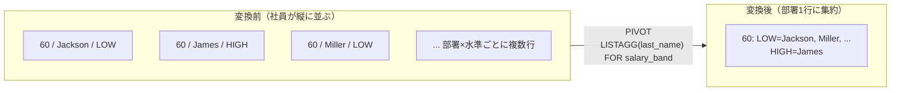
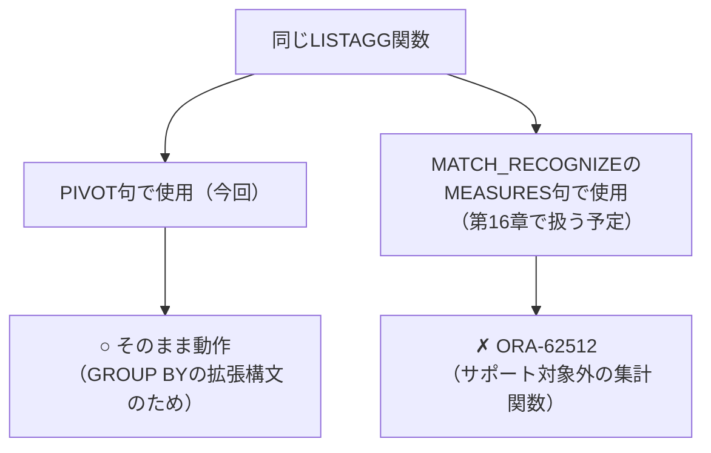

# 【完全版】問題13-12：PIVOT × ROLLUPで作る「年度別小計」レポート（13-9で触れたROLLUPを実践）
### 難易度：★★★★☆ (Lv.4)

## 問題
経営企画部門から、「四半期別の店舗売上レポート（問題13-7の応用形）を年単位でも見たいが、**各年の右端に年間小計（TOTAL列）を追加してほしい**。ついでに、表の一番下に**全期間を通じた総合計行**も置いてほしい」との依頼がありました。

COスキーマの`ORDERS`テーブルと`ORDER_ITEMS`テーブルを使用し、注文年（`YR`）を縦軸、四半期（Q1〜Q4）を横軸としたクロス集計レポートを作成してください。

**【条件およびルール】**
* **売上計算**：1注文あたりの金額は、`ORDER_ITEMS`テーブルの **`UNIT_PRICE` × `QUANTITY`** の合計とします。
* **階層構造の活用**：`ROLLUP`句を使用して、各年の四半期小計（`TOTAL`列）と、全期間の総合計行を算出してください。**`CUBE`は使用しないでください。**
* **NULLのラベル化**：集計によって生じる`NULL`部分は、`GROUPING`関数と`CASE`式を用いて`'TOTAL'`という文字列に置換してください。
* **横軸の展開**：`PIVOT`句を使用し、四半期（`'1'`〜`'4'`）および新しく作成した`'TOTAL'`を列として展開してください。
* **ソート順**：結果は`YR`の昇順で並べてください。ただし、総合計行（`YR`が`'TOTAL'`の行）は必ず最終行（最下部）に表示されるようにソート順を制御してください。

## 期待する結果
| YR    | Q1       | Q2       | Q3       | Q4       | TOTAL     |
| ----- | -------- | -------- | -------- | -------- | --------- |
| 2021  | 14661.64 | 57072.77 | 69599.93 | 81103.77 | 222438.11 |
| 2022  | 80674.44 | 5485.98  |          |          | 86160.42  |
| TOTAL |          |          |          |          | 308598.53 |

## 解答例、解説
[](https://zenn.dev/kinopp/books/0b24d659785f31)

----
<br><br>


# 【完全版】問題13-13：UNPIVOT→PIVOTの二段構え（レポートの軸入れ替え）
### 難易度：★★★★☆ (Lv.4)

## 問題
経営企画部門から、「以前作成してもらった店舗別の四半期レポート（問題13-7に近い形式）はとても分かりやすかったが、**別の会議では『店舗を横に並べて、四半期ごとの比較をしたい』という逆向きの要望が出ている**。同じデータのまま、縦軸と横軸を入れ替えたバージョンも用意してほしい」との依頼がありました。

今回は状況を簡略化するため、以下のような**すでに店舗別・四半期別に集計済みの売上レポート**（3店舗分）を`WITH`句で用意します。これは「店舗（`STORE_ID`）が縦軸、四半期（`Q1`〜`Q4`）が横軸」という形になっています。

このレポートを、**「四半期（`QTR`）が縦軸、店舗（`STORE_1`〜`STORE_3`）が横軸」という軸を入れ替えた形**に変換してください。

**【条件およびルール】**
* **変換の方針**：一度`UNPIVOT`で縦持ち（ロング型）に戻したうえで、`PIVOT`を使って店舗IDを新たな横軸として展開し直してください（`UNPIVOT`と`PIVOT`を1つのクエリの中でチェーンさせる形になります）。
* **NULLの扱い**：元データに存在する`NULL`（売上実績なし）についても、軸の入れ替え後にその四半期・店舗の組み合わせが消えてしまわないよう配慮してください。
* **列名の指定**：横軸となる店舗の列名は`STORE_1`、`STORE_2`、`STORE_3`としてください。
* **表示順**：結果は`QTR`（'Q1'〜'Q4'）の昇順で並べてください。

**【使用データ（WITH句）】**
```sql
WITH quarterly_report AS (
    SELECT 1 AS store_id, 14410.46 AS q1, 54740.13 AS q2, 57874.40 AS q3, 52082.17 AS q4 FROM dual
    UNION ALL
    SELECT 2, NULL,       911.25,   1326.69,  1893.02  FROM dual
    UNION ALL
    SELECT 3, 251.18,     136.83,   2551.34,  779.71   FROM dual
)
```

## 期待する結果
| QTR | STORE_1  | STORE_2 | STORE_3 | 
| --- | -------- | ------- | ------- | 
| Q1  | 14410.46 |         | 251.18  | 
| Q2  | 54740.13 | 911.25  | 136.83  | 
| Q3  | 57874.4  | 1326.69 | 2551.34 | 
| Q4  | 52082.17 | 1893.02 | 779.71  | 

## 解答例、解説
[](https://zenn.dev/kinopp/books/0b24d659785f31)

----
<br><br>


# 問題13-14：LISTAGGを使ったテキスト版クロス集計
### 難易度：★★★☆☆ (Lv.3)

## 問題
人事部門から、「部署ごとに、給与水準が高い社員（`HIGH`）と、そうでない社員（`LOW`）が、それぞれ誰なのか一覧で見たい」という依頼がありました。

HRスキーマの`EMPLOYEES`テーブルを使用し、`DEPARTMENT_ID`が`60`（IT）、`90`（Executive）、`100`（Finance）の社員を対象に、部署ごとの「給与水準別・社員名一覧」のクロス集計レポートを作成してください。

**【条件およびルール】**
* **給与水準の定義**：`SALARY`が8000以上を`'HIGH'`、8000未満を`'LOW'`としてください。
* **横軸の展開**：給与水準（`LOW`, `HIGH`）を列として展開してください。
* **セルの中身**：各セルには、該当する社員の**姓（`LAST_NAME`）をカンマ区切りで連結した文字列**を表示してください。
* **並び順**：各セル内の氏名は、姓のアルファベット順で連結してください。
* **表示順**：結果は`DEPARTMENT_ID`の昇順で並べてください。

## 期待する結果
| DEPARTMENT_ID | LOW                               | HIGH                    |
| ------------- | --------------------------------- | ----------------------- |
| 60            | Jackson, Miller, Nguyen, Williams | James                   |
| 90            |                                    | Garcia, King, Yang      |
| 100           | Popp, Sciarra, Urman              | Chen, Faviet, Gruenberg |

## 解答例
```sql
SELECT
    department_id,
    low,
    high
FROM
    (
        SELECT
            department_id,
            last_name,
            -- 給与を'LOW'/'HIGH'の2水準に分類
            CASE WHEN salary >= 8000 THEN 'HIGH' ELSE 'LOW' END AS salary_band
        FROM
            hr.employees
        WHERE
            department_id IN ( 60, 90, 100 )
    )
    PIVOT (
        -- 集計関数にLISTAGGを指定し、姓をアルファベット順に連結
        LISTAGG(last_name, ', ') WITHIN GROUP ( ORDER BY last_name )
        FOR salary_band
        IN ( 'LOW' AS low, 'HIGH' AS high )
    )
ORDER BY
    department_id
```

## 解説
これまでの13章で扱ってきた`PIVOT`の集計関数は、`SUM`・`COUNT`といった**数値を1つの値に集約する**ものばかりでした。しかし`PIVOT`句が受け付ける集計関数は、実は数値集計に限りません。今回は **文字列を連結する`LISTAGG`** を`PIVOT`に組み込み、「数値ではなく、名前そのものを横並びにする」というテキスト版のクロス集計に挑戦します。



クエリの骨格自体は、これまでの`PIVOT`と全く同じです。
```sql
PIVOT (
    LISTAGG(last_name, ', ') WITHIN GROUP ( ORDER BY last_name )
    FOR salary_band
    IN ( 'LOW' AS low, 'HIGH' AS high )
)
```
`PIVOT`の括弧の中に置く集計関数を、いつもの`SUM(...)`や`COUNT(*)`から`LISTAGG(...)`に差し替えているだけです。`LISTAGG`は複数行の文字列を1つに連結する関数のため、`WITHIN GROUP (ORDER BY last_name)`を必ずセットで書き、「連結する際の並び順」を明示的に指定しています。これを省略すると、実行のたびにセル内の並び順が保証されなくなり、レポートとしての再現性が失われてしまいます。

さて、この`LISTAGG`という関数について、少し先取りして触れておきたいことがあります。実は本書ではこの後、**第16章**で`MATCH_RECOGNIZE`という行パターンマッチングの構文を扱いますが、その中の`MEASURES`句という部分で、今回と似たような「複数行の値を1つの文字列にまとめたい」という場面に遭遇します。ところが`MEASURES`句では`LISTAGG`をそのまま指定すると`ORA-62512`というエラーが発生してしまい、素直には使えません（詳しくは第16章16-10〜16-15で扱います）。`MEASURES`句がサポートする集計関数は`COUNT`・`SUM`・`AVG`・`MIN`・`MAX`に限定されており、`LISTAGG`はその対象に含まれていないためです。

一方、今回の`PIVOT`では、同じ`LISTAGG`をごく普通に集計関数として指定するだけで、何の工夫もなく動作しています。同じ関数なのに、なぜこのような違いが生まれるのでしょうか。

| 句 | LISTAGGの扱い | 理由 |
| :--- | :--- | :--- |
| `PIVOT`（今回） | そのまま集計関数として使用可能 | `PIVOT`は内部的に通常の`GROUP BY`と同じ仕組みで動いており、`GROUP BY`はもともと`LISTAGG`を含む任意の集計関数を許容する |
| `MATCH_RECOGNIZE`の`MEASURES`（第16章で扱う予定） | `ORA-62512`で使用不可（`COUNT`/`SUM`/`AVG`/`MIN`/`MAX`のみサポート） | `MEASURES`はパターン内の行を`FIRST`/`LAST`/`PREV`/`NEXT`などで行き来しながら値を計算する特殊な仕組みで、対応する集計関数があらかじめ限定されている |



`PIVOT`は、構文としては特殊に見えますが、内部的には`GROUP BY`＋`CASE`式（13-2の解説で触れた`SUM(CASE WHEN ...)`の書き方）を自動生成しているに過ぎません。`GROUP BY`は元々、`SUM`や`COUNT`はもちろん、`LISTAGG`のようなユーザー定義集計関数に近いものまで幅広く受け入れる仕組みのため、`PIVOT`もその恩恵をそのまま引き継いでいます。一方、後の章で登場する`MATCH_RECOGNIZE`の`MEASURES`句は、単純な集計ではなく「パターンの中の特定の行（最初の行、直前の行など）を参照しながら計算する」という全く別の実行エンジンの上で動いているため、サポートされる関数があらかじめ絞り込まれています。「同じ関数名だから、どの句でも同じように使えるはず」とは限らない、という一例として、この先の章に読み進める際に思い出していただければと思います。

:::message
「同じ関数名だから同じように使えるはず」という思い込みは、SQLに限らずプログラミング全般でよく起きる落とし穴です。今回のように、**関数そのものではなく「その関数を呼び出している句（コンテキスト）」によって制約が変わる**ケースがあることを覚えておくと、この先の章で初見のエラー（`ORA-62512`など）に遭遇したときも「この句特有の制約かもしれない」と冷静に切り分けができるようになります。
:::

出来上がったレポートを見ると、単なる人数集計（13-4のような`COUNT`ベースのクロス集計）では分からなかった **「具体的に誰が該当するか」** が一目で分かります。人事部門が「IT部門で給与水準が低い社員に、来期の昇給を検討したい」といった具体的なアクションを取る際、名前まで一覧化されたこのレポートは、`COUNT`だけの数値レポートよりもずっと実務上の価値が高くなります。

なお、Executive部門（`90`）の`LOW`列が空欄になっている点にも注目してください。該当する社員が1人もいない場合、`LISTAGG`で連結する対象自体が存在しないため、結果はNULL（空欄）になります。これは13-4で確認した「該当データがない場合はNULLになる」という`PIVOT`の基本的な挙動と同じです。

## 参考リンク
https://docs.oracle.com/en/database/oracle/oracle-database/19/sqlrf/LISTAGG.html

---
<br><br>

# 【完全版】問題13-15：コホート分析による顧客継続率マトリクス
### 難易度：★★★★☆ (Lv.4)
## 問題
ECサイトの顧客継続率（リテンション）を把握するため、「コホート分析」を行います。顧客を **初回購入月（コホート月）** でグループ化し、その後何ヶ月目にどれだけの顧客が購入を継続しているかを、コホート月×経過月数のマトリクス（表）にまとめてください。

**【要件】**
* 各コホート月について、経過月数0〜2ヶ月目（`PERIOD0`〜`PERIOD2`）の継続率（％、小数点以下四捨五入）を列として展開すること
* `PERIOD0`は必ず100%になる（コホート月＝初回購入月のため、その月に購入した顧客の割合は定義上100%）
* まだ到来していない月（今回のデータでは2024年4月以降）に該当する経過月数については、`0%`ではなく **空欄（NULL）** として表示すること（「まだ観測できていない」ことと「継続しなかった（0%）」ことは区別すること）

```sql:検証用データ（WITH句）
WITH orders AS (
    SELECT 'C1' AS customer_id, DATE '2024-01-05' AS order_dt FROM dual UNION ALL
    SELECT 'C1',                 DATE '2024-02-10'             FROM dual UNION ALL
    SELECT 'C1',                 DATE '2024-03-12'             FROM dual UNION ALL
    SELECT 'C2',                 DATE '2024-01-08'             FROM dual UNION ALL
    SELECT 'C2',                 DATE '2024-03-20'             FROM dual UNION ALL
    SELECT 'C3',                 DATE '2024-01-15'             FROM dual UNION ALL
    SELECT 'C4',                 DATE '2024-01-20'             FROM dual UNION ALL
    SELECT 'C4',                 DATE '2024-02-02'             FROM dual UNION ALL
    SELECT 'C5',                 DATE '2024-02-05'             FROM dual UNION ALL
    SELECT 'C5',                 DATE '2024-03-15'             FROM dual UNION ALL
    SELECT 'C6',                 DATE '2024-02-08'             FROM dual UNION ALL
    SELECT 'C7',                 DATE '2024-02-12'             FROM dual UNION ALL
    SELECT 'C7',                 DATE '2024-03-01'             FROM dual UNION ALL
    SELECT 'C8',                 DATE '2024-03-03'             FROM dual UNION ALL
    SELECT 'C9',                 DATE '2024-03-18'             FROM dual
)
-- ここから先を作成してください
```

## 期待する結果
| COHORT_MONTH         | PERIOD0 | PERIOD1 | PERIOD2 | 
| -------------------- | ------- | ------- | ------- | 
| 2024-01-01T00:00:00Z | 100     | 50      | 50      | 
| 2024-02-01T00:00:00Z | 100     | 67      |         | 
| 2024-03-01T00:00:00Z | 100     |         |         | 

## 解答例、解説
[](https://zenn.dev/kinopp/books/0b24d659785f31)
