# 問題8-1：基本的な集計関数
### 難易度：★☆☆☆☆ (Lv.1)
## 問題
HRスキーマの`EMPLOYEES`テーブルより、全従業員の給与（`SALARY`）について以下の統計値を算出してください。

**【算出内容】**
* **SUM**：`SALARY`の合計値
* **MAX**：`SALARY`の最大値
* **MIN**：`SALARY`の最小値
* **AVG**：`SALARY`の平均値
* **CNT**：データの総件数

## 期待する結果
| SUM    | MAX   | MIN  | AVG                 | CNT |
| ------ | ----- | ---- | -------------------- | --- |
| 691416 | 24000 | 2100 | 6461.8317757009300 | 107 |

## 解答例
```sql
SELECT
    SUM(salary) AS "SUM",
    MAX(salary) AS "MAX",
    MIN(salary) AS "MIN",
    AVG(salary) AS "AVG",
    COUNT(*)    AS "CNT"
FROM
    hr.employees
```

## 解説
集計関数（Aggregate Functions）のセクションです。ここからは「1行ずつの加工」ではなく、「テーブル全体やグループごとのまとめ」を扱うようになります。大量のデータから「結局、売上はいくら？」「平均点は？」といったビジネス上の結論を出すための重要なステップです。

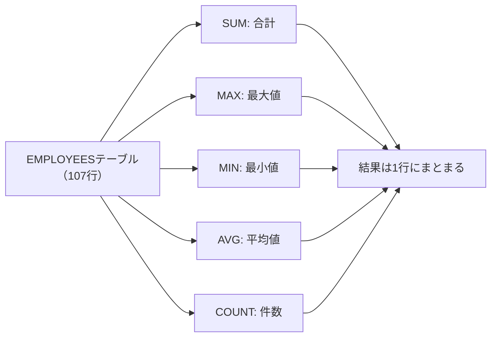

集計関数の特徴は、複数の行を入力として受け取り、1つの結果を返す点にあります。`SUM`は指定した列の数値をすべて足し合わせ、`MAX`は最も大きい値（日付や文字列にも使えます）、`MIN`は最も小さい値、`AVG`は合計を件数で割った平均、`COUNT`は行数を数えます。

実務で集計を行う際、注意が必要なのがNULL（空の値）の扱いです。`SUM`や`AVG`などの関数は、計算対象の中にNULLがあってもそれを「0」とは見なさず、「存在しないもの」として無視します。

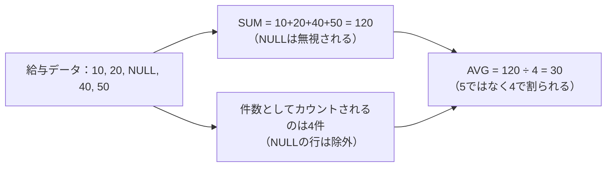

例えば5人の給与が`10, 20, NULL, 40, 50`だった場合、`AVG`は「120 ÷ 4」で算出されます（5人ではなく4人で割られます）。この挙動を知らないと、平均値の計算が意図とズレていることに気づきにくいので注意が必要です。

解答例で`COUNT(*)`が使われている点も見ておきましょう。

| 書き方 | 数える対象 | NULLの扱い |
| :--- | :--- | :--- |
| `COUNT(*)` | 行そのもの | NULLを含む行もカウントする |
| `COUNT(salary)` | salary列の値 | salaryがNULLの行はカウントしない |

`COUNT(*)`はNULLを含むかどうかにかかわらず「行そのもの」が何件あるかを数えるのに対し、`COUNT(salary)`はsalary列がNULLではない行だけを数えます。もし給与が未設定（NULL）の従業員がいた場合、`COUNT(*)`は全従業員数を返しますが、`COUNT(salary)`は少し少ない数字を返すことになります。集計の目的によって、どちらを使うべきかが変わってくる点は覚えておくとよいと思います。

期待する結果の`AVG`は小数点以下が長く表示されています。実務のレポートでは、`ROUND`関数を組み合わせて`ROUND(AVG(salary), 2)`のように四捨五入して見やすく整えるのが一般的です。

## 参考リンク
https://www.shift-the-oracle.com/sql/aggregate-functions/count.html
https://www.shift-the-oracle.com/sql/aggregate-functions/sum.html
https://www.shift-the-oracle.com/sql/aggregate-functions/avg.html
https://www.shift-the-oracle.com/sql/aggregate-functions/max.html
https://www.shift-the-oracle.com/sql/aggregate-functions/min.html

----
<br><br>

# 問題8-2：グループ化
### 難易度：★☆☆☆☆ (Lv.1)
## 問題
COスキーマの`ORDERS`テーブルより、**年月ごとの注文数**を集計して取得してください。
集計にあたっては、以下の条件を適用してください。

**【集計ルール】**
* 注文ステータス（`ORDER_STATUS`）が「CANCELLED」（キャンセル済み）のデータは、**集計対象から除外**すること。
* `ORDER_TMS`を「YYYY-MM」形式（例：2021-02）に加工し、その年月単位でグループ化すること。
* 結果は、年月の昇順で表示すること。

## 期待する結果
| ORDER_TMS | CNT |
| --------- | --- |
| 2021-02   | 17  |
| 2021-03   | 72  |
| 2021-04   | 110 |
| 2021-05   | 110 |
| 2021-06   | 123 |
| 2021-07   | 121 |
| 2021-08   | 141 |
| 2021-09   | 157 |
| 2021-10   | 172 |
| 2021-11   | 151 |
| 2021-12   | 189 |
| 2022-01   | 214 |
| 2022-02   | 154 |
| 2022-03   | 152 |
| 2022-04   | 32  |

## 解答例
```sql
SELECT
    TO_CHAR(order_tms, 'YYYY-MM') AS order_tms,
    COUNT(*)                      AS cnt
FROM
    co.orders
WHERE
    order_status <> 'CANCELLED'
GROUP BY
    TO_CHAR(order_tms, 'YYYY-MM')
ORDER BY
    order_tms
```

## 解説
集計関数の基本（合計や平均）を学んだ次は、SQLの真骨頂とも言える「グループ化（`GROUP BY`）」です。データを特定の切り口（今回は「年月」）でバケツ分けし、それぞれのバケツの中身を数えるという、実務の集計レポート作成で最もよく使うパターンです。

`GROUP BY`句は、指定した列の値が同じ行を1つの塊（グループ）としてまとめます。今回のように日付（TIMESTAMP型）をそのままグループ化すると「秒」まで一致しないとまとまらないため、`TO_CHAR(order_tms, 'YYYY-MM')`で「年月」という文字列に加工してからグループ化しています。

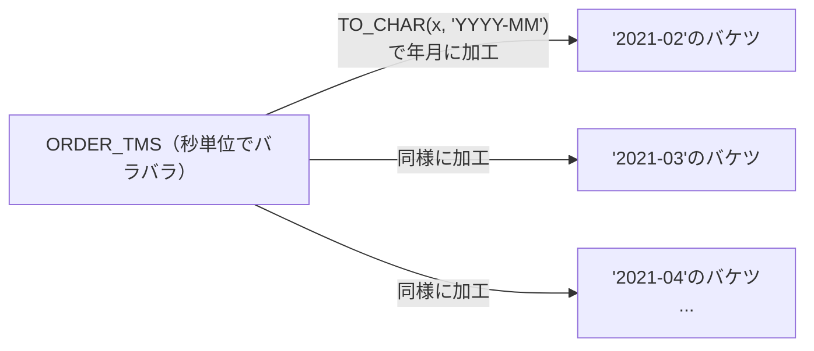

これにより、「2021-02」のバケツ、「2021-03」のバケツ……という具合に、月単位でデータがまとめられます。

初心者が間違いやすいポイントとして、SQLの「実行される順番」があります。

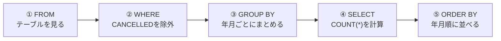

書く順番は`SELECT`から始まりますが、実際にデータベースが処理する順番は、まず`FROM`でテーブルを見て、`WHERE`で集計する前に不要な行（今回は`CANCELLED`）を切り捨て、残った行を`GROUP BY`で年月ごとにまとめ、`SELECT`でグループごとの`COUNT(*)`を計算し、最後に`ORDER BY`で並べ替える、という流れです。今回のように「キャンセルを除いてから数える」場合は、`GROUP BY`よりも前の`WHERE`句でフィルタリングするのが基本になります。

`GROUP BY`を使うときに絶対に守らなければならないルールもあります。それは、SELECT句に書けるのは「GROUP BYに指定した列」か「集計関数（COUNTやSUMなど）」だけである、という点です。例えば`SELECT order_id, COUNT(*)`と書いて`GROUP BY order_tms`とすると、「年月でまとめているのに、どの注文IDを表示すればいいのか」とデータベースが判断できずエラーになります。詳しくは下記のコラムで扱います。

期待する結果を見ると、2021年2月から2022年4月まで、月を追うごとに注文数が変化している様子が分かります。2022年1月の「214件」がピークであることなど、データの傾向がひと目で見て取れるのが、グループ化の面白いところです。

:::message
### ORA-00979: GROUP BYの式ではありません
SQL初心者が必ずといっていいほど遭遇する「ORA-00979」エラーについて説明します。

このエラーは、`GROUP BY`句を使用したSQLにおいて、「集計（グループ化）したい単位」と「SELECTしたい項目」の整合性が取れていないときに発生します。SQLの原則として、`GROUP BY`を使う場合、`SELECT`句に書けるのは「GROUP BY句に指定した列」か「集計関数（SUM, AVG, MAX, MIN, COUNTなど）を通した値」の2種類だけです。これ以外の生の列をSELECTに混ぜようとすると、Oracleは「グループ化した結果、どの行のデータを出せばいいか判断できない」ためエラーを返します。

例えば、部署（DEPT_ID）ごとに給与（SALARY）の合計を出したいが、個人の名前（NAME）も表示したい場合、次のように書くとエラーになります。
```sql
SELECT DEPT_ID, NAME, SUM(SALARY)
FROM EMPLOYEES
GROUP BY DEPT_ID;
```

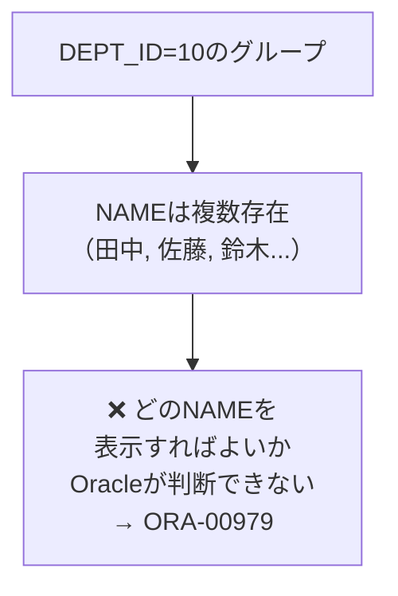

`DEPT_ID`でグループ化すると、1つの部署に複数の`NAME`が存在するため、「1つの部署に対してどの`NAME`を表示すればいいのか」がOracleには判断できません。

修正方法は2つあります。

| 修正方法 | 書き方 | 結果の意味 |
| :--- | :--- | :--- |
| ① NAMEもグループ化基準に含める | `GROUP BY DEPT_ID, NAME` | 部署内の個人ごとに集計する |
| ② 集計関数で囲む | `SELECT DEPT_ID, MAX(NAME), SUM(SALARY)` | 部署の中で誰か1人の名前を代表として出す |

いくつか注意点もあります。SELECT句で計算や加工を行っている場合、その加工後の形、あるいは加工前の列がGROUP BYに不足しているとエラーになります。`SELECT TO_CHAR(HIRE_DATE, 'YYYY') ... GROUP BY TO_CHAR(HIRE_DATE, 'YYYY')`のように記述を合わせる必要があります。一方、SELECT句にリテラル（'2024年度'など）を書く場合は、GROUP BYに含める必要はありません。サブクエリやJOINを伴う複雑なクエリでは、どのテーブルのどの列がGROUP BYに欠けているか見失いやすくなるので、エラーが出たらまず「集計関数で囲まれていない列」をすべてリストアップし、それがGROUP BY句に漏れなく入っているかを確認するとよいと思います。
:::

## 参考リンク
https://www.shift-the-oracle.com/sql/group-by-having.html

----
<br><br>

# 問題8-3：集計後の条件（HAVING句）
### 難易度：★★☆☆☆ (Lv.2)
## 問題
COスキーマの`ORDERS`テーブルより、年月ごとの注文数を集計し、その中から**月間注文数が150件以上**の年月のみを取得してください。
集計にあたっては、以下の条件を適用してください。

**【集計ルール】**
* 注文ステータス（`ORDER_STATUS`）が「CANCELLED」（キャンセル済み）のデータは、**集計対象から除外**すること。
* `ORDER_TMS`を「YYYY-MM」形式に加工し、その年月単位でグループ化すること。
* 集計した結果（注文数）が150以上のデータのみを表示すること。
* 結果は、年月の昇順で表示すること。

## 期待する結果
| ORDER_TMS | CNT |
| --------- | --- |
| 2021-09   | 157 |
| 2021-10   | 172 |
| 2021-11   | 151 |
| 2021-12   | 189 |
| 2022-01   | 214 |
| 2022-02   | 154 |
| 2022-03   | 152 |

## 解答例
```sql
SELECT
    to_char(order_tms, 'YYYY-MM') AS order_tms,
    COUNT(*)                      AS cnt
FROM
    co.orders
WHERE
    order_status <> 'CANCELLED'
GROUP BY
    to_char(order_tms, 'YYYY-MM')
HAVING
    COUNT(*) >= 150
ORDER BY
    order_tms
```

## 解説
今回は「集計結果に対する絞り込み（`HAVING`句）」です。実務では「全データ」ではなく、「売上が目標を超えた店舗だけ」や「注文が集中している時間帯だけ」を抜き出したいことが多々あります。`WHERE`句と`HAVING`句の使い分けができるかどうかが、ここでのポイントです。

| 句 | 絞り込むタイミング | 対象 | 今回の例 |
| :--- | :--- | :--- | :--- |
| `WHERE` | 集計を行う前 | 1行ずつのデータ | キャンセルされたか |
| `HAVING` | 集計を行った後 | まとまったグループの計算結果 | 合計は150以上か |

どちらも「絞り込み」を行いますが、実行されるタイミングが違います。今回の問題に当てはめると、まず`WHERE`でキャンセルされた注文を除外し、残った注文を年月でまとめて`COUNT(*)`を計算し、その計算結果を見て150に届かなかった月を`HAVING`で非表示にする、という流れになります。

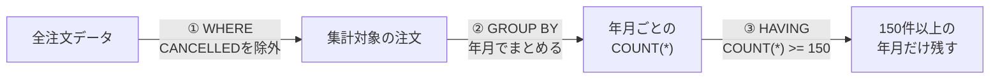

SQLが書かれた順番（`SELECT → FROM...`）と、データベースの中で実際に動く順番は異なります。`FROM`→`WHERE`→`GROUP BY`→`HAVING`→`SELECT`→`ORDER BY`という順番を知っていると、エラーに悩まされる場面が減ります。解答例で`HAVING cnt >= 150`と書かずに、わざわざ`HAVING COUNT(*) >= 150`と書いているのはこのためです。`SELECT`句よりも先に`HAVING`句が実行されるため、データベースが`HAVING`を処理している時点では、まだ`cnt`という別名は決まっていません。

期待する結果を見ると、前問（8-2）では15件あった結果が、150件以上の月だけに絞られて7件になっています。「1日に10回以上ログインエラーを出しているユーザーを特定する」「在庫数の合計が一定以下になった商品カテゴリを抽出する」「期間中に3回以上来店したリピーターを集計する」など、意味のあるデータだけを削り出すのが`HAVING`の役割です。

:::message
### SQLの評価順序
SQLクエリを作成する際、私たちは`SELECT`から書き始めますが、データベースの内部（実行エンジン）では、実は全く異なる順番で処理されています。この評価順序を理解しておくと、「なぜSELECT句で定義した別名がORDER BYでは使えるのに、HAVINGやGROUP BYでは使えないのか」といった疑問がスッキリ解決します。

| 順番 | 処理内容 |
| :---: | :--- |
| 1 | `FROM`（どのテーブルからデータを持ってくるか、JOINもここ） |
| 2 | `WHERE`（行を絞り込む） |
| 3 | `GROUP BY`（データをグループ化する） |
| 4 | `HAVING`（グループ化した後の集計結果でさらに絞り込む） |
| 5 | `SELECT`（どの列を表示するか選ぶ、ここで別名が定義される） |
| 6 | `DISTINCT`（重複を除去する） |
| 7 | `ORDER BY`（最後にデータを並べ替える） |
| 8 | `LIMIT`/`FETCH`（最終的な表示件数を制限する） |

解答例には、`SELECT`句で定義した「order_tms」と「cnt」という2つの別名が登場しますが、`ORDER BY`では別名を使っているのに`HAVING`では使っていません。

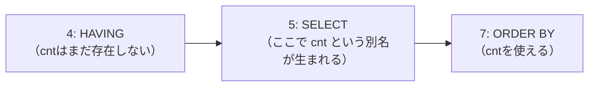

理由は評価順序にあります。`HAVING`（4番目）は`SELECT`（5番目）よりも前に処理されるため、`HAVING`が動いている時点ではまだ`SELECT`で名付けた「cnt」という名前はデータベースの中に存在せず、使うことができません。一方`ORDER BY`（7番目）は`SELECT`（5番目）よりも後に処理されるため、`SELECT`で定義した「order_tms」という名前をデータベースがすでに認識しており、そのまま利用できます。
:::

----
<br><br>

# 問題8-4：特定の条件での集計（CASE式を用いたグループ化）
### 難易度：★★★☆☆ (Lv.3)
## 問題
OEスキーマの`ORDERS`テーブルについて、注文状態（`ORDER_STATUS`）を以下のグループに分類し、グループごとの「件数」および「注文合計額（ORDER_TOTAL）の合計」を算出してください。

**【グループ分けの定義】**
| 値 | 意味 (英語) | 説明 (日本語) | グループ |
| :--- | :--- | :--- | :--- |
| **0** | **Pending** | 保留中（入力が完了していない状態） | **待ち** |
| **1** | **Order entered** | 受付済み（注文が正常に登録された） | **正常** |
| **2** | **Order canceled** | キャンセル済み | **中止** |
| **3** | **Shipped - cash** | 出荷済み（現金払い） | **正常** |
| **4** | **Shipped - credit** | 出荷済み（クレジット払い） | **正常** |
| **5** | **Backordered** | 入荷待ち（在庫不足による出荷待ち） | **待ち** |
| **6** | **Order canceled - incorrect** | キャンセル済み（誤入力・不備など） | **中止** |
| **7** | **Order shipped - partially** | 一部出荷済み | **待ち** |
| **8** | **Order shipped - full** | すべて出荷済み | **正常** |
| **9** | **Order replaced** | 交換済み | **その他** |
| **10** | **Order closed** | 完了（すべての処理が終了） | **正常** |

## 期待する結果
| GROUP  | CNT | SUM       |
| ------ | --- | --------- |
| 待ち   | 29  | 578572.5  |
| 正常   | 50  | 2350361.9 |
| 中止   | 16  | 476383.7  |
| その他 | 10  | 262736.6  |

## 解答例
```sql:例1：GROUP BYにCASE文を使用
SELECT
    CASE
        WHEN order_status IN ( 0, 5, 7 ) THEN
            '待ち'
        WHEN order_status IN ( 1, 3, 4, 8, 10 ) THEN
            '正常'
        WHEN order_status IN ( 2, 6 ) THEN
            '中止'
        ELSE
            'その他'
    END              AS "GROUP",
    COUNT(*)         AS "CNT",
    SUM(order_total) AS "SUM"
FROM
    oe.orders
GROUP BY
    CASE
        WHEN order_status IN ( 0, 5, 7 ) THEN
            '待ち'
        WHEN order_status IN ( 1, 3, 4, 8, 10 ) THEN
            '正常'
        WHEN order_status IN ( 2, 6 ) THEN
            '中止'
        ELSE
            'その他'
    END
```
```sql:例2：GROUP BYに別名を使用（23c以降）
SELECT
    CASE
        WHEN order_status IN ( 0, 5, 7 ) THEN
            '待ち'
        WHEN order_status IN ( 1, 3, 4, 8, 10 ) THEN
            '正常'
        WHEN order_status IN ( 2, 6 ) THEN
            '中止'
        ELSE
            'その他'
    END              AS "GROUP",
    COUNT(*)         AS "CNT",
    SUM(order_total) AS "SUM"
FROM
    oe.orders
GROUP BY
    "GROUP"
```
```sql:例3：サブクエリーを使用
SELECT
    "GROUP",
    COUNT(*)         AS "CNT",
    SUM(order_total) AS "SUM"
FROM
    (
        SELECT
            order_total,
            CASE
                WHEN order_status IN ( 0, 5, 7 ) THEN
                    '待ち'
                WHEN order_status IN ( 1, 3, 4, 8, 10 ) THEN
                    '正常'
                WHEN order_status IN ( 2, 6 ) THEN
                    '中止'
                ELSE
                    'その他'
            END AS "GROUP"
        FROM
            oe.orders
    )
GROUP BY
    "GROUP"
```

## 解説
これまではテーブルにある既存の列でグループ分けしてきましたが、今回は「バラバラなステータスコードを、自分で定義した意味のあるグループにまとめ直して集計する」という実戦的な問題です。ビジネスレポートでは「細かい区分はいらないから正常か異常かでまとめて」と言われることが多いため、このスキルは実務でよく使う場面があります。

通常、`GROUP BY`にはカラム名を指定しますが、実は「計算式」を指定することもできます。

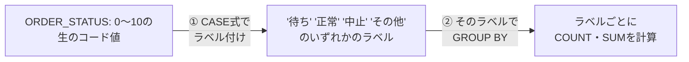

まず各行に対して`CASE`式を実行し、「待ち」「正常」といったラベルを一時的に貼り付け、その貼り付けたラベル（グループ）ごとに`COUNT`や`SUM`を計算する、という2段階の処理です。

解答例には3つのパターンがあり、それぞれ実務での使い分けが変わってきます。

| 方式 | 書き方の特徴 | メリット・デメリット |
| :--- | :--- | :--- |
| 例1：GROUP BYにCASEを直書き | `SELECT`と`GROUP BY`に同じCASE式を2回書く | 修正時に2箇所直す必要がありミスが起きやすい |
| 例2：SELECTの別名をGROUP BYで使い回す | Oracle 23c以降で利用可能 | すっきり書けるが古いバージョンでは動かない |
| 例3：サブクエリで先にラベル付け | 内側でグループ分け、外側で集計 | ロジックが一箇所にまとまりバージョンを問わず動く |

例1はGROUP BYに直接CASEを書く伝統的な方法で、`SELECT`句と`GROUP BY`句に全く同じ`CASE`式を2回書く必要があります。修正が必要になったとき2箇所直さなければならず、ミスが起きやすいのが欠点です。

例2はOracle Database 23cから導入された、SELECT句で付けた別名（今回は`"GROUP"`）をそのままGROUP BYで使い回せる書き方です。かなりすっきり書けますが、古いバージョンのシステムでは動かない点に注意してください。

例3はサブクエリを使う方法で、内側の`SELECT`（サブクエリ）で先にグループ分けを済ませ、外側で集計します。ロジックが一箇所にまとまっているためメンテナンスがしやすく、バージョンを問わず動くという意味でも、私は普段この書き方を選ぶことが多いです。

期待する結果の「正常」グループを見ると、件数は50件、合計金額は約235万となっています。ステータスが`1, 3, 4, 8, 10`とバラバラでも、これらを一つの「正常」というバケツにまとめることで、「ビジネスが今どれくらい健全に動いているか」を大まかに把握できるようになります。

## 参考リンク
https://www.youtube.com/watch?v=SsJluwMpM2o&list=PLb1qVSx1k1VovCRavgMQSS_cvwJoNpAGc&index=6

----
<br><br>

# 問題8-5：１つの文字列への集計
### 難易度：★★☆☆☆ (Lv.2)
## 問題
HRスキーマの`COUNTRIES`テーブルより、地域（`REGION_ID`）ごとにグループ化し、各地域に属する国コード（`COUNTRY_ID`）を1つにまとめたリスト（`COUNTRY_LIST`）を作成してください。

**【出力ルール】**
* 同一の`REGION_ID`に含まれる`COUNTRY_ID`を、カンマ区切り（", "）で列挙すること。
* リスト内の国コードは、**アルファベット順**に並べること。
* 結果は`REGION_ID`ごとに1行で表示すること。

## 期待する結果
| REGION_ID | COUNTRY_LIST                    |
| --------- | -------------------------------- |
| 10        | BE, CH, DE, DK, FR, GB, IT, NL   |
| 20        | AR, BR, CA, MX, US                |
| 30        | CN, IL, IN, JP, KW, ML, SG        |
| 40        | AU                                 |
| 50        | EG, NG, ZM, ZW                    |

## 解答例
```sql
SELECT
    region_id,
    LISTAGG(country_id, ', ') WITHIN GROUP(
    ORDER BY
        country_id
    ) AS country_list
FROM
    hr.countries
GROUP BY
    region_id
```

## 解説
集計といえば「数値」の合計や平均をイメージしがちですが、今回は「文字列」を1つにまとめる`LISTAGG`（リストアグリゲート）関数の解説です。レポートの備考欄に「対象の商品IDをすべて並べて表示したい」といった要望は実務でよくあるので、覚えておくと役立つ場面が多い関数です。
```sql
LISTAGG( [対象カラム], '[区切り文字]' ) 
WITHIN GROUP ( ORDER BY [並び順のカラム] )
```
通常の`SUM`が数値を足し算するように、`LISTAGG`は文字列を連結します。

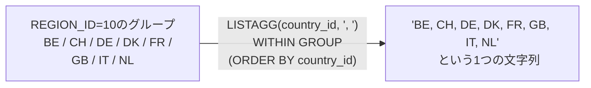

ここでユニークなのが`WITHIN GROUP (ORDER BY ...)`の存在で、リスト化する際に「どんな順番で並べるか」を必ず指定する必要があります。今回の問題では`ORDER BY country_id`としているため、`BE, CH, DE...`のようにアルファベット順に並んでいます。

`LISTAGG`は、データの「1対多」を「1対1」に見せたいときに便利です。例えば「1つの部署」に「複数の従業員」がいる場合、そのまま結合して出力すると部署名の行が重複してしまいますが、`LISTAGG`を使えば「営業部：田中, 佐藤, 鈴木」のように1行のコンパクトなサマリーにまとめられます。区切り文字も自由に変更でき、今回のようなカンマ＋スペースのほか、改行コードやスラッシュなど用途に合わせて選べます。

一点注意しておきたいのが、`LISTAGG`で連結した結果の文字列が、Oracleの文字列制限（通常4,000バイト、設定により32,767バイト）を超えるとエラーが発生する点です。Oracle 19c以降では、`ON OVERFLOW TRUNCATE`というオプションを付けることで、溢れた分を自動的に`...`に省略してくれる機能もあります。データ件数が多いカラムでこの関数を使う場合は、この制限を頭の片隅に置いておくと安心です。

期待する結果を見ると、`REGION_ID = 10`（ヨーロッパ）に対して、所属する国コードが横並びに整理されています。特に`30`（アジア）のリストなど、複数の国がカンマで繋がることで、その地域の広がりが直感的に分かるようになります。

## 参考リンク
https://www.shift-the-oracle.com/sql/aggregate-functions/listagg.html
https://www.youtube.com/watch?v=QSTvwwq5HBg

----
<br><br>

# 問題8-6：クロス集計（縦持ちから横持ちへの変換）
### 難易度：★★★☆☆ (Lv.3)
## 問題
経営企画部から、「特定の部門における役職ごとの人員配置状況を横並びの表（クロス集計）で報告してほしい」との要望がありました。
HRスキーマの **DEPARTMENTS** テーブルおよび **EMPLOYEES** テーブルを使用し、部門名（`DEPARTMENT_NAME`）ごとに、以下の3つの役職（`JOB_ID`）に該当する従業員の「人数」を集計してください。

**【集計対象の役職と出力列名】**
* **PRES_CNT**: 役職が 'AD_PRES'（社長）の人数
* **VP_CNT**: 役職が 'AD_VP'（副社長）の人数
* **PROG_CNT**: 役職が 'IT_PROG'（プログラマー）の人数
なお、所属従業員が存在する部門（内訳がすべて0名であっても、誰かしらが所属している部門）のみを出力対象とし、結果は部門名（`DEPARTMENT_NAME`）の**昇順**で並べ替えてください。

## 期待する結果
| DEPARTMENT_NAME  | PRES_CNT | VP_CNT | PROG_CNT |
| ---------------- | -------- | ------ | -------- |
| Accounting       | 0        | 0      | 0        |
| Administration   | 0        | 0      | 0        |
| Executive        | 1        | 2      | 0        |
| Finance          | 0        | 0      | 0        |
| Human Resources  | 0        | 0      | 0        |
| IT               | 0        | 0      | 5        |
| Marketing        | 0        | 0      | 0        |
| Public Relations | 0        | 0      | 0        |
| Purchasing       | 0        | 0      | 0        |
| Sales            | 0        | 0      | 0        |
| Shipping         | 0        | 0      | 0        |

## 解答例
```sql
SELECT
    d.department_name,
    SUM(CASE WHEN e.job_id = 'AD_PRES' THEN 1 ELSE 0 END) AS pres_cnt,
    SUM(CASE WHEN e.job_id = 'AD_VP'   THEN 1 ELSE 0 END) AS vp_cnt,
    SUM(CASE WHEN e.job_id = 'IT_PROG' THEN 1 ELSE 0 END) AS prog_cnt
FROM
    hr.departments d
    INNER JOIN hr.employees e ON d.department_id = e.department_id
GROUP BY
    d.department_name
ORDER BY
    d.department_name
```

## 解説
今回は実務のレポート作成でよく使われる「クロス集計（ピボット）」です。データの一般的な持ち方である「縦持ち（1行に1つのデータ）」を、人間が見やすい「横持ち（1列に1つの項目）」に変換するテクニックです。

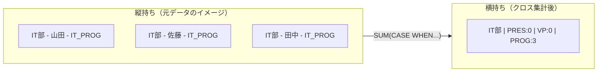

このクエリの核となるのは、「集計関数（`SUM`）」と「条件分岐（`CASE`）」の組み合わせです。まず`CASE`式で、特定の職種（`JOB_ID`）に該当する場合だけ`1`を、それ以外は`0`を返すように定義します。
```sql
CASE WHEN e.job_id = 'AD_PRES' THEN 1 ELSE 0 END
```
そのあと、この`1`を部署（`GROUP BY`）ごとに足し合わせます。該当する人が3人いれば1+1+1=3、該当者がいなければ0です。これにより、「条件に一致する行数」をカウントしつつ、それを横方向の列（`PRES_CNT`など）として出力できます。

問題文に「所属従業員が存在する部門のみを出力対象」という条件があります。`hr.departments`（部署）と`hr.employees`（従業員）を`INNER JOIN`で結合することで、従業員が一人も紐付いていない部署（空き部署）を自動的に除外しています。もし「従業員がいない部署も表示したい」のであれば、`LEFT OUTER JOIN`を使うことになります。

なぜ`COUNT`ではなく`SUM`なのか、疑問に思うかもしれません。

| 書き方 | 仕組み |
| :--- | :--- |
| `SUM(CASE WHEN ... THEN 1 ELSE 0 END)` | 条件に合わなければ0を足すので結果は必ず数値（0以上） |
| `COUNT(CASE WHEN ... THEN 1 ELSE NULL END)` | COUNTはNULLを無視するため同様の結果が得られる |

`SUM`の方が挙動として直感的で、ミスが少ないと言われています。実務のレポートでは「該当なし」をNULL（空欄）ではなく0と表示させたいケースが多いため、`ELSE 0`を指定した`SUM`形式が好まれる傾向があります。

なお、Oracle 11g以降では、この処理をより直感的に書くための`PIVOT`演算子も用意されています。詳細は後の章で解説します。

----
<br><br>

# 【完全版】問題8-7：複数軸の小計・総計とラベル付与（ROLLUP / GROUPING）
### 難易度：★★★★☆ (Lv.4)
## 問題
人事部より、グローバルな平均給与レポートの作成依頼がありました。「国（COUNTRY_ID）ごと」および「都市（CITY）ごと」の平均給与を算出する必要があります。
ただし、単にデータを並べるだけでなく、「国ごとの小計」と「会社全体の総合計」を1つの結果セットに含め、かつ集計行には「US 合計」「会社 総合計」といった適切なラベルを付与して、そのまま会議資料として使える形式で出力してください。
HRスキーマの `EMPLOYEES`, `DEPARTMENTS`, `LOCATIONS` テーブルを使用し、国（`COUNTRY_ID`）、都市（`CITY`）ごとの「平均給与（SALARY）」を算出し、以下の条件に従って出力してください。

1. **階層集計**: 都市ごとのデータ、国ごとの小計、全体の総計を一度に取得すること。
2. **ラベル制御**:
   * 都市の小計行（都市名が本来NULLになる行）には、`[国名] 合計`（例：`US 合計`）と表示すること。
   * 全体の総計行（国名も都市名もNULLになる行）には、`会社 総合計` と表示すること。
3. **表示形式**: 平均給与は小数点以下を四捨五入して整数で表示すること。
4. **ソート**: 国（`COUNTRY_ID`）の昇順を基本とし、各グループ内で「明細行 → 小計行」の順に並ぶようにすること。

## 期待する結果
| COUNTRY_ID  | CITY                | AVG_SALARY |
| ----------- | -------------------- | ---------- |
| CA          | Toronto               | 9500       |
| CA          | CA 合計                | 9500       |
| DE          | Munich                 | 10000      |
| DE          | DE 合計                | 10000      |
| GB          | London                 | 6500       |
| GB          | Oxford                 | 8956       |
| GB          | GB 合計                | 8886       |
| US          | Seattle                | 8845       |
| US          | South San Francisco    | 3476       |
| US          | Southlake              | 5760       |
| US          | US 合計                | 5065       |
| 会社 総合計 | 会社 総合計            | 6457       |

## 解答例、解説
[](https://zenn.dev/kinopp/books/0b24d659785f31)

----
<br><br>

# 【完全版】問題8-8：集計グループ内での最初・最後の値の抽出（KEEP (FIRST / LAST)）
### 難易度：★★★★☆ (Lv.4)
## 問題
人事部より、各部門（`DEPARTMENT_ID`）における給与バランスの調査依頼がありました。
具体的には、各部門の中で **「最も古くに入社した人（最古の採用日）」** の給与と、**「最も新しく入社した人（最新の採用日）」** の給与を一覧化して比較したいという要望です。
通常、部門ごとの「最大給与」や「最小給与」を出すのは簡単ですが、今回は「給与」そのものの最大最小ではなく、**「採用日」を基準に並べた際の端点にいる人の給与** を取得する必要があります。
HRスキーマの `EMPLOYEES` テーブルを使用し、部門（`DEPARTMENT_ID`）ごとにグループ化し、以下の値を算出してください。

**【取得項目】**
1. **DEPT_ID**: 部門ID（`DEPARTMENT_ID`）
2. **OLDEST_EMP_SAL**: その部門で **「最も採用日（HIRE_DATE）が古い従業員」** の給与（`SALARY`）
3. **NEWEST_EMP_SAL**: その部門で **「最も採用日（HIRE_DATE）が新しい従業員」** の給与（`SALARY`）

**【条件】**
* 同一採用日の従業員が複数存在する場合は、その中で最も高い給与（`MAX`）を採用してください。
* `DEPARTMENT_ID` が NULL のレコードは除外してください。
* 結果は `DEPARTMENT_ID` の昇順で並べてください。

## 期待する結果
| DEPT_ID | OLDEST_EMP_SAL | NEWEST_EMP_SAL |
| ------- | --------------- | --------------- |
| 10      | 4400             | 4400             |
| 20      | 13000            | 6000             |
| 30      | 11000            | 2500             |
| 40      | 6500             | 6500             |
| 50      | 7900             | 2200             |
| 60      | 4800             | 6000             |
| 70      | 10000            | 10000            |
| 80      | 10000            | 6200             |
| 90      | 17000            | 17000            |
| 100     | 9000             | 6900             |
| 110     | 12008            | 12008            |

## 解答例、解説
[](https://zenn.dev/kinopp/books/0b24d659785f31)

----
<br><br>

# 問題8-9：データ分析における代表値（MEDIAN / STATS_MODE）
### 難易度：★★★☆☆ (Lv.3)
## 問題
マーケティング部門から、顧客の購買力を分析するために「年収レベル（`INCOME_LEVEL`）ごとの、信用限度額（`CREDIT_LIMIT`）の傾向値」を出してほしいと依頼がありました。
通常、全体傾向を見るには「平均値（`AVG`）」が使われます。しかし、平均値は一部の「極端に高い信用限度額を持つ顧客（外れ値）」に引っ張られてしまい、一般的な顧客の実績値から乖離してしまう特性があります。
より客観的な実態を把握するために、平均値に加えて **「中央値（メディアン）」** と **「最頻値（モード）」** も算出し、データの分布特性を比較・分析することになりました。
OEスキーマの `CUSTOMERS` テーブルを使用し、顧客の収入レベル（`INCOME_LEVEL`）ごとにグループ化し、信用限度額（`CREDIT_LIMIT`）について以下の3つの統計値を算出してください。

**【取得項目】**
1. **INCOME_LEVEL**: 収入レベル
2. **AVG_CREDIT**: 信用限度額の「平均値」（小数点以下は四捨五入）
3. **MEDIAN_CREDIT**: 信用限度額の「中央値」
4. **MODE_CREDIT**: 信用限度額の「最頻値（最も頻繁に現れる値）」

**【条件】**
* 結果は平均値（`AVG_CREDIT`）の昇順でソートしてください。

## 期待する結果
| INCOME_LEVEL          | AVG_CREDIT | MEDIAN_CREDIT | MODE_CREDIT |
| ---------------------- | ---------- | -------------- | ----------- |
| C: 50,000 - 69,999     | 1233       | 1200            | 400         |
| H: 150,000 - 169,999   | 1678       | 1200            | 1200        |
| A: Below 30,000        | 1789       | 1200            | 5000        |
| J: 190,000 - 249,999   | 1833       | 1900            | 500         |
| B: 30,000 - 49,999     | 1894       | 1500            | 500         |
| D: 70,000 - 89,999     | 1900       | 1300            | 1200        |
| I: 170,000 - 189,999   | 1981       | 1400            | 1200        |
| K: 250,000 - 299,999   | 1983       | 2350            | 2400        |
| E: 90,000 - 109,999    | 1996       | 1400            | 1200        |
| F: 110,000 - 129,999   | 1996       | 1400            | 2400        |
| G: 130,000 - 149,999   | 2019       | 1400            | 5000        |
| L: 300,000 and above   | 2213       | 1450            | 3700        |

## 解答例
```sql
SELECT
    income_level,
    ROUND(AVG(credit_limit)) AS avg_credit,
    -- 1. 中央値を算出
    MEDIAN(credit_limit)     AS median_credit,
    -- 2. 最頻値を算出
    STATS_MODE(credit_limit) AS mode_credit
FROM
    oe.customers
GROUP BY
    income_level
ORDER BY
    avg_credit
```

## 解説
今回はデータ分析の基本でありながら奥が深い、「代表値（統計値）」の算出です。平均値（AVG）だけでは見えてこないデータの実態を、中央値（MEDIAN）や最頻値（STATS_MODE）と並べて見ることで浮き彫りにする、実践的な問題です。

| 関数 | 意味 | 特徴 |
| :--- | :--- | :--- |
| `AVG` | 平均値 | データの「重心」。一部の極端な値（富裕層など）に引きずられやすい |
| `MEDIAN` | 中央値 | 大きさ順に並べてちょうど真ん中の値。外れ値の影響を受けにくい |
| `STATS_MODE` | 最頻値 | 最も頻繁に出現する値。「ボリュームゾーン」を特定できる |

`ROUND(AVG(credit_limit))`は、すべての合計を件数で割った平均値です。データの「重心」を示しますが、一部の極端な値（富裕層など）に引きずられやすいという弱点があります。`MEDIAN(credit_limit)`は、データを大きさ順に並べたときにちょうど真ん中に位置する値です。外れ値の影響を受けにくく、「一般的な顧客の感覚」に近い数値が出やすいのがメリットです。`STATS_MODE(credit_limit)`は、データの中で最も頻繁に出現する値で、「最も多くの人が設定している限度額はいくらか」というボリュームゾーンを特定するのに役立ちます。

データの分布がきれいな左右対称（正規分布）であれば「平均 ＝ 中央値 ＝ 最頻値」となりますが、現実のデータ（特に所得や金額系）は多くの場合、左右どちらかに歪んだ分布になります。

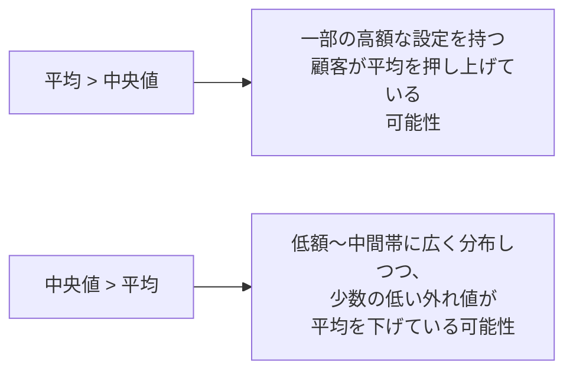

平均と中央値のどちらが大きいかは、分布の歪み方によって変わります。平均が中央値より高ければ、一部の高額な設定を持つ顧客が平均を押し上げている可能性があり、逆に中央値の方が高ければ、低額から中間帯にかけて広く分布しつつ、少数の低い外れ値が平均を下げている、というような読み方ができます。3つの値を横並びで見ることで、平均値だけでは分からない分布の形が見えてくるのが、この分析の面白いところです。

最頻値が複数ある場合（例えば500円と1000円の人が同数で一番多い場合）、Oracleの`STATS_MODE`はそのうちの1つを返します。厳密に全ての最頻値を知りたい場合は別の分析関数（`RANK`等）を組み合わせる必要がありますが、実務の第一歩としてはこの関数で十分な場面が多いです。

期待する結果の1行目（`C: 50,000 - 69,999`）を見ると、平均値1233・中央値1200に対し、最頻値は400とかなり低くなっています。これは、「最も多くの顧客は400という比較的低い額に設定されているものの、それより高い額に設定している顧客も一定数いるため、平均や中央値はもう少し高い水準に落ち着いている」という構造を示しています。一方で、行によっては平均より中央値の方が高いケースも見られ、収入レベルによって分布の形が違うことがうかがえます。1つの統計値だけで判断せず、複数の代表値を並べて初めて見えてくる実態がある、という点がこの問題のポイントです。

----
<br><br>

# 【完全版】問題8-10：多次元の全組み合わせ集計（CUBE）
### 難易度：★★★★☆ (Lv.4)
## 問題
マーケティング部門から、顧客データベースのクロス分析依頼がありました。顧客（`CUSTOMERS`）の「性別（`GENDER`）」と「配偶者の有無（`MARITAL_STATUS`）」を軸に、信用限度額の傾向を調査したいと考えています。
分析レポートには、以下の4パターンの集計結果を「1つの結果セットにすべて詰め込んで」出力する必要があります。
1. **性別 × 配偶者の有無** ごとの集計
2. **性別 のみ**（配偶者の有無は問わない）の集計
3. **配偶者の有無 のみ**（性別は問わない）の集計
4. **会社全体** の総計

通常であれば `UNION ALL` を使って4つのクエリを力技で結合するところですが、コードが肥大化しパフォーマンスも低下します。多次元集計の決定版である `CUBE` 句を用いて、1回のスキャンで解決してください。
OEスキーマの `CUSTOMERS` テーブルを使用し、性別（`GENDER`）と配偶者の有無（`MARITAL_STATUS`）の「すべての組み合わせ」について、顧客数（`CNT`）と平均信用限度額（`AVG_CREDIT`）を算出してください。

**【集計・出力ルール】**
* `CUBE` 句を使用して、全ディメンションの組み合わせを網羅すること。
* `GENDER` や `MARITAL_STATUS` が集計の結果 NULL になっている行（小計・総計行）には、`NVL` 関数等を用いて `'ALL'` という文字列を表示すること。
* 平均信用限度額（`AVG_CREDIT`）は四捨五入して整数で表示すること。
* 表示順は、`GENDER`、`MARITAL_STATUS` の順とすること。

## 期待する結果
| GENDER | MARITAL_STATUS | CNT | AVG_CREDIT |
| ------ | --------------- | --- | ---------- |
| ALL    | ALL              | 319 | 1895        |
| ALL    | married          | 180 | 1883        |
| ALL    | single           | 139 | 1910        |
| F      | ALL              | 110 | 1884        |
| F      | married          | 63  | 1843        |
| F      | single           | 47  | 1938        |
| M      | ALL              | 209 | 1900        |
| M      | married          | 117 | 1904        |
| M      | single           | 92  | 1896        |

## 解答例、解説
[](https://zenn.dev/kinopp/books/0b24d659785f31)
