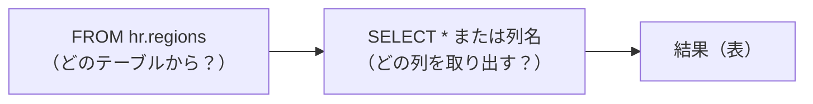
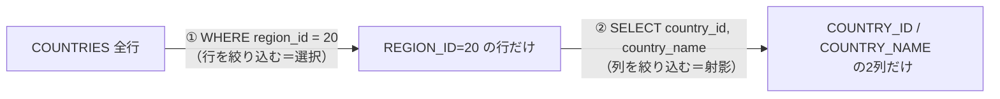
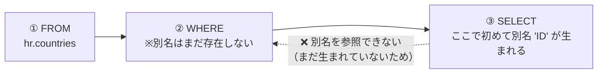
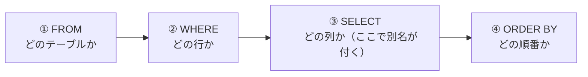
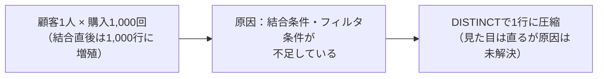

# 問題3-1：全データの取得
### 難易度：★☆☆☆☆ (Lv.1)
## 問題
HRスキーマにある REGIONS テーブルから、すべてのデータを取得してください。
なお、レコードの表示順序は問いません。

## 期待する結果
| REGION_ID | REGION_NAME |
| --------- | ----------- |
| 10        | Europe      |
| 20        | Americas    |
| 30        | Asia        |
| 40        | Oceania     |
| 50        | Africa      |

## 解答例
```sql:例1：「*」を使用
SELECT
    *
FROM
    hr.regions
```
```sql:例2：全てのカラムを指定
SELECT
    region_id,
    region_name
FROM
    hr.regions
```
## 解説
SQLで最初に覚えるのは、この形です。
```sql
SELECT
    [取得したいカラム名]
FROM
    [テーブル名]
```

SELECT句とFROM句が何を指しているか、図にすると次のようになります。



SELECT句は「どの列を取り出すか」、FROM句は「どのテーブルから取り出すか」を指定します。`*`（アスタリスク）を使えばすべての列を一度に取得できますし、`region_id, region_name` のようにカンマ区切りで列挙すれば、必要な列だけに絞ることもできます。

`*` と列挙、それぞれで元のテーブルからどこを取り出すかをイメージすると、次のようになります。

**REGIONS テーブル（元データ）**

| REGION_ID | REGION_NAME |
| --------- | ----------- |
| 10        | Europe      |
| 20        | Americas    |
| 30        | Asia        |
| 40        | Oceania     |
| 50        | Africa      |

`SELECT * FROM hr.regions` → 全列・全行をそのまま取得（上の表と同じ）
`SELECT region_id, region_name FROM hr.regions` → 列を明示的に指定して取得（結果は同じだが、意図が明確）

`hr.regions` の `hr` はスキーマ名（所有者名）です。自分のスキーマにあるテーブルなら、`hr.` を省略して `FROM regions` と書いても構いません。

さて、解答例が2つありますが、実務では基本的に例2（カラム名を指定する書き方）を使います。`*` は動作確認やデバッグのときに便利な反面、テーブルに新しい列が追加されたときにプログラム側の挙動が変わってしまうリスクがあるからです。私も過去に、`SELECT *` で組んだバッチ処理に後から列が追加されて、想定していなかった列まで後続処理に流れてしまい、原因調査に半日費やしたことがあります。「とりあえず動くから」で `*` を使い続けると、こういう形で後から跳ね返ってきます。

| 書き方 | メリット | デメリット |
| :--- | :--- | :--- |
| `SELECT *` | 短く書ける、確認作業が速い | 列追加時に挙動が変わるリスクがある |
| `SELECT col1, col2` | 意図が明確、列追加の影響を受けない | 記述がやや長くなる |

もう一点、Oracle SQLのルールとして、キーワード（`SELECT`, `FROM`）やテーブル名・カラム名は基本的に大文字・小文字を区別しません。正確には、引用符（`" "`）で囲まずに書いた識別子はOracle内部で自動的に大文字に変換される、という挙動によるものです（この話は問題3-3で詳しく扱います）。結果として `select * from regions` と `SELECT * FROM REGIONS` は同じ意味になります。

文末のセミコロン（`;`）は1つの命令の終わりを示す記号です。SQL DeveloperやSQL*Plusなどのツールで複数の命令を続けて実行する際には必須になるので、癖をつけておくと後々困りません。

:::message
### SQLは大文字で書くべきか、小文字で書くべきか
文法上はどちらでも動きますが、私は「キーワードは大文字、テーブル名やカラム名は小文字」で書くスタイルをおすすめしています。`SELECT` や `FROM` が浮き上がって見えるので、どこからどこまでが命令でどこからがデータの名前か、パッと見て判別しやすいためです。本書でもこのスタイルで統一します。

| 書き方の例 | 見やすさ |
| :--- | :--- |
| `SELECT region_id FROM regions` | ◎ キーワードと識別子が一目で区別できる |
| `select region_id from regions` | △ 全部小文字だと命令と名前の境目が曖昧 |
| `SELECT REGION_ID FROM REGIONS` | △ 全部大文字だと逆に読みにくい |

Oracle FreeSQLにはこの書き方を補助する機能があります（環境によっては表示の調整が必要な場合もあります）。


:::

----
<br><br>

# 問題3-2：特定の条件に一致するデータの取得
### 難易度：★☆☆☆☆ (Lv.1)
## 問題
HRスキーマにある **`COUNTRIES`** テーブルから、**`REGION_ID` が 20** であるレコードを抽出し、**`COUNTRY_ID`** と **`COUNTRY_NAME`** の列を表示してください。
なお、レコードの表示順序は問いません。

## 期待する結果
| COUNTRY_ID | COUNTRY_NAME             |
| ---------- | ------------------------ |
| AR         | Argentina                |
| BR         | Brazil                   |
| CA         | Canada                   |
| MX         | Mexico                   |
| US         | United States of America |

## 解答例
```sql
SELECT
    country_id,
    country_name
FROM
    hr.countries
WHERE
    region_id = 20
```

## 解説
前問の「全件取得」から一歩進んで、今回は「必要な列だけを選ぶ（射影）」と「必要な行だけを絞り込む（選択）」を組み合わせています。



行を絞り込むには `WHERE` 句を使います。
```sql
SELECT
    [取得したいカラム名]
FROM
    [テーブル名]
WHERE
    [条件式]
```
`WHERE region_id = 20` と書けば、`region_id` カラムの値が20である行だけが抽出されます。数値を比較する場合はそのまま書けますが、`country_id` のような文字列型のカラムで絞り込む場合は `WHERE country_id = 'US'` のようにシングルクォーテーションで囲む必要があります。ここは最初混乱しやすいポイントなので、迷ったら「文字列はクォートで囲む」とだけ覚えておいてください。

| カラムの型 | 書き方 | 例 |
| :--- | :--- | :--- |
| 数値型 | クォート不要 | `region_id = 20` |
| 文字列型 | シングルクォートで囲む | `country_id = 'US'` |
| 日付型 | 関数等で変換して指定（後の章で扱います） | `hire_date = DATE '2024-01-01'` |

比較演算子は次章で本格的に扱いますが、先に一覧だけ載せておきます。
| 演算子 | 意味 | 例 |
| :--- | :--- | :--- |
| `=` | 等しい | `region_id = 20` |
| `<>` または `!=` | 等しくない | `region_id <> 10` |
| `>` / `<` | より大きい / 未満 | `region_id > 30` |
| `>=` / `<=` | 以上 / 以下 | `region_id <= 20` |

もう一つ、地味に大事なのが「書く順番」と「処理される順番」の違いです。SQLは `SELECT ... FROM ... WHERE ...` の順で書きますが、実際にデータベースが処理する順番は逆で、まず`FROM`でテーブルを見て、次に`WHERE`で行を絞り込み、最後に`SELECT`で列を表示します。

**書く順番と処理される順番の違い**

| 順番 | 書く順番（SQL文） | 処理される順番 |
| :---: | :--- | :--- |
| 1 | `SELECT` | `FROM` |
| 2 | `FROM` | `WHERE` |
| 3 | `WHERE` | `SELECT` |

この順番は今後も何度も出てくるので、頭の片隅に置いておいてください。

:::message
### 暗黙の型変換は「気づかないうちに」性能を悪化させる
`WHERE country_id = 20`（本来は文字列型なのに数値を渡す）のような書き方でも、Oracleは自動的に型を変換してエラーなく動いてしまうことがあります。「動くから大丈夫」と思いがちですが、これが曲者です。


暗黙の型変換が発生すると、そのカラムに設定されているインデックスが正しく使われなくなることがあり、検索速度が大きく落ちることがあります。データ量が多いテーブルだと、体感できるレベルで数百倍〜数千倍遅くなるケースも珍しくありません。しかも型変換自体はエラーにならないため、原因に気づくまで時間がかかります。「型は最初から合わせて書く」を徹底するのが、結局いちばんの近道です。
:::

----
<br><br>

# 問題3-3：列の別名（エイリアス）の設定
### 難易度：★☆☆☆☆ (Lv.1)
## 問題
HRスキーマにある **`COUNTRIES`** テーブルから、**`REGION_ID` が 20** であるレコードを抽出してください。
その際、結果の列名（ヘッダー）を以下のように別名を設定して表示してください。
* `COUNTRY_ID`　→　**`ID`**
* `COUNTRY_NAME`　→　**`NAME`**
なお、レコードの表示順序は問いません。

## 期待する結果
| ID         | NAME                     |
| ---------- | ------------------------ |
| AR         | Argentina                |
| BR         | Brazil                   |
| CA         | Canada                   |
| MX         | Mexico                   |
| US         | United States of America |

## 解答例
```sql
SELECT
    country_id as "ID",
    country_name as "NAME"
FROM
    hr.countries
WHERE
    region_id = 20
```

## 解説
出力結果の見た目を整えるための「別名（エイリアス）」を扱います。
SELECT句で指定したカラム名の後に `AS` を付けると、実行結果のヘッダーを好きな名前に変更できます。
```sql
SELECT
    [元のカラム名] AS "[表示したい別名]"
FROM
    [テーブル名]
```

**別名を付けると、見た目（ヘッダー）だけが変わります**

| 元のカラム名（テーブル上） | → | 別名（結果の見た目） |
| :--- | :---: | :--- |
| `country_id` | → | `ID` |
| `country_name` | → | `NAME` |

`AS` は省略可能ですが、私は書く派です。「これは別名を付けているんだな」と一目でわかるので、後からコードを読む人（未来の自分を含めて）に優しい書き方だと思っています。

ダブルクォーテーション（`" "`）で囲んでいるのにも理由があります。Oracleでは、囲まずに書いた識別子は自動的にすべて大文字に変換されますが、ダブルクォーテーションで囲むと次のことができるようになります。
* 大文字・小文字をそのまま保持できる（`"Id"` と書けば `Id` のまま）
* スペースや記号を含められる（`"Country ID"` のような別名も可能）
* 本来は使えない予約語も別名として使える

便利そうに見えるこの機能ですが、実務での扱いには注意が必要です。詳しくは後述のコラムで説明します。

別名を使う理由は「短くするため」だけではありません。`EMP_LNAME` のようなシステム上のカラム名をレポート用に `"苗字"` と読み替えたり、`salary * 12` のような計算結果に `"Annual Salary"` と名前を付けて意味を明確にしたり、といった使い方もよくします。

ここで一つ、初心者がほぼ確実にハマるポイントを紹介します。**WHERE句の中で、SELECT句で定義した別名を使うことはできません。**
```sql
-- ❌ これはエラーになります
SELECT country_id AS "ID"
FROM hr.countries
WHERE "ID" = 'AR';  -- エラー：そんな列は存在しないと言われる
```

理由は前問で触れた実行順序です。`FROM`→`WHERE`の時点ではまだSELECT句は処理されていないため、別名もまだ存在していません。別名が生まれるのは`SELECT`の段階なので、`WHERE`から見ると`"ID"`という列は最初から存在しないことになります。



この実行順序さえ頭に入っていれば、なぜエラーになるかは自然と理解できるはずです。

:::message
### システム開発で `" "` は使わない方がいい、というのが私の考えです
結論を先に言うと、実務では識別子（テーブル名や列名）を `" "` で囲むのは避けるのが無難です。理由は大きく3つあります。

| 理由 | 内容 |
| :--- | :--- |
| ① 大文字・小文字が固定される | `"UserId"` と定義すると、以後は一字一句完全一致させないとエラーになる |
| ② コード内でのエスケープが地獄になる | Java/Python/PHP等からSQLを組み立てる際、`\"` のエスケープが必要になる |
| ③ 予約語との衝突を許してしまう | `"ORDER"` のように本来使えない予約語も列名にできてしまい、混乱の元になる |

**1. 大文字・小文字が固定される**
囲まずに書けば、`user_id` と `USER_ID` はOracle側で同じものとして扱われます。ところが `"UserId"` のように定義してしまうと、以後は一字一句、大文字小文字まで完全に一致させないとエラーになります。誰か一人がうっかり `"UserId"` で作ってしまうと、他の開発者が `SELECT user_id ...` と書くたびに「そんな列はない」と怒られる羽目になります。私も一度、この理由で丸1日デバッグに費やしたチームを見たことがあります。

**2. プログラムコード内でのエスケープが地獄になる**
JavaやPython、PHPなどからSQLを文字列として組み立てる場合、`" "` が必要な列名があると、コード側でさらにエスケープが必要になります。
```
sql = "SELECT user_id FROM users"                          -- 普通の書き方
sql = "SELECT \"UserId\" FROM \"Users\""                    -- " " が必要な書き方
```
これがすべてのクエリに広がると、コードの視認性はかなり悪くなります。タイプミスも増えますし、レビューする側も読みづらくて仕方ありません。

**3. 予約語との衝突を許してしまう**
本来 `ORDER` や `GROUP` のような予約語は列名に使えません。ところが `"ORDER"` のように囲めば、無理やり作成できてしまいます。一見便利ですが、後から見た人が「このORDERは命令なのか列名なのか」と混乱する原因になります。

まとめると、`" "` を使わない書き方の方が、大文字・小文字を気にせずに書けて、エスケープも不要で、予約語を避ける自然な設計にもつながります。良いことずくめというわけではありませんが、少なくとも「迷ったら使わない」くらいに考えておくのがちょうどいいと思います。

なお、本書の解答例では、ルールをより深く理解してもらうための練習として、あえて `" "` を使っている箇所があります。実際の開発現場での推奨とは異なる書き方も含まれる点は、ご了承のうえ進めてください。
:::

----
<br><br>

# 問題3-4：データの並び替え（ORDER BY）
### 難易度：★☆☆☆☆ (Lv.1)
## 問題
OEスキーマの **`CUSTOMERS`** テーブルを使用します。
**`NLS_TERRITORY`** が **「CHINA」** である顧客を抽出し、以下の順序で並び替えて表示してください。
1. **`CUST_FIRST_NAME`** の **昇順**（小さい順）
2. `CUST_FIRST_NAME` が同じ場合は、**`CUST_LAST_NAME`** の **降順**（大きい順）

## 期待する結果
| CUSTOMER_ID | CUST_FIRST_NAME | CUST_LAST_NAME | 
| ----------- | --------------- | -------------- | 
| 981         | Daniel          | Gueney         | 
| 308         | Glenda          | Dunaway        | 
| 309         | Glenda          | Bates          | 
| 360         | Helmut          | Capshaw        |

## 解答例
```sql:例1：カラムを指定する
SELECT
    customer_id,
    cust_first_name,
    cust_last_name
FROM
    oe.customers
WHERE
    nls_territory = 'CHINA'
ORDER BY
    cust_first_name ASC,
    cust_last_name DESC
```
```sql:例2：列順を指定する
SELECT
    customer_id,
    cust_first_name,
    cust_last_name
FROM
    oe.customers
WHERE
    nls_territory = 'CHINA'
ORDER BY
    2, 3 DESC
```

## 解説
データの並び替え、`ORDER BY` 句です。SQL文の最後に付け加えることで、表示順序を制御できます。
```sql
SELECT
    [カラム名]
FROM
    [テーブル名]
WHERE
    [条件]
ORDER BY
    [カラム1] [ASC | DESC],
    [カラム2] [ASC | DESC]
```
`ASC`（Ascending）は昇順、`DESC`（Descending）は降順です。何も指定しなければ`ASC`がデフォルトになります。複数カラムを指定した場合は「左から順に」優先順位が決まる点も押さえておいてください。

**並び替えのイメージ（第1キー→第2キーの順で効いてくる）**

| 手順 | 内容 | 結果 |
| :--- | :--- | :--- |
| ① `cust_first_name ASC` で並び替え | 名前の昇順に全体を並べる | Daniel → Glenda → Glenda → Helmut |
| ② 同じ名前（Glenda）の中だけ `cust_last_name DESC` で並び替え | Glendaのグループ内だけ並び替える | Dunaway → Bates（D→Bの降順） |

<br>
| CUSTOMER_ID | CUST_FIRST_NAME | CUST_LAST_NAME | 補足 |
| :---: | :--- | :--- | :--- |
| 981 | Daniel | Gueney | 第1キーのみで確定 |
| 308 | **Glenda** | Dunaway | 第2キーで D が先（降順） |
| 309 | **Glenda** | Bates | 第2キーで B が後（降順） |
| 360 | Helmut | Capshaw | 第1キーのみで確定 |

今回の例で言えば、まず`cust_first_name`で全体を並び替え、同じ名前（Glenda)が複数いた場合にだけ、そのグループ内で`cust_last_name`を使ってさらに並び替える、という動きになります。

解答例2の `ORDER BY 2, 3 DESC` は、SELECT句で指定した列の「位置」で並び替え対象を指定する書き方です。`2`は2番目のカラム（`cust_first_name`）、`3`は3番目のカラム（`cust_last_name`）を指します。記述は短くなりますが、後からSELECT句の列順を入れ替えると並び替えの対象までズレてしまうため、私は基本的に例1のようにカラム名を明示する書き方を勧めています。位置指定は、SQL*Plusでさっと確認するときくらいに留めておくのが安全です。

これでSELECT文を構成する主な句が出そろったので、ここまでの実行順序を整理しておきます。



面白いのは、`ORDER BY` は `SELECT` より後に処理されるため、問題3-3で学んだ別名がそのまま使える点です。
```sql
-- これも動きます
SELECT
    cust_first_name AS "FNAME"
FROM
    oe.customers
ORDER BY
    "FNAME" ASC
```

**WHERE句とORDER BY句、別名が使えるかの比較**

| 句 | 処理されるタイミング | 別名を使えるか |
| :--- | :--- | :--- |
| `WHERE` | `SELECT`より前 | ❌ 使えない（問題3-3参照） |
| `ORDER BY` | `SELECT`より後 | ⭕ 使える |

WHERE句では使えなかった別名が、ORDER BY句では使える。この非対称性こそが、実行順序を理解する一番の近道だと思います。

:::message
### ASCはいつ書いて、いつ省略するか
省略できるとはいえ、私は次の基準で書き分けています。

| ケース | 書き方 |
| :--- | :--- |
| すべての条件が昇順 | `ASC`は省略する（デフォルトの挙動なので、書かなくても意図は伝わる） |
| 昇順と降順が混在する | `ASC`もあえて明示する（意図がひと目で伝わり、書き忘れとの区別がつく） |

絶対のルールというわけではありませんが、一つの目安として覚えておいてください。
:::

## 参考リンク
https://www.shift-the-oracle.com/sql/order-by.html

----
<br><br>

# 問題3-5：重複データの除外（DISTINCT）
### 難易度：★☆☆☆☆ (Lv.1)
## 問題
SHスキーマにある **`COUNTRIES`** テーブルから、**`COUNTRY_REGION`** 列のデータを取得してください。
その際、同じデータが複数表示されないよう、**重複を排除**して表示してください。
なお、レコードの表示順序は問いません。

## 期待する結果
| COUNTRY_REGION |
| -------------- |
| Americas       |
| Europe         |
| Asia           |
| Oceania        |
| Africa         |
| Middle East    |

## 解答例
```sql:例1：DISTINCTを使用
SELECT DISTINCT
    country_region
FROM
    sh.countries
```
```sql:例2：GROUP BYを使用（参考）
SELECT
    country_region
FROM
    sh.countries
GROUP BY
    country_region
```

## 解説
最後は「重複の排除」です。`DISTINCT` キーワードを使うと、指定した列の値を見比べて、同じ値をまとめて1件として表示できます。
```sql
SELECT DISTINCT
    [カラム名]
FROM
    [テーブル名]
```

**イメージ：DISTINCTは同じ値をまとめて1件にする**

| DISTINCT適用前（元データの一部） | → | DISTINCT適用後 |
| :--- | :---: | :--- |
| Europe | | Europe |
| Americas | | Americas |
| Europe | → | Asia |
| Asia | | Oceania |
| Europe | | Africa |
| Americas | | Middle East |
| ...（全国数十行） | | （地域の種類だけ） |

`SELECT DISTINCT col1, col2` のように複数のカラムを指定した場合は、「col1とcol2の組み合わせ」が重複している行だけがまとめられます。片方の値が同じでも、もう片方が違えば別の行として残ります。

解答例2にある `GROUP BY` でも同じ結果になります。「重複をなくす」という結果だけを見れば両者は同じですが、使い分けの基準は明確です。

| 使い分け | DISTINCT | GROUP BY |
| :--- | :--- | :--- |
| 目的 | 単に重複を削るフィルタ | 集計関数（SUM/AVG等）とセットで使う |
| 向いている場面 | 値の種類をさっと確認したいとき | データをグループとして集計したいとき |
| 今回の例（地域一覧を見たいだけ） | ⭕ 意図が伝わりやすい | △ 使えるが本来の用途ではない |

今回のように「地域の一覧だけが見たい」という場面では、意図がはっきり伝わるDISTINCTを使うのが自然です。

細かい点ですが、`NULL` が列に含まれている場合、`DISTINCT` は `NULL` も1つの種類として扱います。10種類の値と `NULL` が混ざっていれば、結果は11行になります。また、DISTINCTは内部でデータの並び替えや比較を行うため、対象データが非常に大きい場合は処理に時間がかかることもあります。

:::message
### 「とりあえずDISTINCT」は危険信号かもしれない
私は開発の現場で、誰かが書いたSQLに`DISTINCT`が付いているのを見ると、少し身構えてしまいます。理由は単純で、「よくわからないけどデータが重複しているので、とりあえずDISTINCTで消しておこう」という使われ方をしているケースが本当に多いからです。

一番多いパターンは、テーブルの結合条件が足りていないことによる「1対多」の増殖です。結合についてはまだ先の章で扱いますが、ここでは「複数のテーブルからデータを取り出す操作」くらいの理解で構いません。

たとえば「顧客名の一覧を出したい」と思って、顧客テーブル（`CUSTOMERS`）と販売履歴テーブル（`SALES`）を結合したとします。
```sql
-- あまり良くない例：DISTINCTで無理やり消している
SELECT DISTINCT c.cust_id, c.cust_last_name
FROM sh.customers c
JOIN sh.sales s ON c.cust_id = s.cust_id;
```



1人の顧客が1,000回購入していれば、結合直後の内部データではその顧客の行が1,000行に増えています。DISTINCTは、その増えた1,000行を後から無理やり1行に圧縮しているだけで、根本的な原因は何も直っていません。

似たケースとして、「有効な契約期間内のデータだけ欲しい」のに期間条件を書き忘れて過去の全データと結合されてしまい、重複が発生することもあります。この場合、DISTINCTを使うとその書き忘れ自体が見えなくなってしまいます。本来は「重複している＝結合条件かフィルタが足りていない」というアラートとして受け取るべき現象を、自分の手で消してしまっているわけです。

私自身の基準としては、DISTINCTを使っていいのは「論理的にどうしても重複が発生する構造で、それが仕様だと言い切れるとき」だけだと思っています。もし「なぜか増えたから消す」という動機でDISTINCTに手が伸びたときは、一度立ち止まって、結合条件やフィルタ条件を見直してみることをおすすめします。
:::

## 参考リンク
https://www.shift-the-oracle.com/sql/distinct.html