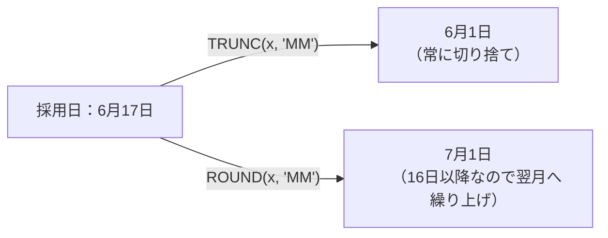
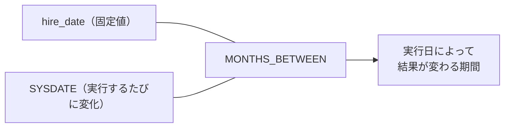
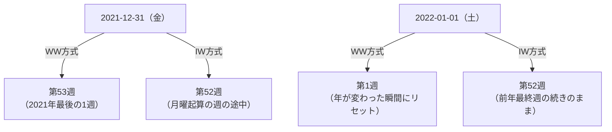

# 問題7-17：日付の四捨五入（ROUND）とTRUNCの違い
### 難易度：★★☆☆☆ (Lv.2)
## 問題
前問（7-9）では`TRUNC`関数を使って日付を「切り捨て」ましたが、Oracleには四捨五入を行う`ROUND`関数も用意されています。
HRスキーマの`EMPLOYEES`テーブルより、`EMPLOYEE_ID`が110より小さい従業員を対象として、採用日（`HIRE_DATE`）を基準に以下の日付を取得してください。なお、結果の表示順は問いません。

**【取得内容】**
* **月初日(TRUNC)**：採用日が属する月の1日（切り捨て）
* **月の四捨五入(ROUND)**：採用日を「月」単位で四捨五入した日付
* **年初日(TRUNC)**：採用日が属する年の1月1日（切り捨て）
* **年の四捨五入(ROUND)**：採用日を「年」単位で四捨五入した日付

※結果はすべて「YYYY-MM-DD」形式の文字列に変換して表示してください。

## 期待する結果
| EMPLOYEE_ID | HIRE_DATE  | 月初日(TRUNC) | 月の四捨五入(ROUND) | 年初日(TRUNC) | 年の四捨五入(ROUND) | 
| ----------- | ---------- | ------------- | ------------------- | ------------- | ------------------- | 
| 100         | 2013-06-17 | 2013-06-01    | 2013-07-01          | 2013-01-01    | 2013-01-01          | 
| 101         | 2015-09-21 | 2015-09-01    | 2015-10-01          | 2015-01-01    | 2016-01-01          | 
| 102         | 2011-01-13 | 2011-01-01    | 2011-01-01          | 2011-01-01    | 2011-01-01          | 
| 103         | 2016-01-03 | 2016-01-01    | 2016-01-01          | 2016-01-01    | 2016-01-01          | 
| 104         | 2017-05-21 | 2017-05-01    | 2017-06-01          | 2017-01-01    | 2017-01-01          | 
| 105         | 2015-06-25 | 2015-06-01    | 2015-07-01          | 2015-01-01    | 2015-01-01          | 
| 106         | 2016-02-05 | 2016-02-01    | 2016-02-01          | 2016-01-01    | 2016-01-01          | 
| 107         | 2017-02-07 | 2017-02-01    | 2017-02-01          | 2017-01-01    | 2017-01-01          | 
| 108         | 2012-08-17 | 2012-08-01    | 2012-09-01          | 2012-01-01    | 2013-01-01          | 
| 109         | 2012-08-16 | 2012-08-01    | 2012-09-01          | 2012-01-01    | 2013-01-01          |

## 解答例
```sql
SELECT
    employee_id,
    TO_CHAR(hire_date,          'YYYY-MM-DD') AS hire_date,
    TO_CHAR(TRUNC(hire_date, 'MM'), 'YYYY-MM-DD') AS "月初日(TRUNC)",
    TO_CHAR(ROUND(hire_date, 'MM'), 'YYYY-MM-DD') AS "月の四捨五入(ROUND)",
    TO_CHAR(TRUNC(hire_date, 'YY'), 'YYYY-MM-DD') AS "年初日(TRUNC)",
    TO_CHAR(ROUND(hire_date, 'YY'), 'YYYY-MM-DD') AS "年の四捨五入(ROUND)"
FROM
    hr.employees
WHERE
    employee_id < 110
```

## 解説
前問（7-9）で登場した`TRUNC`は「問答無用で切り捨てる」関数でしたが、今回の`ROUND`は数値の四捨五入と同じ発想で、日付にも「丸める」という考え方を適用できる関数です。

```sql
ROUND( [日付データ], '[書式モデル]' )
```

書式モデルの指定方法自体は`TRUNC`と共通ですが、挙動が大きく異なります。

| 関数 | 挙動 | 例（6月17日、書式`'MM'`） |
| :--- | :--- | :--- |
| `TRUNC(date, 'MM')` | 問答無用で月初に切り捨てる | 6月1日 |
| `ROUND(date, 'MM')` | 月の中間日を境に、前後どちらに近いか判定する | 7月1日（17日は後半なので繰り上がる） |

`ROUND(date, 'MM')`の判定基準は「その月の16日」です。1日〜15日（月の前半）に丸める場合は当月の1日に、16日〜月末（月の後半）に丸める場合は翌月の1日に繰り上がります。



期待する結果のEMPLOYEE_ID=109（2012-08-16）に注目してください。ちょうど境界値の16日に採用されているため、`TRUNC`では8月のまま（2012-08-01）ですが、`ROUND`では9月に繰り上がっています（2012-09-01）。逆にEMPLOYEE_ID=102（2011-01-13）のように15日以前の場合は、`TRUNC`と`ROUND`の結果が完全に一致します。

年単位（`'YY'`）で丸める場合の境界は「7月1日」です。1月〜6月に丸める場合はその年の1月1日に、7月〜12月に丸める場合は翌年の1月1日に繰り上がります。EMPLOYEE_ID=101（2015-09-21、9月）や108・109（2012-08-1x、8月）は、いずれも下半期の採用のため、`ROUND`では年をまたいで翌年扱いになっている点を確認してください。

| 書式モデル | 境界日 | 前半（丸めない） | 後半（繰り上がる） |
| :---: | :---: | :--- | :--- |
| `'MM'`（月） | 16日 | 1〜15日 | 16日〜月末 |
| `'YY'`（年） | 7月1日 | 1月〜6月 | 7月〜12月 |
| `'Q'`（四半期） | 各四半期の中間月の16日相当 | 前半45日 | 後半45日 |

実務では、`TRUNC`が「その月・年の集計の起点を揃える」ために使われるのに対し、`ROUND`は「どちらの月・年に近いとみなすか」を判定する用途で使われます。例えば、契約開始日が月の後半であれば実質的に翌月扱いにして請求サイクルを決める、入社日が下半期であれば「翌年入社」として研修カリキュラムの年度を割り当てる、といったビジネスルールに`ROUND`がそのまま応用できます。

一点注意したいのは、`ROUND`は`TRUNC`と違って「未来の日付」に丸められる可能性があるという点です。`TRUNC`は常に「過去または当日」に寄りますが、`ROUND`は条件次第で採用日より後の日付（翌月・翌年）を返します。「集計の締め日」のように必ず過去方向に丸めたい処理で誤って`ROUND`を使うと、まだ来ていない未来の日付が結果に混ざってしまうため、`TRUNC`との使い分けを意識することが大切です。

:::message
### TRUNCとROUNDの使い分けの目安
* **`TRUNC`**：集計のグルーピングキーを作りたいとき（「その月の売上」「その週の件数」など、常に過去方向に丸めたい場合）
* **`ROUND`**：「どちらの期間に近いか」を判定したいとき（月の前半/後半による締め処理の振り分けなど）
:::

## 参考リンク
https://www.shift-the-oracle.com/sql/functions/round-datetime.html
https://www.shift-the-oracle.com/sql/functions/trunc-datetime.html


----
<br><br>

# 問題7-18：勤続年数の算出（SYSDATEを使った期間計算）
### 難易度：★★☆☆☆ (Lv.2)
## 問題
HRスキーマの`EMPLOYEES`テーブルより、`EMPLOYEE_ID`が105以下の従業員を対象として、**本日時点**での勤続年数を「〇年〇ヶ月」形式で算出してください。なお、結果の表示順はEMPLOYEE_IDの昇順とします。

**【算出のヒント】**
* 前問（7-6）と同様に`MONTHS_BETWEEN`関数を使用しますが、今回は比較対象の片方が`SYSDATE`（実行日）になります。
* 端数の月は切り捨てて計算してください。
* 「今日」を基準にするため、実行するタイミング（日付）によって結果が変わることに注意してください。

## 期待する結果
| EMPLOYEE_ID | NAME            | HIRE_DATE  | 勤続年数   | 
| ----------- | --------------- | ---------- | ---------- | 
| 100         | Steven King     | 2013-06-17 | 13年1ヶ月  | 
| 101         | Neena Yang      | 2015-09-21 | 10年10ヶ月 | 
| 102         | Lex Garcia      | 2011-01-13 | 15年6ヶ月  | 
| 103         | Alexander James | 2016-01-03 | 10年7ヶ月  | 
| 104         | Bruce Miller    | 2017-05-21 | 9年2ヶ月   | 
| 105         | David Williams  | 2015-06-25 | 11年1ヶ月  | 

> 表示される値は、SQLを実行した日付（本日）によって変動します。上記は2026年8月10日時点での参考値です。

## 解答例
```sql
SELECT
    employee_id,
    first_name || ' ' || last_name AS name,
    TO_CHAR(hire_date, 'YYYY-MM-DD') AS hire_date,
    TRUNC(MONTHS_BETWEEN(SYSDATE, hire_date) / 12) || '年' ||
      MOD(TRUNC(MONTHS_BETWEEN(SYSDATE, hire_date)), 12) || 'ヶ月' AS "勤続年数"
FROM
    hr.employees
WHERE
    employee_id <= 105
ORDER BY
    employee_id
```

## 解説
今回は前問7-6の応用編です。式の形そのものは`MONTHS_BETWEEN`→`TRUNC`→`MOD`という同じ組み立てですが、決定的に違うのは**比較対象の片方が「固定値」ではなく「実行するたびに変わるSYSDATE」になっている**という点です。

```sql
MONTHS_BETWEEN(SYSDATE, hire_date)
```

7-6の`START_DATE`と`END_DATE`はどちらもテーブルに保存された不変のデータでしたが、今回は「今日」という動く基準点を使って期間を測っています。そのため、このクエリは**実行するたびに結果が変わる「非決定的（non-deterministic）」なクエリ**です。同じSQLでも、今日実行した場合と1年後に実行した場合とでは、当然「勤続年数」の値が異なります。



この性質は、テストやレビューの場面で誤解を生みやすいポイントです。「昨日確認したときは『13年0ヶ月』だったのに、今日実行したら『13年1ヶ月』になっている」という現象は、SQLのバグではなく、`SYSDATE`を使っている以上当然起こる正しい挙動です。7-1の解説で触れた「表示される値は実行時によって変動する」という注意点は、今回のような期間計算にもそのまま当てはまります。

実務でこの計算パターンが最もよく使われるのが、**年齢の算出**です。`HIRE_DATE`の代わりに`DATE_OF_BIRTH`（生年月日）を使えば、そのまま「満年齢」の計算に転用できます。
```sql
-- 応用：生年月日から満年齢を算出する場合
TRUNC(MONTHS_BETWEEN(SYSDATE, date_of_birth) / 12) AS "満年齢"
```

ここで初心者がよく引っかかる罠が、「今年の誕生日をまだ迎えていない場合」の扱いです。例えば生年月日が「1990年12月25日」の人を、実行日が「2026年8月10日」の状態で計算すると、単純に「2026 - 1990 = 36歳」としてしまうミスが起こりがちです。しかし実際にはまだ12月の誕生日を迎えていないため、正しくは「35歳」です。

| 判定方法 | 挙動 |
| :--- | :--- |
| `西暦の引き算のみ`（❌） | 誕生日を迎えたかどうかを無視するため、実際より1歳多く数えてしまうことがある |
| `MONTHS_BETWEEN` + `TRUNC`（⭕） | 月・日の情報まで考慮した上で月数を算出し、端数月を切り捨てるため、誕生日未到来のケースも正しく1歳少なく計算される |

`MONTHS_BETWEEN`は年・月・日すべての差分を考慮した「月数」を返し、それを`TRUNC`で切り捨てているため、「まだ誕生日（記念日）を迎えていない」ケースも自動的に正しく処理されます。期待する結果のEMPLOYEE_ID=101（2015-09-21入社）を見てください。実行日である2026年8月10日はまだ9月21日（入社記念日）を迎えていないため、単純な「2026-2015=11年」ではなく、1年少ない「10年10ヶ月」が正しい答えになっています。

もう一点、実務での注意点として、`SYSDATE`を含むクエリはアプリケーション側でキャッシュされた結果と食い違うことがある、という問題があります。バッチ処理が日付をまたいで実行された場合や、深夜0時direkt前後に実行された場合など、「いつの時点のSYSDATEを基準にすべきか」をあらかじめ`WITH`句や変数で固定しておくと、処理の途中で日付が変わってしまうという不具合を防げます。
```sql
-- 実行途中で日付がずれないよう、SYSDATEを最初に固定する例
WITH base AS (
    SELECT TRUNC(SYSDATE) AS today FROM dual
)
SELECT
    e.employee_id,
    TRUNC(MONTHS_BETWEEN(b.today, e.hire_date) / 12) AS "満年数"
FROM
    hr.employees e, base b
```

7-6が「過去の確定した期間」を測るのに対し、今回は「現在進行系の期間」を測るという点が本質的な違いです。この2つを対比させて理解しておくと、年齢計算・勤続年数・契約経過日数など、実務で頻出する期間系の要件にスムーズに対応できるようになります。

## 参考リンク
https://www.shift-the-oracle.com/sql/functions/months_between.html
https://www.shift-the-oracle.com/sql/functions/sysdate.html

----
<br><br>

# 【完全版】問題7-19：日付マスタの動的生成による「0件の日」を含めた日次集計
### 難易度：★★★★☆ (Lv.4)
## 問題
マーケティング部門から「2021年6月の日別注文件数の推移をグラフ化したい」という依頼がありました。しかし、`CO.ORDERS`テーブルは注文が発生した日のデータしか持っておらず、注文が1件も無かった日はテーブルに行として存在しません。このままグラフを作成すると、注文0件の日がグラフ上で不自然に「欠落」してしまい、正しい推移を示せません。

COスキーマの`ORDERS`テーブルを用いて、**2021年6月1日〜2021年6月30日**の日別注文件数を集計してください。ただし、注文が1件も無かった日についても、その日付を`ORDER_COUNT = 0`として結果に必ず含めてください。

出力にあたっては以下の条件を満たしてください。
1. 日付を`ORDER_DATE`という列名で「YYYY-MM-DD」形式の文字列として出力する。
2. その日の注文件数を`ORDER_COUNT`列として出力する。
3. 結果は`ORDER_DATE`の昇順でソートする。
4. 6月1日から6月30日まで、必ず30行が出力されること（歯抜けがあってはならない）。

## 期待する結果
| ORDER_DATE | ORDER_COUNT | 
| ---------- | ----------- | 
| 2021-06-01 | 6           | 
| 2021-06-02 | 5           | 
| 2021-06-03 | 4           | 
| 2021-06-04 | 4           | 
| 2021-06-05 | 3           | 
| 2021-06-06 | 5           | 
| 2021-06-07 | 1           | 
| 2021-06-08 | 3           | 
| 2021-06-09 | 3           | 
| 2021-06-10 | 3           | 
| 2021-06-11 | 2           | 
| 2021-06-12 | 4           | 
| 2021-06-13 | 5           | 
| 2021-06-14 | 5           | 
| 2021-06-15 | 4           | 
| 2021-06-16 | 5           | 
| 2021-06-17 | 3           | 
| 2021-06-18 | 4           | 
| 2021-06-19 | 6           | 
| 2021-06-20 | 6           | 
| 2021-06-21 | 6           | 
| 2021-06-22 | 7           | 
| 2021-06-23 | 3           | 
| 2021-06-24 | 4           | 
| 2021-06-25 | 5           | 
| 2021-06-26 | 7           | 
| 2021-06-27 | 6           | 
| 2021-06-28 | 2           | 
| 2021-06-29 | 4           | 
| 2021-06-30 | 1           | 

## 解答例、解説
[](https://zenn.dev/kinopp/books/0b24d659785f31)


----
<br><br>

# 問題7-20：ISO週番号（IW）とWW週番号の違い
### 難易度：★★★☆☆ (Lv.3)
## 問題
COスキーマの`ORDERS`テーブルより、注文日時（`ORDER_TMS`）が「2021年12月28日」から「2022年1月4日」までの注文を対象として、それぞれの注文日が「年始から数えて何週目」にあたるかを、以下の2つの書式でそれぞれ取得してください。

1. **WW方式**：`'WW'`書式（1月1日を起点に7日ごとで区切る週番号）
2. **IW方式**：`'IW'`書式（ISO 8601に準拠し、月曜始まりで区切る週番号）

さらに、この2つの週番号の値が一致しないレコードには、備考列（`REMARKS`）に「不一致」という文字列を、一致するレコードには「一致」という文字列を出力してください。

出力にあたっては以下の条件を満たしてください。
1. 日付は「YYYY-MM-DD」形式の文字列として出力する。
2. 結果は`ORDER_TMS`の昇順でソートする。

## 期待する結果
| ORDER_ID | ORDER_DATE | WW方式 | IW方式 | REMARKS | 
| -------- | ---------- | ------ | ------ | ------- | 
| 1365     | 2021-12-28 | 52     | 52     | 一致    | 
| 1366     | 2021-12-28 | 52     | 52     | 一致    | 
| 1367     | 2021-12-28 | 52     | 52     | 一致    | 
| 1368     | 2021-12-28 | 52     | 52     | 一致    | 
| 1369     | 2021-12-28 | 52     | 52     | 一致    | 
| 1370     | 2021-12-28 | 52     | 52     | 一致    | 
| 1371     | 2021-12-28 | 52     | 52     | 一致    | 
| 1372     | 2021-12-28 | 52     | 52     | 一致    | 
| 1373     | 2021-12-29 | 52     | 52     | 一致    | 
| 1374     | 2021-12-29 | 52     | 52     | 一致    | 
| 1375     | 2021-12-29 | 52     | 52     | 一致    | 
| 1376     | 2021-12-29 | 52     | 52     | 一致    | 
| 1377     | 2021-12-29 | 52     | 52     | 一致    | 
| 1378     | 2021-12-30 | 52     | 52     | 一致    | 
| 1379     | 2021-12-30 | 52     | 52     | 一致    | 
| 1380     | 2021-12-30 | 52     | 52     | 一致    | 
| 1381     | 2021-12-30 | 52     | 52     | 一致    | 
| 1382     | 2021-12-30 | 52     | 52     | 一致    | 
| 1383     | 2021-12-31 | 53     | 52     | 不一致  | 
| 1384     | 2021-12-31 | 53     | 52     | 不一致  | 
| 1385     | 2021-12-31 | 53     | 52     | 不一致  | 
| 1386     | 2021-12-31 | 53     | 52     | 不一致  | 
| 1387     | 2021-12-31 | 53     | 52     | 不一致  | 
| 1388     | 2021-12-31 | 53     | 52     | 不一致  | 
| 1389     | 2021-12-31 | 53     | 52     | 不一致  | 
| 1390     | 2021-12-31 | 53     | 52     | 不一致  | 
| 1391     | 2021-12-31 | 53     | 52     | 不一致  | 
| 1392     | 2022-01-01 | 1      | 52     | 不一致  | 
| 1393     | 2022-01-01 | 1      | 52     | 不一致  | 
| 1394     | 2022-01-01 | 1      | 52     | 不一致  | 
| 1395     | 2022-01-01 | 1      | 52     | 不一致  | 
| 1396     | 2022-01-01 | 1      | 52     | 不一致  | 
| 1397     | 2022-01-01 | 1      | 52     | 不一致  | 
| 1398     | 2022-01-01 | 1      | 52     | 不一致  | 
| 1399     | 2022-01-02 | 1      | 52     | 不一致  | 
| 1400     | 2022-01-02 | 1      | 52     | 不一致  | 
| 1401     | 2022-01-02 | 1      | 52     | 不一致  | 
| 1402     | 2022-01-02 | 1      | 52     | 不一致  | 
| 1403     | 2022-01-02 | 1      | 52     | 不一致  | 
| 1404     | 2022-01-02 | 1      | 52     | 不一致  | 
| 1405     | 2022-01-03 | 1      | 1      | 一致    | 
| 1406     | 2022-01-03 | 1      | 1      | 一致    | 
| 1407     | 2022-01-03 | 1      | 1      | 一致    | 
| 1408     | 2022-01-03 | 1      | 1      | 一致    | 
| 1409     | 2022-01-03 | 1      | 1      | 一致    | 
| 1410     | 2022-01-03 | 1      | 1      | 一致    | 
| 1411     | 2022-01-03 | 1      | 1      | 一致    | 
| 1412     | 2022-01-03 | 1      | 1      | 一致    | 
| 1413     | 2022-01-04 | 1      | 1      | 一致    | 
| 1414     | 2022-01-04 | 1      | 1      | 一致    | 
| 1415     | 2022-01-04 | 1      | 1      | 一致    | 
| 1416     | 2022-01-04 | 1      | 1      | 一致    | 

## 解答例
```sql
SELECT
    order_id,
    TO_CHAR(order_tms, 'YYYY-MM-DD') AS order_date,
    TO_CHAR(order_tms, 'WW')         AS "WW方式",
    TO_CHAR(order_tms, 'IW')         AS "IW方式",
    CASE
        WHEN TO_CHAR(order_tms, 'WW') = TO_CHAR(order_tms, 'IW') THEN '一致'
        ELSE '不一致'
    END AS remarks
FROM
    co.orders
WHERE
    order_tms >= TIMESTAMP '2021-12-28 00:00:00'
    AND order_tms <  TIMESTAMP '2022-01-05 00:00:00'
ORDER BY
    order_tms
```

## 解説
前問7-9では`TRUNC(dt, 'IW')`を使い「その日が属する週の月曜日」を求めました。今回はその発展として、`TO_CHAR`を使って「年始から数えて第何週か」という**週番号そのもの**を取得します。一見地味な違いですが、`'WW'`と`'IW'`という2つの書式モデルは、年をまたぐタイミングで挙動が大きく食い違う「実務あるある」の罠を持っています。

| 書式モデル | 週の数え方 | 週の始まりの曜日 |
| :--- | :--- | :--- |
| `'WW'` | その年の1月1日を「第1週の1日目」として、単純に7日ごとに区切る | 年によって曜日がバラバラ |
| `'IW'` | ISO 8601国際規格に準拠し、**月曜始まり**で区切る（木曜日を含む週がその年の「第1週」） | 常に月曜日 |

この違いが最も顕著に表れるのが、まさに今回の題材である「年末年始」です。



期待する結果を見ると、`ORDER_ID=9804`（12月31日）以降で挙動が分かれています。`WW`方式は日付が「2022年」に変わった瞬間（1月1日）に問答無用で週番号を「01」にリセットします。1月1日がたとえ土曜日であっても、`WW`方式にとっては関係ありません。

一方`IW`方式は「月曜日から日曜日までの7日間」という単位を厳密に守ります。2022年1月1日（土）を含む週は、月曜日である2021年12月27日から始まっているため、**まだ2021年の最終週（52週目）の途中**という扱いになります。実際に2022年の「第1週」が始まるのは、次の月曜日である1月3日からです。そのため`ORDER_ID=9805`と`9806`は、暦の上ではすでに2022年の注文であるにもかかわらず、`IW`方式では「52週目」のままという、直感に反する結果になります。

:::message
### 要注意：'IW'は「週番号」だけで「年」を含まない
`TO_CHAR(date, 'IW')`が返すのはあくまで1〜52（53）の週番号だけで、「どの年の第52週なのか」という年の情報は含まれていません。そのため、1月1日と12月31日が両方とも「52」を返しても、Oracleが混同しているわけではなく、これはISO 8601の仕様どおりの正しい挙動です。年をまたいだ集計を週単位で正確に行いたい場合は、`'IW'`と対になる年の書式モデルである`'IYYY'`（ISO年）を組み合わせて、`TO_CHAR(date, 'IYYY-IW')`のように出力することで、`2021-52`と`2022-01`を明確に区別できます。
:::

この違いを知らずに実務でレポートを作ると、次のようなトラブルが起こりがちです。

* 海外拠点や取引先から「ISO週番号（`IW`）で集計してほしい」と依頼されているのに、日本の社内Excelで馴染みのある`WW`相当の週区切り（1月1日起算）で集計してしまい、年末年始の週で数字が食い違う
* 週次バッチ処理で「新しい週（週番号が変わったタイミング）」を検知するロジックを`WW`で組んでいたため、1月1日の瞬間に本来ならまだ継続しているはずの「先週分」の集計が強制的に打ち切られてしまう

`TRUNC(dt, 'IW')`（7-9で学んだ「週の月曜日」を求める関数）と`TO_CHAR(dt, 'IW')`（今回学んだ「週番号」を求める関数）は、どちらも同じISO 8601の考え方に基づいているため、セットで覚えておくと、週次集計まわりの実装で迷うことが少なくなります。

## 参考リンク
https://www.shift-the-oracle.com/sql/functions/to_char-datetime.html
