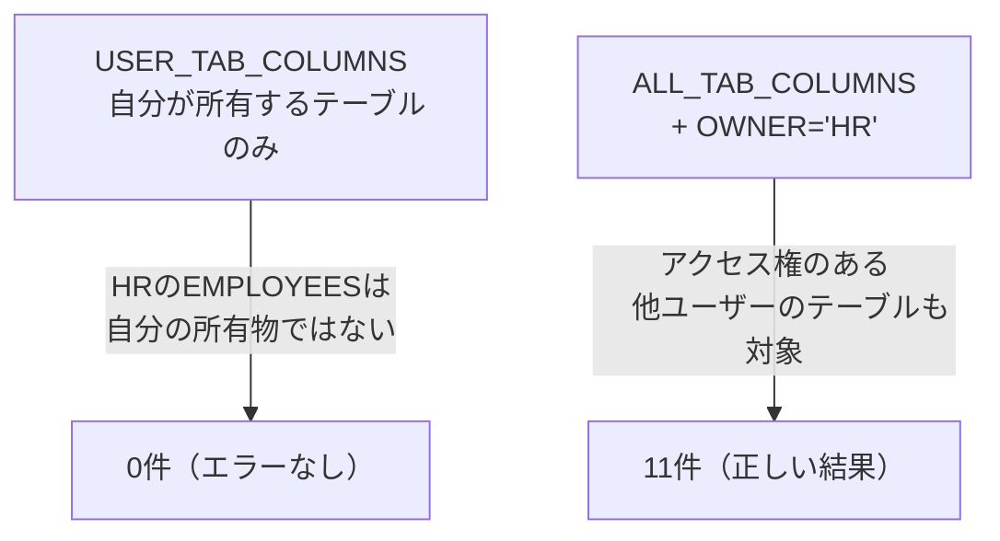
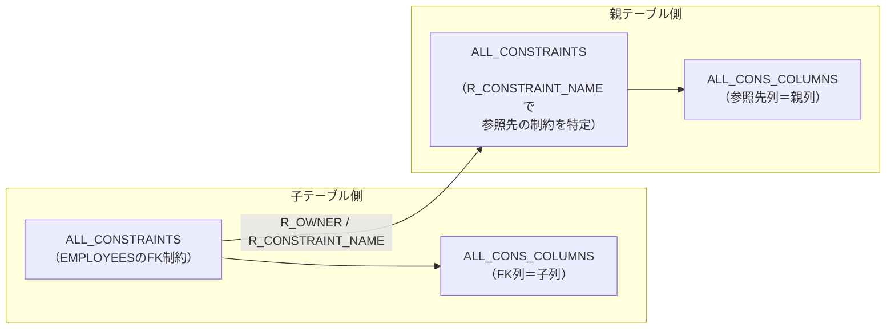
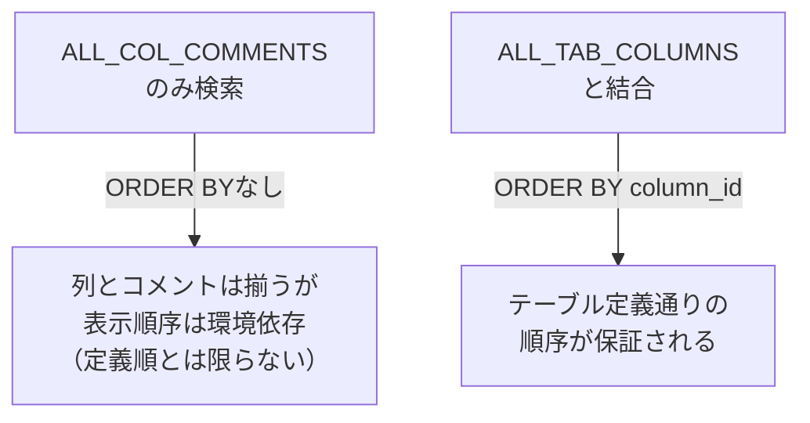
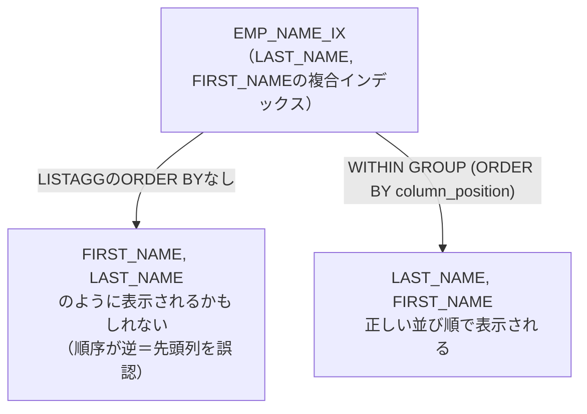

# 問題20-1：ALL_TAB_COLUMNSによるテーブル構造の一覧化
### 難易度：★★☆☆☆ (Lv.2)
## 問題
新しくプロジェクトにアサインされたメンバーが、HRスキーマの`EMPLOYEES`テーブルの構造を把握するため、データディクショナリから列定義の一覧を取得しようとしています。

`ALL_TAB_COLUMNS`を使い、HRスキーマの`EMPLOYEES`テーブルについて、以下の項目を`COLUMN_ID`（列の並び順）順に取得してください。

* `COLUMN_ID`：列の並び順
* `COLUMN_NAME`：列名
* `DATA_TYPE_DISPLAY`：データ型の表示（例：`VARCHAR2(25)`、`NUMBER(8,2)`、`DATE`のように、桁数まで含めた表記にすること）
* `NULLABLE_DISPLAY`：`NULL`を許可するかどうか（許可する場合は`許可`、許可しない場合は`不可`と表示すること）

## 期待する結果
| COLUMN_ID | COLUMN_NAME    | DATA_TYPE_DISPLAY | NULLABLE_DISPLAY | 
| --------- | -------------- | ----------------- | ---------------- | 
| 1         | EMPLOYEE_ID    | NUMBER(6)         | 不可             | 
| 2         | FIRST_NAME     | VARCHAR2(20)      | 許可             | 
| 3         | LAST_NAME      | VARCHAR2(25)      | 不可             | 
| 4         | EMAIL          | VARCHAR2(25)      | 不可             | 
| 5         | PHONE_NUMBER   | VARCHAR2(20)      | 許可             | 
| 6         | HIRE_DATE      | DATE              | 不可             | 
| 7         | JOB_ID         | VARCHAR2(10)      | 不可             | 
| 8         | SALARY         | NUMBER(8,2)       | 許可             | 
| 9         | COMMISSION_PCT | NUMBER(2,2)       | 許可             | 
| 10        | MANAGER_ID     | NUMBER(6)         | 許可             | 
| 11        | DEPARTMENT_ID  | NUMBER(4)         | 許可             | 


## 解答例
```sql:失敗例：USER_TAB_COLUMNSを使用
SELECT
    column_id,
    column_name,
    data_type,
    nullable
FROM
    user_tab_columns
WHERE
    table_name = 'EMPLOYEES'
ORDER BY
    column_id
-- 0件がヒットする（エラーにはならない）
-- 現在ログイン中のユーザーは EMPLOYEES テーブルを「所有」していないため
```

```sql:正解例：ALL_TAB_COLUMNSをOWNERで絞り込む
SELECT
    column_id,
    column_name,
    CASE
        WHEN data_type IN ('VARCHAR2', 'CHAR', 'NVARCHAR2', 'NCHAR')
            THEN data_type || '(' || data_length || ')'
        WHEN data_type = 'NUMBER' AND data_precision IS NOT NULL AND data_scale > 0
            THEN data_type || '(' || data_precision || ',' || data_scale || ')'
        WHEN data_type = 'NUMBER' AND data_precision IS NOT NULL
            THEN data_type || '(' || data_precision || ')'
        ELSE
            data_type
    END AS data_type_display,
    CASE nullable
        WHEN 'Y' THEN '許可'
        ELSE '不可'
    END AS nullable_display
FROM
    all_tab_columns
WHERE
    owner = 'HR'
    AND table_name = 'EMPLOYEES'
ORDER BY
    column_id
```

## 解説
この章では、これまでのHR／CO／SHといった業務データではなく、Oracleが内部的に管理している「データベース自身の構造に関する情報（メタデータ）」を検索します。ドキュメントが手元になくても、SQLだけでテーブルの構造を調べられるようになる、実務上とても価値のあるテクニックです。



失敗例のポイントは、`USER_TAB_COLUMNS`が「今ログインしているユーザー自身が所有するオブジェクト」しか見せてくれない点です。Oracle FreeSQLやOracle Live SQLのような環境では、`HR`スキーマは自分とは別のユーザーとして用意されており、`hr.employees`のようにスキーマ名を明示して初めて参照できます。`USER_TAB_COLUMNS`で`EMPLOYEES`を検索しても、自分が所有する同名テーブルがなければ**エラーにならず、静かに0件が返る**だけなので、「テーブルが存在しない」と誤解してしまう危険があります。

正解例では`ALL_TAB_COLUMNS`を使い、`OWNER = 'HR'`で明示的に絞り込んでいます。`ALL_%`系のビューは「自分がアクセス権を持つ、すべてのオブジェクト」を対象にするため、`SELECT`権限さえあれば他ユーザーが所有するテーブルの構造も参照できます。

データディクショナリ系のビューには、対象範囲の異なる3つのプレフィックスがあります。

| プレフィックス | 対象範囲 | Oracle FreeSQLでの利用可否 |
| :--- | :--- | :--- |
| `USER_*` | 自分が所有するオブジェクトのみ | HR／CO／SHは他ユーザー所有のため対象外 |
| `ALL_*` | 自分がアクセス権を持つ全オブジェクト（所有＋付与された権限） | HR／CO／SHへの参照権限があれば利用可 |
| `DBA_*` | データベース全体の全オブジェクト | 通常DBA権限が必要。Oracle FreeSQLでは利用不可 |

今回のように「自分のスキーマではないテーブルを調べたい」場面では、原則として`ALL_%`系のビューを`OWNER`で絞り込む書き方が基本になります。この使い分けは本章全体を通して繰り返し登場します。

`DATA_TYPE_DISPLAY`列の`CASE`式もこの問題の実務的なポイントです。`ALL_TAB_COLUMNS`には`DATA_TYPE`（型名）・`DATA_LENGTH`（バイト長）・`DATA_PRECISION`（有効桁数）・`DATA_SCALE`（小数点以下の桁数）が別々の列として格納されているため、`VARCHAR2(25)`や`NUMBER(8,2)`のような見慣れた表記に組み立てるには、型ごとに参照すべき列を出し分ける必要があります。

:::message
### DATA_LENGTHは「バイト数」であって「文字数」ではない
`VARCHAR2`列の`DATA_LENGTH`はバイト単位の長さです。キャラクタセットがマルチバイト（例：AL32UTF8）の環境で、日本語1文字を3バイトとして定義した`VARCHAR2(20 CHAR)`のような列がある場合、`DATA_LENGTH`にはバイト換算の値（この場合60）が入り、定義時に指定した文字数（20）とは異なります。文字数ベースの定義かどうかを正確に知りたい場合は、`CHAR_USED`列（`'C'`なら文字数指定、`'B'`ならバイト数指定）もあわせて確認すると安心です。
:::

## 参考リンク
https://docs.oracle.com/en/database/oracle/oracle-database/19/refrn/ALL_TAB_COLUMNS.html
https://docs.oracle.com/en/database/oracle/oracle-database/19/refrn/USER_TAB_COLUMNS.html

---
<br><br>

# 問題20-2：ALL_CONSTRAINTS／ALL_CONS_COLUMNSによる制約・参照関係の調査
### 難易度：★★★★☆ (Lv.4)
## 問題
ER図が手元にない状態で、HRスキーマの`EMPLOYEES`テーブルにどんな外部キー制約が張られているかを、データディクショナリだけを頼りに調査してください。

`EMPLOYEES`テーブルに設定されている外部キー制約（`CONSTRAINT_TYPE = 'R'`）について、以下の項目を取得してください。

* `FK_NAME`：外部キー制約名
* `FK_COLUMN`：`EMPLOYEES`側の列名（子テーブルの列）
* `REF_OWNER`：参照先テーブルの所有者（スキーマ名）
* `REF_TABLE`：参照先テーブル名
* `REF_COLUMN`：参照先テーブルの列名（親テーブルの列）

## 期待する結果
| FK_NAME        | FK_COLUMN     | REF_OWNER | REF_TABLE   | REF_COLUMN    | 
| -------------- | ------------- | --------- | ----------- | ------------- | 
| EMP_DEPT_FK    | DEPARTMENT_ID | HR        | DEPARTMENTS | DEPARTMENT_ID | 
| EMP_JOB_FK     | JOB_ID        | HR        | JOBS        | JOB_ID        | 
| EMP_MANAGER_FK | MANAGER_ID    | HR        | EMPLOYEES   | EMPLOYEE_ID   | 

## 解答例
```sql:失敗例：参照先の列名を子列名と同じだと決め打ちする
SELECT
    child_cons.constraint_name AS fk_name,
    child_cols.column_name     AS fk_column,
    parent_cons.table_name     AS ref_table,
    child_cols.column_name     AS ref_column_guess  -- 誤り：参照先も同じ列名のはず、という思い込み
FROM
    all_constraints child_cons
    JOIN all_cons_columns child_cols
        ON  child_cols.owner           = child_cons.owner
        AND child_cols.constraint_name = child_cons.constraint_name
    JOIN all_constraints parent_cons
        ON  parent_cons.owner           = child_cons.r_owner
        AND parent_cons.constraint_name = child_cons.r_constraint_name
WHERE
    child_cons.owner = 'HR'
    AND child_cons.table_name = 'EMPLOYEES'
    AND child_cons.constraint_type = 'R'
ORDER BY
    fk_name
-- EMP_MANAGER_FK の行で REF_COLUMN_GUESS が "MANAGER_ID" になってしまう
-- 実際にはEMPLOYEES.EMPLOYEE_ID（自分自身の主キー）を参照しており、列名は一致していない
```

```sql:正解例：ALL_CONS_COLUMNSを親側にも結合して実際の参照先列を取得
SELECT
    child_cons.constraint_name   AS fk_name,
    child_cols.column_name       AS fk_column,
    parent_cons.owner            AS ref_owner,
    parent_cons.table_name       AS ref_table,
    parent_cols.column_name      AS ref_column
FROM
    all_constraints child_cons
    JOIN all_cons_columns child_cols
        ON  child_cols.owner           = child_cons.owner
        AND child_cols.constraint_name = child_cons.constraint_name
    JOIN all_constraints parent_cons
        ON  parent_cons.owner           = child_cons.r_owner
        AND parent_cons.constraint_name = child_cons.r_constraint_name
    JOIN all_cons_columns parent_cols
        ON  parent_cols.owner           = parent_cons.owner
        AND parent_cols.constraint_name = parent_cons.constraint_name
        AND parent_cols.position        = child_cols.position
WHERE
    child_cons.owner = 'HR'
    AND child_cons.table_name = 'EMPLOYEES'
    AND child_cons.constraint_type = 'R'
ORDER BY
    fk_name
```

## 解説
この問題は、ドキュメントが古かったり存在しなかったりする現場で、テーブル同士の参照関係をSQLだけで正確に洗い出す実務的なテクニックです。



失敗例は、一見自然に見える「外部キーの列名と、参照先の主キーの列名は同じだろう」という思い込みに基づいています。`EMP_DEPT_FK`（`DEPARTMENT_ID`→`DEPARTMENTS.DEPARTMENT_ID`）や`EMP_JOB_FK`（`JOB_ID`→`JOBS.JOB_ID`）は確かに列名が一致しているため、この思い込みでもたまたま正しい結果になってしまいます。しかし`EMP_MANAGER_FK`は、`EMPLOYEES`テーブルが自分自身を参照する自己参照外部キー（10-4で学んだ自己結合に相当する構造）で、子側の列名は`MANAGER_ID`、参照先の列名は`EMPLOYEE_ID`と、**列名が一致していません**。列名を推測に頼ると、この種の非対称な命名のケースで静かに誤った情報を報告してしまいます。

正解例のポイントは、`ALL_CONSTRAINTS`と`ALL_CONS_COLUMNS`を**子側・親側それぞれに対して**結合していることです。

| ビュー | 役割 |
| :--- | :--- |
| `ALL_CONSTRAINTS`（子側） | `EMPLOYEES`テーブルに設定された制約の一覧。`R_CONSTRAINT_NAME`・`R_OWNER`に「参照先の制約名・所有者」が格納されている |
| `ALL_CONS_COLUMNS`（子側） | 制約がどの列に設定されているか（今回は外部キー列） |
| `ALL_CONSTRAINTS`（親側） | `R_CONSTRAINT_NAME`と`R_OWNER`をキーに、参照先の制約（多くは主キーや一意キー）そのものを特定する |
| `ALL_CONS_COLUMNS`（親側） | 参照先の制約がどの列に設定されているか（＝実際に参照されている列） |

`R_CONSTRAINT_NAME`は「参照先（Referenced）の制約名」を格納する列です。外部キー制約は必ずどこかの主キーまたは一意キー制約を参照しているため、この値を使って`ALL_CONSTRAINTS`をもう一度検索すれば、参照先の制約にたどり着けます。参照先の制約が特定できれば、`ALL_CONS_COLUMNS`で「その制約がどの列に設定されているか」を調べることで、初めて正しい参照先列名が得られます。

:::message
### 複合キーを参照する場合はPOSITION列で列順を揃える
今回はすべて単一列の外部キーでしたが、複数列からなる複合外部キー（複合主キーを参照するケース）では、`ALL_CONS_COLUMNS.POSITION`列（制約内での列の並び順）を子側・親側で一致させて結合する必要があります。正解例で`parent_cols.position = child_cols.position`という結合条件を入れているのはこのためで、単一列の制約であれば`POSITION`は常に1になるため今回の結果には影響しませんが、複合キーを扱う可能性がある場合は省略しないことをおすすめします。
:::

## 参考リンク
https://docs.oracle.com/en/database/oracle/oracle-database/19/refrn/ALL_CONSTRAINTS.html
https://docs.oracle.com/en/database/oracle/oracle-database/19/refrn/ALL_CONS_COLUMNS.html

---
<br><br>

# 問題20-3：ALL_TAB_COMMENTS／ALL_COL_COMMENTSによるコメントの取得
### 難易度：★★☆☆☆ (Lv.2)
## 問題
仕様書が古くなっているため、HRスキーマの`EMPLOYEES`テーブルについて、データディクショナリに登録されている**コメント**（`COMMENT ON TABLE`／`COMMENT ON COLUMN`で設定された説明文）から、簡易的な定義書のベースを作ってください。

`EMPLOYEES`テーブルの列について、以下の項目を **列の定義順（`COLUMN_ID`順）** で取得してください。

* `COLUMN_NAME`：列名
* `COLUMN_COMMENT`：その列に設定されているコメント。コメントが未設定の場合は`'(コメントなし)'`と表示すること。

## 期待する結果
| COLUMN_NAME    | COLUMN_COMMENT                                                                                                                                                                                  | 
| -------------- | ----------------------------------------------------------------------------------------------------------------------------------------------------------------------------------------------- | 
| EMPLOYEE_ID    | Primary key of employees table.                                                                                                                                                                 | 
| FIRST_NAME     | First name of the employee. A not null column.                                                                                                                                                  | 
| LAST_NAME      | Last name of the employee. A not null column.                                                                                                                                                   | 
| EMAIL          | Email id of the employee                                                                                                                                                                        | 
| PHONE_NUMBER   | Phone number of the employee; includes country code and area code                                                                                                                               | 
| HIRE_DATE      | Date when the employee started on this job. A not null column.                                                                                                                                  | 
| JOB_ID         | Current job of the employee; foreign key to job_id column of the <br>jobs table. A not null column.                                                                                             | 
| SALARY         | Monthly salary of the employee. Must be greater <br>than zero (enforced by constraint emp_salary_min)                                                                                           | 
| COMMISSION_PCT | Commission percentage of the employee; Only employees in sales <br>department elgible for commission percentage                                                                                 | 
| MANAGER_ID     | Manager id of the employee; has same domain as manager_id in <br>departments table. Foreign key to employee_id column of employees table. <br>(useful for reflexive joins and CONNECT BY query) | 
| DEPARTMENT_ID  | Department id where employee works; foreign key to department_id <br>column of the departments table                                                                                            | 


## 解答例
```sql:失敗例：ALL_COL_COMMENTSだけを検索する（順序を保証していない）
SELECT
    column_name,
    NVL(comments, '(コメントなし)') AS column_comment
FROM
    all_col_comments
WHERE
    owner = 'HR'
    AND table_name = 'EMPLOYEES'
-- 全11列とコメントは正しく取得できるが、ORDER BY句がないため
-- 表示順序が「テーブル定義上の列順（COLUMN_ID順）」と一致する保証がない
```

```sql:正解例：ALL_TAB_COLUMNSと結合してCOLUMN_ID順を保証する
SELECT
    tc.column_name,
    NVL(cc.comments, '(コメントなし)') AS column_comment
FROM
    all_tab_columns tc
    LEFT JOIN all_col_comments cc
        ON  cc.owner       = tc.owner
        AND cc.table_name  = tc.table_name
        AND cc.column_name = tc.column_name
WHERE
    tc.owner = 'HR'
    AND tc.table_name = 'EMPLOYEES'
ORDER BY
    tc.column_id
```

## 解説
17-8や19-5と同じ「NULL（未設定）データへの向き合い方」に加えて、今回は「ディクショナリビューの検索結果は、勝手に都合の良い順序では並んでくれない」という、地味ながら実務でよく踏む落とし穴を扱います。



`ALL_COL_COMMENTS`は`OWNER`・`TABLE_NAME`・`COLUMN_NAME`・`COMMENTS`を持つビューで、`EMPLOYEES`テーブルの11列すべてについて1行ずつ存在します（コメントが未設定の列は`COMMENTS`が`NULL`になるだけで、行自体は必ず存在します）。そのため、失敗例のクエリでも列の抜け漏れは起きません。しかし`ALL_COL_COMMENTS`自体は列の定義順（`COLUMN_ID`）という概念を持っていないため、`ORDER BY`を指定しない限り、結果の並び順はOracleの内部的な実行計画に左右され、実行するたびに変わる可能性すらあります。「定義書として列を上から順に読みたい」という今回の目的には向きません。

正解例では、列の並び順を管理している`ALL_TAB_COLUMNS`の`COLUMN_ID`を`ORDER BY`に使うことで、この問題を解決しています。`ALL_COL_COMMENTS`はコメントの中身だけを補う位置づけにし、`LEFT JOIN`で結合することで、万が一コメントが1件も登録されていない列があっても`ALL_TAB_COLUMNS`側の行は失われず、`NVL`で`(コメントなし)`に置き換えられます。

| ビュー | 役割 | 順序の概念 |
| :--- | :--- | :--- |
| `ALL_TAB_COLUMNS` | 列の型・桁数・NULL許容などの構造情報（20-1で使用） | `COLUMN_ID`で定義順を管理 |
| `ALL_COL_COMMENTS` | 列に対するコメント文だけを保持 | 順序の概念を持たない |
| `ALL_TAB_COMMENTS` | テーブル・ビュー単位のコメント文を保持 | （テーブル単位なので順序は不要） |

なお、テーブル全体のコメント（今回の`EMPLOYEES`であれば「どんなテーブルか」を説明する1文）は`ALL_TAB_COMMENTS`から取得できます。

```sql
SELECT comments FROM all_tab_comments WHERE owner = 'HR' AND table_name = 'EMPLOYEES';
```

:::message
### コメント一覧を1テーブル1行のサマリーに圧縮する（発展例）
定義書ではなく、テーブル一覧画面などで「このテーブルにはどんな列があるか」を1行で概観したい場合は、8-5で学んだ`LISTAGG`と組み合わせることができます。
```sql
SELECT
    tc.table_name,
    LISTAGG(tc.column_name, ', ') WITHIN GROUP (ORDER BY tc.column_id) AS column_list
FROM
    all_tab_columns tc
WHERE
    tc.owner = 'HR'
    AND tc.table_name = 'EMPLOYEES'
GROUP BY
    tc.table_name;
```
`WITHIN GROUP (ORDER BY tc.column_id)`を指定することで、`LISTAGG`で連結する際も定義順を保つことができます。`ORDER BY`の指定を怠ると、19-4で扱った`XMLAGG`と同様に連結順が不定になる点は共通の注意点です。
:::

## 参考リンク
https://docs.oracle.com/en/database/oracle/oracle-database/19/refrn/ALL_TAB_COMMENTS.html
https://docs.oracle.com/en/database/oracle/oracle-database/19/refrn/ALL_COL_COMMENTS.html

---
<br><br>

# 問題20-4：ALL_INDEXES／ALL_IND_COLUMNSによるインデックス構成の調査
### 難易度：★★★☆☆ (Lv.3)
## 問題
パフォーマンス改善の調査で、HRスキーマの`EMPLOYEES`テーブルに現在どのようなインデックスが張られているかを確認することになりました。

`EMPLOYEES`テーブルに設定されているインデックスについて、以下の項目を`INDEX_NAME`順に取得してください。

* `INDEX_NAME`：インデックス名
* `UNIQUENESS`：一意性（`UNIQUE`／`NONUNIQUE`）
* `INDEX_COLUMNS`：構成列の一覧。複数列からなる複合インデックスの場合は、**インデックス内での並び順どおりに**カンマ区切りで連結すること（例：`LAST_NAME, FIRST_NAME`）

## 期待する結果
| INDEX_NAME        | UNIQUENESS | INDEX_COLUMNS         | 
| ----------------- | ---------- | --------------------- | 
| EMP_DEPARTMENT_IX | NONUNIQUE  | DEPARTMENT_ID         | 
| EMP_EMAIL_UK      | UNIQUE     | EMAIL                 | 
| EMP_EMP_ID_PK     | UNIQUE     | EMPLOYEE_ID           | 
| EMP_JOB_IX        | NONUNIQUE  | JOB_ID                | 
| EMP_MANAGER_IX    | NONUNIQUE  | MANAGER_ID            | 
| EMP_NAME_IX       | NONUNIQUE  | LAST_NAME, FIRST_NAME | 


## 解答例
```sql:失敗例：LISTAGGで列の並び順を指定しない
SELECT
    i.index_name,
    i.uniqueness,
    LISTAGG(ic.column_name, ', ') AS index_columns
FROM
    all_indexes i
    JOIN all_ind_columns ic
        ON  ic.index_owner = i.owner
        AND ic.index_name  = i.index_name
WHERE
    i.table_owner = 'HR'
    AND i.table_name = 'EMPLOYEES'
GROUP BY
    i.index_name,
    i.uniqueness
ORDER BY
    i.index_name
-- EMP_NAME_IX の INDEX_COLUMNS が "FIRST_NAME, LAST_NAME" のように
-- 本来の並び順（LAST_NAME, FIRST_NAME）と逆になってしまうことがある
```

```sql:正解例：WITHIN GROUPでCOLUMN_POSITION順を保証
SELECT
    i.index_name,
    i.uniqueness,
    LISTAGG(ic.column_name, ', ') WITHIN GROUP (ORDER BY ic.column_position) AS index_columns
FROM
    all_indexes i
    JOIN all_ind_columns ic
        ON  ic.index_owner = i.owner
        AND ic.index_name  = i.index_name
WHERE
    i.table_owner = 'HR'
    AND i.table_name = 'EMPLOYEES'
GROUP BY
    i.index_name,
    i.uniqueness
ORDER BY
    i.index_name
```

## 解説
20-3のmessageブロックで少し触れた「`LISTAGG`は`ORDER BY`を指定しないと連結順が不定になる」という注意点を、実際に実務上の被害が出る形で体験する問題です。



複合インデックスは、構成する列の**並び順**そのものに意味があります。`EMP_NAME_IX`が`(LAST_NAME, FIRST_NAME)`の順で構成されている場合、このインデックスが効果的に使われるのは主に`WHERE LAST_NAME = '...'`のように**先頭列（LAST_NAME）から条件を指定するケース**です。`WHERE FIRST_NAME = '...'`のように先頭列を飛ばして2番目の列だけで検索しても、このインデックスは基本的に活用されません（これを「左端一致の原則」と呼びます）。

失敗例では`LISTAGG`に`ORDER BY`（正確には`WITHIN GROUP (ORDER BY ...)`）を指定していないため、`GROUP BY`で集約された複数行がどの順序で連結されるかはOracleの内部的な処理順に依存し、保証されません。もし`FIRST_NAME, LAST_NAME`の順で表示されてしまうと、「このインデックスは`FIRST_NAME`で検索する際に効く」という**逆の結論**を報告書に書いてしまいかねません。列は揃っているのに順序だけが違う、という点で、19-4・20-3と同様の「実行するたびに結果が変わりうる／見た目は正しそうだが実は不正確」という失敗パターンです。

正解例では、`ALL_IND_COLUMNS.COLUMN_POSITION`（インデックス内でのその列の位置、1始まり）を使い、`LISTAGG(... ) WITHIN GROUP (ORDER BY ic.column_position)`と明示することで、必ずインデックス定義どおりの順序で連結されるようにしています。

| 列 | 意味 |
| :--- | :--- |
| `ALL_INDEXES.UNIQUENESS` | `UNIQUE`（一意）か`NONUNIQUE`（非一意）かの区分 |
| `ALL_IND_COLUMNS.COLUMN_POSITION` | 複合インデックス内での、その列の並び順（1始まり） |
| `ALL_IND_COLUMNS.COLUMN_NAME` | 構成する列名 |

:::message
### 主キー・一意キー制約とインデックスの関係
`EMP_EMP_ID_PK`や`EMP_EMAIL_UK`のように、`ALL_CONSTRAINTS`（20-2）にも同名の制約が登場するインデックスがあります。Oracleでは主キー制約や一意キー制約を定義すると、それを裏付けるための一意インデックスが自動的に作成されるためです。つまり、`ALL_CONSTRAINTS`は「業務上のルール（一意性を守れ、など）」を表し、`ALL_INDEXES`は「そのルールを高速に検証・検索するための実体」を表している、と整理すると理解しやすくなります。同じ名前が両方のビューに登場しても、それぞれ見ている側面が異なる点に注意してください。
:::

## 参考リンク
https://docs.oracle.com/en/database/oracle/oracle-database/19/refrn/ALL_INDEXES.html
https://docs.oracle.com/en/database/oracle/oracle-database/19/refrn/ALL_IND_COLUMNS.html

---
<br><br>

# 【完全版】問題20-5：ALL_TABLESのNUM_ROWSの落とし穴（統計情報 vs 実件数）
### 難易度：★★★★☆ (Lv.4)
## 問題
他チームから「HRスキーマの主要テーブルの件数を一覧化してほしい」と頼まれました。`COUNT(*)`をテーブルごとに何度も打つのは手間なので、`ALL_TABLES.NUM_ROWS`を使って手早く済ませようとしています。

`EMPLOYEES`・`DEPARTMENTS`・`JOBS`・`LOCATIONS`・`JOB_HISTORY`の5テーブルについて、以下の項目を取得し、統計情報上の件数と実際の件数が一致しているかを確認してください。

* `TABLE_NAME`：テーブル名
* `STATS_NUM_ROWS`：`ALL_TABLES.NUM_ROWS`（統計情報上の件数）
* `ACTUAL_COUNT`：`COUNT(*)`による実際の件数
* `CHECK_RESULT`：`STATS_NUM_ROWS`が`NULL`なら`'統計情報未収集'`、`ACTUAL_COUNT`と一致すれば`'一致'`、一致しなければ`'不一致（統計情報が古い可能性）'`と表示すること

```sql:検証用データ（WITH句）
WITH actual_counts AS (
    SELECT 'EMPLOYEES'   AS table_name, COUNT(*) AS actual_count FROM hr.employees   UNION ALL
    SELECT 'DEPARTMENTS',               COUNT(*)                 FROM hr.departments UNION ALL
    SELECT 'JOBS',                      COUNT(*)                 FROM hr.jobs        UNION ALL
    SELECT 'LOCATIONS',                 COUNT(*)                 FROM hr.locations   UNION ALL
    SELECT 'JOB_HISTORY',               COUNT(*)                 FROM hr.job_history
)
-- ここから先を作成してください
```

## 期待する結果（一致している場合の例）
| TABLE_NAME  | STATS_NUM_ROWS | ACTUAL_COUNT | CHECK_RESULT | 
| ----------- | -------------- | ------------ | ------------ | 
| DEPARTMENTS | 27             | 27           | 一致         | 
| EMPLOYEES   | 107            | 107          | 一致         | 
| JOBS        | 19             | 19           | 一致         | 
| JOB_HISTORY | 10             | 10           | 一致         | 
| LOCATIONS   | 23             | 23           | 一致         | 

## 解答例、解説
[](https://zenn.dev/kinopp/books/0b24d659785f31)

----
<br><br>

# 【完全版】問題20-6：CHECK制約とNOT NULL制約の判別、およびSEARCH_CONDITION（LONG型）の壁
### 難易度：★★★★☆ (Lv.4)
## 問題
HRスキーマの`EMPLOYEES`テーブルに、業務ルールとして明示的に定義された`CHECK`制約が何個あるかを調査してください。列に`NOT NULL`を指定したことで自動的に作られる制約は、業務ルールとしてカウントしないでください。

以下の項目を取得してください。

* `CONSTRAINT_NAME`：制約名
* `SEARCH_CONDITION`：制約の条件式

## 期待する結果
| CONSTRAINT_NAME | SEARCH_CONDITION |
| ---------------- | ----------------- |
| EMP_SALARY_MIN    | salary > 0        |

## 解答例、解説
[](https://zenn.dev/kinopp/books/0b24d659785f31)