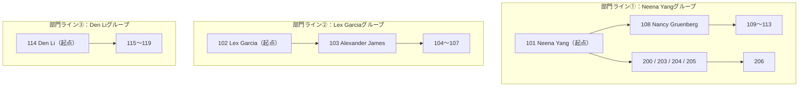

# 【完全版】問題14-8：再帰CTE（WITH句）による階層問い合わせへの書き換え
### 難易度：★★★★☆ (Lv.4)
## 問題
問題14-1では、HRスキーマの`EMPLOYEES`テーブルに対して`START WITH` / `CONNECT BY`（Oracle独自の階層問い合わせ）を使い、社長から末端の従業員までのツリー経路を`EMPLOYEE_TREE`列として取得しました。

今回は全く同じ出力を、**`CONNECT BY`句や`START WITH`句、`PRIOR`キーワードを一切使わず**、ANSI標準構文である「**再帰CTE（`WITH`句の再帰）**」だけを使って再現してください。

**【抽出・編集ルール】**
* **階層の表現**：問題14-1と同様、最上位の上司から現在の従業員までを「 <-- 」で繋いで表示してください。
* 例：`最上位上司 <-- 直属上司 <-- 従業員`
* **開始地点**：社長（`MANAGER_ID` が `NULL` の人物）をルート（根）として開始してください。
* **リレーション**：ある行の`EMPLOYEE_ID`が、次の行の`MANAGER_ID`と一致する関係で繋いでください。
* **禁止事項**：`CONNECT BY`、`START WITH`、`PRIOR`、`SYS_CONNECT_BY_PATH`は使用禁止です。`WITH`句による自己参照（`UNION ALL`）のみで組み立ててください。
* 出力順序は問題14-1の期待する結果と完全に一致させてください。

## 期待する結果
問題14-1と全く同じ結果になります。

| EMPLOYEE_TREE               | 
| --------------------------- | 
| 100                         | 
| 100 <-- 101                 | 
| 100 <-- 101 <-- 108         | 
| 100 <-- 101 <-- 108 <-- 109 | 
| 100 <-- 101 <-- 108 <-- 110 | 
| 100 <-- 101 <-- 108 <-- 111 | 
| 100 <-- 101 <-- 108 <-- 112 | 
| 100 <-- 101 <-- 108 <-- 113 | 
| 100 <-- 101 <-- 200         | 
| 100 <-- 101 <-- 203         | 
| 100 <-- 101 <-- 204         | 
| 100 <-- 101 <-- 205         | 
| 100 <-- 101 <-- 205 <-- 206 | 
| 100 <-- 102                 | 
| 100 <-- 102 <-- 103         | 
| 100 <-- 102 <-- 103 <-- 104 | 
| 100 <-- 102 <-- 103 <-- 105 | 
| 100 <-- 102 <-- 103 <-- 106 | 
| 100 <-- 102 <-- 103 <-- 107 | 
| 100 <-- 114                 | 
| 100 <-- 114 <-- 115         | 
| 100 <-- 114 <-- 116         | 
| 100 <-- 114 <-- 117         | 
| 100 <-- 114 <-- 118         | 
| 100 <-- 114 <-- 119         | 
| 100 <-- 120                 | 
| 100 <-- 120 <-- 125         | 
| 100 <-- 120 <-- 126         | 
| 100 <-- 120 <-- 127         | 
| 100 <-- 120 <-- 128         | 
| 100 <-- 120 <-- 180         | 
| 100 <-- 120 <-- 181         | 
| 100 <-- 120 <-- 182         | 
| 100 <-- 120 <-- 183         | 
| 100 <-- 121                 | 
| 100 <-- 121 <-- 129         | 
| 100 <-- 121 <-- 130         | 
| 100 <-- 121 <-- 131         | 
| 100 <-- 121 <-- 132         | 
| 100 <-- 121 <-- 184         | 
| 100 <-- 121 <-- 185         | 
| 100 <-- 121 <-- 186         | 
| 100 <-- 121 <-- 187         | 
| 100 <-- 122                 | 
| 100 <-- 122 <-- 133         | 
| 100 <-- 122 <-- 134         | 
| 100 <-- 122 <-- 135         | 
| 100 <-- 122 <-- 136         | 
| 100 <-- 122 <-- 188         | 
| 100 <-- 122 <-- 189         | 
| 100 <-- 122 <-- 190         | 
| 100 <-- 122 <-- 191         | 
| 100 <-- 123                 | 
| 100 <-- 123 <-- 137         | 
| 100 <-- 123 <-- 138         | 
| 100 <-- 123 <-- 139         | 
| 100 <-- 123 <-- 140         | 
| 100 <-- 123 <-- 192         | 
| 100 <-- 123 <-- 193         | 
| 100 <-- 123 <-- 194         | 
| 100 <-- 123 <-- 195         | 
| 100 <-- 124                 | 
| 100 <-- 124 <-- 141         | 
| 100 <-- 124 <-- 142         | 
| 100 <-- 124 <-- 143         | 
| 100 <-- 124 <-- 144         | 
| 100 <-- 124 <-- 196         | 
| 100 <-- 124 <-- 197         | 
| 100 <-- 124 <-- 198         | 
| 100 <-- 124 <-- 199         | 
| 100 <-- 145                 | 
| 100 <-- 145 <-- 150         | 
| 100 <-- 145 <-- 151         | 
| 100 <-- 145 <-- 152         | 
| 100 <-- 145 <-- 153         | 
| 100 <-- 145 <-- 154         | 
| 100 <-- 145 <-- 155         | 
| 100 <-- 146                 | 
| 100 <-- 146 <-- 156         | 
| 100 <-- 146 <-- 157         | 
| 100 <-- 146 <-- 158         | 
| 100 <-- 146 <-- 159         | 
| 100 <-- 146 <-- 160         | 
| 100 <-- 146 <-- 161         | 
| 100 <-- 147                 | 
| 100 <-- 147 <-- 162         | 
| 100 <-- 147 <-- 163         | 
| 100 <-- 147 <-- 164         | 
| 100 <-- 147 <-- 165         | 
| 100 <-- 147 <-- 166         | 
| 100 <-- 147 <-- 167         | 
| 100 <-- 148                 | 
| 100 <-- 148 <-- 168         | 
| 100 <-- 148 <-- 169         | 
| 100 <-- 148 <-- 170         | 
| 100 <-- 148 <-- 171         | 
| 100 <-- 148 <-- 172         | 
| 100 <-- 148 <-- 173         | 
| 100 <-- 149                 | 
| 100 <-- 149 <-- 174         | 
| 100 <-- 149 <-- 175         | 
| 100 <-- 149 <-- 176         | 
| 100 <-- 149 <-- 177         | 
| 100 <-- 149 <-- 178         | 
| 100 <-- 149 <-- 179         | 
| 100 <-- 201                 | 
| 100 <-- 201 <-- 202         | 

## 解答例、解説
[](https://zenn.dev/kinopp/books/0b24d659785f31)

----
<br><br>

# 【完全版】問題14-9：階層の深さ制限（枝刈り）― CONNECT BY句とWHERE句によるLEVEL制限の違い
### 難易度：★★★★☆ (Lv.4)
## 問題
経営会議向けの資料として、「社長からマネージャー層まで（3階層だけ）」の簡易組織図を作成することになりました。あわせて、各行が「その系統における末端（それ以上部下がいないポジション）」かどうかを`IS_LEAF`列（1:末端／0:末端でない）として表示してください。

検証用に、HRスキーマの`EMPLOYEES`テーブルの一部を使用します。
```sql
-- 本問題の検証用データソース（クエリの先頭に配置します）
WITH test_employees AS (
    SELECT
        employee_id,
        manager_id,
        first_name,
        last_name
    FROM
        hr.employees
    WHERE
        employee_id IN (100, 101, 102, 103, 104, 105, 106, 107, 108, 109, 110, 111, 112, 113)
)
```
上記の`test_employees`をデータソースとし、`employee_id = 100`（社長）を`START WITH`として、以下の**2種類の方法**でクエリA・クエリBをそれぞれ作成してください。

**【共通ルール】**
* **表示列**：`EMPLOYEE_ID`、`LEVEL`、`EMPLOYEE_NAME`（`LPAD`で階層1つにつき半角スペース2個のインデントを付与した氏名）、`IS_LEAF`（`CONNECT_BY_ISLEAF`を使用）
* **絞り込み**：最終的な表示は「LEVELが3以下」の行のみに絞ってください。
* **並び順**：`ORDER SIBLINGS BY employee_id`で、階層構造を保ったまま深さ優先順に並べてください。

**【2つの絞り込み方法】**
1. **クエリA**：`CONNECT BY`句そのものに`LEVEL <= 3`の条件を加え、**探索自体をレベル3で打ち切る**方法
2. **クエリB**：`CONNECT BY`句には手を加えず最下層まで探索したうえで、`WHERE`句で**表示行だけをレベル3以下に絞り込む**方法

両クエリの`IS_LEAF`列の値を見比べ、どちらが実際の組織構造（108番・103番の配下に本当は部下がいる）を正しく反映しているか確認できるようにしてください。

## 期待する結果
**クエリA（CONNECT BY句でLEVEL制限＝探索そのものを打ち切る）**

| EMPLOYEE_ID | LEVEL | EMPLOYEE_NAME | IS_LEAF |
| ----------- | ----- | ------------------------- | ------- |
| 100 | 1 | Steven King | 0 |
| 101 | 2 | &nbsp;&nbsp;Neena Yang | 0 |
| 108 | 3 | &nbsp;&nbsp;&nbsp;&nbsp;Nancy Gruenberg | **1** |
| 102 | 2 | &nbsp;&nbsp;Lex Garcia | 0 |
| 103 | 3 | &nbsp;&nbsp;&nbsp;&nbsp;Alexander James | **1** |

**クエリB（WHERE句でLEVEL制限＝探索は最後まで行い表示だけ絞る）**

| EMPLOYEE_ID | LEVEL | EMPLOYEE_NAME | IS_LEAF |
| ----------- | ----- | ------------------------- | ------- |
| 100 | 1 | Steven King | 0 |
| 101 | 2 | &nbsp;&nbsp;Neena Yang | 0 |
| 108 | 3 | &nbsp;&nbsp;&nbsp;&nbsp;Nancy Gruenberg | **0** |
| 102 | 2 | &nbsp;&nbsp;Lex Garcia | 0 |
| 103 | 3 | &nbsp;&nbsp;&nbsp;&nbsp;Alexander James | **0** |

表示される行そのものは全く同じ5行ですが、108番（Nancy Gruenberg）と103番（Alexander James）の`IS_LEAF`だけが、クエリAとクエリBで真逆の値になっています。

## 解答例、解説
[](https://zenn.dev/kinopp/books/0b24d659785f31)

----
<br><br>

# 【完全版】問題14-10：部品表（BOM）データの数量展開 ― 階層を跨いだ累積乗算

### 難易度：★★★★☆ (Lv.4)
## 問題
製造業でよく使われる「部品表（BOM：Bill Of Materials）」を題材にした問題です。ある製品は複数の部品から構成され、その部品自体もさらに下位の部品から構成される、という**親子関係を持つ数量データ**を扱います。

検証用データとして、自転車（BICYCLE）の部品構成表を用意します。`QTY_PER_PARENT`は「**親部品1個を作るのに、この部品が何個（または何kg）必要か**」を表す数量です。
```sql
-- 本問題の検証用データソース（クエリの先頭に配置します）
WITH bom_master (part_id, parent_part_id, part_name, qty_per_parent) AS (
    SELECT 1, NULL, 'BICYCLE', 1 FROM dual UNION ALL  -- 完成品（自転車1台）
    SELECT 2, 1,    'FRAME',   1 FROM dual UNION ALL  -- 自転車1台につきフレーム1個
    SELECT 3, 1,    'WHEEL',   2 FROM dual UNION ALL  -- 自転車1台につき車輪2個
    SELECT 4, 1,    'HANDLE',  1 FROM dual UNION ALL  -- 自転車1台につきハンドル1個
    SELECT 5, 3,    'TIRE',    1 FROM dual UNION ALL  -- 車輪1個につきタイヤ1個
    SELECT 6, 3,    'RIM',     1 FROM dual UNION ALL  -- 車輪1個につきリム1個
    SELECT 7, 3,    'SPOKE',  20 FROM dual UNION ALL  -- 車輪1個につきスポーク20本
    SELECT 8, 5,    'RUBBER',  3 FROM dual            -- タイヤ1個につきゴム素材3kg
)
```
上記の`bom_master`をデータソースとして、以下のルールで**自転車を1台作るために最終的に何個（何kg）ずつの部品が必要か**を算出してください。

**【抽出・編集ルール】**
* **開始地点**：`PARENT_PART_ID`が`NULL`の部品（BICYCLE本体）をルートとして開始してください。
* **PART_TREE**：階層が1つ下がるごとに半角スペース2つのインデントを付与し、部品名を表示してください。
* **TOTAL_QTY**：**ルートから該当部品までの経路上にある`QTY_PER_PARENT`をすべて掛け合わせた、最終的な累積所要数**を算出してください。
  * 例：`SPOKE`は「自転車1台 → 車輪2個 → 車輪1個につきスポーク20本」なので、`2 × 20 = 40`本が正解です。
  * 例：`RUBBER`は「自転車1台 → 車輪2個 → タイヤ1個 → タイヤ1個につきゴム3kg」なので、`2 × 1 × 3 = 6`kgが正解です。
* **ソート順**：`PART_ID`昇順の深さ優先探索順で表示してください。

## 期待する結果
| PART_ID | PART_TREE | QTY_PER_PARENT | TOTAL_QTY |
| ------- | ------------------------- | --------------- | --------- |
| 1 | BICYCLE | 1 | 1 |
| 2 | &nbsp;&nbsp;FRAME | 1 | 1 |
| 3 | &nbsp;&nbsp;WHEEL | 2 | 2 |
| 5 | &nbsp;&nbsp;&nbsp;&nbsp;TIRE | 1 | 2 |
| 8 | &nbsp;&nbsp;&nbsp;&nbsp;&nbsp;&nbsp;RUBBER | 3 | 6 |
| 6 | &nbsp;&nbsp;&nbsp;&nbsp;RIM | 1 | 2 |
| 7 | &nbsp;&nbsp;&nbsp;&nbsp;SPOKE | 20 | 40 |
| 4 | &nbsp;&nbsp;HANDLE | 1 | 1 |

## 解答例、解説
[](https://zenn.dev/kinopp/books/0b24d659785f31)

----
<br><br>

# 問題14-11：CONNECT_BY_ROOTによる「各従業員の最終決裁者」一括取得
### 難易度：★★★☆☆ (Lv.3)
## 問題
経費精算システムの改修プロジェクトから、次のような要件が届きました。

> 「弊社の経費精算は、社長（Steven King）まで回すような大掛かりな決裁フローではなく、**各部門のトップ（社長に直属するマネージャー）が最終決裁者**として承認する運用です。全従業員について、自分がどの部門ラインに属し、最終的に誰の承認で決裁が下りるのかを一覧化してください。」

検証用に、HRスキーマの`EMPLOYEES`テーブルの一部を使用します。
```sql
-- 本問題の検証用データソース（クエリの先頭に配置します）
WITH test_employees AS (
    SELECT
        employee_id,
        manager_id,
        first_name,
        last_name
    FROM
        hr.employees
    WHERE
        employee_id IN (
            101, 102, 103, 104, 105, 106, 107, 108, 109, 110, 111, 112, 113,
            114, 115, 116, 117, 118, 119, 200, 203, 204, 205, 206
        )
)
```
上記の`test_employees`をデータソースとし、以下のルールで一括取得するクエリを作成してください。

**【抽出・編集ルール】**
* **開始地点**：**社長（`EMPLOYEE_ID = 100`）に直属するマネージャー**（`MANAGER_ID = 100`の従業員）を、それぞれ独立した部門ラインの起点（ルート）としてください。
* **EMPLOYEE_TREE**：階層が1つ下がるごとに半角スペース2つのインデントを付与した氏名を表示してください（起点となった部門トップ自身は、インデント0の状態で1行表示してください）。
* **FINAL_APPROVER_NAME**：その従業員が最終的に決裁を仰ぐべき「部門トップ（起点となったマネージャー）」の氏名を、**1回の階層問い合わせだけで**全行に付与してください。
* **表示順**：部門（ルート）ごとにまとまるように、かつ各部門内は深さ優先探索の順序（`EMPLOYEE_ID`昇順）で表示してください。

## 期待する結果
| EMPLOYEE_ID | LEVEL | EMPLOYEE_TREE | FINAL_APPROVER_NAME |
| ----------- | ----- | -------------------------- | -------------------- |
| 101 | 1 | Neena Yang | Neena Yang |
| 108 | 2 | &nbsp;&nbsp;Nancy Gruenberg | Neena Yang |
| 109 | 3 | &nbsp;&nbsp;&nbsp;&nbsp;Daniel Faviet | Neena Yang |
| 110 | 3 | &nbsp;&nbsp;&nbsp;&nbsp;John Chen | Neena Yang |
| 111 | 3 | &nbsp;&nbsp;&nbsp;&nbsp;Ismael Sciarra | Neena Yang |
| 112 | 3 | &nbsp;&nbsp;&nbsp;&nbsp;Jose Manuel Urman | Neena Yang |
| 113 | 3 | &nbsp;&nbsp;&nbsp;&nbsp;Luis Popp | Neena Yang |
| 200 | 2 | &nbsp;&nbsp;Jennifer Whalen | Neena Yang |
| 203 | 2 | &nbsp;&nbsp;Susan Jacobs | Neena Yang |
| 204 | 2 | &nbsp;&nbsp;Hermann Brown | Neena Yang |
| 205 | 2 | &nbsp;&nbsp;Shelley Higgins | Neena Yang |
| 206 | 3 | &nbsp;&nbsp;&nbsp;&nbsp;William Gietz | Neena Yang |
| 102 | 1 | Lex Garcia | Lex Garcia |
| 103 | 2 | &nbsp;&nbsp;Alexander James | Lex Garcia |
| 104 | 3 | &nbsp;&nbsp;&nbsp;&nbsp;Bruce Miller | Lex Garcia |
| 105 | 3 | &nbsp;&nbsp;&nbsp;&nbsp;David Williams | Lex Garcia |
| 106 | 3 | &nbsp;&nbsp;&nbsp;&nbsp;Valli Jackson | Lex Garcia |
| 107 | 3 | &nbsp;&nbsp;&nbsp;&nbsp;Diana Nguyen | Lex Garcia |
| 114 | 1 | Den Li | Den Li |
| 115 | 2 | &nbsp;&nbsp;Alexander Khoo | Den Li |
| 116 | 2 | &nbsp;&nbsp;Shelli Baida | Den Li |
| 117 | 2 | &nbsp;&nbsp;Sigal Tobias | Den Li |
| 118 | 2 | &nbsp;&nbsp;Guy Himuro | Den Li |
| 119 | 2 | &nbsp;&nbsp;Karen Colmenares | Den Li |

## 解答例
```sql
WITH test_employees AS (
    SELECT
        employee_id,
        manager_id,
        first_name,
        last_name
    FROM
        hr.employees
    WHERE
        employee_id IN (
            101, 102, 103, 104, 105, 106, 107, 108, 109, 110, 111, 112, 113,
            114, 115, 116, 117, 118, 119, 200, 203, 204, 205, 206
        )
)
SELECT
    employee_id,
    LEVEL,
    LPAD(' ', 2 * (LEVEL - 1), ' ') || first_name || ' ' || last_name AS employee_tree,
    -- 起点（部門トップ）の氏名を、階層問い合わせ1回だけで全行にコピーする
    CONNECT_BY_ROOT(first_name || ' ' || last_name) AS final_approver_name
FROM
    test_employees
START WITH
    manager_id = 100
CONNECT BY
    PRIOR employee_id = manager_id
ORDER SIBLINGS BY
    employee_id
```
## 解説
今回のテーマは、問題14-5で紹介した`CONNECT_BY_ROOT`を、**本来の得意分野であるトップダウン探索**で使うとどれだけシンプルになるか、という「伏線回収」の問題です。



問題14-5では「末端の従業員（起点）から社長（終着点）に向かって遡る」というボトムアップ探索だったため、`CONNECT_BY_ROOT`で取れるのは「起点である自分自身」の情報にとどまり、本当に知りたかった「終着点（社長）」の情報は、`manager_id IS NULL`を条件にしたスカラ・サブクエリで別途取得する必要がありました。

今回は逆に、**探索の起点（`START WITH`）そのものを「知りたい情報（各部門のトップ）」に設定する**ことで、`CONNECT_BY_ROOT`だけで目的の値を一撃で取得できます。
```sql
START WITH
    manager_id = 100
CONNECT BY
    PRIOR employee_id = manager_id
```
`START WITH manager_id = 100`は、「社長に直属するマネージャー全員」を同時に複数の起点（ルート）として指定しています。`CONNECT_BY_ROOT`は「その行がどの起点から辿り着いたか」を記憶している擬似列（正確には演算子）なので、`101 Neena Yang`から辿り着いた行にはすべて`Neena Yang`が、`102 Lex Garcia`から辿り着いた行にはすべて`Lex Garcia`が、それぞれ自動的にコピーされます。

| 問題14-5（ボトムアップ） | 今回・問題14-11（トップダウン） |
| :--- | :--- |
| 起点＝末端の従業員、終着点＝社長 | 起点＝各部門のトップ、終着点＝末端の従業員 |
| `CONNECT_BY_ROOT`で取れるのは「起点（自分自身）」の情報 | `CONNECT_BY_ROOT`で取れるのが「まさに知りたかった情報（部門トップ）」と一致する |
| 終着点（社長）はサブクエリで別途取得が必要 | サブクエリ不要。`CONNECT_BY_ROOT`だけで完結 |

このように、`CONNECT_BY_ROOT`は「**探索を開始した行の情報を、末端の行にまで一括でコピーする**」という単純な機能ですが、`START WITH`に何を指定するか次第で「社長を全員に配る」「部門トップを全員に配る」「特定のプロジェクトリーダーを配下全員に配る」など、様々な「起点情報の一括配布」に応用できます。

### 補足：STARTWITHの行同士に親子関係がある場合の注意
今回は`START WITH manager_id = 100`で指定した101・102・114…といった複数の起点同士が、互いに上司・部下の関係になっていない（＝それぞれ独立したライン）ため、各従業員は必ずどこか1つの部門ラインにのみ属し、結果も重複なくきれいに出力されます。

もし仮に`START WITH`の条件が、指定した行同士に親子関係を含んでしまうケース（例えば「社長」と「社長直属のマネージャー」を両方`START WITH`の対象にしてしまった場合）だと、社長配下のマネージャー以下の従業員は「社長を起点とした系列」と「マネージャー自身を起点とした系列」の**両方**に二重に出現してしまいます。複数の起点を指定する際は、それらの起点同士が階層的に独立している（片方がもう片方の祖先・子孫になっていない）ことを事前に確認しておくのが安全です。

このテクニックは、今回の決裁権限の一括判定以外にも、「あるプロジェクトのリーダー（起点）を、そのプロジェクトに参加する全メンバーの行に一括表示する」プロジェクト管理システムの担当者表示、「各フランチャイズ本部（起点）を、そのグループに属する全店舗の行に一括表示する」フランチャイズ店舗管理システムなど、「起点の情報を配下全体にコピーしたい」場面全般で活用できます。

---
<br><br>


# 【完全版】問題14-12：入れ子集合モデル（Nested Sets Model）によるサブツリー抽出
### 難易度：★★★★☆ (Lv.4)
## 問題
これまでの14-1〜14-11では、Oracle独自の`CONNECT BY`（隣接リストモデル）や再帰CTEを使って階層構造を扱ってきました。しかし木構造の実装方法はこれだけではありません。

「入れ子集合モデル（Nested Sets Model）」は、各ノードに`lft`（左値）・`rgt`（右値）という2つの数値をあらかじめ採番しておくことで、**再帰処理を一切使わずに`BETWEEN`だけでサブツリー全体を一発抽出**できる設計手法です。`lft`・`rgt`は、木を深さ優先で辿ったときに各ノードを「行きがけ」と「帰りがけ」の2回通過する順序を採番したもので、あるノードの子孫はすべて、そのノードの`lft`と`rgt`の間に値を持つという性質を利用します。

以下は、ある小規模な開発組織を「あらかじめ`lft`/`rgt`を採番済み」の状態でモデル化したデータです。

```sql
WITH org_nested_sets (node_id, node_name, lft, rgt) AS (
    SELECT 1, 'A. CEO 佐藤',              1,  18 FROM DUAL UNION ALL
    SELECT 2, 'B. VP営業 鈴木',           2,   7 FROM DUAL UNION ALL
    SELECT 3, 'C. VP開発 田中',           8,  17 FROM DUAL UNION ALL
    SELECT 4, 'D. 営業マネージャー1 高橋', 3,   4 FROM DUAL UNION ALL
    SELECT 5, 'E. 営業マネージャー2 伊藤', 5,   6 FROM DUAL UNION ALL
    SELECT 6, 'F. 開発マネージャー1 渡辺', 9,  14 FROM DUAL UNION ALL
    SELECT 7, 'G. 開発マネージャー2 山本', 15, 16 FROM DUAL UNION ALL
    SELECT 8, 'H. 開発者1 中村',          10, 11 FROM DUAL UNION ALL
    SELECT 9, 'I. 開発者2 小林',          12, 13 FROM DUAL
)
```

上記の`org_nested_sets`をデータソースとして参照し、**「VP開発 田中」（C）を根とするサブツリー全体**（C自身とその配下全員）を抽出してください。

**【抽出・編集ルール】**
1. `BETWEEN`（または相当の範囲比較）のみを用い、再帰CTEや`CONNECT BY`は使用しないこと。
2. **INDENTED_NAME**：Cを深さ1とした相対階層に応じて、ノード名の前に「-」を2つずつインデントとして付与すること。
3. **DEPTH**：Cを1とした相対的な深さ。
4. `lft`の昇順（＝深さ優先探索の訪問順）に並べること。

## 期待する結果
| INDENTED_NAME               | DEPTH | 
| ----------------------------- | ------- | 
| C. VP開発 田中              | 1       | 
| --F. 開発マネージャー1 渡辺 | 2       | 
| ----H. 開発者1 中村         | 3       | 
| ----I. 開発者2 小林         | 3       | 
| --G. 開発マネージャー2 山本 | 2       | 


## 解答例、解説
[](https://zenn.dev/kinopp/books/0b24d659785f31)

----
<br><br>

# 【完全版】問題14-13：経路列挙モデル（Path Enumeration Model）── 動的生成 vs 実列保持
### 難易度：★★★★☆ (Lv.4)
## 問題
問題14-3では、`EMPLOYEES`テーブルに対して再帰CTEを使い、`hierarchy_path`という経路文字列を**クエリ実行のたびにその場で組み立てて**いました。しかし実務では、「経路文字列をあらかじめ実列（マテリアライズドカラム）としてテーブルに持たせておく」という設計もよく採用されます。これが「経路列挙モデル（Path Enumeration Model）」の本来の姿です。

以下は、ECサイトの商品カテゴリマスタを、**あらかじめ`MAT_PATH`列に経路文字列を格納済み**の状態でモデル化したデータです。`MAT_PATH`は、ルートから自分自身までの`CATEGORY_ID`を`/`で連結し、前後にも`/`を付与した文字列です（例：`/1/5/6/`）。

```sql
WITH category_master (category_id, parent_id, category_name, mat_path) AS (
    SELECT 1, NULL, '家電',            '/1/'       FROM DUAL UNION ALL
    SELECT 2, 1,    'パソコン',         '/1/2/'     FROM DUAL UNION ALL
    SELECT 3, 2,    'ノートPC',         '/1/2/3/'   FROM DUAL UNION ALL
    SELECT 4, 2,    'デスクトップPC',   '/1/2/4/'   FROM DUAL UNION ALL
    SELECT 5, 1,    '周辺機器',         '/1/5/'     FROM DUAL UNION ALL
    SELECT 6, 5,    'マウス',           '/1/5/6/'   FROM DUAL UNION ALL
    SELECT 7, 5,    'キーボード',       '/1/5/7/'   FROM DUAL UNION ALL
    SELECT 8, 6,    'ゲーミングマウス', '/1/5/6/8/' FROM DUAL
)
```

上記の`category_master`をデータソースとして、**再帰CTEや`CONNECT BY`を一切使わず**、`MAT_PATH`列に対する`LIKE`演算だけで以下を算出してください。

**【抽出・編集ルール】**
1. **INDENTED_NAME**：`MAT_PATH`内の`/`の数から算出した階層の深さに応じて、カテゴリ名の前に「-」を2つずつインデントとして付与すること。
2. **BREADCRUMB**：ルートから自分自身までの経路を「カテゴリ名 > カテゴリ名 > ...」の形式で連結した、いわゆる「パンくずリスト」を表示すること。
3. **DESCENDANT_COUNT**：自分自身を除いた、配下カテゴリ（間接的な子孫も含む）の件数。
4. **並び順**：`MAT_PATH`の昇順で、深さ優先探索と同じ順序になるようにすること。

## 期待する結果
| INDENTED_NAME          | BREADCRUMB                                  | DESCENDANT_COUNT | 
| ------------------------ | --------------------------------------------- | ------------------ | 
| 家電                   | 家電                                        | 7                  | 
| --パソコン             | 家電 > パソコン                             | 2                  | 
| ----ノートPC           | 家電 > パソコン > ノートPC                  | 0                  | 
| ----デスクトップPC     | 家電 > パソコン > デスクトップPC            | 0                  | 
| --周辺機器             | 家電 > 周辺機器                             | 3                  | 
| ----マウス             | 家電 > 周辺機器 > マウス                    | 1                  | 
| ------ゲーミングマウス | 家電 > 周辺機器 > マウス > ゲーミングマウス | 0                  | 
| ----キーボード         | 家電 > 周辺機器 > キーボード                | 0                  | 

「ゲーミングマウス」（マウスの子）が「キーボード」より**前**に表示される点に注目してください。これは`MAT_PATH`の文字列としての昇順ソートが、そのまま深さ優先探索の順序と一致するためです。

## 解答例、解説
[](https://zenn.dev/kinopp/books/0b24d659785f31)

----
<br><br>

# 【完全版】問題14-14：推移閉包（Transitive Closure）テーブルの生成 ── 権限判定への応用
### 難易度：★★★★☆ (Lv.4)
## 問題
これまでの階層問い合わせは「特定の1人（あるいは1つの根）を起点に、そこから辿れる範囲を探索する」という使い方が中心でした。しかし実務では、「AさんはBさんの（直接・間接を問わない）上司にあたるか？」といった**任意の2人の組み合わせ**について、祖先・子孫の関係を都度チェックしたい場面が多くあります。

そのたびに`CONNECT BY`を実行して探索し直すのは非効率です。そこで登場するのが「**推移閉包（Transitive Closure）**」という考え方です。これは、木（あるいはグラフ）に存在する**すべての祖先-子孫のペアとその距離**を、あらかじめ1枚の表としてまとめておく手法です。一度この表を作ってしまえば、以降は単純な`WHERE`検索だけで「AはBの上司か」を判定でき、再帰処理を毎回走らせる必要がなくなります。

検証用に、HRスキーマの`EMPLOYEES`テーブルの一部を使用します。
```sql
-- 本問題の検証用データソース（クエリの先頭に配置します）
WITH test_employees AS (
    SELECT
        employee_id,
        manager_id,
        first_name || ' ' || last_name AS emp_name
    FROM
        hr.employees
    WHERE
        employee_id IN (100, 101, 102, 103, 104, 108, 109, 110)
)
```
組織構造は以下のとおりです。
```
100 Steven King
├─101 Neena Yang
│  └─108 Nancy Gruenberg
│     ├─109 Daniel Faviet
│     └─110 John Chen
└─102 Lex Garcia
   └─103 Alexander James
      └─104 Bruce Miller
```

上記の`test_employees`をデータソースとし、以下の手順で推移閉包テーブルを構築したうえで、各従業員について **「自分より上位にいる人数（直接・間接を問わない）」** と **「自分より下位にいる人数（直接・間接を問わない）」** を求めてください。

**【抽出・編集ルール】**
1. **STEP1（推移閉包の構築）**：`test_employees`の**全ての行を起点候補**として`CONNECT BY`で展開し、`ANCESTOR_ID`（起点＝祖先）・`DESCENDANT_ID`（到達先＝子孫）・`DISTANCE`（階層差。自分自身との組は`0`）の3列からなる推移閉包を、`WITH`句内で構築すること。
2. **STEP2（集計）**：STEP1で構築した推移閉包を**再度`CONNECT BY`を使わずに**参照するだけで、以下を算出すること。
   * **ANCESTOR_COUNT**：自分より上位にいる人数（`DISTANCE >= 1`の祖先の数）
   * **DESCENDANT_COUNT**：自分より下位にいる人数（`DISTANCE >= 1`の子孫の数）
3. **並び順**：`EMPLOYEE_ID`昇順。

## 期待する結果
| EMPLOYEE_ID | EMP_NAME        | ANCESTOR_COUNT | DESCENDANT_COUNT | 
| ------------- | ----------------- | ---------------- | ------------------ | 
| 100           | Steven King     | 0                | 7                  | 
| 101           | Neena Yang      | 1                | 3                  | 
| 102           | Lex Garcia      | 1                | 2                  | 
| 103           | Alexander James | 2                | 1                  | 
| 104           | Bruce Miller    | 3                | 0                  | 
| 108           | Nancy Gruenberg | 2                | 2                  | 
| 109           | Daniel Faviet   | 3                | 0                  | 
| 110           | John Chen       | 3                | 0                  | 

## 解答例、解説
[](https://zenn.dev/kinopp/books/0b24d659785f31)
