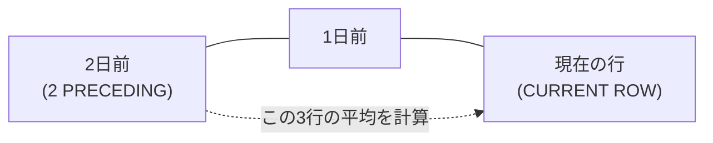

# 問題12-13：移動平均によるトレンド分析（Windowフレームの応用）
### 難易度：★★★☆☆ (Lv.3)
## 問題
SHスキーマの`SALES`テーブルを使用して、商品ID（`PROD_ID`）が「**20**」の商品について、**2021年7月～8月の日別売上推移**を算出してください。
単なる日次売上だけでなく、売上の傾向を滑らかに把握するために、「自分を含めた過去3日間の平均売上（3日間移動平均）」も同時に計算してください。

**【条件およびルール】**
* **TIME_ID**: 販売日。
* **DAILY_SALES**: その日の売上合計（`AMOUNT_SOLD`の合計）。
* **MOVING_AVG_3DAYS**: 自身を含む、最大3日前までの `DAILY_SALES` の平均値。
* 小数点以下は四捨五入して第2位まで表示してください。
* 結果は日付の昇順で表示してください。

## 期待する結果
| TIME_ID               | DAILY_SALES | MOVING_AVG_3DAYS |
| ----------------------- | ------------ | ------------------ |
| 2021-07-07T00:00:00Z      | 36200.12       | 36200.12              |
| 2021-07-10T00:00:00Z      | 9230.62        | 22715.37              |
| 2021-07-13T00:00:00Z      | 13371.2        | 19600.65              |
| 2021-07-16T00:00:00Z      | 16093.89       | 12898.57              |
| 2021-07-17T00:00:00Z      | 54332.45       | 27932.51              |
| 2021-07-23T00:00:00Z      | 49865.69       | 40097.34              |
| 2021-07-26T00:00:00Z      | 19618.33       | 41272.16              |
| 2021-07-30T00:00:00Z      | 10660.04       | 26714.69              |
| 2021-08-07T00:00:00Z      | 37534.64       | 22604.34              |
| 2021-08-10T00:00:00Z      | 11254.76       | 19816.48              |
| 2021-08-13T00:00:00Z      | 12628.8        | 20472.73              |
| 2021-08-16T00:00:00Z      | 16852.8        | 13578.79              |
| 2021-08-17T00:00:00Z      | 21757.89       | 17079.83              |
| 2021-08-23T00:00:00Z      | 52063.66       | 30224.78              |
| 2021-08-26T00:00:00Z      | 23172.75       | 32331.43              |
| 2021-08-30T00:00:00Z      | 34190.23       | 36475.55              |

## 解答例
```sql
WITH daily_data AS (
    -- 1. まず日別の売上を集計する（分析関数の前準備）
    SELECT
        time_id,
        SUM(amount_sold) AS daily_sales
    FROM
        sh.sales
    WHERE
        prod_id = 20
        AND time_id BETWEEN DATE '2021-07-01' AND DATE '2021-8-31'
    GROUP BY
        time_id
)
SELECT
    time_id,
    daily_sales,
    -- 2. 集計済みのデータに対して、過去2行〜現在行までの範囲で平均を出す
    ROUND(
        AVG(daily_sales) OVER(
            ORDER BY time_id
            ROWS BETWEEN 2 PRECEDING AND CURRENT ROW
        ), 2
    ) AS moving_avg_3days
FROM
    daily_data
ORDER BY
    time_id
```
## 解説
今回は売上推移や株価分析などの「時系列解析」で使われる「移動平均」の問題です。日次の売上データは、曜日や特売日によって上下（スパイク）するため、そのままではトレンドが見えにくいことがあります。そこで、前後のデータを平均化して滑らかにするこの手法がよく使われます。

このクエリは「集計してから分析する」という2段構えの構造になっています。まず`daily_data`（共通テーブル式）の中で、生の販売データを「1日1行」にまとめます。1日に複数回の販売があるため、まずは`SUM(amount_sold)`を行い、その日の合計売上（`daily_sales`）を確定させます。分析関数（Window関数）を適用する前に、こうしてデータの粒度を整えておくのがコツです。

メインの`SELECT`文で、Window関数を使って計算を行います。
```sql
AVG(daily_sales) OVER(
    ORDER BY time_id
    ROWS BETWEEN 2 PRECEDING AND CURRENT ROW
)
```
この`ROWS BETWEEN ...`の部分が今回の移動平均の核心です。



`ROWS`は行の物理的な位置に基づいて範囲を決めるという意味、`2 PRECEDING`は現在の行から数えて「2行前」まで、`CURRENT ROW`は「現在の行」まで、`AND`は範囲の開始と終了をつなぐ役割です。結果として「2日前＋1日前＋今日」の合計3行が平均計算の対象になります。データの1行目（初日）には「2日前」が存在しませんが、この場合Oracleは存在する行（1行目のみ）だけで平均を出してくれます。エラーにならないのがWindow関数の良いところです。

| 種類 | 基準 | 使いどころ |
| :--- | :--- | :--- |
| `ROWS` | 行の物理的な位置 | データが欠損していてもレコードがある日だけを繋いで見たいとき |
| `RANGE` | 値（日付）の間隔 | 「過去3日分の日付」を厳密に指定したいとき |

実務では`ROWS`（行数）のほかに`RANGE`を使うこともあります。`ROWS`は物理的に「前の行」を見るため、データが欠損している（例：7/11の売上が0でレコード自体がない）場合でも、無理やりその前の「行」を拾います。`RANGE`は値（日付）の間隔を見るため、「過去3日分の日付」を厳密に指定したい場合はこちらが適していますが、今回のようにレコードがある日だけを繋いで傾向を見るなら`ROWS`が一般的です。

同じ書き方で、平均（`AVG`）を合計（`SUM`）に変えれば「直近3日間の累積売上」になります。
```sql
SUM(daily_sales) OVER(ORDER BY time_id ROWS 2 PRECEDING) 
-- ※CURRENT ROWは省略可能
```

----
<br><br>

# 【完全版】問題12-14：未来予測の予兆（LEAD関数による購入間隔分析）
### 難易度：★★★☆☆ (Lv.3)
## 問題
マーケティング部門では、顧客の離脱を防ぐための「リピート予測モデル」の構築を計画しています。その前段階として、優良顧客が通常「何日おきに注文をしているか」というリードタイムを把握する必要があります。
特定の顧客（`CUSTOMER_ID = 101`）をモデルケースとして、過去の注文履歴から「今回の注文日」と「次回の注文日」を横並びにしたリストを作成し、リピート注文までの経過日数を算出してください。
OEスキーマの`ORDERS` テーブルより、顧客ID（`CUSTOMER_ID`）が `101` の従業員を対象として、以下の情報を取得してください。

**【取得項目】**
1. **`ORDER_ID`**: 注文ID
2. **`CURRENT_ORDER`**: 今回の注文日（`YYYY-MM-DD`形式）
3. **`NEXT_ORDER`**: **次回の注文日**（`YYYY-MM-DD`形式）
4. **`DAYS_TO_NEXT`**: 次回の注文までの日数（`NEXT_ORDER` - `CURRENT_ORDER`）

**【抽出・算出ルール】**
* 注文日（`ORDER_DATE`）の昇順で並べ替えた際の「次の行」の注文日を `NEXT_ORDER` とします。
* 最後の注文行など、次に注文がない場合は `NEXT_ORDER` には `NULL` を表示してください。
* 日数計算において、TIMESTAMP型の差分から「日」の部分を抽出してください。

## 期待する結果
| ORDER_ID | CURRENT_ORDER | NEXT_ORDER  | DAYS_TO_NEXT |
| -------- | -------------- | ------------ | ------------- |
| 2458     | 2007-08-16       | 2007-10-02     | 46              |
| 2430     | 2007-10-02       | 2008-03-29     | 179             |
| 2413     | 2008-03-29       | 2008-07-27     | 119             |
| 2447     | 2008-07-27       |                 |                 |

## 解答例、解説
[](https://zenn.dev/kinopp/books/0b24d659785f31)

----
<br><br>

# 【完全版】問題12-15：基準値との比較（FIRST_VALUE / LAST_VALUE）
### 難易度：★★★☆☆ (Lv.3)
## 問題
人事部より、部門内の給与格差に関する分析レポートの依頼がありました。
各部門において、「その部門で最も早く採用された従業員（最初に入社した人）」の給与を基準値（ベースライン）とし、他の従業員との給与差を可視化したいと考えています。
これにより、勤続年数と給与の相関関係や、初期メンバーと後発メンバーの待遇差を調査します。
HRスキーマの`EMPLOYEES` テーブルより、部門ID（`DEPARTMENT_ID`）が `60`（IT）および `90`（Executive）の従業員を対象として、以下の情報を取得してください。

**【取得項目】**
1. **`DEPARTMENT_ID`**: 部門ID
2. **`FIRST_NAME`**: 名前
3. **`HIRE_DATE`**: 採用日
4. **`SALARY`**: 給与
5. **`BASE_SALARY`**: その部門で **最も早く採用された人** の給与（`FIRST_VALUE` を使用）
6. **`DIFF_BASE`**: 基準給与との差分（`SALARY` - `BASE_SALARY`）

**【抽出・算出ルール】**
* 部門（`PARTITION BY department_id`）ごとに計算してください。
* 「最も早く採用された」の判定は、採用日（`HIRE_DATE`）の昇順とします。
* 同日に採用された人が複数いる場合は、`EMPLOYEE_ID` が小さい方を優先してください。
* 結果は、部門IDの昇順、次に採用日の昇順で表示してください。

## 期待する結果
| DEPARTMENT_ID | FIRST_NAME | HIRE_DATE              | SALARY | BASE_SALARY | DIFF_BASE |
| -------------- | ----------- | ------------------------ | ------- | ------------- | ---------- |
| 60              | David        | 2015-06-25T00:00:00Z        | 4800     | 4800            | 0            |
| 60              | Alexander    | 2016-01-03T00:00:00Z        | 9000     | 4800            | 4200         |
| 60              | Valli        | 2016-02-05T00:00:00Z        | 4800     | 4800            | 0            |
| 60              | Diana        | 2017-02-07T00:00:00Z        | 4200     | 4800            | -600         |
| 60              | Bruce        | 2017-05-21T00:00:00Z        | 6000     | 4800            | 1200         |
| 90              | Lex          | 2011-01-13T00:00:00Z        | 17000    | 17000           | 0            |
| 90              | Steven       | 2013-06-17T00:00:00Z        | 24000    | 17000           | 7000         |
| 90              | Neena        | 2015-09-21T00:00:00Z        | 17000    | 17000           | 0            |

## 解答例、解説
[](https://zenn.dev/kinopp/books/0b24d659785f31)

----
<br><br>

# 【完全版】問題12-16：分析関数版 LISTAGG（明細へのリスト付与）
### 難易度：★★★★☆ (Lv.4)
## 問題
注文管理システム（OEスキーマ）において、カスタマーサポート向けの注文明細照会画面を作成しています。
担当者は、ある注文（`ORDER_ID`）に含まれる各商品（`PRODUCT_ID`）の詳細を確認しながら、同時に「その注文の中に他にどんな商品が一緒に買われているか」をひと目で把握したいと考えています。
行を1行に集約してしまうのではなく、全明細行を表示したまま、その横に「注文内全商品リスト」を添えて出力してください。
OEスキーマの **`ORDER_ITEMS`** および **`PRODUCT_INFORMATION`** テーブルを使用し、`ORDER_ID` が `2355` および `2374` のデータを対象として、以下の情報を取得してください。

**【取得項目】**
1. **`ORDER_ID`**: 注文ID
2. **`PRODUCT_ID`**: 商品ID
3. **`PRODUCT_NAME`**: 商品名
4. **`ALL_ITEMS_IN_ORDER`**: **その注文に含まれる全商品のリスト**

**【抽出・算出ルール】**
* `ALL_ITEMS_IN_ORDER` は、注文（`PARTITION BY order_id`）ごとに商品名（`PRODUCT_NAME`）をカンマ＋スペース（`', '`）で区切って連結してください。
* リスト内の商品名の並び順は、商品名のアルファベット昇順（`WITHIN GROUP (ORDER BY product_name)`）としてください。
* 結果は、注文IDの昇順、次に商品名の昇順で表示してください。

## 期待する結果
| ORDER_ID | PRODUCT_ID | PRODUCT_NAME            | ALL_ITEMS_IN_ORDER                                                                                                                                    | 
| -------- | ---------- | ----------------------- | ----------------------------------------------------------------------------------------------------------------------------------------------------- | 
| 2355     | 2289       | KB 101/ES               | KB 101/ES, LCD Monitor 9/PM, PS 220V /L, Paper - Std Printer, Plastic Stock - R, Plastic Stock - Y, Screws <B.32.P>, Screws <Z.28.P>, Video Card /E32 | 
| 2355     | 2359       | LCD Monitor 9/PM        | KB 101/ES, LCD Monitor 9/PM, PS 220V /L, Paper - Std Printer, Plastic Stock - R, Plastic Stock - Y, Screws <B.32.P>, Screws <Z.28.P>, Video Card /E32 | 
| 2355     | 2311       | PS 220V /L              | KB 101/ES, LCD Monitor 9/PM, PS 220V /L, Paper - Std Printer, Plastic Stock - R, Plastic Stock - Y, Screws <B.32.P>, Screws <Z.28.P>, Video Card /E32 | 
| 2355     | 2339       | Paper - Std Printer     | KB 101/ES, LCD Monitor 9/PM, PS 220V /L, Paper - Std Printer, Plastic Stock - R, Plastic Stock - Y, Screws <B.32.P>, Screws <Z.28.P>, Video Card /E32 | 
| 2355     | 2330       | Plastic Stock - R       | KB 101/ES, LCD Monitor 9/PM, PS 220V /L, Paper - Std Printer, Plastic Stock - R, Plastic Stock - Y, Screws <B.32.P>, Screws <Z.28.P>, Video Card /E32 | 
| 2355     | 2326       | Plastic Stock - Y       | KB 101/ES, LCD Monitor 9/PM, PS 220V /L, Paper - Std Printer, Plastic Stock - R, Plastic Stock - Y, Screws <B.32.P>, Screws <Z.28.P>, Video Card /E32 | 
| 2355     | 2323       | Screws <B.32.P>         | KB 101/ES, LCD Monitor 9/PM, PS 220V /L, Paper - Std Printer, Plastic Stock - R, Plastic Stock - Y, Screws <B.32.P>, Screws <Z.28.P>, Video Card /E32 | 
| 2355     | 2322       | Screws <Z.28.P>         | KB 101/ES, LCD Monitor 9/PM, PS 220V /L, Paper - Std Printer, Plastic Stock - R, Plastic Stock - Y, Screws <B.32.P>, Screws <Z.28.P>, Video Card /E32 | 
| 2355     | 2308       | Video Card /E32         | KB 101/ES, LCD Monitor 9/PM, PS 220V /L, Paper - Std Printer, Plastic Stock - R, Plastic Stock - Y, Screws <B.32.P>, Screws <Z.28.P>, Video Card /E32 | 
| 2374     | 2423       | C for SPNIX4.0 - 1 Seat | C for SPNIX4.0 - 1 Seat, OSI 1-4/IL, SPNIX4.0 - SAL, SPNIX4.0 - UL/D                                                                                  | 
| 2374     | 2449       | OSI 1-4/IL              | C for SPNIX4.0 - 1 Seat, OSI 1-4/IL, SPNIX4.0 - SAL, SPNIX4.0 - UL/D                                                                                  | 
| 2374     | 2422       | SPNIX4.0 - SAL          | C for SPNIX4.0 - 1 Seat, OSI 1-4/IL, SPNIX4.0 - SAL, SPNIX4.0 - UL/D                                                                                  | 
| 2374     | 2467       | SPNIX4.0 - UL/D         | C for SPNIX4.0 - 1 Seat, OSI 1-4/IL, SPNIX4.0 - SAL, SPNIX4.0 - UL/D                                                                                  | 

## 解答例、解説
[](https://zenn.dev/kinopp/books/0b24d659785f31)

----
<br><br>

# 【完全版】問題12-17：統計的分布（CUME_DIST / PERCENT_RANK）
### 難易度：★★★☆☆ (Lv.3)
## 問題
マーケティング部門では、製品の価格戦略を検討するために、各製品カテゴリ内における製品価格の「相対的なポジション」を分析しています。
単なる順位（1位、2位…）ではなく、「その製品よりも高い製品がどれくらい存在するか」という割合を数値化することで、高級ラインの製品（上位10%など）を動的に特定したいと考えています。
SHスキーマの`PRODUCTS`テーブルより、製品カテゴリ（`PROD_CATEGORY_ID`）が `205`（Electronics）の製品を対象として、以下の情報を取得してください。

**【取得項目】**
1. **`PROD_ID`**: 製品ID
2. **`PROD_NAME`**: 製品名
3. **`PROD_LIST_PRICE`**: 定価
4. **`CUME_DIST_VAL`**: **累積分布**
5. **`PERCENT_RANK_VAL`**: **パーセンタイル順位**

**【抽出・算出ルール】**
* 価格（`PROD_LIST_PRICE`）の**降順**（高い順）で並べた際の分布を計算してください。
* 計算結果は小数点第4位を四捨五入して表示してください。
* 結果は、定価の降順で表示してください。
## 期待する結果
| PROD_ID | PROD_NAME                       | PROD_LIST_PRICE | CUME_DIST_VAL | PERCENT_RANK_VAL | 
| ------- | -------------------------------- | ---------------- | -------------- | ------------------ | 
| 28      | English Willow Cricket Bat        | 199.99             | 0.0385           | 0                   | 
| 19      | Cricket Bat Bag                   | 55.99              | 0.0769           | 0.04                | 
| 123     | Helmet                            | 49.99              | 0.1154           | 0.08                | 
| 40      | Team shirt                        | 44.99              | 0.3462           | 0.12                | 
| 44      | Team shirt                        | 44.99              | 0.3462           | 0.12                | 
| 45      | Team shirt                        | 44.99              | 0.3462           | 0.12                | 
| 41      | Team shirt                        | 44.99              | 0.3462           | 0.12                | 
| 42      | Team shirt                        | 44.99              | 0.3462           | 0.12                | 
| 43      | Team shirt                        | 44.99              | 0.3462           | 0.12                | 
| 126     | Spiked Shoes                      | 28.99              | 0.3846           | 0.36                | 
| 113     | Cricket Ball                      | 22.99              | 0.4231           | 0.4                 | 
| 23      | Plastic Cricket Bat                | 21.99              | 0.4615           | 0.44                | 
| 124     | Wicket Keeper Gloves               | 18.99              | 0.5769           | 0.48                | 
| 122     | Wide Brim Hat                     | 18.99              | 0.5769           | 0.48                | 
| 114     | Cricket Ball - Training Ball        | 18.99              | 0.5769           | 0.48                | 
| 125     | Bucket Hat                        | 15.99              | 0.6154           | 0.6                 | 
| 116     | Catchers Helmet                   | 11.99              | 0.6923           | 0.64                | 
| 48      | Indoor Cricket Ball                 | 11.99              | 0.6923           | 0.64                | 
| 121     | Cricket - Athletic Guard Cup         | 10.99              | 0.7308           | 0.72                | 
| 30      | Linseed Oil                       | 9.99               | 0.7692           | 0.76                | 
| 117     | Plastic - Beach Cricket Wickets     | 8.99               | 0.8846           | 0.8                 | 
| 31      | Fiber Tape                        | 8.99               | 0.8846           | 0.8                 | 
| 115     | Plastic - Beach Cricket Ball        | 8.99               | 0.8846           | 0.8                 | 
| 118     | Cricket Bails                     | 7.99               | 0.9231           | 0.92                | 
| 120     | Cricket Peak Cap                  | 6.99               | 1                | 0.96                | 
| 119     | Cricket Bails - Junior              | 6.99               | 1                | 0.96                | 

## 解答例、解説
[](https://zenn.dev/kinopp/books/0b24d659785f31)

----
<br><br>

# 【完全版】問題12-18：売上の前月比と成長率の算出（LAG関数の応用）
### 難易度：★★★☆☆ (Lv.3)
## 問題
SH（売上履歴）スキーマを使用し、特定の商品について月ごとの売上推移を分析します。単なる売上額だけでなく、「前月からの増減額」**および**「売上成長率（前月比%）」を算出してください。
これにより、売上の勢いが加速しているのか、鈍化しているのかを判断します。
SHスキーマの`SALES`テーブルより、商品ID（`PROD_ID`）が「**13**」の商品を対象に、2021年の月別売上レポートを作成してください。

**【算出項目】**
1. **MONTH**: 売上月（`YYYY-MM`形式）。
2. **MONTHLY_SALES**: その月の売上合計（`AMOUNT_SOLD`の合計）。
3. **PREV_MONTH_SALES**: **前月**の `MONTHLY_SALES` 。
4. **SALES_DELTA**: 前月からの増減額（`MONTHLY_SALES` - `PREV_MONTH_SALES`）。
5. **GROWTH_RATE**: 前月比成長率（小数第3位を四捨五入し、XX.XX% 形式で表示）。

## 期待する結果
| MONTH   | MONTHLY_SALES | PREV_MONTH_SALES | SALES_DELTA | GROWTH_RATE | 
| ------- | -------------- | ------------------ | ------------- | ------------- | 
| 2021-01 | 85697.96         |                     |                |  %             | 
| 2021-02 | 215811.29        | 85697.96              | 130113.33       | 151.83%          | 
| 2021-03 | 160276.7         | 215811.29             | -55534.59       | -25.73%          | 
| 2021-04 | 177791.56        | 160276.7              | 17514.86        | 10.93%           | 
| 2021-05 | 169206.96        | 177791.56             | -8584.6         | -4.83%           | 
| 2021-06 | 152892.03        | 169206.96             | -16314.93       | -9.64%           | 
| 2021-07 | 174558.16        | 152892.03             | 21666.13        | 14.17%           | 
| 2021-08 | 221150.28        | 174558.16             | 46592.12        | 26.69%           | 
| 2021-09 | 163743.33        | 221150.28             | -57406.95       | -25.96%          | 
| 2021-10 | 227343.36        | 163743.33             | 63600.03        | 38.84%           | 
| 2021-11 | 150036.7         | 227343.36             | -77306.66       | -34%             | 
| 2021-12 | 230453.02        | 150036.7              | 80416.32        | 53.6%            | 

## 解答例、解説
[](https://zenn.dev/kinopp/books/0b24d659785f31)

----
<br><br>

# 【完全版】問題12-19：パレート分析（ABC分析）による重要商品の特定
### 難易度：★★★★☆ (Lv.4)
## 問題
「売上の8割は全商品のうちの2割が作っている」というパレートの法則（80:20の法則）に基づき、SHスキーマの商品別売上を分析します。
各商品が全体売上に占める**累計構成比**を計算し、商品をA・B・Cランクに分類してください。
2019年の売上データに基づき、以下の条件で商品リストを作成してください。

**【集計ルール】**
1. **PROD_REVENUE**: 商品ごとの2019年の売上合計を算出。
2. **CUMULATIVE_PCT**: 売上額の**降順**で並べた際の、売上の**累計構成比**（その商品までの累計売上 ÷ 全体売上）を算出 。
3. **ABC_RANK**: 累計構成比に基づき以下のランクを付与。
   * 70%まで：**'A'**
   * 70%超〜90%まで：**'B'**
   * 90%超：**'C'**

## 期待する結果
上位の商品（Aランク：〜70%）と中位（Bランク：70〜90%）、そして下位（Cランク：90%超）に分類された商品一覧が、売上降順・累計構成比とともに出力される（全商品リスト、詳細は元データ参照）。上位9商品（Lithium Electric Golf Caddy 〜 Pro Maple Youth Bat）で累計69.85%に到達し、以降がBランク・Cランクへと続く。

## 解答例、解説
[](https://zenn.dev/kinopp/books/0b24d659785f31)

----
<br><br>

# 【完全版】問題12-20：中央値と外れ値の検出（PERCENTILE_CONT）
### 難易度：★★★★☆ (Lv.4)
## 問題
人事部では、平均給与だけでなく「中央値（メジアン）」を用いて部門間の給与バランスを調査しています。平均値は極端な高額所得者（外れ値）に引きずられやすいため、中央値との乖離を見ることで実態に近い給与水準を把握します。
HRスキーマの `EMPLOYEES` テーブルを使用し、各部門（`DEPARTMENT_ID`）における以下の統計量を算出してください。

**【算出項目】**
1. **AVG_SAL**: 部門の平均給与。
2. **MEDIAN_SAL**: 部門の**給与中央値**（`PERCENTILE_CONT(0.5)` を使用）。
3. **DIFF**: 平均と中央値の差分（`AVG_SAL` - `MEDIAN_SAL`）。
4. 対象は `DEPARTMENT_ID` が 50, 80, 100 の部門とします。

## 期待する結果
| DEPARTMENT_ID | AVG_SAL | MEDIAN_SAL | DIFF   | 
| -------------- | -------- | ----------- | ------- | 
| 50              | 3475.56    | 3100          | 375.56    | 
| 80              | 8955.88    | 8900          | 55.88     | 
| 100             | 8601.33    | 8000          | 601.33    | 

## 解答例、解説
[](https://zenn.dev/kinopp/books/0b24d659785f31)

----
<br><br>

# 【完全版】問題12-21：IGNORE NULLSによる欠損値の前方補完（為替レートの穴埋め）
### 難易度：★★★☆☆ (Lv.3)
## 問題
経理部門が管理している月次の為替レート表は、レートが変動した月にだけ値が記録されており、変動がなかった月は`NULL`のまま放置されています。この「歯抜け」のレート表を、**直近に記録されていたレートで埋める（前方補完する）** SQLを作成してください。

**【条件およびルール】**
* データは通貨（`CURRENCY_CD`）ごとに、`RATE_MONTH`（対象月）の昇順で並んでいます。
* `RATE`列にレートが記録されている月は、その値をそのまま表示してください。
* `RATE`列が`NULL`の月は、**同じ通貨の中で直近に記録されていた（NULLではない）レート**を使って埋めてください。
* 埋めた結果は`FILLED_RATE`列として表示してください（`RATE`列自体は変更しません）。
* 結果は通貨コードの昇順、次に対象月の昇順で表示してください。

**【前提データ（WITH句）】**
```sql
WITH exchange_rates AS (
    SELECT DATE '2024-01-01' AS rate_month, 'USD' AS currency_cd, 150.00 AS rate FROM dual UNION ALL
    SELECT DATE '2024-02-01', 'USD', NULL   FROM dual UNION ALL
    SELECT DATE '2024-03-01', 'USD', 148.50 FROM dual UNION ALL
    SELECT DATE '2024-04-01', 'USD', NULL   FROM dual UNION ALL
    SELECT DATE '2024-05-01', 'USD', NULL   FROM dual UNION ALL
    SELECT DATE '2024-06-01', 'USD', 152.00 FROM dual UNION ALL
    SELECT DATE '2024-01-01', 'EUR', 160.00 FROM dual UNION ALL
    SELECT DATE '2024-02-01', 'EUR', NULL   FROM dual UNION ALL
    SELECT DATE '2024-03-01', 'EUR', NULL   FROM dual UNION ALL
    SELECT DATE '2024-04-01', 'EUR', 158.00 FROM dual UNION ALL
    SELECT DATE '2024-05-01', 'EUR', NULL   FROM dual UNION ALL
    SELECT DATE '2024-06-01', 'EUR', NULL   FROM dual
)
SELECT * FROM exchange_rates
```

## 期待する結果
| CURRENCY_CD | RATE_MONTH | RATE  | FILLED_RATE | 
| ----------- | ---------- | ----- | ----------- | 
| EUR         | 2024/01    | 160   | 160         | 
| EUR         | 2024/02    |       | 160         | 
| EUR         | 2024/03    |       | 160         | 
| EUR         | 2024/04    | 158   | 158         | 
| EUR         | 2024/05    |       | 158         | 
| EUR         | 2024/06    |       | 158         | 
| USD         | 2024/01    | 150   | 150         | 
| USD         | 2024/02    |       | 150         | 
| USD         | 2024/03    | 148.5 | 148.5       | 
| USD         | 2024/04    |       | 148.5       | 
| USD         | 2024/05    |       | 148.5       | 
| USD         | 2024/06    | 152   | 152         | 

## 解答例、解説
[](https://zenn.dev/kinopp/books/0b24d659785f31)

----
<br><br>

# 【完全版】問題12-22：WIDTH_BUCKETによる度数分布表（ヒストグラム）の作成
### 難易度：★★★★☆ (Lv.4)
## 問題
とある店舗の1日の購入履歴（返品によるマイナス金額や、まとめ買いによる高額決済も含む）をもとに、購入金額の**度数分布表（ヒストグラム）** を作成してください。

**【条件およびルール】**
* 購入金額を **0円から10,000円まで、2,000円刻みの5つの区分（ビン）** に分類してください。
* 0円未満（返品によるマイナス金額）は「**0円未満（返品）**」という区分にまとめてください。
* 10,000円以上（範囲の上限を超える高額決済）は「**10,000円以上（VIP）**」という区分にまとめてください。
* 各区分に該当する件数（`PURCHASE_COUNT`）を集計してください。
* 結果は区分番号（`BUCKET_NO`）の昇順で表示してください。

**【前提データ（WITH句）】**
```sql
WITH sales_log AS (
    SELECT 1200  AS purchase_amount FROM dual UNION ALL
    SELECT 3400  FROM dual UNION ALL
    SELECT 7600  FROM dual UNION ALL
    SELECT 500   FROM dual UNION ALL
    SELECT 2200  FROM dual UNION ALL
    SELECT 9800  FROM dual UNION ALL
    SELECT 4300  FROM dual UNION ALL
    SELECT 6700  FROM dual UNION ALL
    SELECT 1500  FROM dual UNION ALL
    SELECT 8900  FROM dual UNION ALL
    SELECT 3300  FROM dual UNION ALL
    SELECT 5600  FROM dual UNION ALL
    SELECT -500  FROM dual UNION ALL  -- 返品
    SELECT 7200  FROM dual UNION ALL
    SELECT 15000 FROM dual UNION ALL  -- VIP顧客のまとめ買い
    SELECT 4800  FROM dual UNION ALL
    SELECT 6100  FROM dual UNION ALL
    SELECT 2700  FROM dual
)
SELECT * FROM sales_log
```

## 期待する結果
| BUCKET_NO | PRICE_RANGE         | PURCHASE_COUNT | 
| --------- | ------------------- | -------------- | 
| 0         | 0円未満（返品）     | 1              | 
| 1         | 0～2,000円未満      | 3              | 
| 2         | 2,000～4,000円未満  | 4              | 
| 3         | 4,000～6,000円未満  | 3              | 
| 4         | 6,000～8,000円未満  | 4              | 
| 5         | 8,000～10,000円未満 | 2              | 
| 6         | 10,000円以上（VIP） | 1              | 

## 解答例、解説
[](https://zenn.dev/kinopp/books/0b24d659785f31)