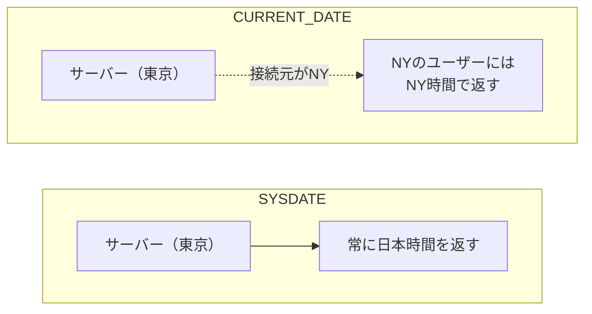
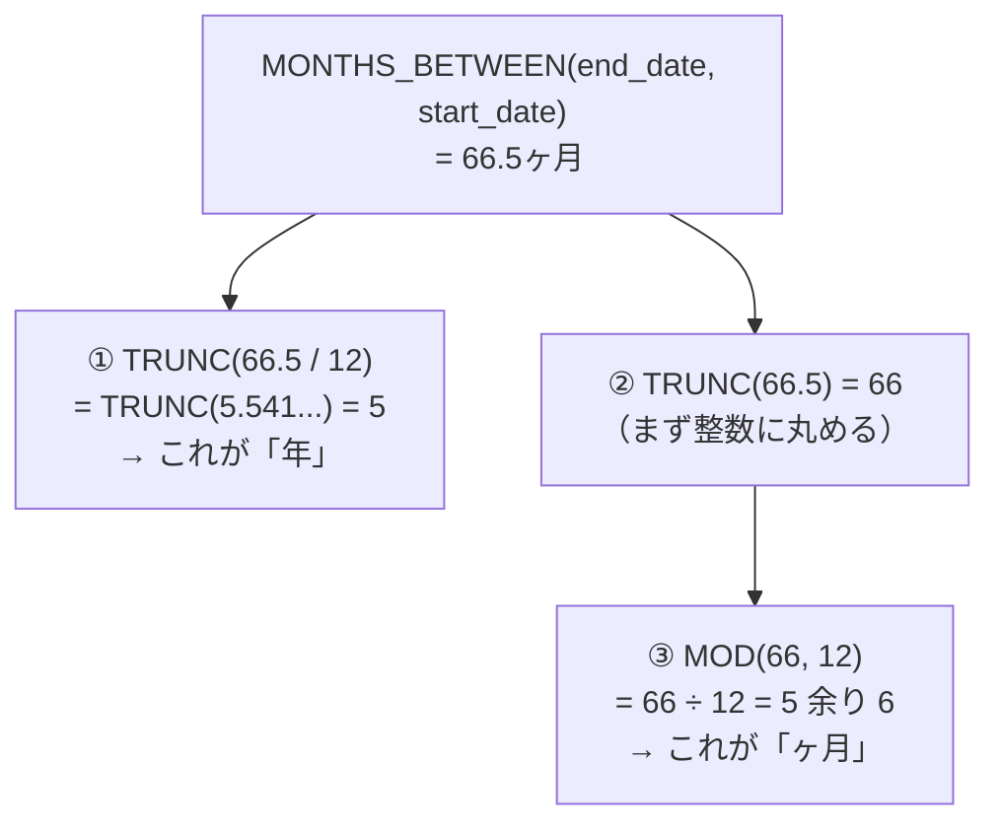
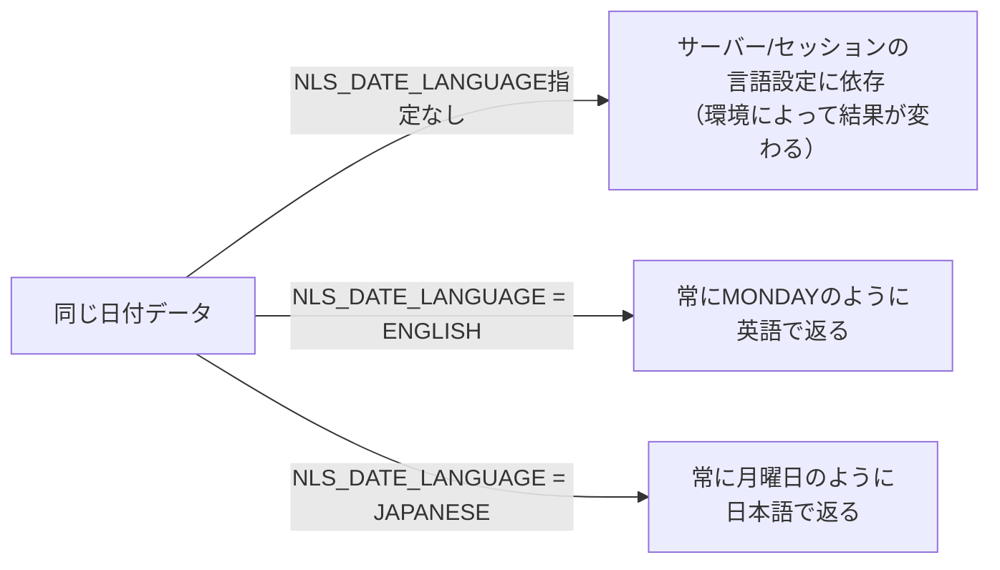
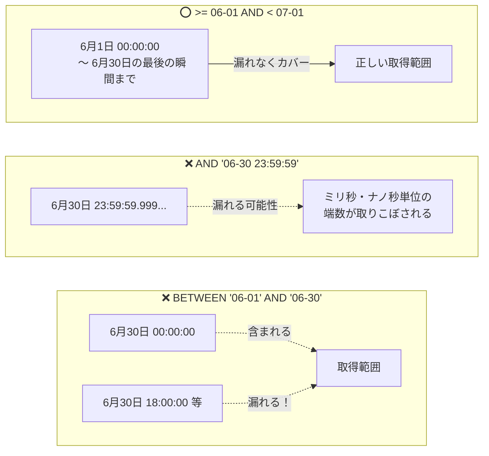
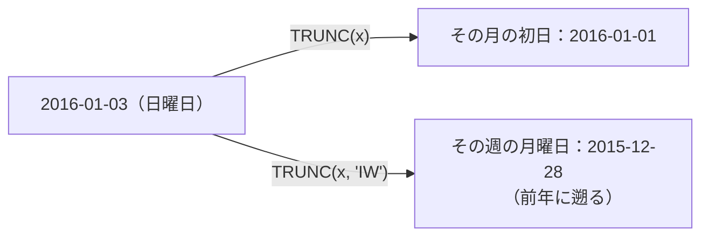
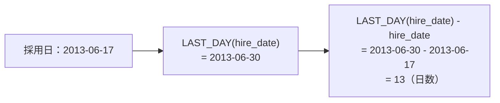
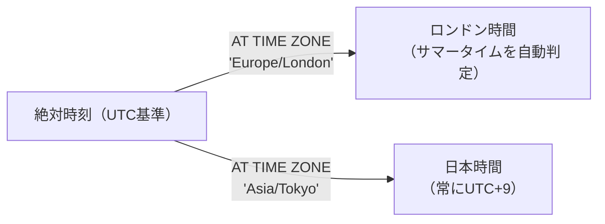
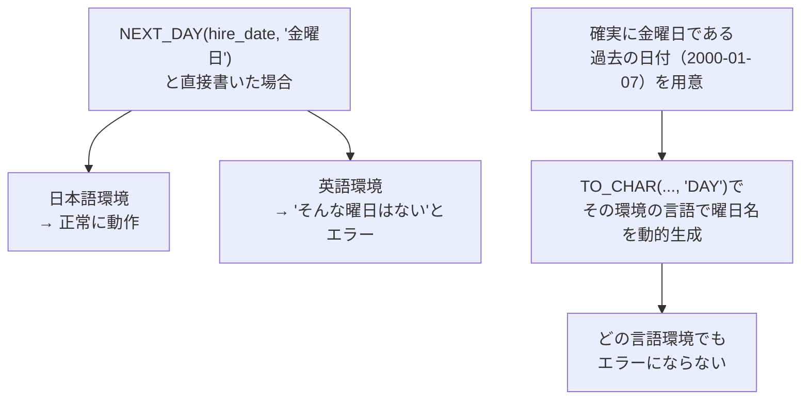
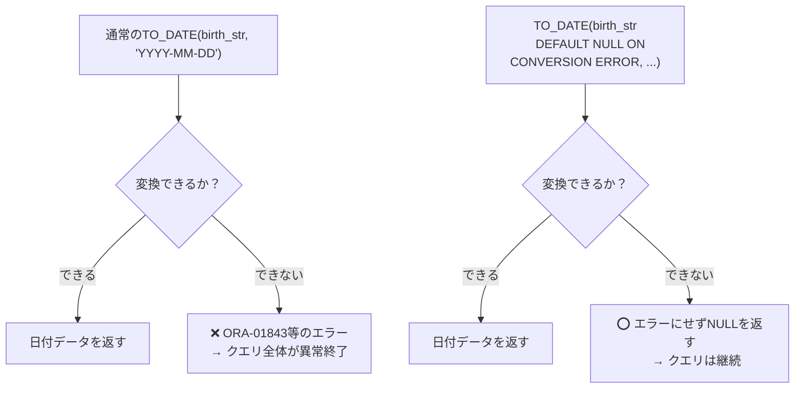
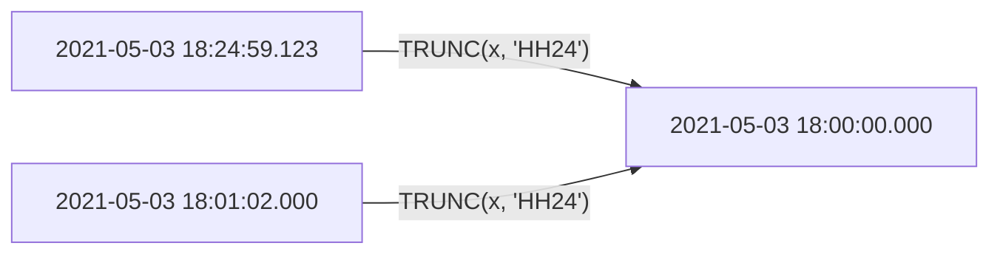

# 問題7-1：現在日時（DATE型）
### 難易度：★☆☆☆☆ (Lv.1)
## 問題
データベースのサーバー、またはセッションの現在日付（DATE型）を取得してください。
Oracle Databaseにおける基本的なシステム日付の取得方法を確認します。

## 期待する結果
| NOW                  |
| -------------------- |
| 2026-03-07T23:42:48Z |
> 表示される値は、SQLを実行した際の日時によって変動します。

## 解答例
```sql:例1：SYSDATEで取得
SELECT
    SYSDATE AS "NOW"
FROM
    dual
```
```sql:例2：CURRENT_DATEで取得
SELECT
    CURRENT_DATE AS "NOW"
FROM
    dual
```
```sql:例3：FROM DUALを省略（23c以降）
SELECT
    SYSDATE AS "NOW"
```

## 解説
SQLにおいて日付の扱いは、売上集計や期限管理など、ビジネスロジックの要（かなめ）となります。Oracleで現在の日時を取得する、基本的な2つの関数の違いを整理しましょう。

| 関数 | 基準 | 具体例 |
| :--- | :--- | :--- |
| `SYSDATE` | データベースが稼働している**サーバー（OS）**の現在時刻 | サーバーが日本にあれば常に日本時間を返す |
| `CURRENT_DATE` | 接続している**ユーザー（セッション）**のタイムゾーン | サーバーが東京でも、NYから接続すればNY時間を返す |



`SYSDATE`（システム日付）は最も一般的に使われる関数で、**データベースが稼働しているサーバー（OS）の現在時刻**を返します。サーバーが日本にあれば日本時間を返します。誰がどこから接続していても同じ値になる、という意味で「一定の基準」を持つ関数です。

一方`CURRENT_DATE`（セッション日付）は、**接続しているユーザー（セッション）のタイムゾーン**における現在時刻を返します。例えばサーバーが東京にあっても、ニューヨークから接続しているユーザーがタイムゾーンを設定していれば、ニューヨークの時刻が表示されます。この2つの違いを理解しておかないと、「同じテーブルを見ているのに、人によって表示される日時がズレる」という不可解な現象に遭遇することがあります。

解答例で使われている `FROM dual` は、Oracle特有の「ダミーテーブル」です。Oracleの`SELECT`文は必ず`FROM`句でテーブルを指定しなければならないというルールがあるため、`DUMMY`というカラムが1つ、行が1行だけ入っている特別なテーブルを、定数や関数の結果を確認するための計算台として使います。最新のOracle Database 23cからは、この`FROM dual`を省略できるようになり、他のデータベース（PostgreSQLやSQL Serverなど）の書き方に近づいています。

期待する結果の形式（`2026-03-07T23:42:48Z`）からも分かる通り、OracleのDATE型は日付だけでなく「秒」までの時刻情報を含んでいます。「今日の日付のデータだけ欲しい」と思って`WHERE hire_date = SYSDATE`と書いてしまうと、時刻までぴったり一致しない限りヒットしないというミスがよく起こります。日付だけを比較したい場合は、後ほど登場する`TRUNC`関数で時刻を切り捨てるのが基本です。

:::message
### DUAL表
DUAL表はOracleが提供する1行1列のダミーテーブルです。
```sql
SELECT * FROM dual
```
| DUMMY |
| ----- |
| X     |

OracleでSQLを記述する場合、必ずFROM句を書かなければならないというルールがあります。SYSDATEなど特定のテーブルから値を取得しない場合、FROM句にどのテーブルを指定すればいいのか、という問題が出てきます。その際に使うのがDUAL表です。

活用シーンとしては、SYSDATEのように特定のテーブルの値を必要としない関数を使う場合、`SELECT upper('oracle') FROM dual;` のような関数の動作確認、`SELECT my_sequence.NEXTVAL FROM dual;` のような自動採番の取得などがあります。なお、23c以降はDUAL表の指定自体が不要になっています。
:::

## 参考リンク
https://www.shift-the-oracle.com/sql/functions/sysdate.html
https://www.shift-the-oracle.com/sql/functions/current_date.html
https://www.youtube.com/watch?v=wIOGTeA4heg&list=PLb1qVSx1k1VovCRavgMQSS_cvwJoNpAGc&index=1

----
<br><br>

# 問題7-2：現在日時（TIMESTAMP型）
### 難易度：★☆☆☆☆ (Lv.1)
## 問題
データベースのサーバー、またはセッションの現在日付（TIMESTAMP型）を取得してください。
DATE型よりも精度の高い（秒未満を含む）日時情報の取得方法を確認します。

## 期待する結果
| NOW                         |
| --------------------------- |
| 2026-03-07T23:57:37.027035Z |
> 表示される値は、SQLを実行した際の日時によって変動します。

## 解答例
```sql:例1：SYSTIMESTAMPで取得
SELECT
    SYSTIMESTAMP AS "NOW"
FROM
    dual
```
```sql:例2：CURRENT_TIMESTAMPで取得
SELECT
    CURRENT_TIMESTAMP AS "NOW"
FROM
    dual
```
```sql:例3：LOCALTIMESTAMPで取得
SELECT
    LOCALTIMESTAMP AS "NOW"
FROM
    dual
```
## 解説
前問のDATE型に続き、今回はさらに高精度なTIMESTAMP型を取得する関数の解説です。実務では「ミリ秒単位のログ記録」や「タイムゾーンをまたぐグローバルなシステム」で、このTIMESTAMP系関数が必須になります。

解答例にある3つの関数は、「どこの時間を基準にするか」と「タイムゾーン情報を含めるか」という点が異なります。

| 関数 | 基準 | タイムゾーン情報 |
| :--- | :--- | :---: |
| `SYSTIMESTAMP` | データベースサーバー | あり |
| `CURRENT_TIMESTAMP` | 接続ユーザー（セッション） | あり |
| `LOCALTIMESTAMP` | 接続ユーザー（セッション） | なし |

`SYSTIMESTAMP`はデータベースサーバーを基準に、タイムゾーン情報ありで返します。サーバーのOS時刻とサーバーの時差をそのまま返すイメージです。`CURRENT_TIMESTAMP`は接続ユーザー（セッション）を基準に、タイムゾーン情報ありで返します。`LOCALTIMESTAMP`も接続ユーザーを基準にしますが、時差データは含みません。時刻はユーザー設定に従うものの、タイムゾーンの情報自体は持たない、という違いです。

DATE型とTIMESTAMP型の大きな違いは2つあります。

| 観点 | DATE型 | TIMESTAMP型 |
| :--- | :--- | :--- |
| 精度 | 秒まで | 最大ナノ秒（10億分の1秒）まで |
| 時差の扱い | 時差を持たない | `TIMESTAMP WITH TIME ZONE`なら「どこの国の何時か」を保持できる |

実務での使い分けとしては、「サーバーにデータが書き込まれた絶対的な瞬間」を記録したい更新ログや監査トレースには`SYSTIMESTAMP`、「東京のユーザーには日本時間、ロンドンのユーザーには現地時間」で表示・登録したいアプリには`CURRENT_TIMESTAMP`、時差情報は不要だが秒以下の細かい精度だけが欲しい場合には`LOCALTIMESTAMP`が向いています。

実行環境（ツール）の設定によっては、TIMESTAMPを取得しても秒までしか表示されないことがあります。その場合は、後ほど学ぶ`TO_CHAR`関数でフォーマットを指定することで、`.027035`のような細かい数値までしっかり確認できるようになります。

## 参考リンク
https://www.shift-the-oracle.com/guideline/datetime-datetimestring.html
https://www.shift-the-oracle.com/urchin/sysdate-systimestamp.html

----
<br><br>

# 問題7-3：日付のフォーマット
### 難易度：★☆☆☆☆ (Lv.1)
## 問題
HRスキーマの`JOB_HISTORY`テーブルからすべてのデータを取得してください。
その際、日付型の項目である`START_DATE`と`END_DATE`を、**「YYYY-MM-DD」形式**（例：2026-05-11）の文字列に変換して表示してください。なお、結果の表示順は問いません。

## 期待する結果
| EMPLOYEE_ID | START_DATE | END_DATE   |
| ----------- | ---------- | ---------- |
| 102         | 2011-01-13 | 2016-07-24 |
| 101         | 2007-09-21 | 2011-10-27 |
| 101         | 2011-10-28 | 2015-03-15 |
| 201         | 2014-02-17 | 2017-12-19 |
| 114         | 2016-03-24 | 2017-12-31 |
| 122         | 2017-01-01 | 2017-12-31 |
| 200         | 2005-09-17 | 2011-06-17 |
| 176         | 2016-03-24 | 2016-12-31 |
| 176         | 2017-01-01 | 2017-12-31 |
| 200         | 2012-07-01 | 2016-12-31 |

## 解答例
```sql
SELECT
    employee_id,
    TO_CHAR(start_date, 'YYYY-MM-DD') AS start_date,
    TO_CHAR(end_date, 'YYYY-MM-DD')   AS end_date
FROM
    hr.job_history
```


## 解説
日付データをそのまま表示すると、データベースの設定（NLS_DATE_FORMAT）によって「07-MAY-26」だったり「26/05/07」だったりとバラバラになりがちです。そこで登場するのが、日付を自由な見た目に変換する`TO_CHAR`関数です。
```sql
TO_CHAR( [日付データ], '[フォーマットマスク]' )
```
今回使用した`'YYYY-MM-DD'`の意味は、次のようになります。

| フォーマット記号 | 意味 | 桁数 |
| :---: | :--- | :---: |
| `YYYY` | 西暦 | 4桁 |
| `MM` | 月 | 2桁 |
| `DD` | 日 | 2桁 |
| `-`（ハイフン） | 区切り文字としてそのまま表示 | - |

実務でよくリクエストされるフォーマットもいくつか紹介しておきます。

| フォーマット | 用途 |
| :--- | :--- |
| `'YYYY/MM/DD'` | 日本でおなじみのスラッシュ区切り |
| `'YYYY-MM-DD HH24:MI:SS'` | 時刻まで含める |
| `'YYYYMM'` | 年月のみ（年別・月別集計向け） |
| `'YYYY-MM-DD (DY)'` | 曜日を入れる（言語設定に依存） |

「アプリ側のプログラムで整形すればいいのでは」と思うかもしれませんが、SQL側でフォーマットするメリットは大きいです。どのツールで出力しても期待通りの形式でデータが出てくるという統一感、`TO_CHAR(hire_date, 'YYYY')`で抽出すればそのまま年別の集計に使えるという便利さ、Excelなどで開いたときに日付として正しく認識されやすい形式で書き出せるという扱いやすさ、といった点が挙げられます。

一点注意しておきたいのが、`TO_CHAR`を使った後のデータは「日付型」ではなく「文字列型」になっているという点です。この結果を使って「1日足す」といった日付計算をしようとするとエラーになります。計算は`TO_CHAR`する前に済ませておくのが基本です。

## 参考リンク
https://www.shift-the-oracle.com/sql/functions/to_char-datetime.html

----
<br><br>

# 問題7-4：年、月、日の抽出
### 難易度：★★☆☆☆ (Lv.2)
## 問題
OEスキーマの`CUSTOMERS`テーブルより、**1985年生まれ**の顧客を取得し、以下のルールに従って表示してください。なお、結果の表示順は問いません。

**【編集ルール】**
* **ID**：`CUSTOMER_ID`を表示する。
* **NAME**：`CUST_FIRST_NAME`と`CUST_LAST_NAME`を半角スペースを挟んで結合する。
* **BIRTHDAY**：`DATE_OF_BIRTH`を「〇〇〇〇年〇月〇日」という形式の文字列に変換する。
* 月や日が1桁の場合、先頭の「0」は表示しないこと（例：05月→5月）。

## 期待する結果
| ID  | NAME             | BIRTHDAY      |
| --- | ---------------- | ------------- |
| 215 | Orson Perkins    | 1985年5月24日 |
| 253 | Sally Bogart     | 1985年1月14日 |
| 255 | Brooke Shepherd  | 1985年2月13日 |
| 328 | Hannah Field     | 1985年10月6日 |
| 838 | Alfred Nicholson | 1985年1月25日 |
| 913 | Bob Sharif       | 1985年1月10日 |

## 解答例
```sql:例1：TO_CHARを使用（従来のやり方）
SELECT
    customer_id       AS id,
    cust_first_name || ' ' || cust_last_name AS NAME,
    TO_CHAR(date_of_birth, 'YYYY') || '年' || 
      TO_CHAR(date_of_birth,'FMMM') || '月' ||
        TO_CHAR(date_of_birth, 'FMDD') || '日' AS BIRTHDAY
FROM
    oe.customers
WHERE
    date_of_birth BETWEEN TO_DATE('1985-01-01', 'YYYY-MM-DD') 
                      AND TO_DATE('1985-12-31', 'YYYY-MM-DD')
ORDER BY
    id
```
```sql:例2：TO_CHARを使用（スマートなやり方）
SELECT
    customer_id       AS id,
    cust_first_name || ' ' || cust_last_name AS NAME,
    TO_CHAR(date_of_birth, 'YYYY"年"FMMM"月"DD"日"') AS BIRTHDAY
FROM
    oe.customers
WHERE
    date_of_birth BETWEEN TO_DATE('1985-01-01', 'YYYY-MM-DD') 
                      AND TO_DATE('1985-12-31', 'YYYY-MM-DD')
ORDER BY
    id
```
```sql:例3：EXTRACTを使用
SELECT
    customer_id       AS id,
    cust_first_name || ' ' || cust_last_name AS NAME,
    EXTRACT(YEAR FROM date_of_birth) || '年' || 
      EXTRACT(MONTH FROM date_of_birth) || '月' ||
        EXTRACT(DAY FROM date_of_birth) || '日' AS BIRTHDAY
FROM
    oe.customers
WHERE
    date_of_birth BETWEEN date'1985-01-01' 
                      AND date'1985-12-31'
ORDER BY
    id
```

## 解説
日付データを扱う上で避けては通れない「年・月・日の個別抽出」と「日本語フォーマットへの整形」です。解答例には3つのアプローチが示されています。特に「01月」を「1月」と表示させるテクニックなど、細かいこだわりが詰まった問題です。

**3つのアプローチの比較**

| 方式 | コードの長さ | 覚えるべきこと | 数値としての利用 |
| :--- | :--- | :--- | :--- |
| 例1：TO_CHAR + `\|\|`結合 | やや長い（関数を何度も呼ぶ） | シンプルで分かりやすい | できない（文字列） |
| 例2：TO_CHARの1発整形 | 短い | フォーマット内の`FM`と`" "`の記法 | できない（文字列） |
| 例3：EXTRACT | 中間（結合が必要） | 標準SQLに近い書き方 | できる（数値型） |

解答例2は、`TO_CHAR`関数の機能をフル活用したスマートな書き方です。通常、`MM`や`DD`は「01」「05」のように2桁で表示されますが（先頭ゼロ埋め）、「1」「5」のように数字だけ表示したい場合は先頭に`FM`（Fill Mode）を付けます（`TO_CHAR(date, 'MM')`→05、`TO_CHAR(date, 'FMMM')`→5）。また、フォーマットマスクの中で「年」や「月」といった特定の文字をそのまま表示させたい場合は、その文字をダブルクォーテーションで囲みます。これを使えば、例1のように`||`で何度も結合しなくても、一発で整形が可能です。

解答例3の`EXTRACT`は、日付から特定の要素を数値型として取り出す標準的な関数です。
```sql
EXTRACT(YEAR FROM [日付])  -- 年を数値で取得
EXTRACT(MONTH FROM [日付]) -- 月を数値で取得
EXTRACT(DAY FROM [日付])   -- 日を数値で取得
```
結果が数値として返ってくるため、そのまま「1月」と表示され、先頭に0はつきません。数値として計算（誕生月が偶数か判定するなど）に使う場合に便利です。

解答例3のWHERE句にある `date'1985-01-01'` のような書き方は「日付リテラル」と呼ばれます。`TO_DATE`を使わずに、ISO標準の形式で日付を直感的に書けるため、コードの可読性が上がります。

3つのアプローチを比べると、解答例2のTO_CHARは1つの関数で複雑な整形が完結しコードが最も短くなる一方、フォーマットマスクの記法（FMや`" "`）を覚える必要があります。解答例3のEXTRACTは数値として要素を取り出せて標準SQLに近いですが、表示用に文字と結合する場合は記述が長くなりがちです。解答例1の結合方式は仕組みが単純で分かりやすい反面、関数を何度も呼ぶため少し冗長です。

なお、今回のように「1985年」のデータを取る場合、`TO_CHAR(date_of_birth, 'YYYY') = '1985'`と書いても正解ですが、`BETWEEN`を使う方がデータベースのインデックスを効率よく使えるため、速度面で有利になることが多いです。

:::message
### 日付リテラル（ANSI日付リテラル）
日付リテラルは、`TO_DATE`関数を使わずに、よりシンプルな形式で日付を指定する方法です。「時間は不要で、決まった形式（YYYY-MM-DD）で書きたいとき」に便利です。
```sql
DATE 'YYYY-MM-DD'
```
`TO_DATE`と比べて、いくつか守るべきルールがあります。

| ルール | 内容 |
| :--- | :--- |
| フォーマット固定 | `YYYY-MM-DD`のみ。スラッシュ区切りや2桁年はエラー |
| 年月日までしか指定できない | 時・分・秒を含めたい場合はTIMESTAMPリテラルを使う |

もう一つの違いとして、`TO_DATE`は実行時に文字列を日付へ変換する処理が走りますが、日付リテラルはデータベースが最初から日付として認識するため、わずかにパフォーマンス面で有利な場合があります（通常は気にするほどの差ではありません）。

使い分けの目安としては、プログラム内の固定値や手動でサクッと投げるクエリには`DATE '2024-01-01'`が読みやすくおすすめです。画面からの入力値や特殊な形式の文字列を扱う場合は、`TO_DATE(:input_val, 'YYYY/MM/DD')`のように柔軟に指定できる`TO_DATE`を使うのがよいでしょう。
:::

## 参考リンク
https://www.shift-the-oracle.com/sql/functions/extract.html
https://www.shift-the-oracle.com/sql/functions/to_date.html

----
<br><br>

# 問題7-5：日付の加算
### 難易度：★★☆☆☆ (Lv.2)
## 問題
HRスキーマの`EMPLOYEES`テーブルより、職種（`JOB_ID`）が「AD_VP」の従業員を対象として、採用日（`HIRE_DATE`）を基準に以下の日付を取得してください。
**【取得内容】**
* **HIRE_DATE**：採用日
* **HIRE_DATE + 2DAY**：採用日の2日後の日付
* **HIRE_DATE + 2MONTH**：採用日の2ヶ月後の日付
* **HIRE_DATE + 2YEAR**：採用日の2年後の日付
※すべて「YYYY-MM-DD」形式の文字列に変換して表示してください。

## 期待する結果
| EMPLOYEE_ID | NAME       | HIRE_DATE  | HIRE_DATE + 2DAY | HIRE_DATE + 2MONTH | HIRE_DATE + 2YEAR |
| ----------- | ---------- | ---------- | ----------------- | -------------------- | -------------------- |
| 101         | Neena Yang | 2015-09-21 | 2015-09-23         | 2015-11-21            | 2017-09-21            |
| 102         | Lex Garcia | 2011-01-13 | 2011-01-15         | 2011-03-13            | 2013-01-13            |

## 解答例
```sql
SELECT
    employee_id,
    first_name || ' ' || last_name as name,
    TO_CHAR(hire_date, 'YYYY-MM-DD')                   AS "HIRE_DATE",
    TO_CHAR(hire_date + 2, 'YYYY-MM-DD')               AS "HIRE_DATE + 2DAY",
    TO_CHAR(ADD_MONTHS(hire_date, 2), 'YYYY-MM-DD')    AS "HIRE_DATE + 2MONTH",
    TO_CHAR(ADD_MONTHS(hire_date, 2*12), 'YYYY-MM-DD') AS "HIRE_DATE + 2YEAR"
FROM
    hr.employees
WHERE
    job_id = 'AD_VP';
```

## 解説
いよいよ日付の「計算」です。Oracle SQLにおいて日付は単なるデータではなく、数値のように足したり引いたりできる存在です。今回のポイントは、「単位（日・月・年）によって計算方法が異なる」という点です。

| 単位 | 計算方法 | 理由 |
| :--- | :--- | :--- |
| 日 | `hire_date + 2`（算術演算子） | DATE型は内部的に数値扱いで「1 = 1日」 |
| 月 | `ADD_MONTHS(hire_date, 2)` | 月ごとに日数が違う（28〜31日）ため単純な足し算が使えない |
| 年 | `ADD_MONTHS(hire_date, 2*12)` | 年を足す専用関数はなく「1年=12ヶ月」として計算 |

日を足す場合が最もシンプルです。OracleのDATE型は内部的に数値として扱われており、「1 = 1日」を意味します。そのため、日数を足したいときは単に算術演算子（`+`）を使うだけです（`hire_date + 2`で2日後、`hire_date - 1`で1日前）。

月を足す場合は、単純に「+ 30」とはいきません。月によって30日だったり31日だったり、2月は28日（うるう年は29日）だったりするからです。そこで`ADD_MONTHS`関数を使います。

```sql
ADD_MONTHS( [日付], [足したい月数] )
```


賢いポイントとして、月末（例：1月31日）に1ヶ月足すと、正しく「2月28日（または29日）」を返してくれるなど、カレンダーの不規則性を自動で吸収してくれます。

年を足す専用の関数は実は用意されていません。そのため「1年 = 12ヶ月」というルールを利用して、`ADD_MONTHS(hire_date, 2 * 12)`のように`ADD_MONTHS`で計算するのが一般的です。

解答例のやり方は伝統的なOracleの書き方ですが、最近の実務（特に他DBへの移行も考慮する場合）では、より英語に近い`INTERVAL`を使うことも増えています。
```sql
-- こう書くこともできます
hire_date + INTERVAL '2' DAY    -- 2日後
hire_date + INTERVAL '2' MONTH  -- 2ヶ月後
hire_date + INTERVAL '2' YEAR   -- 2年後
```
ただし`INTERVAL`は「1月31日の1ヶ月後」のような計算をしようとするとエラーを出す場合があるなど、挙動がややシビアです。まずは解答例の`ADD_MONTHS`を使いこなせるようになるのが上達の近道だと思います。

実務では、発送から3日後を到着予定日にする期限管理（`shipping_date + 3`）、1年後の更新日を算出する契約更新（`ADD_MONTHS(contract_date, 12)`）など、この計算パターンは頻繁に登場します。解答例のように、計算した結果を最後に`TO_CHAR`で整形するのが、SQLの基本的な処理順序です。

## 参考リンク
https://www.shift-the-oracle.com/sql/functions/add_months.html

----
<br><br>

# 問題7-6：期間の算出
### 難易度：★★☆☆☆ (Lv.2)
## 問題
HRスキーマの`JOB_HISTORY`テーブルより、各職務の開始日（`START_DATE`）から終了日（`END_DATE`）までの期間を算出し、「〇年〇ヶ月」という形式で取得してください。なお、結果の表示順は問いません。

**【算出のヒント】**
* 2つの日付間の月数を求めるには `MONTHS_BETWEEN` 関数を使用します。
* 月数を12で割った商を「年」、12で割った余りを「ヶ月」として算出してください。
* 月数の端数は切り捨てて計算してください。

## 期待する結果
| EMPLOYEE_ID | JOB_ID     | 期間      |
| ----------- | ---------- | --------- |
| 102         | IT_PROG    | 5年6ヶ月  |
| 101         | AC_ACCOUNT | 4年1ヶ月  |
| 101         | AC_MGR     | 3年4ヶ月  |
| 201         | MK_REP     | 3年10ヶ月 |
| 114         | ST_CLERK   | 1年9ヶ月  |
| 122         | ST_CLERK   | 0年11ヶ月 |
| 200         | AD_ASST    | 5年9ヶ月  |
| 176         | SA_REP     | 0年9ヶ月  |
| 176         | SA_MAN     | 0年11ヶ月 |
| 200         | AC_ACCOUNT | 4年5ヶ月  |

## 解答例
```sql
SELECT
    employee_id,
    job_id,
    TRUNC(MONTHS_BETWEEN(end_date, start_date) / 12) || '年' || 
      MOD(TRUNC(MONTHS_BETWEEN(end_date, start_date)), 12) || 'ヶ月' 
                                                           AS "期間"
FROM
    hr.job_history
```

## 解説
今回は日付の「差」を求める計算です。単に「何日間」を出すのは簡単ですが、「○年○ヶ月」という形式にするには、算数の「割り算」と「余り」の考え方をSQLで表現する必要があります。

日付同士の期間を計算する際、もっとも強力な味方が`MONTHS_BETWEEN`です。
```sql
MONTHS_BETWEEN( [後の日付], [前の日付] )
```
2つの日付の間の月数を数値で返し、31日の月も30日の月も考慮して「1.5ヶ月」のように小数点を含めて正確に算出してくれます。

解答例の計算式を、102番の従業員（5年6ヶ月）を例に分解してみましょう。まず`MONTHS_BETWEEN`の結果が仮に66.5ヶ月だったとします。



「年」を出すには、1年は12ヶ月なので全体の月数を12で割り、小数点以下を切り捨てます。`TRUNC(66.5 / 12)` は `TRUNC(5.541...)` となり、結果は5です。

「ヶ月」を出すには、「年」として計算しきれなかった余りの月数が必要です。ここで便利なのが余りを計算する`MOD`関数です。`MOD(TRUNC(66.5), 12)` は「66 ÷ 12 = 5 余り 6」の計算になり、結果は6になります。

ここで2回`TRUNC`が登場するのが少し分かりにくいポイントかもしれません。`MONTHS_BETWEEN`は「30.5」のように端数を返すことがあり、そのまま`MOD`に入れると「余り 6.5」のような中途半端な結果になってしまいます。そのため、一度`TRUNC`で整数（月数）に丸めてから、12で割った余り（0〜11ヶ月）を出す、という2段階の処理になっています。

この計算は、「入社から現在まで何年何ヶ月働いているか」という勤続年数の算出や、ローン・分割払いの経過期間、誕生月を考慮した厳密な年齢表示など、人事システムや顧客管理システムで重宝します。

期待する結果を見ると、122番の従業員が「0年11ヶ月」と表示されています。もし`TRUNC(... / 12)`をせずに`MONTHS_BETWEEN`だけを使っていたら、「0.916...年」のような直感的に分かりにくい数値になってしまいます。「DBが計算しやすい値（月数）」を「人間が理解しやすい形式（年・月）」へ変換するこのスキルは、レポート作成の現場で役立つ場面が多いです。

## 参考リンク
https://www.shift-the-oracle.com/sql/functions/months_between.html

----
<br><br>

# 問題7-7：曜日、四半期の算出
### 難易度：★★☆☆☆ (Lv.2)
## 問題
HRスキーマの`EMPLOYEES`テーブルより、`EMPLOYEE_ID`が200を超える従業員を対象として、以下の値を取得してください。なお、結果の表示順は問いません。

**【取得内容】**
* **曜日E**：採用日（`HIRE_DATE`）の曜日を**英語**で表示する（例：MONDAY）。
* **曜日J**：採用日（`HIRE_DATE`）の曜日を**日本語**で表示する（例：月曜日）。
* **四半期**：採用日（`HIRE_DATE`）が属する**四半期**を数値（1～4）で表示する。
※曜日の言語指定には、`TO_CHAR`関数の第3引数（`NLS_DATE_LANGUAGE`）を使用してください。

## 期待する結果
| EMPLOYEE_ID | HIRE_DATE            | 曜日E    | 曜日J  | 四半期 |
| ----------- | -------------------- | -------- | ------ | ------ |
| 201         | 2014-02-17T00:00:00Z | MONDAY   | 月曜日 | 1      |
| 202         | 2015-08-17T00:00:00Z | MONDAY   | 月曜日 | 3      |
| 203         | 2012-06-07T00:00:00Z | THURSDAY | 木曜日 | 2      |
| 204         | 2012-06-07T00:00:00Z | THURSDAY | 木曜日 | 2      |
| 205         | 2012-06-07T00:00:00Z | THURSDAY | 木曜日 | 2      |
| 206         | 2012-06-07T00:00:00Z | THURSDAY | 木曜日 | 2      |

## 解答例
```sql
SELECT
    employee_id,
    hire_date,
    TO_CHAR(hire_date, 'DAY', 'NLS_DATE_LANGUAGE = ENGLISH')  AS "曜日E",
    TO_CHAR(hire_date, 'DAY', 'NLS_DATE_LANGUAGE = JAPANESE') AS "曜日J",
    TO_CHAR(hire_date, 'Q')                                   AS "四半期"
FROM
    hr.employees
```

## 解説
今回は、日付から「曜日」と「四半期」という、カレンダー上の付加情報を取り出す方法です。どちらも`TO_CHAR`関数のフォーマットマスクを変えるだけで簡単に取得できます。

曜日を取得するには、フォーマットマスクに`'DAY'`を指定します。ただし、そのまま使うとデータベースのセッション設定に依存した言語（日本語環境なら日本語、英語環境なら英語）で表示されてしまい、実行環境によって結果が変わってしまいます。これを固定するために、`TO_CHAR`の第3引数に`NLS_DATE_LANGUAGE`パラメータを渡します。
```sql
TO_CHAR(hire_date, 'DAY', 'NLS_DATE_LANGUAGE = ENGLISH')
TO_CHAR(hire_date, 'DAY', 'NLS_DATE_LANGUAGE = JAPANESE')
```



こうしておけば、クエリを実行するサーバーやセッションの言語設定に関わらず、常に指定した言語で曜日が返ってきます。実務でレポートの表示を固定したいときや、複数の拠点で同じクエリを共有するときに欠かせないテクニックです。私も以前、開発環境と本番環境でセッションのNLS設定が違っていて、開発では日本語で出ていた曜日が本番では英語になってしまい慌てたことがあります。それ以来、曜日や月名を扱うときは必ず`NLS_DATE_LANGUAGE`を明示するようにしています。

四半期を取得するには、フォーマットマスクに`'Q'`を指定するだけです。`TO_CHAR(hire_date, 'Q')`は、1〜3月なら1、4〜6月なら2、7〜9月なら3、10〜12月なら4、というように、月をもとに自動的に四半期番号を返してくれます。

| 月 | 四半期（Q） |
| :---: | :---: |
| 1月・2月・3月 | 1 |
| 4月・5月・6月 | 2 |
| 7月・8月・9月 | 3 |
| 10月・11月・12月 | 4 |

期待する結果を見ても、2014-02-17（2月）が「1」、2015-08-17（8月）が「3」、2012-06-07（6月）が「2」と、それぞれ正しい四半期に振り分けられています。

会計年度や販売実績のレポートでは「四半期ごとの集計」がよく求められますが、`GROUP BY TO_CHAR(order_date, 'Q')`のように書くだけで、面倒な月の判定ロジックを自分で書かずに済みます。

----
<br><br>

# 問題7-8：日時の範囲指定
### 難易度：★★☆☆☆ (Lv.2)
## 問題
COスキーマの`ORDERS`テーブルより、注文日時（`ORDER_TMS`）が**2021年6月**であるデータを取得してください。
ただし、対象とする顧客は`CUSTOMER_ID`が350から359までの範囲に該当するレコードに限定します。なお、結果の表示順は問いません。

**【ポイント】**
* `TIMESTAMP`リテラルを使用して範囲を指定してください。
* 索引を効率的に使用するため、列側（`ORDER_TMS`）に関数（`TO_CHAR`など）を適用せず、比較演算子（`>=` および `<`）を用いた条件式を作成してください。

## 期待する結果
| CUSTOMER_ID | ORDER_TMS                   |
| ----------- | ---------------------------- |
| 351         | 2021-06-03T16:04:46.024146Z |
| 354         | 2021-06-08T04:17:12.071275Z |
| 350         | 2021-06-13T18:10:25.420066Z |
| 352         | 2021-06-30T18:09:40.698324Z |

## 解答例
```sql
SELECT
    customer_id,
    order_tms
FROM
    co.orders
WHERE
    customer_id BETWEEN 350 AND 359
    AND order_tms >= TIMESTAMP '2021-06-01 00:00:00'
    AND order_tms  < TIMESTAMP '2021-07-01 00:00:00'
```

## 解説
今回は、大量のデータの中から特定の「期間」を、データベースに負荷をかけず正確に抜き出すための実践的なテクニックです。一見シンプルですが、この書き方にはいくつかの現場の知恵が詰まっています。

日付やタイムスタンプの範囲指定で、間違いが少なく推奨されるのが「以上」と「未満」の組み合わせです。



もし`BETWEEN '2021-06-01' AND '2021-06-30'`と書いてしまうと、「6月30日の00:00:00」までのデータしか取れず、それ以降（18:00など）のデータが漏れてしまいます。かといって`AND '2021-06-30 23:59:59'`と書くのも危険です。TIMESTAMP型はミリ秒やナノ秒単位まで保持しているため、その「最後の1秒」の中にデータが存在する可能性があるからです。「翌月の1日0時未満」と指定しておけば、6月30日の最後の瞬間まで漏れなくカバーできます。

解答例で使われている`TIMESTAMP 'YYYY-MM-DD HH24:MI:SS'`という書き方はTIMESTAMPリテラルと呼ばれます。`TO_TIMESTAMP`関数を使わずに、文字列を直接タイムスタンプ型として認識させることができ、余計な関数を挟まないためクエリが読みやすくなります。

「6月のデータが欲しいなら`WHERE TO_CHAR(order_tms, 'YYYYMM') = '202106'`でもいいのでは」と思うかもしれません。結果自体は同じになりますが、実務（特に数千万件のデータがある場合）ではあまり推奨されません。

| 書き方 | インデックスの利用 | 処理イメージ |
| :--- | :--- | :--- |
| `WHERE TO_CHAR(order_tms, 'YYYYMM') = '202106'` | ❌ 使えない | 全行を一度文字列に変換してから比較（低速） |
| `WHERE order_tms >= ... AND order_tms < ...` | ⭕ 使える | インデックスで対象期間まで一気にジャンプ（高速） |

カラムを関数（`TO_CHAR`など）で加工してしまうと、そのカラムに貼られたインデックスが使えなくなるためです。関数を使う場合は全行を一度文字に変換してから比較するため時間がかかりますが、範囲指定であればインデックスを使って対象の期間まで一気にジャンプできるため、はるかに高速です。

期待する結果を見ると、6月3日、8日、13日、30日と、しっかり1ヶ月分のデータが取得できています。特に30日の`18:09:40...`というデータは、もし「30日の0時まで」という指定ミスをしていたら取りこぼしていたはずのデータです。この「以上・未満」のセットは、日付だけでなく数値の範囲指定でも役立つ考え方です。

----
<br><br>

# 問題7-9：日付の切り捨て
### 難易度：★★☆☆☆ (Lv.2)
## 問題
HRスキーマの`EMPLOYEES`テーブルより、`EMPLOYEE_ID`が110より小さい従業員を対象として、採用日（`HIRE_DATE`）を基準に以下の日付を取得してください。なお、結果の表示順は問いません。

**【取得内容】**
* **その日(秒以下切り捨て)**：`HIRE_DATE`の時刻部分を切り捨てた年月日
* **その月の初日**：採用日の属する月の1日
* **その年の初日**：採用日の属する年の1月1日
* **その四半期の初日**：採用日の属する四半期の開始日
* **その週の月曜日**：採用日の属する週の月曜日（ISO週）

※結果はすべて「YYYY-MM-DD」形式の文字列に変換して表示してください。

## 期待する結果
| EMPLOYEE_ID | HIRE_DATE            | その日(秒以下切り捨て) | その月の初日 | その年の初日 | その四半期の初日 | その週の月曜日 |
| ----------- | -------------------- | ------------------------ | -------------- | -------------- | ------------------ | ---------------- |
| 100         | 2013-06-17T00:00:00Z | 2013-06-17                | 2013-06-01      | 2013-01-01      | 2013-04-01           | 2013-06-17         |
| 101         | 2015-09-21T00:00:00Z | 2015-09-21                | 2015-09-01      | 2015-01-01      | 2015-07-01           | 2015-09-21         |
| 102         | 2011-01-13T00:00:00Z | 2011-01-13                | 2011-01-01      | 2011-01-01      | 2011-01-01           | 2011-01-10         |
| 103         | 2016-01-03T00:00:00Z | 2016-01-03                | 2016-01-01      | 2016-01-01      | 2016-01-01           | 2015-12-28         |
| 104         | 2017-05-21T00:00:00Z | 2017-05-21                | 2017-05-01      | 2017-01-01      | 2017-04-01           | 2017-05-15         |
| 105         | 2015-06-25T00:00:00Z | 2015-06-25                | 2015-06-01      | 2015-01-01      | 2015-04-01           | 2015-06-22         |
| 106         | 2016-02-05T00:00:00Z | 2016-02-05                | 2016-02-01      | 2016-01-01      | 2016-01-01           | 2016-02-01         |
| 107         | 2017-02-07T00:00:00Z | 2017-02-07                | 2017-02-01      | 2017-01-01      | 2017-01-01           | 2017-02-06         |
| 108         | 2012-08-17T00:00:00Z | 2012-08-17                | 2012-08-01      | 2012-01-01      | 2012-07-01           | 2012-08-13         |
| 109         | 2012-08-16T00:00:00Z | 2012-08-16                | 2012-08-01      | 2012-01-01      | 2012-07-01           | 2012-08-13         |

## 解答例
```sql
SELECT
    employee_id,
    hire_date,
    TO_CHAR(TRUNC(hire_date),      'YYYY-MM-DD') AS "その日(秒以下切り捨て)",
    TO_CHAR(TRUNC(hire_date,'MM'), 'YYYY-MM-DD') AS "その月の初日",
    TO_CHAR(TRUNC(hire_date,'YY'), 'YYYY-MM-DD') AS "その年の初日",
    TO_CHAR(TRUNC(hire_date, 'Q'), 'YYYY-MM-DD') AS "その四半期の初日",
    TO_CHAR(TRUNC(hire_date,'IW'), 'YYYY-MM-DD') AS "その週の月曜日"
FROM
    hr.employees
WHERE
    employee_id < 110
```

## 解説
今回は、日付データを意図した単位で丸めるための重要関数、`TRUNC`（日付版）の解説です。「今月分の売上だけ集計したい」「週ごとのレポートを作りたい」といった実務の場面で、この関数がよく使われます。

`TRUNC`関数は、指定した「書式モデル」に基づいて、それ以下の単位をすべて切り捨てます。
```sql
TRUNC( [日付データ], '[書式モデル]' )
```

| 書式モデル | 切り捨てられる単位 | 結果 |
| :---: | :--- | :--- |
| （指定なし） | 時・分・秒 | その日の00:00:00 |
| `'MM'` | 日以下 | 月の1日 |
| `'Q'` | 月・日以下 | 四半期の初日（1, 4, 7, 10月の1日） |
| `'YY'` | 月・日以下 | 年の1月1日 |
| `'IW'` | 曜日（ISO週基準） | 週の月曜日 |



書式モデルを変えるだけで、自由に「基準日」を作り出せます。何も指定しない場合は時刻（時・分・秒）が切り捨てられてその日の00:00:00になり、`'MM'`なら日が切り捨てられて月の1日に、`'Q'`なら四半期の初日（1, 4, 7, 10月の1日）に、`'YY'`なら年の1月1日に、`'IW'`なら週の月曜日（ISO週基準）になります。

OracleのDATE型は、目に見えていなくても内部的に必ず「時・分・秒」を持っています。`2013-06-17 15:30:00`と`2013-06-17 00:00:00`は、人間には同じ日に見えますが、SQLの比較（`=`）では「一致しない」と判定されてしまいます。`TRUNC`を使うことで、すべてのデータの時刻を強制的に00:00:00に揃えることができ、日付単位での正しい比較やグループ化（`GROUP BY`）が可能になります。

実務では、「月別の売上合計」を出したいときに`GROUP BY TRUNC(order_date, 'MM')`と書くだけで、1ヶ月分のデータを「その月の1日」というラベルでまとめられます。また`TRUNC(SYSDATE, 'IW')`を使えば、今日が何曜日であっても「今週の月曜日」を自動的に特定できます。

期待する結果の103番（2016-01-03）を見てみましょう。その月の初日は1月1日ですが、その週の月曜日は2015-12-28になっています。1月3日は日曜日なので、その週の始まりである前年の12月28日（月曜日）まで遡って計算されているわけです。これが`IW`モデルの挙動です。

解答例では`TO_CHAR(TRUNC(...))`のように入れ子にしています。これは、`TRUNC`で計算した「日付型」のデータを、最終的に人間が見やすい「文字列」として表示するための、実務でよく使われる組み合わせです。

## 参考リンク
https://www.shift-the-oracle.com/sql/functions/trunc-datetime.html

----
<br><br>

# 問題7-10：月末の算出
### 難易度：★★☆☆☆ (Lv.2)
## 問題
HRスキーマの`EMPLOYEES`テーブルより、`EMPLOYEE_ID`が105以下の従業員を対象として、以下の値を計算してください。なお、結果の表示順は問いません。

**【取得内容】**
* **NAME**：`FIRST_NAME`と`LAST_NAME`を半角スペースで結合。
* **HIRE_DATE**：採用日。
* **MONTH_END**：採用日の**属する月の末日**。
* **DAYS_REMAINING**：採用日から数えて、**その月が残り何日あったか**（末日 - 採用日）。

※日付はすべて「YYYY-MM-DD」形式の文字列に変換して表示してください。

## 期待する結果
| EMPLOYEE_ID | NAME            | HIRE_DATE  | MONTH_END  | DAYS_REMAINING |
| ----------- | --------------- | ---------- | ---------- | -------------- |
| 100         | Steven King     | 2013-06-17 | 2013-06-30 | 13             |
| 101         | Neena Yang      | 2015-09-21 | 2015-09-30 | 9              |
| 102         | Lex Garcia      | 2011-01-13 | 2011-01-31 | 18             |
| 103         | Alexander James | 2016-01-03 | 2016-01-31 | 28             |
| 104         | Bruce Miller    | 2017-05-21 | 2017-05-31 | 10             |
| 105         | David Williams  | 2015-06-25 | 2015-06-30 | 5              |

## 解答例
```sql
SELECT
    employee_id,
    first_name || ' ' || last_name AS name,
    TO_CHAR(hire_date, 'YYYY-MM-DD') AS hire_date,
    TO_CHAR(LAST_DAY(hire_date), 'YYYY-MM-DD') AS month_end,
    LAST_DAY(hire_date) - hire_date AS days_remaining
FROM
    hr.employees
WHERE
    employee_id <= 105
```

## 解説
今回は「月末の算出」です。Oracle SQLの`LAST_DAY`関数と、日付同士の算術演算を組み合わせます。

`LAST_DAY(date)`は、指定した日付が含まれる月の最終日を返す関数です。うるう年の2月29日なども自動的に計算してくれるため、自前でカレンダーロジックを書く必要がありません。戻り値はDATE型です。

Oracle SQLでは、日付型に対して足し算や引き算が可能です。「日付 - 日付」は「数値（日数）」を返す、というのが今回のコアになる特性です。



例えば、末日が31日で採用日が20日の場合、`LAST_DAY(hire_date) - hire_date`の結果は11になります。

計算処理（`LAST_DAY - hire_date`）はDATE型のまま行い、表示用の列だけを`TO_CHAR`で囲むのが正解です。計算する前に`TO_CHAR`で文字列にしてしまうと引き算ができなくなるので、順番には注意してください。

実務では、今回のように「その月の残り日数」を出す処理は、月額料金の日割り計算や月末締め処理の判定ロジックなどでよく使われます。1行で書けるシンプルな計算ですが、応用範囲は意外と広いです。

## 参考リンク
https://www.shift-the-oracle.com/sql/functions/last_day.html

----
<br><br>

# 問題7-11：時差の壁を超える（タイムゾーン変換）
### 難易度：★★★☆☆ (Lv.3)
## 問題
グローバルに展開するECサイト（OEスキーマ）では、注文日時がタイムゾーン付きの形式（`TIMESTAMP WITH LOCAL TIME ZONE`）で管理されています。
本社の監査レポートを作成するにあたり、各地域のユーザー環境で入力された注文日時を、明示的に「ロンドン時間（Europe/London）」**と**「日本時間（Asia/Tokyo）」に統一して並列で確認する必要があります。データの国際化（I18N）に対応する必須テクニックを学びます。
`OE.ORDERS` テーブルより、顧客ID（`CUSTOMER_ID`）が `101` のレコードを対象として、注文日時（`ORDER_DATE`）を以下の3つの形式で出力してください。なお、結果の表示順は問いません。
1. **セッション時間**：元の `ORDER_DATE` をそのまま表示
2. **ロンドン時間**：`ORDER_DATE` を `Europe/London` タイムゾーンに変換して表示
3. **日本時間**：`ORDER_DATE` を `Asia/Tokyo` タイムゾーンに変換して表示

## 期待する結果
| ORDER_ID | セッション時間      | ロンドン時間                      | 日本時間                       |
| -------- | ------------------- | ---------------------------------- | -------------------------------- |
| 2458     | 2007-08-16 14:34:12 | 2007-08-16 15:34:12 EUROPE/LONDON | 2007-08-16 23:34:12 ASIA/TOKYO   |
| 2447     | 2008-07-27 07:59:10 | 2008-07-27 08:59:10 EUROPE/LONDON | 2008-07-27 16:59:10 ASIA/TOKYO   |
| 2413     | 2008-03-29 12:34:04 | 2008-03-29 12:34:04 EUROPE/LONDON | 2008-03-29 21:34:04 ASIA/TOKYO   |
| 2430     | 2007-10-02 05:18:36 | 2007-10-02 06:18:36 EUROPE/LONDON | 2007-10-02 14:18:36 ASIA/TOKYO   |

## 解答例
```sql
SELECT
    order_id,
    TO_CHAR(order_date, 'YYYY-MM-DD HH24:MI:SS') AS "セッション時間",
    TO_CHAR(order_date AT TIME ZONE 'Europe/London', 'YYYY-MM-DD HH24:MI:SS TZR') AS "ロンドン時間",
    TO_CHAR(order_date AT TIME ZONE 'Asia/Tokyo', 'YYYY-MM-DD HH24:MI:SS TZR') AS "日本時間"
FROM
    oe.orders
WHERE
    customer_id = 101
```

## 解説
今回の課題は、グローバルシステムの開発やデータ分析において避けて通れない「タイムゾーン（時差）の変換」です。世界中で利用されるECサイトやWebサービスでは、データが「どこの国の時間で記録されたか」を正しく扱い、レポート作成時には基準となる時間に揃える必要があります。

このクエリの核心は`AT TIME ZONE`句と、それを人間が見やすい文字列に変換する`TO_CHAR`の組み合わせです。
```sql
order_date AT TIME ZONE 'Asia/Tokyo'
```
この一文だけで、Oracle内部で時差の計算が自動的に行われます。元の`order_date`のデータ型（`TIMESTAMP WITH LOCAL TIME ZONE`）が持つ絶対的な時間（UTC：世界標準時ベース）を基準に、指定した地域のローカル時間に変換してくれます。



期待する結果の「ロンドン時間」を見ると、面白いことに気づきます。

| 日付 | セッション時間 | ロンドン時間 | 時差 | 理由 |
| :--- | :---: | :---: | :---: | :--- |
| 2007-08-16（8月） | 14:34:12 | 15:34:12 | +1時間 | サマータイム適用中 |
| 2008-03-29（3月） | 12:34:04 | 12:34:04 | ±0時間 | 標準時適用中 |

つまり、単に「◯時間足す」という固定の計算ではなく、その日付がサマータイム期間内かどうかまでOracleが自動判定して変換しているということです。

`TO_CHAR`の第2引数に含まれている`TZR`（Time Zone Region）を出力フォーマットの末尾に入れておくと、結果に`EUROPE/LONDON`や`ASIA/TOKYO`といったタイムゾーンの地域名が明示的に付与されます。これがあるだけで、監査レポートとしての信頼性が上がります。

Oracleの日時データ型は用途によって使い分けが必要です。

| データ型 | 特徴 |
| :--- | :--- |
| `DATE` | 時差の概念を持たない。日本ローカルのシステム向き |
| `TIMESTAMP WITH TIME ZONE` | データ自体に「+09:00」等の時差情報を保持して保存 |
| `TIMESTAMP WITH LOCAL TIME ZONE` | DBにはUTCで保存、取り出す時にセッションの時差へ自動変換 |

今回の`ORDER_DATE`はこの3つ目のタイプで、「セッション時間」は接続環境によって見た目が変わりますが、`AT TIME ZONE`を明示すれば、世界中どこのサーバーからクエリを叩いても絶対に同じロンドン時間・日本時間が出力されます。

もしレポート全体の時間をすべて日本時間に統一したい場合、すべての列に`AT TIME ZONE`を書くのは面倒です。その場合は、クエリを実行する前にセッション自体のタイムゾーンを切り替えるという方法もあります。
```sql
-- セッションのタイムゾーンを日本時間に設定
ALTER SESSION SET TIME_ZONE = 'Asia/Tokyo';
-- この後なら、普通にSELECTするだけで日本時間で表示される
SELECT order_id, order_date FROM oe.orders;
```
システム開発の実務では、アプリケーション側からDBに接続した直後にこの`ALTER SESSION`を発行し、ユーザーの国に合わせた時間を一発で表示させる手法がよく使われます。

----
<br><br>

# 問題7-12：支払締め日の自動計算（特定曜日の算出）
### 難易度：★★★☆☆ (Lv.3)
## 問題
HR（人事）システムにおいて、新入社員の研修完了日や配属日（`HIRE_DATE`）を起点として、社内の機材手配やアカウント発行の締め処理を行います。
システム上のルールとして、「入社日（`HIRE_DATE`）の直後にやってくる金曜日」を最初のステータス確認日（検収日）として自動設定したいと考えました。カレンダーの曜日を動的にコントロールする実務的なロジックを構築します。
HRスキーマ`EMPLOYEES` テーブルの、従業員ID（`EMPLOYEE_ID`）が `100` から `104` のメンバーを対象に、採用日（`HIRE_DATE`）と、「その採用日以降で、最初に到来する金曜日の日付」を求めてください。
ただし、入社日自体が金曜日であった場合は、その当日ではなく「翌週の金曜日」を取得してください。結果は「YYYY-MM-DD」形式の文字列で、従業員IDの昇順でソートしてください。

## 期待する結果
| EMPLOYEE_ID | FIRST_NAME | HIRE_DATE       | NEXT_FRIDAY |
| ----------- | ---------- | ---------------- | ----------- |
| 100         | Steven     | 2013-06-17 (月) | 2013-06-21   |
| 101         | Neena      | 2015-09-21 (月) | 2015-09-25   |
| 102         | Lex        | 2011-01-13 (木) | 2011-01-14   |
| 103         | Alexander  | 2016-01-03 (日) | 2016-01-08   |
| 104         | Bruce      | 2017-05-21 (日) | 2017-05-26   |

## 解答例
```sql
SELECT
    employee_id,
    first_name,
    TO_CHAR(hire_date, 'YYYY-MM-DD (DY)', 'NLS_DATE_LANGUAGE=JAPANESE') AS hire_date,
    TO_CHAR(NEXT_DAY(hire_date, TO_CHAR(DATE '2000-01-07', 'DAY')), 'YYYY-MM-DD') AS next_friday
FROM
    hr.employees
WHERE
    employee_id BETWEEN 100 AND 104
ORDER BY
    employee_id
```

## 解説
今回の課題は、実務の「支払処理」や「タスクスケジュール管理」で頻繁に登場する「特定曜日の自動算出」です。カレンダーのロジックをSQLで扱う際に恐ろしいのが、「サーバーの言語設定（NLS設定）によってクエリが動かなくなるバグ」です。解答例のコードは、その罠を回避するテクニックが盛り込まれています。

このクエリの主役は、次の曜日を割り出す`NEXT_DAY`関数です。問題には「入社日自体が金曜日であった場合は、当日ではなく翌週の金曜日を取得する」という、一見`CASE`式が必要そうな条件がありますが、Oracleの`NEXT_DAY(日付, 曜日)`関数は、「指定した日付の『翌日』以降で、最初に指定の曜日になる日」を返す仕様になっています。

| 入社日の曜日 | NEXT_DAYの動作 | 結果 |
| :--- | :--- | :--- |
| 月曜日 | 直後の金曜日を探す | 4日後 |
| 金曜日 | 当日は含めず、次の金曜日を探す | 7日後（翌週） |

つまり月曜日入社なら直後の金曜日（4日後）、金曜日入社なら当日ではなく自動的に翌週の金曜日（7日後）が返ります。条件分岐をわざわざ書かなくても、`NEXT_DAY`関数をそのまま使うだけで要件を満たせるわけです。

解答例で一番工夫されているのが、第2引数の曜日の指定方法です。
```sql
NEXT_DAY(hire_date, TO_CHAR(DATE '2000-01-07', 'DAY'))
```



通常、`NEXT_DAY(hire_date, '金曜日')`と書けば動きますが、このクエリを英語設定のデータベース（海外のクラウド環境など）で実行すると「そんな曜日はない」とエラーになります。逆に`'FRIDAY'`と書くと、日本語設定のサーバーで落ちます。そこで、「確実に金曜日である過去の日付（2000年1月7日）」をあらかじめ用意し、それを`TO_CHAR(..., 'DAY')`で切り出しています。日本環境なら`'金曜日'`が、英語環境なら`'FRIDAY'`が動的に生成されるため、DBサーバーがどこにあろうとエラーにならない堅牢なクエリになります。

実務での「締め日」の計算では、今回のような曜日ベースのほかに日付ベースの制御もよく使われます。「毎月20日締め、翌月末払い」の翌月末を出したいなら`LAST_DAY(ADD_MONTHS(日付, 1))`、「次の水曜日」を出したいなら2000年1月5日が水曜日なので`DATE '2000-01-05'`を基準に同じ手法が使えます。

なお、`TO_CHAR(hire_date, '... (DY)', 'NLS_DATE_LANGUAGE=JAPANESE')`のように第3引数で明示的に言語を指定する方法もあります。表示形式を統一したい場合はこちらも有効ですが、`NEXT_DAY`関数の内部に組み込む場合は、解答例のような「確定日付から曜日を作る」手法の方が汎用的です。

----
<br><br>

# 問題7-13：文字列から日付への安全な変換とエラーハンドリング
### 難易度：★★★☆☆ (Lv.3)
## 問題
外部システムから連携された顧客の生年月日データ（文字列型）を、自社のデータベースの `DATE` 型カラムに移行するタスクが発生しました。
しかし、外部システムのデータには、区切り文字が異なるもの（'1985/12/25'）、カレンダー上存在しない日付（'1990-02-31'）、あるいは完全なゴミデータ（'UNKNOWN'）など、不適切な文字列が混入していることが判明しました。
通常の `TO_DATE` 関数でこれらを一括変換しようとすると、1件でも不正データがあった時点で **「ORA-01843: 指定された月が無効です」** などのエラーが発生し、クエリ全体（バッチ処理）が異常終了してしまいます。
システムを絶対に止めず、不正データを `NULL` に安全にバイパスしつつ、どの行がエラーになったかを識別できる堅牢なデータ移行クエリを構築してください。
データ移行の検証用として、WITH句に`cust_migration_data`という顧客データ移行を想定した以下のテンポラリテーブル（サンプルデータ含む）を作成・使用します。
```sql
WITH cust_migration_data(customer_id, birth_str) AS(
    SELECT 101, '1980-05-15' FROM dual UNION ALL  -- 正常（期待するフォーマット）
    SELECT 102, '1985/12/25' FROM dual UNION ALL  -- 正常だが区切り文字が異なる
    SELECT 103, '1990-02-31' FROM dual UNION ALL  -- 不正（存在しない日付）
    SELECT 104, 'UNKNOWN'    FROM dual UNION ALL  -- 不正（文字列エラー）
    SELECT 105, '2000-11-30' FROM dual            -- 正常（期待するフォーマット）
)
```
`cust_migration_data` テーブルからすべてのデータを取得し、`birth_str`（文字列型）を `'YYYY-MM-DD'` フォーマットを基準として `DATE` 型に変換してください。
その際、以下の条件を満たすSQL文を作成してください。
1. 変換に成功した場合は、その日付を「YYYY-MM-DD」形式の文字列に再整形して `CONVERTED_DATE` として出力する。
2. フォーマット不正や存在しない日付などで**変換エラーになる場合は、クエリを落とさずに `NULL` を割り当てる**。
3. 新しい関数を活用し、データが正常に変換できた場合は `'VALID'`、エラーになった場合は `'INVALID'` と判定する `DATA_STATUS` 列を合わせて出力する。
4. 結果は `customer_id` の昇順でソートする。

## 期待する結果
| CUSTOMER_ID | BIRTH_STR  | CONVERTED_DATE | DATA_STATUS |
| ----------- | ---------- | --------------- | ------------ |
| 101         | 1980-05-15 | 1980-05-15       | VALID        |
| 102         | 1985/12/25 | 1985-12-25       | VALID        |
| 103         | 1990-02-31 |                  | INVALID      |
| 104         | UNKNOWN    |                  | INVALID      |
| 105         | 2000-11-30 | 2000-11-30       | VALID        |

## 解答例
```sql
WITH cust_migration_data(customer_id, birth_str) AS(
    SELECT 101, '1980-05-15' FROM dual UNION ALL  -- 正常（期待するフォーマット）
    SELECT 102, '1985/12/25' FROM dual UNION ALL  -- 正常だが区切り文字が異なる
    SELECT 103, '1990-02-31' FROM dual UNION ALL  -- 不正（存在しない日付）
    SELECT 104, 'UNKNOWN'    FROM dual UNION ALL  -- 不正（文字列エラー）
    SELECT 105, '2000-11-30' FROM dual            -- 正常（期待するフォーマット）
)
SELECT
    customer_id,
    birth_str,
    -- 1. 安全な日付変換（エラー時はNULLを返す）
    TO_CHAR(
        TO_DATE(birth_str DEFAULT NULL ON CONVERSION ERROR, 'YYYY-MM-DD'),
        'YYYY-MM-DD'
    ) AS converted_date,
    -- 2. 変換可能かどうかの事前判定
    CASE VALIDATE_CONVERSION(birth_str AS DATE, 'YYYY-MM-DD')
        WHEN 1 THEN 'VALID'
        ELSE 'INVALID'
    END AS data_status
FROM
    cust_migration_data
ORDER BY
    customer_id
```

## 解説
この問題は、データ移行（データマイグレーション）やETL処理の実務において頻出の「データのクレンジングとエラーハンドリング」がテーマです。Oracle Database 12c Release 2 (12.2) 以降で導入された機能を使うことで、従来はPL/SQLを組まなければ難しかった「エラーをスルーする」処理を、SQLだけで実現できます。

このクエリの要点は、「変換エラーが起きてもクエリを止めない」という堅牢性を2つの機能で支えている点です。

| 機能 | 役割 |
| :--- | :--- |
| `DEFAULT ... ON CONVERSION ERROR` | 変換エラー時に例外を出さず、代わりの値（今回はNULL）を返す |
| `VALIDATE_CONVERSION` | 変換できるかどうかを事前に判定し、1（成功）か0（失敗）を返す |

1つ目は`DEFAULT ... ON CONVERSION ERROR`句です。通常の`TO_DATE(birth_str, 'YYYY-MM-DD')`では、'UNKNOWN'や'1990-02-31'（存在しない日付）が紛れ込んだ瞬間にエラー（ORA-01843など）が発生し、バッチ処理全体が異常終了してしまいます。



```sql
TO_DATE(birth_str DEFAULT NULL ON CONVERSION ERROR, 'YYYY-MM-DD')
```
このように書くと、「もし変換エラーが起きたら、エラーにせず代わりにNULLを返して進めてほしい」という指示になります。システムを止められないデータ移行では必須のテクニックです。

2つ目は`VALIDATE_CONVERSION`関数です。「エラーを回避してNULLにする」だけでなく、「どの行がエラーだったか」をマーキングするために使います。指定したフォーマットで正しく変換できる場合は1、変換エラーになる場合は0を返すため、これを`CASE`文と組み合わせることで、クエリ内で安全にVALID/INVALIDのフラグを生成できます。

サンプルデータの`1985/12/25`は、指定フォーマット（ハイフン区切りの`'YYYY-MM-DD'`）と区切り文字が異なりますが、VALIDとして正常に変換されています。これは、Oracleの`TO_DATE`がフォーマット文字内の句読点（ハイフン、スラッシュ、ピリオドなど）の不一致に対して、ある程度柔軟にマッチングしてくれる仕様があるためです。

`DEFAULT ... ON CONVERSION ERROR`や`VALIDATE_CONVERSION`が導入される前（Oracle 11g以前など）は、PL/SQL関数内で`BEGIN ... EXCEPTION WHEN OTHERS THEN RETURN NULL; END;`のようにエラーを捕捉する方法や、`DBMS_ERRLOG`パッケージでエラー行を別テーブルに退避させながらインサートする方法が一般的でした。ただしPL/SQL関数を使う方法は、SQLとPL/SQLの切り替えオーバーヘッドが発生するため、大量データ処理では速度が低下しやすいという弱点がありました。今回のようなネイティブなSQL関数は内部で最適化されているため、数百万件規模の移行処理でも高いパフォーマンスを発揮します。

----
<br><br>

# 【完全版】問題7-14：カレンダーマスタなしでの「純営業日（土日除く）」の算出
### 難易度：★★★★☆ (Lv.4)
## 問題
プロジェクト管理部門から、「各従業員の過去の職務履歴（`JOB_HISTORY`）をベースに、それぞれの職務に『実際に何営業日（土日を除く）』従事していたかを正確に計算してほしい」との要望がありました。
通常、こうした計算には会社固有の「カレンダーマスタテーブル」を参照しますが、今回はあいにくマスタが存在しない、あるいは他システムへの移行前で参照できない状況です。
マスタテーブルに頼ることなく、SQLの力だけで職務期間（開始日から終了日）の中にある「土曜日」と「日曜日」を完全に除外した、純粋な営業日数を動的に算出するロジックを構築してください。
HRスキーマの`job_history` テーブルを参照し、各レコードの開始日（`START_DATE`）から終了日（`END_DATE`）までの「総日数」**と、そこから土日を除外した**「純営業日数」を算出してください。
出力には以下の情報を含めてください：
1. 従業員ID（`EMPLOYEE_ID`）
2. 職務開始日（`START_DATE`：YYYY-MM-DD形式）
3. 職務終了日（`END_DATE`：YYYY-MM-DD形式）
4. 総日数（`TOTAL_DAYS`：終了日－開始日＋1）
5. 純営業日数（`BUSINESS_DAYS`）
なお、結果は `employee_id` の昇順、次いで `start_date` の昇順でソートしてください。

## 期待する結果
| EMPLOYEE_ID | START_DATE | END_DATE   | TOTAL_DAYS | BUSINESS_DAYS |
| ----------- | ---------- | ---------- | ---------- | -------------- |
| 101         | 2007-09-21 | 2011-10-27 | 1498       | 1070            |
| 101         | 2011-10-28 | 2015-03-15 | 1235       | 881             |
| 102         | 2011-01-13 | 2016-07-24 | 2020       | 1442            |
| 114         | 2016-03-24 | 2017-12-31 | 648        | 462             |
| 122         | 2017-01-01 | 2017-12-31 | 365        | 260             |
| 176         | 2016-03-24 | 2016-12-31 | 283        | 202             |
| 176         | 2017-01-01 | 2017-12-31 | 365        | 260             |
| 200         | 2005-09-17 | 2011-06-17 | 2100       | 1500            |
| 200         | 2012-07-01 | 2016-12-31 | 1645       | 1175            |
| 201         | 2014-02-17 | 2017-12-19 | 1402       | 1002            |

## 解答例、解説
[](https://zenn.dev/kinopp/books/0b24d659785f31)

----
<br><br>

# 問題7-15 タイムスタンプの「時間帯別（1時間ごと）」の切り捨て集計
### 難易度：★★★☆☆ (Lv.3)
## 問題
マーケティング部門およびインフラ管理部門から、「ECサイトにおける注文のピーク時間帯を特定したい」とのシステム分析依頼がありました。24時間のうち「何時台」に注文が集中しているかを可視化することで、サーバーのリソース増強計画や、タイムセールなどの効果的な施策を打つタイミングを決定します。
データベースに格納されている注文日時（`TIMESTAMP`型）は秒やミリ秒単位まで記録されていますが、これらを「1時間単位（〇時00分00秒）」に丸めてグループ化し、時間帯別の注文数を集計するクエリを構築してください。
COスキーマの`orders` テーブルからデータを取得し、注文日時（`order_tms`）を1時間単位（分・秒・ミリ秒を切り捨て）に丸め、時間帯ごとの注文数を集計してください。
出力にあたっては以下の条件を満たしてください。
1. 切り捨てられた日時を `ORDER_HOUR` という列名で、「YYYY-MM-DD HH24:MI:SS」形式の文字列として出力する。
2. 各時間帯の注文数を `ORDER_COUNT` 列として出力する。
3. 結果は `ORDER_HOUR` の昇順でソートする。
4. 出力対象は注文数（`ORDER_COUNT`）が2を超えるもの。

## 期待する結果
| ORDER_HOUR          | ORDER_COUNT |
| -------------------- | ----------- |
| 2021-05-03 18:00:00 | 3           |
| 2021-06-29 23:00:00 | 3           |
| 2021-09-10 10:00:00 | 3           |
| 2021-09-30 03:00:00 | 3           |
| 2021-10-07 03:00:00 | 3           |
| 2021-10-11 04:00:00 | 3           |
| 2021-10-26 20:00:00 | 3           |
| 2021-12-04 14:00:00 | 4           |
| 2021-12-13 09:00:00 | 3           |
| 2022-01-07 15:00:00 | 3           |
| 2022-01-10 18:00:00 | 3           |
| 2022-02-28 04:00:00 | 3           |

## 解答例
```sql
SELECT
    TO_CHAR(TRUNC(order_tms, 'HH24'), 'YYYY-MM-DD HH24:MI:SS') AS order_hour,
    COUNT(*) AS order_count
FROM
    co.orders
GROUP BY
    TRUNC(order_tms, 'HH24')
HAVING
    COUNT(*) > 2
ORDER BY
    order_hour
```

## 解説
今回のテーマは、アクセス解析やマーケティング分析で頻出する「日時の切り捨て（グルーピング）集計」です。秒やミリ秒単位まで記録された細かなタイムスタンプを、目的に応じて「1時間ごと」「1日ごと」「1ヶ月ごと」といった適切な粒度に丸めることで、データの背後にあるトレンド（山と谷）を見やすくすることができます。

このクエリの主役は、数値を丸める際にもおなじみの`TRUNC`関数ですが、日付やタイムスタンプに対しても使えます。
```sql
TRUNC(order_tms, 'HH24')
```
第2引数に`'HH24'`を指定することで、「時（Hour）」未満の情報をすべて切り捨てます。



`2021-05-03 18:24:59.123`も`2021-05-03 18:01:02.000`も、どちらも`2021-05-03 18:00:00.000`に変換されます。バラバラだった分・秒・ミリ秒をすべて「00分00秒」に揃えることで、同じ時間帯のデータを`GROUP BY`で1行にきれいに束ねることができます。

問題文の条件に「出力対象は注文数が2を超えるもの」とあります。

| 句 | 絞り込むタイミング | 絞り込む対象 |
| :--- | :--- | :--- |
| `WHERE` | 集計をする前 | 生のレコード |
| `HAVING` | `GROUP BY`で集計した後 | 集計結果（`COUNT(*)`等） |

`WHERE`句は集計をする前に生のレコードを間引くのに対し、`HAVING`句は`GROUP BY`で集計した後の、まとまった数字（今回なら`COUNT(*)`）に対して絞り込みをかけます。今回は「集計した結果、3件以上あった時間帯だけが欲しい」という要件なので、`HAVING COUNT(*) > 2`を使うのが正解です。

実務では、切り捨てたい単位が要望によって変わることがよくあります。

| 書式モデル | 単位 | 用途例 |
| :---: | :--- | :--- |
| `'MI'` | 1分 | 障害発生時のアクセス急増検知 |
| `'HH24'` | 1時間 | サーバーリソース計画、タイムセールの分析 |
| `'DD'`（または指定なし） | 1日 | 日次の売上報告、DAU |
| `'MM'` | 1ヶ月 | 月次の売上推移、解約率の算出 |

実務で「時間帯別のピークを知りたい」と言われた場合、実は2つの異なるニーズが存在することがあります。

| ニーズ | 使う関数 | 例 |
| :--- | :--- | :--- |
| 日付も加味した時系列推移 | `TRUNC(order_tms, 'HH24')` | 「2021年5月3日の18時台」のような特定の1時間 |
| 日付を無視した「純粋な24時間」の傾向 | `TO_CHAR(order_tms, 'HH24')` | 「何月何日かに関係なく、いつも何時台に集まるか」 |

1つは、今回のように日付も加味した時系列推移です。「2021年5月3日の18時台」のように、特定のカレンダー上の1時間を特定するもので、「特定のキャンペーンを打ったあの日のあの時間、サーバーにどれだけ負荷がかかったか」といったスポットのイベント評価に向いています。もう1つは、日付を無視した「純粋な24時間」の傾向です。「何月何日かに関係なく、いつも何時台に一番人が集まるのか」という人間の生活リズムに合わせた分析で、この場合は`TRUNC`ではなく`TO_CHAR`を使って次のようにグループ化します。
```sql
-- 日付を無視して、純粋に「18時台」「19時台」の総計を出す
SELECT
    TO_CHAR(order_tms, 'HH24') AS order_hour_of_day,
    COUNT(*) AS order_count
FROM co.orders
GROUP BY TO_CHAR(order_tms, 'HH24')
ORDER BY order_hour_of_day;
```
どちらの分析が求められているのかを最初に確認しておくと、手戻りが少なくなります。

----
<br><br>

# 【完全版】問題7-16：INTERVAL型を用いた精密な時間の加減算 
### 難易度：★★★★☆ (Lv.4)
## 問題
eコマースおよび物流システム（COスキーマ）において、顧客満足度を維持するために厳しいSLA（サービス品質保証）が設定されています。
注文（`ORDERS`）が確定した瞬間（`ORDER_TMS`）を起点として、システムは以下の2つの重要なデッドラインをリアルタイムに計算し、ダッシュボードに表示する必要があります。
1. **一次検品期限**: 注文確定から **「3時間30分後」**
2. **出荷デッドライン**: 注文確定から **「1日と12時間（36時間）後」**
DATE型のような「1 ＝ 1日」という小数点の計算（`+ 3.5/24` など）は、直感的に分かりにくく計算ミスの原因になります。Oracle SQLが提供する時間間隔専用のデータ型である **`INTERVAL` 型** を駆使して、秒や分、時間単位の精密なスケジュールを算出するクエリを構築してください。
COスキーマ`orders` テーブルからデータを取得し、注文日時（`order_tms`）を基準として以下の2つの日時を計算してください。
   * **CHECK_DEADLINE**: 注文日時から **3時間30分後** の日時
   * **SHIP_DEADLINE**: 注文日時から **1日と12時間後** の日時

出力にあたっては以下の条件を満たしてください。
1. すべての日付・時刻項目は「YYYY-MM-DD HH24:MI:SS」形式の文字列に変換して表示する。
2. 結果は `order_id` の昇順でソートする。
3. 出力対象は`order_id`が100〜115を対象とする。


## 期待する結果
| ORDER_ID | ORDER_TMS           | CHECK_DEADLINE      | SHIP_DEADLINE       |
| -------- | -------------------- | -------------------- | -------------------- |
| 100      | 2021-04-03 14:39:45 | 2021-04-03 18:09:45 | 2021-04-05 02:39:45 |
| 101      | 2021-04-03 23:02:19 | 2021-04-04 02:32:19 | 2021-04-05 11:02:19 |
| 102      | 2021-04-04 02:37:24 | 2021-04-04 06:07:24 | 2021-04-05 14:37:24 |
| 103      | 2021-04-04 16:13:44 | 2021-04-04 19:43:44 | 2021-04-06 04:13:44 |
| 104      | 2021-04-04 19:39:28 | 2021-04-04 23:09:28 | 2021-04-06 07:39:28 |
| 105      | 2021-04-05 00:42:42 | 2021-04-05 04:12:42 | 2021-04-06 12:42:42 |
| 106      | 2021-04-05 11:43:57 | 2021-04-05 15:13:57 | 2021-04-06 23:43:57 |
| 107      | 2021-04-06 15:59:33 | 2021-04-06 19:29:33 | 2021-04-08 03:59:33 |
| 108      | 2021-04-07 03:36:13 | 2021-04-07 07:06:13 | 2021-04-08 15:36:13 |
| 109      | 2021-04-07 13:02:12 | 2021-04-07 16:32:12 | 2021-04-09 01:02:12 |
| 110      | 2021-04-07 15:01:50 | 2021-04-07 18:31:50 | 2021-04-09 03:01:50 |
| 111      | 2021-04-07 15:07:59 | 2021-04-07 18:37:59 | 2021-04-09 03:07:59 |
| 112      | 2021-04-07 23:15:41 | 2021-04-08 02:45:41 | 2021-04-09 11:15:41 |
| 113      | 2021-04-09 06:40:53 | 2021-04-09 10:10:53 | 2021-04-10 18:40:53 |
| 114      | 2021-04-09 14:43:29 | 2021-04-09 18:13:29 | 2021-04-11 02:43:29 |
| 115      | 2021-04-09 14:50:09 | 2021-04-09 18:20:09 | 2021-04-11 02:50:09 |

## 解答例、解説
[](https://zenn.dev/kinopp/books/0b24d659785f31)
